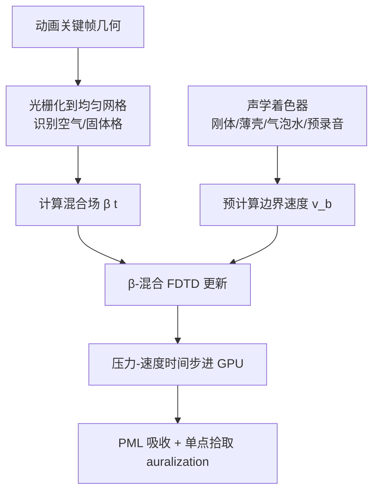

## 一句话总结

WaveBlender 提出一种简单、GPU 友好的有限差分时域（FDTD）声波求解器，通过在两帧离散化之间做时间上的"混合域"（$$\beta$$-blending），在粗网格上稳定地处理连续运动、变形的固-气/液-气界面，为动画声源合成低噪声声音，速度最高可达此前 CPU 求解器的 1000 倍。

## 研究背景

现代物理动画中的声源往往涉及快速运动、变形和振动的界面（如噪声薄壳、拍打的液面、近距离相互散射的多体系统），这些界面在空气域中激发声波，并因空气域形状随时间变化而产生有趣的瞬态与反射。FDTD 波动仿真能有效捕捉这些效果，但要在实践中落地面临多重相互冲突的约束：合成的声音必须真实且无数字伪影，方法要易于实现、支持快速并行硬件，还要在数百万个音频时间步的长时间跨度上保持稳定。

此前的代表性工作 [Wang et al. 2018] 提出通用声学传递求解器，但存在鲁棒性问题与"popping"爆音伪影——尤其当薄界面拓扑复杂时（如两相气泡流体），并且其压力更新所需的稀疏矩阵求解对 GPU 不友好。[Xue et al. 2023] 的 sample-and-hold GPU 求解器通过按固定间隔"冻结"几何缓解了鲁棒性问题，但其并行时间方案带来重复仿真开销且缺乏平滑动画域。WaveBlender 受 Allen 和 Raghuvanshi [2015] 的时变 PML 混合思路启发，但后者对连续变形界面（尤其需施加 Neumann 边界条件的振动声源）表现不佳。

## 方法

### 整体框架

WaveBlender 在均匀交错 MAC 网格（压力定义在格心、速度定义在格面）上求解压力-速度形式的声波方程。核心思想是引入定义在格心、随时间变化的**混合场** $$\beta \in [0, 1]$$：$$\beta=0$$ 表示空气，$$\beta=1$$ 表示固体，在两个动画关键帧的离散化之间做时间过渡。整体流程为：把仿真切成固定长度的批次，每批开始时对边界几何做一次光栅化，各"声学着色器"预计算边界速度 $$v_b$$，随后在 GPU 上做完全显式的时间步进。

### 关键设计一：离散域上的 $$\beta$$-混合更新

不同于 [Allen and Raghuvanshi 2015] 在连续方程上做混合（其速度更新权重变化过陡、对移动声源引入失真），WaveBlender 直接在离散 FDTD 更新规则上做混合：

$$
p^{n+1} = p^n - \rho_0 c_0^2 \left( \tilde{\nabla} \cdot v^{n+1/2} \right) \Delta t
$$

$$
v^{n+1/2} = (1-\beta)\left( v^{n-1/2} - \frac{\tilde{\nabla} p^n}{\rho_0}\Delta t \right) + \beta\, v_b^{n+1/2}
$$

当 $$\beta=0$$（空气格）速度更新来自动量方程，$$\beta=1$$（固体格）来自边界条件。此时更新权重 $$w_\beta = \beta$$，因此 $$\beta(t)$$ 直接控制速度更新的平滑度。作者对所有结果采用分段三次 smoothstep 函数：空气到固体时 $$\beta(t) = 3t^2 - 2t^3$$，固体到空气时反向，从而显著降低谐波失真。

### 关键设计二：混合域的稳定性与阻抗性质

将更新式改写后，其连续形式对应于一个"$$\beta$$-介质"上的波方程，等效密度被放大为 $$\rho_\beta = \rho_0 / (1-\beta)$$，声速相应降低为 $$c_\beta^2 = (1-\beta) c_0^2$$。由此得到两个重要保证：由于 $$c_\beta \le c_0$$，只要原始 CFL 条件满足，混合更新始终稳定；比声阻抗 $$z_\beta = \rho_0 c_0 / \sqrt{1-\beta}$$ 在域内均匀时保证声波在混合格中自由传播，当 $$\beta \to 1$$ 阻抗趋于无穷，如刚性边界般完美反射。当格面与固-气边界不重合导致 $$v_b$$ 取值不明确时，令 $$v_b^{n+1/2} = v^{n-1/2}$$ 以避免速度场突变、保证阻抗一致性。

### 关键设计三：声学着色器"动物园"与点源模型

沿用 [Wang et al. 2018] 的声学着色器抽象，但改为规定表面速度（而非加速度）且在 GPU 上实现，覆盖预录音、刚体模态、薄壳、气泡水等声源。对于粒子系统与大量小刚体，作者引入点状加速度噪声源模型：在动量方程加入力密度项，依据 Howe [2002]，半径 $$r$$、体积 $$V_r$$、加速度 $$a(t)$$ 的小球等效力为

$$
f(t) = 2\pi \rho_0 r^3\, a(t) = \tfrac{3}{2}\rho_0 V_r\, a(t)
$$

该力用三线性插值分配到邻近的 MAC 网格速度位置，从而无需细化网格即可建模"碰撞咔哒声"等微小声源。

### 关键设计四：GPU 实现与逐批开销处理

批次化设计避免了每步重新光栅化。着色器样本以 44.1–48 kHz 预计算（低于 FDTD 88.2 kHz 及以上的步率），在时间上线性插值以减少主机-设备内存传输。逐批还处理三类问题：固体格变空气格的"新鲜格"外推（压力用 Neumann 边界局部求解，速度通过全局最小二乘 + QR 分解求解以避免虚假散度）、着色器速度重初始化（对齐全局速度场避免不连续）、以及运行时空腔检测（用 flood fill 找出与听音位置断连的区域，防止非物理压力累积后突然释放）。域边界采用 [Liu and Tao 1997] 的分裂场 PML，宽度为 8 格，并将内部区域与 PML 核函数融合以提升性能。

## 实验结果

在与 [Wang et al. 2018] 相同的格尺寸、步率与相近维度下，将 WaveBlender 单机串行 GPU 计时与其并行时间 CPU 计时对比（括号内为机器数）。核心计时仅含 FDTD、着色器、光栅化与逐批开销；实时因子 = 核心运行时 / 音频长度。

| 例子 | 时长(s) | 格尺寸(mm) | 步率(kHz) | [Wang 2018] 并行时间 | 本文(全程) | 本文(核心) | 实时因子 |
|---|---|---|---|---|---|---|---|
| 2016 Pouring Faucet | 8.3 | 5 | 88 | 55 hrs (×1) | 2.53 min | 1.30 min | 9.40× |
| Blue LEGO Drop | 0.21 | 1 | 615 | 32 min (×10) | 0.33 min | 0.30 min | 85.71× |
| Spolling Bowl | 2.5 | 5 | 120 | 1.05 hrs (×8) | 1.97 min | 1.83 min | 43.92× |
| Cymbal | 2 | 10 | 88.2 | 53 min (×1) | 7.03 min | 1.48 min | 44.4× |
| Metal Sheet Shake | 10 | 14.3 | 44.1 | 24 hrs (×1) | 41.23 min | 10.39 min | 62.34× |
| Cup Phone | 8 | 7 | 88.2 | 41 min (×20) | 0.33 min | 0.30 min | 2.25× |
| Trumpet | 11 | 10 | 88.2 | 33 min (×20) | 0.98 min | 0.96 min | 5.24× |

在与 [Wang et al. 2018] 均单机串行运行的"2016 Pouring Faucet"对比中，WaveBlender 取得约 1000 倍加速。此外，$$\beta$$-混合结合运行时空腔检测显著改善鲁棒性、减少爆音伪影：例如"Spolling Bowl"不再需要 [Wang et al. 2018] 的开槽地板技巧，"2016 Water Step"的薄片空腔伪影可通过将水边界 $$\beta$$ 钳制到 0.9 避免。"Glass Pour"在粗格（$$\Delta x = 12.5$$ mm）下避免了基线的低频 popping。

## 亮点与局限

**亮点：**
- 对原始 FDTD 更新方程改动极小——仅新增一个格心混合参数 $$\beta$$ 与近似速度级边界条件，易于实现。
- 数学上保证：混合介质声速不超过原声速，故 CFL 稳定性自动继承；阻抗均匀保证波自由传播。
- 全显式时间步进 + 均匀网格 + 批次化，充分适配 GPU 并行，最高约 1000× 加速。
- 对空气域拓扑变化（空腔开合）比先前方法更鲁棒，爆音伪影更少。

**局限：**
- $$\beta$$-混合本质是启发式方法，混合域的非物理慢声速会不利影响置于其中的点源。
- 基于一阶空间离散（存在数值色散与阶梯化伪影），混合进一步降低精度。
- 声学着色器仅假设单向源耦合；对薄壳而言，振动板与声场的双向耦合会显著影响衰减时间。
- 仅支持空气阻尼，尚不支持墙面损耗与吸收；研究实现仍用 CPU 软件光栅化与几何库，未完全移植到 GPU；采用固定 PML 的矩形域可能对某些形状造成不必要的大体积。

## 延伸思考

WaveBlender 用"以精度换实用"的思路，把动画声合成从离线大规模并行推向单机可负担，其"在离散更新上做时间混合"的技巧对任何需要在粗网格上处理运动/变形界面的时域仿真（不止声学）都具启发性——它把界面运动的不连续性转化为可控的平滑过渡。真正实现实时集成的动画-声音系统仍需几项工作：把光栅化与声源表示完全 GPU 化（FDTD 已不再是瓶颈）、支持自适应追踪声源感兴趣区域的动态域、以及引入更高阶边界处理与吸收边界条件以支持墙损耗、双向耦合乃至乐器所需的非线性波效应。此外，如何在保留混合稳定性优势的同时消除慢声速对内部点源的影响，是让点源与光栅化声源无缝共存的关键。
