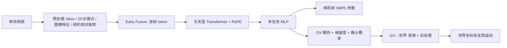

## 一句话总结

提出 GVHMR，通过一个由重力方向与相机视线方向定义的 Gravity-View（GV）坐标系，把"世界坐标系人体运动恢复"这一存在旋转歧义的问题转化为逐帧的重力对齐姿态预测，再用相机相对旋转把各帧对齐到统一世界坐标系，避免了自回归方法沿重力方向的误差累积，在相机空间与世界空间指标上均超过此前方法且更快。

## 研究背景

世界坐标系人体运动恢复（World-Grounded HMR）的目标是从单目视频中重建重力对齐世界坐标系下连续的 3D 人体运动。相比传统在相机坐标系下捕获的运动，世界坐标系运动天然适合作为文本到运动生成、人形机器人模仿学习等生成与物理模型的基础数据。

核心难点在于世界坐标系定义本身存在歧义：给定重力轴后，任何绕重力轴的旋转都构成一个合法的重力对齐世界坐标系，导致要学习的全局朝向 $$\Gamma_w$$ 和平移 $$\tau_w$$ 并不唯一。

已有方案各有局限：
- 用相机位姿把相机空间运动变换到世界空间，无法保证重力对齐，且平移与姿态误差会随时间累积。
- 代表性工作 WHAM 用 RNN 自回归地预测相对全局位姿，虽有明显提升，但依赖良好初始化，长序列下误差累积，难以在重力方向上保持一致。

作者的观察是：对图像中的人，人类能轻松推断其重力对齐姿态；且对相邻两帧，估计绕重力方向的 1 自由度旋转，比估计完整 3 自由度旋转更容易、更鲁棒。这启发了逐帧重力对齐 + 仅恢复绕重力轴相对旋转的设计。

## 方法

### 整体框架

给定单目视频 $$\{I_t\}_{t=0}^{T}$$，任务是预测：SMPL-X 的局部姿态 $$\theta_t \in \mathbb{R}^{21\times3}$$ 与形状系数 $$\beta \in \mathbb{R}^{10}$$；从 SMPL 空间到相机空间的朝向 $$\Gamma_{tc}$$ 与平移 $$\tau_{tc}$$；以及到世界空间的朝向 $$\Gamma_{tw}$$ 与平移 $$\tau_{tw}$$。

流水线沿用 WHAM 的预处理：跟踪人体框、检测 2D 关键点、提取图像特征、用视觉里程计（DPVO）或陀螺仪估计相机相对旋转。随后网络把这些特征融合为逐帧 token，经关系型 Transformer 与多任务 MLP，输出（1）中间表示：GV 坐标系下的人体朝向、SMPL 坐标系下的根速度、预定义关节的静止概率；（2）相机帧 SMPL 参数。最后把中间表示变换到世界坐标系，恢复全局轨迹。

### 关键设计 1：Gravity-View（GV）坐标系

对每一帧图像，用世界重力方向和相机视线方向（图像平面法向量）定义 GV 坐标系。给定相机空间中人的朝向 $$\Gamma_c$$ 和重力方向 $$\vec{g}$$：

- y 轴对齐重力方向，即 $$\vec{y} = \vec{g}$$；
- x 轴由视线方向 $$\overrightarrow{view} = [0,0,1]^T$$ 与 y 轴叉乘得到，即 $$\vec{x} = \vec{y} \times \overrightarrow{view}$$；
- z 轴由右手定则得到，即 $$\vec{z} = \vec{x} \times \vec{y}$$。

得到三轴后，人在 GV 坐标系下的朝向作为学习目标：

$$\Gamma_{GV} = R_{c2GV} \cdot \Gamma_c = [\vec{x}, \vec{y}, \vec{z}]^T \cdot \Gamma_c$$

由于 GV 坐标系完全由输入图像决定，它天然重力对齐，且逐帧唯一，大幅降低了图像到姿态映射的旋转歧义。

### 关键设计 2：全局轨迹恢复（避免重力方向误差累积）

每帧存在独立的 $$GV_t$$，其中预测朝向 $$\Gamma_{tGV}$$。恢复一致的全局轨迹需把所有朝向变换到公共参考系，实践中取 $$GV_0$$ 为世界参考系 $$W$$。

对运动相机，先用相机相对旋转与预测朝向计算相邻帧 GV 坐标系之间的旋转 $$R_{t\Delta GV}$$。关键在于该旋转只发生在绕重力（y 轴）方向：把各帧视线方向投影到 xz 平面并计算夹角即可求得 $$R_{t\Delta GV}$$。得到整段序列的 $$\{R_{t\Delta GV}\}$$ 后，滚动对齐到首帧 GV 坐标系：

$$\Gamma_{tw} = \begin{cases} \Gamma_{0GV}, & t=0 \\ \prod_{i=1}^{t} R_{i\Delta GV} \cdot \Gamma_{tGV}, & t>0 \end{cases}$$

平移则通过把预测的局部根速度 $$v_{root}$$ 变换到世界系后做累加求和：

$$\tau_{tw} = \begin{cases} [0,0,0]^T, & t=0 \\ \sum_{i=0}^{t-1} \Gamma_{iw} v_{root}^{i}, & t>0 \end{cases}$$

静态相机是其特例（$$R_{t\Delta GV}$$ 为恒等变换）。由于利用了 GV 系 y 轴一致性，该算法系统性地避免了重力方向的累积误差，也缓解了相机旋转估计误差——因此用 GT 陀螺与 DPVO 估计旋转的结果几乎一致。

### 关键设计 3：关系型 Transformer + RoPE

作者认为人体运动的绝对位置是歧义的（序列起点可任意），而相对位置定义明确、易学习。因此用旋转位置编码（RoPE）把相对特征注入时序 token，自注意力输出为：

$$o_t = \sum_{i\in T} \underset{s\in T}{\text{Softmax}}\left(a_{ts}\right)_i W_v f_{token}^{i}$$

$$a_{ts} = (W_q f_{token}^{t})^{\top} R(p_s - p_t)(W_k f_{token}^{s})$$

其中 $$R(\cdot)$$ 是相对位置的旋转编码。推理时再引入注意力掩码限制每个 token 的感受野：

$$m_{ts} = \begin{cases} 0, & \text{if } -L < t-s < L \\ -\infty, & \text{otherwise} \end{cases}$$

其中 $$L$$ 为最大训练长度。由此模型能泛化到任意长序列，无需滑动窗口等自回归推理技巧，可并行处理。

### 关键设计 4：静止性后处理

预测手、脚趾、脚跟的关节静止概率，逐帧更新全局平移使静止关节尽量固定在空间中，再计算各关节的细粒度静止目标位置，送入 CCD 逆运动学求解局部姿态，缓解脚滑等物理不合理现象。训练用 MSE 损失（静止概率用 BCE），并对 3D/2D 关节、顶点、相机帧与世界系平移施加 L2 损失。

## 实验结果

在三个野外基准（3DPW、RICH、EMDB）上评估。世界坐标系指标（RICH 静态相机、EMDB-2 动态相机）如下，可见 GVHMR 在所有指标上均最优，且在动态相机下用 DPVO 替代 GT 陀螺仅带来 W-MPJPE100 下降 1.6mm / RTE 下降 0.1%，而 WHAM 分别下降 19.5mm / 1.9%，显示其对相机旋转误差更鲁棒。

| 方法 | RICH WA-MPJPE100 | RICH W-MPJPE100 | RICH RTE | RICH Jitter | RICH FS | EMDB WA-MPJPE100 | EMDB W-MPJPE100 | EMDB RTE | EMDB Jitter | EMDB FS |
|------|------|------|------|------|------|------|------|------|------|------|
| DPVO + HMR2.0 | 184.3 | 338.3 | 7.7 | 255.0 | 38.7 | 647.8 | 2231.4 | 15.8 | 537.3 | 107.6 |
| GLAMR | 129.4 | 236.2 | 3.8 | 49.7 | 18.1 | 280.8 | 726.6 | 11.4 | 46.3 | 20.7 |
| TRACE | 238.1 | 925.4 | 610.4 | 1578.6 | 230.7 | 529.0 | 1702.3 | 17.7 | 2987.6 | 370.7 |
| SLAHMR | 98.1 | 186.4 | 28.9 | 34.3 | 5.1 | 326.9 | 776.1 | 10.2 | 31.3 | 14.5 |
| WHAM (w/ DPVO) | 109.9 | 184.6 | 4.1 | 19.7 | 3.3 | 135.6 | 354.8 | 6.0 | 22.5 | 4.4 |
| WHAM (w/ GT gyro) | 109.9 | 184.6 | 4.1 | 19.7 | 3.3 | 131.1 | 335.3 | 4.1 | 21.0 | 4.4 |
| **Ours (w/ DPVO)** | **78.8** | **126.3** | **2.4** | **12.8** | **3.0** | 111.0 | 276.5 | 2.0 | 16.7 | 3.5 |
| **Ours (w/ GT gyro)** | **78.8** | **126.3** | **2.4** | **12.8** | **3.0** | **109.1** | **274.9** | **1.9** | **16.5** | **3.5** |

（WA-MPJPE100、W-MPJPE100、Jitter 括号内为参与计算的关节数；RTE 单位 %，Jitter 单位 $$m/s^3$$，Foot-Sliding 单位 $$mm$$。）

相机空间指标上，GVHMR 在多数指标上也以明显优势领先（如 3DPW MPJPE 55.6 vs WHAM 57.8），仅 3DPW 的 PA-MPJPE 略落后 WHAM 0.3mm，作者归因于预测 SMPL-X 而非 SMPL 参数引入的误差。消融实验（RICH）显示去掉 GV、$$\Gamma_{GV}$$、Transformer、RoPE 或后处理均导致指标显著下降，其中去掉 RoPE 影响最大。

运行时间上，1430 帧（约 45 秒）视频中，GVHMR 核心网络仅需 0.28 秒（WHAM 需 2.0 秒，SLAHMR 需超过 6 小时），预处理约 46 秒，均在 RTX 4090 上测试。

## 亮点与局限

亮点：
- GV 坐标系设计巧妙，把带旋转歧义的全局朝向预测转化为逐帧重力对齐的、唯一定义的学习目标，从原理上抑制了重力方向的累积误差。
- 帧间相对旋转被约束在绕重力轴的 1 自由度上，对相机旋转估计误差鲁棒，GT 陀螺与 DPVO 结果几乎一致。
- 关系型 Transformer + RoPE + 感受野掩码，使模型能并行推理任意长序列，无需滑动窗口，核心网络推理极快。
- 多任务学习让全局运动信息反哺相机空间估计，相机空间指标也随之提升。

局限：
- 依赖预处理阶段的 2D 跟踪、关键点、图像特征与相机相对旋转估计，整体耗时主要来自预处理（约 46 秒），核心网络虽快但端到端仍受预处理制约。
- 采用 SMPL-X 参数可能在与 SMPL 基准对齐时引入细微误差（如 3DPW PA-MPJPE 略逊 WHAM）。
- 重力对齐依赖对重力方向的隐式推断，对极端视角或重力线索不足的场景鲁棒性未充分讨论。

## 延伸思考

- GV 坐标系的核心思想——用外部物理先验（重力）+ 传感器几何（视线方向）来消解学习目标的歧义——具有普适性，可能迁移到其他需要世界对齐的重建任务，如手物交互、多人场景或车辆/相机轨迹恢复。
- 把 3 自由度旋转分解为"绝对可从单帧推断的部分（重力对齐姿态）"与"帧间只需 1 自由度的部分（绕重力轴旋转）"，是一种降低估计难度的有效范式，值得在其他时序状态估计问题中借鉴。
- 逐帧并行 + 相对位置编码替代自回归的思路，对构建大规模世界坐标系运动数据集有实际意义，可为文本到运动生成、人形机器人模仿学习提供高质量基础数据。
- 后续可探索把重力方向估计与相机旋转估计端到端联合优化，进一步减少对外部 SLAM/陀螺的依赖。
