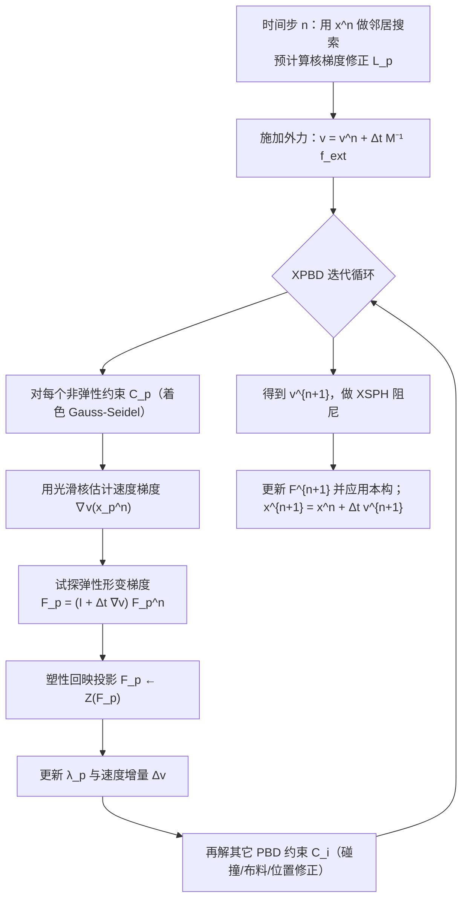

## 一句话总结

这篇论文把连续介质力学里的经典弹塑性/黏塑性/颗粒材料本构（雪、沙、橡皮泥等）搬进了 XPBD 框架，用"以速度为主变量、更新拉格朗日追踪形变梯度 + 隐式塑性回映"的思路，让纯粒子的 XPBD 也能做出以往只有 MPM 才能做的连续介质非弹性现象。

## 研究背景

- 领域现状：PBD 及其扩展 XPBD 因为快、稳、实现简单，在图形学里广泛用于刚体、软体、布料、杆、头发等柔顺约束动力学；网格弹性（乃至 Neo-Hookean 这样的非线性弹性）都已能用 XPBD 约束表达。另一条线是 MPM，过去十年主导了带拓扑变化的非弹性现象（雪、沙、泥、金属、泡沫、断裂）的模拟。
- 核心痛点：XPBD 在有限应变的"非弹性"上一直是空白。网格方法遇到材料分裂/融合时要不断重网格，非常麻烦；而 MPM 虽然天然处理拓扑变化，却有粒子-网格传输带来的数值耗散、材料难以分离的"人工粘连"、以及依赖网格分辨率的碰撞间隙等固有缺陷——这些恰恰是 XPBD 没有的问题。于是自然要问：能不能用 XPBD 直接做出 MPM 那类现象？
- 本文 idea：作者的关键观察是——让 MPM 能建模非弹性的核心并不是它的"拉格朗日-欧拉混合"结构，而是它对形变梯度采用的**更新拉格朗日（updated Lagrangian）**表述。只要能在 XPBD 里稳健地估计速度梯度，就能用更新拉格朗日的方式追踪形变梯度 $$\dot{F} = (\nabla v) F$$，从而把 $$F$$ 表达成 XPBD 自由度的函数，让 XPBD "变成一个材料点方法"。据此提出 XPBI（eXtended Position-based Inelasticity）。

## 方法

整体框架：XPBI 保留 PBD 纯粒子的自由度，但把主变量从"位置"改成"速度"。每个时间步先做邻居搜索并算好核梯度修正矩阵；然后在 XPBD 迭代内部，对每个粒子用光滑核估计速度梯度，据此更新形变梯度、做塑性回映投影、再解约束更新速度；如此在"XPBD 迭代"与"塑性不动点迭代"之间交替，最后统一用同一速度更新位置与形变梯度状态。

关键设计：

1. **把 StVK 弹性写成 XPBD 约束**。采用带 Hencky 应变的 St. Venant-Kirchhoff 模型，通过对形变梯度做 SVD 在主拉伸空间 $$\Sigma$$ 里描述弹塑性，这样某些塑性流的回映有解析解，省去数值求解。能量密度为 $$\Psi = \mu\,\mathrm{tr}\big(\log(\Sigma)^2\big) + \tfrac{\lambda}{2}\big(\mathrm{tr}(\log(\Sigma))\big)^2$$ 。利用 $$\Phi = V_0 \Psi(F) = \tfrac{1}{2\alpha}C(F)^2$$ ，把 Lamé 参数吸收进约束，得到单一 $$F$$ 相关约束 $$\alpha = 1/V_0,\ C(F) = \sqrt{2\Psi(F)}$$ ，相比分开处理 $$\mu$$、$$\lambda$$ 两项的做法把约束数量减半，作者最终选用这个单约束版本以求效率。

2. **"梯度就是全部所需"——更新拉格朗日的无网格形变梯度**。因为极端形变下无法用单纯形网格，作者跟随连续介质的速率形式，把形变梯度演化离散成 $$F_p^{n+1} = \big(I + \Delta t\,\tfrac{\partial v^{n+1}}{\partial x}(x_p^n)\big)F_p^n$$ ，参考构型永远是上一步的 $$\Omega^n$$，不必存储初始构型 $$\Omega^0$$。于是问题归结为稳健地估计速度梯度 $$\partial v/\partial x$$ 及其导数。为对抗无网格核在稀疏区的"邻域缺陷"，采用 Wendland 核并引入基于重加权的**核梯度修正矩阵** $$L_p$$（对其做 SVD 伪逆以避免病态求逆），得到修正后的离散速度梯度 $$\tfrac{\partial v}{\partial x}(x_p^n) = \sum_{b\neq p} V_b^n (v_b - v_p)\big(L_p \nabla W_b(x_p^n)\big)^T$$ ，进而给出约束对各粒子位置的解析导数。

3. **隐式塑性（plasticity in-the-loop）**。连续介质塑性通常用回映算子 $$Z(\cdot)$$ 把试探弹性预测子投影回屈服面。本文不像半隐式那样只在时间步末尾做一次投影，而是在 XPBD 迭代内部交替做"带投影应力的 XPBD 迭代"与"应力投影"，本质上是对 $$F$$ 的不动点迭代 $$F_p^{(k+1)} \leftarrow Z\big(F_p^{E,tr}(v^{(k)}(F_p^{(k)}))\big)$$ 。因为更新的是 XPBD 迭代内直接受影响的变量，隐式塑性几乎不增加额外开销，却能避免半隐式方法把屈服面外应力当作弹性力、导致材料"过度抵抗拉伸"的严重伪影。

4. **以速度为主变量的求解与稳定性增强**。把 XPBD 重参数化为解速度 $$v^{n+1}$$ 和拉格朗日乘子 $$\lambda^{n+1}$$：每个非弹性约束的乘子增量 $$\Delta\lambda_p = \frac{-C_p - \tilde{\alpha}_p \lambda_p}{\sum_b \frac{1}{m_b}|\nabla_{x_b}C_p|^2 + \tilde{\alpha}_p}$$ ，速度更新 $$\Delta v = (M^{-1}\nabla C(x)^T \Delta\lambda)/\Delta t$$ 。选速度做主变量的好处是可以直接在 $$\Omega^n$$ 上用 $$t^n$$ 定义的核评估速度梯度和约束，与 MPM 实践一致，避免了用位置时"迭代中是否更新核"的不确定性。求解用**着色 Gauss-Seidel**（$$2^d$$ 种颜色消除同格约束依赖），比 Jacobi 传播信息快、在高刚度下收敛更好。稳定性上还加了两件：**XSPH** 人工黏性（无量纲系数 $$c = 0.01$$）抑制非物理振荡；以及**位置修正**——用点-点距离约束 $$C(x_p, x_b) = \|x_p - x_b\|_2 - r + \epsilon \ge 0$$（取 $$\epsilon = 0.25r$$）在非线性迭代中保持粒子分布均匀，且不像单纯平移粒子那样破坏形变梯度的一致性。

## 实验结果

硬件为 Intel Core i9-14900KF + NVIDIA RTX 4090。下表取论文的参数与时间统计主表（Table 2），展示不同 demo 的规模与性能（材料缩写：VM=Von Mises，HB=Herschel-Bulkley，NACC=Non-Associated Cam-Clay，DP=Drucker-Prager）：

| Demo | 粒子数 | 平均邻居数 ΣN_p | 平均秒/帧 | 迭代数 | Δt(步长) | 材料 |
|------|--------|-----------------|-----------|--------|----------|------|
| Noodles | 1.18M | 28.7M | 46.3 | 10 | 1e-4 | VM |
| Cloth | 1.10M | 19.9M | 24.3 | 10 | 5e-5 | HB |
| Camponotus | 1.12M | 32.9M | 37.3 | 10 | 4e-5 | NACC |
| Dam Breach | 4.00M | 156.2M | 138.8 | 7 | 2.5e-4 | DP |
| Hourglass | 1.01M | 17.0M | 30.9 | 5 | 1e-4 | DP |
| Hitman | 1.05M | 32.5M | 38.9 | 10 | 4e-5 | NACC |
| Snow Dive | 2.48M | 64.1M | 78.2 | 5 | 4e-5 | NACC |
| Wrist | 20K | 433.2K | 0.015 | 5 | 2e-4 | HB |

其余关键结果用文字补充：

- **与 vanilla XPBD / MPM 对比**（同 $$\Delta t = 0.1$$ ms、同初始采样）：vanilla XPBD 的点式摩擦模型无法复现正确的沙堆休止角；MPM 与 XPBI 都能重现连续介质行为，但 XPBI 粒子分布更均匀，避免了 MPM 常见的稀疏、结块和网格 $$\Delta x$$ 间隙。量化上，MPM 碰撞后粒子最近邻平均距离快速下降、方差上升，而 XPBI 全程保持稳定。
- **可扩展性**：用 8K/56K/400K/3M 粒子模拟黏塑性怪物落地，单粒子平均计算时间分别为 0.30 ms、0.098 ms、0.058 ms、0.037 ms——粒子越多，着色 Gauss-Seidel 越能充分利用 GPU，呈现超线性可扩展性。
- **收敛性**：用不同刚度（$$E = 10^4, 10^5, 10^6$$ Pa）的悬臂梁对比 Gauss-Seidel、Jacobi 与隐式 FEM 真值。GS 能在大步长下稳定收敛；Jacobi 只在软材料下收敛、遇高刚度困难。
- **隐式 vs 半隐式塑性**：半隐式（仅步末回映）在缺口沙块下落中产生严重伪影，隐式塑性则无此问题。
- **与 Gissler et al. 2020 对比**：对方是半隐式塑性、单次步末投影，雪行为随步长（$$10^{-4}$$ s vs $$10^{-3}$$ s）而变；XPBI 全隐式塑性在不同步长下行为一致。
- **实时交互**：20K 粒子的黏弹性流体在 Apple Vision Pro 上以 30fps 交互（小规模场景改用并行度更高的 Jacobi 求解）。

## 亮点与局限

- 亮点：
  - 概念上打通了 XPBD 与 MPM——指出 MPM 建模非弹性的关键是"更新拉格朗日"而非混合欧拉网格，从而在纯粒子框架里复现了雪/沙/橡皮泥/金属延展/脆性断裂等连续介质现象。
  - "隐式塑性在环内"的不动点设计几乎零额外开销，却显著优于半隐式，且行为对步长鲁棒。
  - 天然融入既有 XPBD 管线，可与 PBF 流体、布料等标准 XPBD 材料无缝耦合；着色 GS 在大规模下有超线性可扩展性。
  - 相比 MPM 避免了数值耗散、人工粘连和网格间隙，粒子分布更均匀。

- 局限：
  - 受限于 GS 收敛速度和 SPH 的 CFL 条件（与核支撑半径相关），高刚度、高分辨率场景下时间步偏小；仍需 XSPH 或约束阻尼来避免抖动。
  - Maxwell 黏弹性材料需要更专门的处理；沙水混合目前只发生在材料边界，真正的多孔介质/流体-沉积物动量传递尚未解决。
  - 着色 Gauss-Seidel 在小规模场景下 GPU 利用率低、表现不佳，制约了更多交互式实验；缺少专门的实时求解器。
  - 论文坦言未定量监控塑性不动点迭代的收敛性，仅以"视觉合理、迭代很少即可"为依据。

## 延伸思考

- XPBI 与近期把可微渲染/3DGS 与 PBD 结合的工作（如 Gaussian Splashing）方向互补：XPBI 提供了更物理、参数更可控的连续介质非弹性本构，若接入可微或神经外观表示，可能做出既好看又"可编辑材料参数"的固液混合动画。
- 把主变量从位置改成速度、并在迭代中固定 $$t^n$$ 的核，是本文能稳健估计速度梯度的关键工程抉择；论文也提出"用位置做主变量、迭代中如何更新核"是值得探索的开放问题。
- 与 power plastics 等"XPBD 风格 Gauss-Seidel + MPM 离散"的路线相比，本文走的是纯粒子 + 对偶（乘子）表述，便于与传统 PBD 材料耦合，二者在精度/耦合性/性能上的系统比较会很有意思。
- 面向游戏/VR 的实时化仍是主要瓶颈：针对小规模场景设计兼顾并行度与收敛性的求解器，是把这套方法真正推向交互应用的关键。
