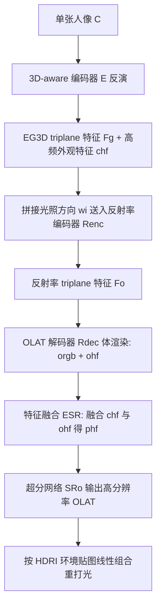

## 一句话总结

本文提出 3DPR：给定单张人像照片，先把它反演进预训练 3D 生成头模型 EG3D 的隐空间，再用一个基于 triplane 的反射率网络合成该主体的 OLAT（One-Light-At-a-Time，单光源逐次照明）基图像，最后按给定 HDRI 环境贴图线性组合，实现物理准确、3D 一致的新视角人像重打光。

## 研究背景

将单张人像转换为可在任意环境、任意视角下渲染的 3D 资产，是 AR/VR 等应用的刚需，但这是一个高度欠约束的问题：既要从单目输入恢复 3D，又要建模复杂的面部光传输。已有方法各有短板：

- 传统图形学路线把图像显式分解为几何、材质、光照再做可微渲染，但受限于底层模型的诸多假设与近似。
- 生成式体表示方法（如 EG3D）擅长新视角合成，却未必解决重打光；基于物理渲染训练的变体则受野外训练集中未知相机与光照的困扰，物理模型与真实图像间的差距损害真实感。
- 基于图像的重打光（image-based relighting）用光台采集的 OLAT 数据做监督，无需显式建模光传输，但已有工作要么是特定主体（subject-specific），要么推理时需要多视角输入，难以泛化到单目野外人像。
- VoRF 用一组 OLAT 基函数建模面部反射率、能较好还原阴影，但结果过平滑、泛化差，因为它训练所用的光台主体数量有限，缺乏丰富的几何与外观先验。

一个关键瓶颈是：目前没有足够大规模、足够多样、公开可用的光台数据集。

## 方法

整体框架分两个阶段。第一阶段用基于编码器的 GAN 反演把输入人像嵌入 EG3D 隐空间，得到 triplane 特征 $$F_g$$，借助 EG3D 强大的 3D 几何与外观先验实现对未见人脸的泛化；第二阶段用一个 OLAT 反射率模块，把 $$F_g$$ 与给定光照方向拼接后，通过 triplane 体渲染合成低分辨率 OLAT 与高频反射率特征，再经超分网络输出高分辨率 OLAT 图像。推理时对目标视角合成 OLAT 基，再按 HDRI 权重线性组合完成重打光。

重打光的基本原理是光传输的可加性：给定环境贴图，重光照图像近似为各方向 OLAT 图像的加权和

$$
C \approx \sum_{l \in I} f_l \cdot O(l)
$$

其中 $$I$$ 是 OLAT 光照方向集合，$$O(l)$$ 为来自方向 $$l$$ 的 OLAT 图像，$$f_l$$ 为环境贴图权重。

### 关键设计 1：在生成先验隐空间中学习反射率

方法不直接从像素学反射率，而是让反射率网络工作在 EG3D 的隐空间/triplane 空间。反演网络产生 $$F_g = E(C)$$，反射率编码器 $$R_{enc}$$ 结合光照方向 $$\omega_i$$ 输出反射率感知的 triplane 特征 $$F_o = R_{enc}(F_g, \omega_i)$$。作者强调 96 通道深度对建模高光、硬阴影、次表面散射等复杂皮肤-光交互至关重要。得益于此，用相对少量的光台图像就能训练出反射率模型。

### 关键设计 2：特征融合模块 ESR 防止过拟合

若直接把低分辨率 OLAT $$o_{rgb}$$ 与高频反射率特征 $$o_{hf}$$ 送入超分模块，模块容易对数据集中少量主体过拟合。为此引入融合模块 $$E_{SR}$$，把 $$o_{hf}$$ 与反演阶段得到的高频身份特征 $$c_{hf}$$ 逐通道拼接：$$p_{hf} = E_{SR}(c_{hf} \oplus o_{hf})$$。由于超分网络 $$S_{Ro}$$ 预训练时就依赖 $$c_{hf}$$，身份信息从训练一开始就由 $$c_{hf}$$ 提供，起到正则作用，迫使 $$S_{Ro}$$ 只从 $$o_{rgb}$$、$$o_{hf}$$ 中获取光照信息，从而在小数据上保住身份保真度。

### 关键设计 3：ID-MRF 损失替代对抗损失

仅用像素级 $$L_1$$ 重建损失不足以纠正反演阶段引入的轻微错位；而数据集主体数量少（约 130），对抗损失易导致判别器过拟合、训练不稳。作者改用 ID-MRF（隐式多样化马尔可夫随机场）损失，在预训练 VGG19 的 conv3_2 与 conv4_2 特征空间上最小化预测与真值 OLAT 的分块最近邻距离。总损失为 $$L = L_O + 0.3\, L_{MRF}$$，比常用的 LPIPS 感知损失更能恢复高频细节。

### 关键设计 4：FaceOLAT 大规模数据集

方法依托作者新采集的 FaceOLAT 数据集：139 名不同肤色、发色、瞳色、族裔与年龄的主体，40 个视角、4K 分辨率、331 个点光源 OLAT 照明，覆盖多种表情，规模与多样性超越现有公开数据集。采集时用每 21 次 OLAT 插入一帧全亮参考帧并做光流对齐，以补偿 7 秒采集中被试的轻微不自主移动。数据集按 129/10 划分训练与评测（另有文中提到用 10 名未见主体评测），将公开发布。

## 实验结果

在 WeyrichOLAT 测试集上（与 Lite2Relight 相同训练-测试划分，同时评测新视角合成与重打光），3DPR 在多数指标上超越 NeLF、PhotoApp、VoRF、NeRFFaceLighting 与 Lite2Relight。ID 指标为重光照图与真值经 MagFace 嵌入的余弦相似度（身份一致性）。

| 方法 | SSIM↑ | LPIPS↓ | RMSE↓ | DISTS↓ | PSNR↑ | ID↑ |
| --- | --- | --- | --- | --- | --- | --- |
| NeLF | 0.75 | 0.4874 | 0.2466 | 0.2212 | 19.72 | 0.798 |
| PhotoApp | 0.72 | 0.4163 | 0.1988 | 0.2031 | 29.13 | 0.853 |
| VoRF | 0.69 | 0.3253 | 0.1967 | 0.1934 | 20.21 | 0.860 |
| NeRFFaceLighting | 0.79 | 0.2171 | 0.2393 | 0.2107 | 27.24 | 0.892 |
| Lite2Relight | 0.83 | 0.2492 | 0.1841 | 0.1719 | 28.27 | 0.936 |
| Ours（3DPR_w） | 0.87 | 0.1828 | 0.1332 | 0.1689 | 28.69 | 0.942 |

作者指出 PhotoApp 因缺乏显式 3D 表示常出现身份不一致（如下颌线改变），其 PSNR 偏高主要源于 StyleGAN2 图像本身质量，而 PSNR 并不适合衡量复杂光照变化。在自建 FaceOLAT 上与最强的两个基线 NFL、L2R 对比，3DPR 同样领先（PSNR 21.02，ID 0.943）；单独评估 OLAT 合成质量也大幅优于 VoRF（SSIM 0.88 对 0.71，PSNR 28.70 对 20.43）。随着环境光变得越来越稀疏、带色，NFL 与 L2R 明显退化，而 3DPR 凭显式 OLAT 反射率建模仍能稳定重现阴影与高光。

## 亮点与局限

亮点：
- 把预训练 3D 生成先验（EG3D）与光台 OLAT 表示结合，从单目输入实现物理准确、可同时编辑光照与视角的 3D 一致人像重打光。
- 显式合成 OLAT 基再线性组合，赋予细粒度光照控制，能处理艺术化、稀疏、非自然照明等分布外光照，且单次前向即可完成、无需逐主体测试时优化。
- 贡献了 FaceOLAT：139 主体、40 视角、331 光源、4K 的大规模多视角 OLAT 数据集，填补公开数据空白。

局限：
- 重打光质量在头部背面下降，源于 EG3D 先验对正脸外区域覆盖不可靠。
- 适用范围限于面部反射率（脸、眼、头皮头发），头盔、墨镜等配饰属于域外，不生成其 OLAT。
- 继承 EG3D 对细发丝建模的困难：新视角可能出现发区局部不一致，OLAT 微小错位线性组合后累积成噪声或闪烁，超分阶段头部转动时可能出现发丝"popping"。
- 尽管对视角做了条件化，鼻梁、脸颊等处的视角相关效应仍偏弱，因为这类线索对训练目标贡献较小。

## 延伸思考

3DPR 的核心思路是"用生成先验补几何与身份、用光台数据补光传输"，把重打光拆成可加的 OLAT 基预测再组合，从而在小规模光台数据上兼顾泛化与物理准确。这一分解相比直接端到端预测重光照图更可控、更能外推到稀疏/异常光照，值得推广到全身、配饰乃至更一般材质的重打光。局限也指向清晰的方向：更强的头部/头发高频先验、面向发丝的对齐策略，以及更能表达视角相关效应的监督目标，可能是把这类方法推向真正全头、影视级重打光的关键。此外 FaceOLAT 的公开有望成为面部反射率建模的新基准资源。
