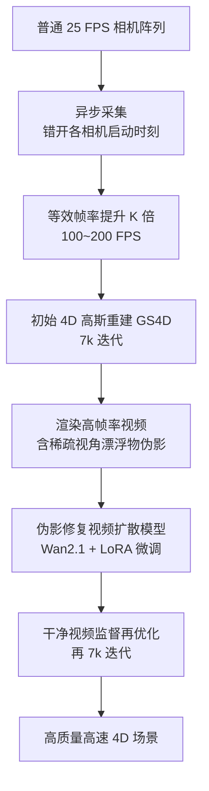

## 一句话总结

本文提出 4DSloMo：用一批普通 25 FPS 相机，通过"异步采集"（错开各相机的开始曝光时刻）把等效帧率提到 100~200 FPS，再用一个基于视频扩散模型的"伪影修复模型"消除因异步导致的稀疏视角伪影，从而在不换高速硬件的前提下高质量重建高速复杂运动的 4D 场景。

## 研究背景

- 领域现状：从多视角视频重建动态 3D 场景是 3D 视觉的基础问题，在体育与生物力学、自动驾驶与机器人、VR/AR 内容制作中都有需求。近年基于高斯泼溅的 4D 重建（如 GS4D、4DGS）大幅提升了动态场景的新视角合成质量。
- 核心痛点：绝大多数 4D 采集相机阵列帧率不超过 30 FPS（如 DNA-Rendering 15 FPS、Neural3DV 与 ENeRF-Outdoor 30 FPS），而衣物摆动这类高速运动往往需要 120 FPS 以上才能拍清。直接提升硬件帧率既昂贵又大幅增加数据带宽；而只在重建阶段做时间插值，面对布料等复杂非线性运动时会产生明显伪影。
- 本文 idea：既然单靠同步相机拍不到相邻两帧之间的信息，就故意给不同相机的启动时刻加延时，让它们错峰采集不同时刻，等效提升系统帧率。代价是每个时刻可用视角变稀疏、重建出现"漂浮物"伪影，于是再训练一个视频扩散伪影修复模型来兜底。这是一套硬件（异步采集）+ 软件（扩散修复）联合的解法。

## 方法

### 整体框架

系统输入若干路异步多视角视频，先用所有已采图像初始化一个 4D 高斯模型，渲染出覆盖所有时刻的高帧率视频（含稀疏视角伪影）；再用伪影修复视频扩散模型把这些"脏"视频修成时序一致、清晰的"干净"视频；最后用干净视频反过来监督、更新 4D 高斯模型。

### 关键设计一：异步采集方案

把 $$K$$ 台相机分为一组，组内第 $$i$$ 台相机在时刻 $$t_i = i\cdot(\tau/K) + j\cdot\tau$$ 开始采集，其中 $$i\in\{1,2,\dots,K\}$$ 是组内相机序号，$$j$$ 是以 25 FPS 记录的帧序号，$$\tau$$ 为帧间隔。这样在 $$1/25$$ 秒的曝光间隔内错峰采样，等效帧率提升 $$K$$ 倍且无额外硬件成本。实验中取 $$K=4$$，把有效帧率推到 100 FPS。真实采集系统用 12 台可硬件同步触发的 25 FPS 相机，分三层、每层 4 台、约 $$22.5^\circ$$ 间隔布置，靠手动引入不同触发延时实现异步，可分成 4 或 8 组达到 100 或 200 FPS。

### 关键设计二：伪影修复视频扩散模型

异步采集让每个时刻可用视角减少 $$K$$ 倍，稀疏视角重建会产生"漂浮物"伪影。已有稀疏视角 3D 方法多用图像扩散先验，但逐帧独立处理会带来时序不一致。本文在预训练视频扩散模型 Wan2.1（Wan-I2V-14B）上做 LoRA 微调（秩为 16，仅微调 DiT，冻结 VAE 编解码器）来专门修复 4D 重建伪影。模型输入含伪影的渲染视频 $$V_{render}\in\mathbb{R}^{C\times T\times H\times W}$$，输出时序连贯、清晰的干净视频 $$\hat V$$。训练损失为：

$$L_{tune}=\mathbb{E}_{z_{target},t,\epsilon,z_{render}}\left[\lVert \epsilon_\theta(z^{target}_t,t,z_{render},c_{tex})-\epsilon\rVert_2^2\right]$$

其中 $$c_{tex}$$ 是物体相关的文字提示。训练数据用"异步时间下采样"构造：把多视频序列在时间维异步子采样后训 GS4D，其渲染输出天然带伪影，与原始干净序列配对，仅用 750 对（分辨率 $$1024\times1024$$、长 25 帧，来自 DNA-Rendering）就能获得较好泛化。

### 关键设计三：带扩散先验的 4D 重建

先从全部采集图像重建初始 4D 高斯 $$G$$，对每个训练视角渲染覆盖所有相机所见时刻的高帧率视频 $$V_{render}$$；用 Wan-VAE 得到潜表示 $$z_{render}$$，与同形状纯噪声沿通道拼接后生成修复视频 $$\hat V$$；最后用 $$\hat V$$ 监督渲染：

$$L_{diff}=\lVert V_{render}-\hat V\rVert_1 + L_p(V_{render},\hat V)$$

其中 $$L_p$$ 为 LPIPS 感知距离。训练分两阶段：先 7k 迭代初始优化（此时仍有伪影），再 7k 迭代仅用扩散模型修复后的视频监督，把扩散先验蒸馏进 4D 重建管线。

## 实验结果

在 DNA-Rendering 数据集上与三个 SOTA 4D 重建方法对比（对原数据做时间下采样以模拟大运动/异步采集），本文在保真度（PSNR、SSIM）和感知（LPIPS）指标上全面领先：

| 方法 | PSNR ↑ | SSIM ↑ | LPIPS ↓ |
| --- | --- | --- | --- |
| K-Planes | 22.74 | 0.750 | 0.443 |
| 4DGS | 23.09 | 0.772 | 0.351 |
| GS4D | 24.75 | 0.797 | 0.337 |
| 本文 | 26.76 | 0.845 | 0.293 |

在 Neural3DV 数据集上同样最优（本文 PSNR 33.48 / SSIM 0.951 / LPIPS 0.134，对比 GS4D 30.54 / 0.917 / 0.178）。消融实验（DNA-Rendering）显示：同步无修复 24.75、同步加修复反而略降到 24.15（同步帧率太低导致运动本身错乱，修复也救不回）、异步无修复升到 26.23、异步加修复达 26.76，说明异步采集是质量提升主因、伪影修复模型再进一步。与帧插值方法对比中，本文（26.76）优于 RIFE（25.06）与 MoMo（24.85），因为大运动下 CNN 插值产生形变、扩散插值生成错误运动。

## 亮点与局限

亮点：
- 提出零硬件成本的异步采集范式：仅靠错开普通相机启动时刻就把等效帧率提升 4~8 倍，用软件手段绕开高速相机的昂贵与带宽瓶颈。
- 针对"稀疏视角 4D 重建"专门用视频扩散（而非图像扩散）做伪影修复，利用时空先验解决逐帧图像扩散带来的时序不一致问题。
- 数据构造巧妙：用异步时间下采样自动生成"脏—干净"训练对，仅 750 对即获得跨场景泛化能力。
- 提供首个真实异步多视角视频数据集（12 段高速复杂运动序列），推动该方向研究。

局限：
- 受预训练扩散模型自身保真上限限制，某些精细纹理即使经过按场景优化，修复后仍可能细节下降。
- 伪影修复模型仅在以人体表演为主的 DNA-Rendering 上训练，对非人体、其他类型运动等真实开放场景的泛化尚未验证。
- 论文探索的按场景微调虽能恢复更精细细节，但留一法构造数据带来显著时间开销，故未作为默认设置。

## 延伸思考

- "在采集端制造时间多样性、在处理端用生成先验补稀疏"是一个可推广的思路：把稀缺的时间分辨率从硬件问题转化为可用生成模型补偿的数据问题，本质是在时间维度做"复用换密度"。
- 视频扩散优于图像扩散的关键在于时序一致性，这提示凡是涉及 4D/动态重建的先验注入都应优先考虑视频级先验，而非逐帧图像先验。
- 异步采集牺牲了每一时刻的空间视角数换取时间密度，存在"空间稀疏 vs 时间密集"的权衡；未来若能自适应地按场景运动剧烈程度动态分配相机分组（快运动时多分时间组、慢运动时保空间视角），或结合更强的通用视频基座模型扩大训练数据覆盖，有望进一步突破泛化与保真的上限。
