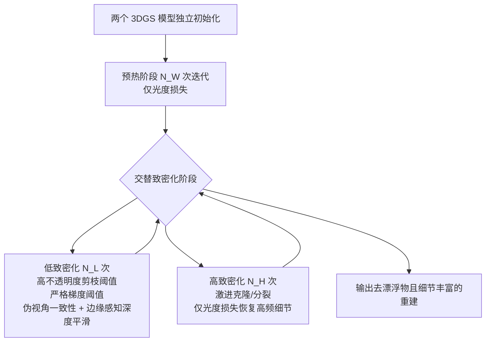

## 一句话总结

AD-GS 通过交替进行"高致密化"与"低致密化"两个阶段，在稀疏输入下有控制地增长高斯基元并配合几何正则，从而同时抑制漂浮物（floaters）并保留高频细节。

## 研究背景

3D Gaussian Splatting（3DGS）能实现实时、高保真的新视角合成，但在稀疏输入视角下性能显著退化，常出现漂浮物、几何错误和过拟合。作者指出一个关键成因是**不受控的致密化**：3DGS 依据光度损失的梯度对高斯进行克隆或分裂，这一过程本质上是随机且缺乏约束的，尤其在分裂时新高斯从父分布中采样，容易落在几何不一致或低似然区域。在稀疏视角下这些错误放置的高斯会引发进一步的致密化，且光度损失无法将其移除，反而会调整其颜色去拟合稀疏训练视角，造成新视角上的失真。

已有稀疏输入方法各有短板：FSGS 依赖预训练深度网络先验，泛化性有限；CoR-GS 强制两模型间一致性但过度平滑、丢失细节；DropGaussian 随机丢弃高斯又会损害精细细节。因此需要一种在"恢复细节"和"去除漂浮物"之间取得平衡的方案。

## 方法

### 整体框架

AD-GS 并发训练两个独立初始化的 3DGS 模型（用于伪视角一致性），训练分为三个阶段：先进行 $$N_W$$ 次迭代的预热阶段，随后进入交替致密化阶段，在每 $$N_L$$ 次的低致密化阶段与每 $$N_H$$ 次的高致密化阶段之间往复切换。评估时任取其中一个模型作为最终测试模型。

### 关键设计

1. **交替低/高致密化**：高致密化阶段使用较低的梯度阈值 $$\tau_{pos}$$ 激进地新增高斯，仅用光度损失快速恢复高频纹理与细节；低致密化阶段使用更严格的梯度阈值 $$\tau_L > \tau_{pos}$$ 减缓增长，并用更高的不透明度阈值 $$\epsilon_L > \epsilon_\alpha$$ 激进剪除低不透明度高斯（去除半透明漂浮物）。这样在受控增长中逐步细化场景。

2. **伪视角一致性（Pseudo-View Consistency）**：对训练视角施加小扰动得到伪视角，令两个模型在该视角的渲染结果 $$u_1, u_2$$ 保持光度一致：$$L_{pseudo}(u_1, u_2) = L_{ph}(u_1, u_2)$$。作者认为这类似半监督学习中对扰动观测的一致性约束，能促使输出平滑并抑制漂浮物。关键在于该损失只在低致密化阶段施加，避免全程使用而抑制细节学习。

3. **边缘感知深度平滑（Edge-Aware Depth Smoothness）**：通过与颜色相同的 alpha 合成方式渲染深度，鼓励深度在纹理平坦区平滑、在图像强度边缘处保留不连续：$$L_{ds}(d, v) = \sum_{x,y} \lVert \nabla d(x,y) \rVert_1 \exp(-\lVert \nabla v(x,y) \rVert_1) - \lambda_r (d_{max} - d_{min})$$。第一项鼓励平滑，第二项保证深度具有合理动态范围，该损失同时施加于训练视角和伪视角。

4. **分阶段损失调度**：低致密化阶段的总损失为 $$L_k = \lambda_1 L_{ph}(v_k, v_{gt}) + \lambda_2 L_{tds}(v_k, d_k, u_k, d_{u_k}) + \lambda_3 L_{pseudo}(u_1, u_2)$$；高致密化阶段则去掉所有正则项、只保留光度损失。作者发现全程施加几何正则会过度约束表示、损害细节恢复，间歇式应用才能兼顾细节与几何。实现上预热 1500 次迭代、总训练 10,000 次迭代，所有超参在各数据集与场景间固定。

## 实验结果

在 Tanks & Temples、LLFF、Mip-NeRF360 三个数据集上，与 3DGS、FSGS、CoR-GS、DropGaussian 对比，AD-GS 在所有指标、所有视角设置下均取得最佳表现，且输入视角越少提升越明显。下表为 LLFF 数据集结果：

| 模型 | PSNR↑ 3-view | PSNR↑ 6-view | PSNR↑ 9-view | SSIM↑ 3-view | SSIM↑ 6-view | SSIM↑ 9-view | LPIPS↓ 3-view | LPIPS↓ 6-view | LPIPS↓ 9-view |
|------|------|------|------|------|------|------|------|------|------|
| 3DGS | 18.90 | 22.57 | 24.02 | 0.632 | 0.757 | 0.799 | 0.269 | 0.182 | 0.151 |
| FSGS | 19.50 | 23.25 | 24.56 | 0.655 | 0.776 | 0.815 | 0.269 | 0.185 | 0.151 |
| CoR-GS | 19.59 | 23.33 | 24.75 | 0.674 | 0.780 | 0.817 | 0.271 | 0.187 | 0.152 |
| DropGaussian | 19.72 | 23.52 | 24.89 | 0.674 | 0.786 | 0.824 | 0.266 | 0.182 | 0.148 |
| AD-GS（本文） | 20.06 | 23.54 | 25.02 | 0.699 | 0.793 | 0.830 | 0.237 | 0.170 | 0.142 |

消融实验（SSIM）表明：去掉交替致密化、去掉交替损失、或全程使用组合损失均导致明显下降，验证了交替致密化与分阶段损失调度两个组件缺一不可。此外随着输入视角增多，AD-GS 性能平滑地收敛到稠密输入 3DGS 的水平，且不出现退化。

## 亮点与局限

**亮点：**
- 将"致密化控制"这一在稠密场景中主要用于减小模型体积的机制，重新用于稀疏输入下同时抑制漂浮物与恢复细节，视角切入新颖。
- 交替式而非全程式的几何正则，巧妙化解了"去漂浮物"与"保细节"之间的矛盾。
- 不依赖外部深度先验网络，仅用渲染深度自身的边缘感知平滑，泛化性更好，且全数据集超参固定。

**局限：**
- 需并发训练两个 3DGS 模型以实现伪视角一致性，增加了训练时的显存与计算开销。
- 当两个模型出现相似伪影时，伪视角一致性损失可能失效。
- 方法本质上是在错误被不当致密化引入后再进行修正，而非从源头避免。

## 延伸思考

作者在结论中提出的方向值得关注：能否让两个致密化阶段的持续时长自适应，而非固定 $$N_L, N_H$$。更进一步，本文"先激进增长、再几何修正"的思路属于事后纠错，若能研究几何一致的致密化（在采样新高斯时即施加几何约束），或引入学习式模型预测何时何地致密化，或许能从根本上减少漂浮物的产生。此外，双模型一致性带来的开销提示了一个权衡：是否存在单模型即可实现类似正则效果的替代方案（例如时间维度上的自一致或数据增广式扰动），这在实际部署中可能更具吸引力。
