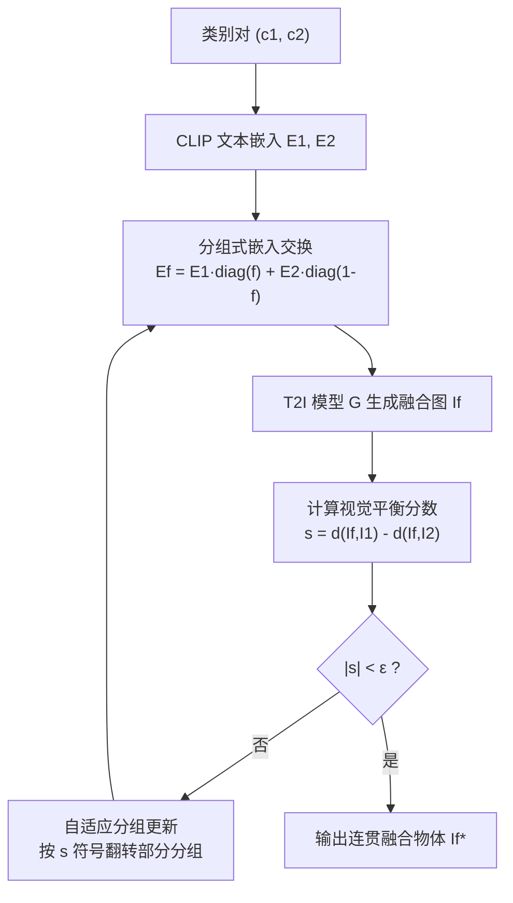

## 一句话总结

AGSwap 通过"分组式文本嵌入交换 + 自适应分组更新"的训练无关方法，将两个跨类别概念融合成单一、连贯且富有想象力的新物体，并配套构建了大规模层级化基准数据集 COF。

## 研究背景

跨类别物体融合（把两个不同类别的概念合成为一个连贯的新物体）在虚拟现实、数字媒体、影视与游戏等领域应用广泛，也是文本生成图像（T2I）中"组合创造力"研究的重要方向。然而现有方法存在明显短板：

- 基于提示词的方法（如 GPT-image-1、SDXL-turbo）缺乏对概念融合的细粒度控制，常常只是把两个物体并列摆放，而非真正语义融合；且对非专业用户而言，为多样化想象结果撰写有效提示词本身就很困难。
- 基于微调/文本反演的方法（如 ConceptLab、CreTok）在高维 token 空间中类间分布稀疏，难以融合语义上相距较远的概念（例如动物与非动物）。
- 训练无关的嵌入交换方法（如 BASS）采用随机交换向量与迭代采样，在高维嵌入空间中采样效率低，容易产生混乱或偏向某一方的结果。

此外，该领域长期缺乏一个全面的基准数据集：ImageNet 存在长尾分布（动植物类别远多于人造物），CIFAR-100 规模与多样性不足，CangJie 类别少且集中于动植物。这些都限制了跨类别融合研究的评测。

## 方法

### 整体框架

给定一个类别对 $$(c_1, c_2)$$，先用文本编码器得到各自的 CLIP 文本嵌入 $$E_1, E_2$$，并用扩散模型生成对应参考图 $$I_1, I_2$$。通过分组式嵌入交换构造混合嵌入 $$E_f$$ 生成融合图 $$I_f$$，再用基于 CLIP 的视觉平衡分数作为反馈，自适应地更新交换向量，迭代收敛到均衡融合。

### 关键设计

1. **分组式嵌入交换（Group-wise Embedding Swapping）**：用二值交换向量 $$f \in \{0,1\}^w$$ 对两个文本嵌入按列混合：$$E_f = E_1 \times \mathrm{diag}(f) + E_2 \times \mathrm{diag}(1-f)$$。初始时随机将一半位置置 1、一半置 0。在此基础上定义交换组 $$G \subset C$$，一次只修改组内若干索引，从而以"分组"为单位而非逐元素地调节融合比例。

2. **平衡分数（Balance Score）**：用融合图与两张参考图的 CLIP 余弦相似度之差衡量偏向性：$$s = d_1 - d_2$$，其中 $$d_1 = d(I_f, I_1)$$、$$d_2 = d(I_f, I_2)$$。$$s>0$$ 表示偏向 $$c_1$$，$$s<0$$ 表示偏向 $$c_2$$，$$\lvert s \rvert$$ 越小表示两个概念融合得越均衡。

3. **自适应分组更新（Adaptive Group Updating）**：根据 $$s$$ 的符号，随机选取交换向量中的一个子集翻转取值（$$s>0$$ 时把部分 0 翻成 1，$$s<0$$ 时把部分 1 翻成 0），使融合逐步趋向均衡，直到满足停止条件 $$\lvert s \rvert < \epsilon$$（文中 $$\epsilon = 0.01$$）。

4. **分组大小自适应（Group Size Selection）**：借鉴梯度下降思想，从初始组大小 $$l_{init}$$ 出发；当更新方向出现振荡（相邻迭代 $$s$$ 符号翻转，累计四次）时按 $$\Delta l$$ 缩小组大小；若缩小到 $$l_{min}$$ 仍未收敛则重置为 $$l_{init}$$。经验上设 $$l_{init}=10$$ 以兼顾收敛速度与稳定性。

此外，作者构建了 **Cross-category Object Fusion（COF）数据集**：基于 ImageNet-1K 文本标签，借助 WordNet 的层级语义关系，经过超类候选集生成、人工超类筛选、子类平衡与增广三步，最终得到 95 个超类、每类 10 个子类共 950 个类别，支持 $$\binom{950}{2} = 451{,}250$$ 个融合对。评测时随机抽取每个超类的一个子类构成 95 类的 COF-tiny 子集（4465 个文本对）。

## 实验结果

在 COF-tiny 上使用 CLIP、VQA、ChatGPT-4o 三类指标进行定量比较（avg. sim. 越高越好，balance 越低越好，其余越高越好）：

| Model | avg. sim.↑ | balance↓ | text-sim.↑ | surprise↑ | value↑ | novelty↑ | overall↑ |
|---|---|---|---|---|---|---|---|
| Ours | 0.56 | **0.01** | 0.58 | **7.3** | **7.4** | **7.9** | **7.6** |
| BASS (ECCV'24) | 0.52 | 0.12 | 0.53 | 7.1 | 6.0 | 7.2 | 6.5 |
| ConceptLab (TOG'24) | 0.38 | 0.11 | 0.51 | 7.2 | 5.8 | 7.1 | 6.7 |
| SDXL-turbo (StabilityAI'23) | 0.48 | 0.17 | 0.47 | 6.5 | 7.2 | 6.8 | 6.2 |
| GPT-image-1 (OpenAI'25) | **0.61** | 0.11 | **0.62** | 7.0 | 7.4 | 7.2 | 7.1 |

AGSwap 取得最优的平衡分数（0.01），说明融合最均衡、几乎不偏向任一输入；在 GPT-4o 评测的四项标准上全面领先，尤其 novelty 比次优方法高出 0.7 分。GPT-image-1 虽在平均 CLIP 相似度上略高（0.05），但主要来自"并列摆放"而非真正的语义融合。效率方面，在单张 RTX 4090 上，AGSwap 比 BASS 快约 4 倍、比 ConceptLab 快约 6 倍，迭代次数也分别少约 4 倍与 50 倍。用户研究（73 名用户）中，AGSwap 在组合方法比较中获得 72.1% 的票数，在复杂提示词比较中获得 53.7%。

## 亮点与局限

亮点：

- 方法简单、训练无关，且模型无关（在 SDXL-Turbo、Kandinsky 2.2、FLUX.1-Schnell 等多种生成器上均可迁移而无需重训）。
- 以"分组交换 + 视觉平衡反馈"替代随机交换，收敛更快、融合更均衡，显著优于同类训练无关方法 BASS。
- 论文对"为何能生成连贯单一物体"给出了三点机理解释：单一条件先验（混合嵌入构成单一条件序列，而非两路并行条件）、围绕同一嵌入的小步分组更新、以及基于前景主体（RMBG-2.0 分割）的平衡分数天然惩罚"并列摆放"。
- 贡献了大规模层级化基准 COF（95 超类 × 10 子类，45 万余融合对），弥补了该方向缺乏基准的空白。

局限：

- 融合效果依赖 CLIP 相似度与前景分割（RMBG-2.0）的质量，若分割或相似度度量失准可能影响平衡判断。
- 参考图 $$I_1/I_2$$ 的选择虽对最终输出稳定性影响不大，但会影响收敛速度与相似度分数，说明优化动态对初始条件仍有一定敏感性。
- 文本-图像相似度替代图像-图像相似度会明显降低融合质量，说明方法较依赖图像级参考信号。

## 延伸思考

- 平衡分数目前只用两概念间的对称距离衡量融合，若要扩展到三个及以上概念的融合，如何设计多元平衡准则与更新规则是一个自然的延伸方向。
- "基于前景主体的实例级约束天然惩罚并列摆放"这一观察很有启发：它把"语义融合"问题转化为"让缺失概念的线索汇聚到同一前景实体"的优化问题，这种思路或可迁移到其他组合生成或图像编辑任务。
- COF 数据集的层级结构（超类-子类）除了用于融合评测，也可能为研究"语义距离对可融合性的影响"提供受控实验平台，例如系统性分析同超类内 vs. 跨超类融合的难度差异。
