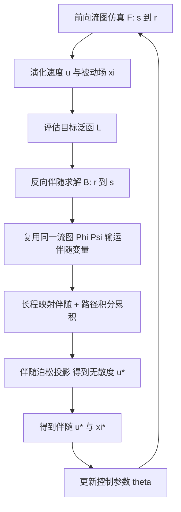

## 一句话总结

本文提出一种基于双向流图（flow map）的伴随（adjoint）求解器：前向仿真与反向梯度计算共享同一张长程流图，从而无需微分中间数值步、也无需存储中间变量，就能对不可压流做长时程、高精度的可微分仿真与梯度计算。

## 研究背景

- 领域现状：可微分流体仿真主要有两条路线。一类直接微分离散化的前向格式（如经典 advection-projection 方案），梯度与实际仿真步严格一致，在图形学中被广泛采用；另一类在连续控制方程层面解析推导伴随方程再离散，多见于计算流体力学的反问题。
- 核心痛点：直接微分离散格式的方法需要为反传保存所有中间状态，反向过程往往还要 3–5 倍于前向的计算量，在长时程、高分辨率下内存与时间开销巨大，且长期误差累积会让长时段梯度估计变得不可靠；而解析伴随路线为保证离散伴随解与离散前向仿真对应，通常依赖高阶离散，牺牲了视觉计算所需的效率与可扩展性。
- 本文 idea：注意到长程双向流图本是为提升前向仿真精度而生的建模框架，其"双向"意味着可在时间上正反输运物理量。作者观察到前向解与其伴随解由同一速度场驱动，反向过程可视为前向过程的时间反演，因此前向用的流图可以原样复用到伴随方程的反向过程中。这样梯度计算的精度可以直接受益于流图构造的改进，无需逐步微分数值格式。

## 方法

### 整体框架

系统由三部分组成：一个基于双向流图、在网格对齐帧序列上离散的前向不可压流体求解器；一个用同一套流图求解伴随方程的反向求解器；以及一个"长短时稀疏流图"（Long-Short Time-Sparse EFM）加速策略。前向从起始时刻 $$s$$ 积分到终止时刻 $$r$$、演化速度与被动场；随后按目标泛函 $$L$$ 反向从 $$r$$ 解到 $$s$$，得到速度伴随 $$\mathbf{u}^{*}$$ 与被动场伴随 $$\xi^{*}$$，再据此更新控制参数 $$\theta$$。关键在于前向的后向流图 $$\Psi$$ 在反向过程里充当前向流图、前向流图 $$\Phi$$ 充当后向流图，两个过程沿相反时间方向使用同一数值格式。

### 关键设计一：前后向共享同一张流图

标准可微分方法只能先近似构造 $$\hat{\mathcal{F}}$$、再直接微分 $$\hat{\mathcal{F}}$$ 间接近似反向算子 $$\hat{\mathcal{B}}$$，导致 $$\mathcal{B}\to\hat{\mathcal{B}}$$ 的映射不准。本文利用前向算子 $$\mathcal{F}$$ 与反向算子 $$\mathcal{B}$$ 的严格对应关系：只需分别构造精确的 $$\mathcal{F}\to\hat{\mathcal{F}}$$ 与 $$\mathcal{B}\to\hat{\mathcal{B}}$$，二者的一致性借助流图的高精度经由传递性自然成立。由于伴随速度同样满足不可压条件 $$\nabla\cdot\mathbf{u}^{*}=0$$，伴随方程可像原方程一样用流图求解，伴随场表达为长程映射项加路径积分项 $$\mathbf{u}^{*}(\mathbf{x},t)=F_{t\to r}^{\top}\mathbf{u}^{*}(\Phi_{t\to r}(\mathbf{x}),r)+F_{t\to r}^{\top}\Lambda^{u}_{r\to t}$$，长程映射使伴随速度免于平流带来的误差累积。

### 关键设计二：直接离散连续伴随方程

不同于先微分离散前向过程的做法，本文直接离散连续的反向过程 $$\mathcal{B}_{r\to t}$$，给出一个有原则的伴随格式。伴随速度满足 $$\left(\tfrac{\partial}{\partial t}+(\mathbf{u}\cdot\nabla)\right)\mathbf{u}^{*}=\nabla\mathbf{u}^{\top}\mathbf{u}^{*}+\xi^{*}\nabla\xi-\tfrac{1}{\rho}\nabla p^{*}+\nu\Delta\mathbf{u}^{*}-\tfrac{\partial J}{\partial\mathbf{u}}$$，配合不可压约束 $$\nabla\cdot\mathbf{u}^{*}=0$$；反向每步先做长程映射并转换为短程平流伴随速度，累积源项、粘性项与耦合项得到未投影速度，再解一个带伴随非穿透边界条件的伴随泊松方程 $$\tfrac{\Delta t}{\rho}\Delta p^{*}=\nabla\cdot\mathbf{u}^{*\mathrm{up}}_{t}$$ 完成投影。前向所需的中点速度会存到磁盘或内存（无需占用 GPU），供反向复用，从而避开自动微分需要在计算图里保留全部中间速度的开销。

### 关键设计三：长短时稀疏流图加速

原始欧拉流图（EFM）演化代价为 $$O(m^{2})$$（$$m$$ 为流图长度），时稀疏 EFM 只在重初始化步做长程映射，把代价降到 $$O(m)$$，但重初始化区间内用半拉格朗日平流会积累误差，能量曲线呈锯齿状衰减。这在只渲染选定帧的视觉特效里可接受，但在伴随反向过程中，每一步速度都通过 $$\nabla\mathbf{u}^{\top}\mathbf{u}^{*}$$ 项显式贡献给伴随、误差会经路径积分 $$\Lambda_{r\to t}$$ 累积，严重污染 $$\mathbf{u}^{*}$$。为此作者提出长短时稀疏 EFM：在稀疏的长程流图之间再插入短程流图（长程每 $$n_{l}=15\sim60$$ 步、短程每 $$n_{s}=1\sim3$$ 步重初始化），在保持 $$O(m)$$ 复杂度、仅一次性增加演化步数的前提下，兼顾长时距与短时距精度，防止中间速度不准导致的伴随误差累积。

### 关键设计四：数值细节

流图及其雅可比 $$F,T$$ 用 RK4 积分；映射过程沿用双向流图做 BFECC 误差补偿；映射插值用支撑半径 $$1.5\Delta x$$ 的二阶核，耦合项梯度用支撑半径 $$2\Delta x$$ 的三阶核；粘性项用二阶有限差分。泊松求解在 2D 用 Taichi 自研 MGPCG，3D 用无矩阵 AMGPCG 以提升效率。

## 实验结果

主实验为 Fig. 11 中三个 2D 烟雾控制任务的体积守恒误差对比（数值忠于原文 Table 2，越低越好）：

| 任务 | Ours | DiffEigen | Improved-SL | SL |
| --- | --- | --- | --- | --- |
| Dragon | 0.0016% | 2.89% | 6.54% | 0.44% |
| Snake | 0.0056% | 1.50% | 4.91% | 3.28% |
| Turtle | 0.0018% | 2.84% | 3.46% | 2.02% |

补充关键结果（文字简述）：本方法在所有 2D 例子中体积波动低于 0.006%，而对比方法为 0.44%–6.54%；3D 例子最终帧波动仅 0.018%。在方法适用性上，涡量动力学推断与涡量控制任务只有本方法能完成，半拉格朗日与 Eigenfluids 因不保涡而失败；烟雾控制三者都能做但本方法细节与真实感更好。效率上，反向过程与前向过程的单步耗时和显存相近（未出现反传常见的显著增长），在 $$192^{3}$$ 分辨率下前后向合计仅需 6.53 GB 显存；例如 $$196^3$$ 例子前向约 0.24 秒/步、反向约 0.28 秒/步。消融实验（Fig. 15、Fig. 16）表明仅用时稀疏 EFM 会在蛙跳与单涡算例中产生明显伴随误差，且前向或反向换成半拉格朗日都会给出错误结果，验证了长短时稀疏 EFM 与双向流图对两个方向的必要性。

## 亮点与局限

亮点：

- 核心洞见简洁有力：前向仿真与反向伴随共享同一张双向流图，使梯度精度直接受益于流图构造，绕开了逐步微分数值格式。
- 直接离散连续伴随方程，不需保存全部中间状态、不需在计算图上反传，反向开销与前向相当，内存占用低（$$192^{3}$$ 仅 6.53 GB）。
- 提出长短时稀疏 EFM，在 $$O(m)$$ 复杂度下同时保证长、短时距精度，专门解决伴随路径积分对中间速度误差的敏感性。
- 解锁了需要精确涡量识别、预测与控制的可微分任务（视频涡量推断、涡量控制、二/三维烟雾形状控制），体积守恒显著优于基线。

局限：

- 只处理控制力与速度场的优化，未涉及形状优化与固体边界的可微分。
- 尚未支持带自由表面的不可压流可微分仿真。
- 优化仍主要依赖拟牛顿类算法，未探索更先进的优化器；以真实烟雾图像为目标的形状优化留待未来。

## 延伸思考

- "前后向共享流图"把梯度精度与前向建模精度绑定，是一种很干净的解耦思路：任何提升流图构造精度的工作（神经流图、粒子流图、可压缩流图等）都能顺势改善梯度质量，这为流图家族方法提供了统一的可微分接口。
- 直接离散连续伴随、把中间速度落盘复用，本质上是用"重算/存储物理量"替代"存储计算图"，在长时程高分辨率场景中这种以物理结构换内存的策略值得在其他可微分物理中借鉴。
- 作者展望的自由表面、固体边界与形状优化，正是把该框架推向真实反问题（如从真实烟雾视频反演初始涡量与控制策略）的关键；结合固-流耦合的流图工作，"流图 + 伴随"有望成为一条统一的长时程可微分仿真主线。
