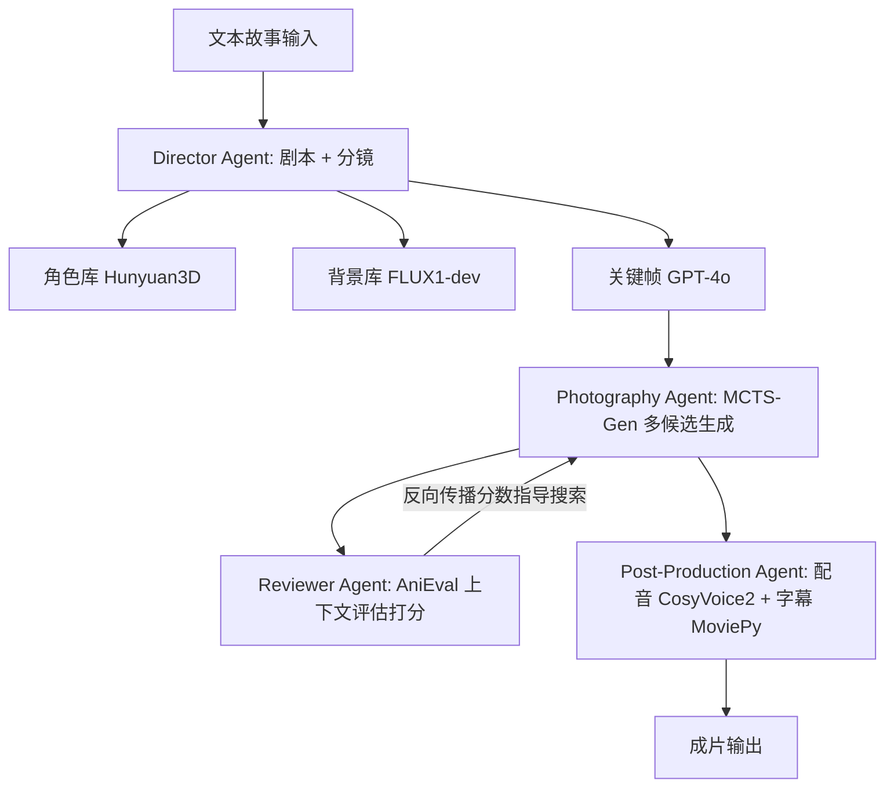

## 一句话总结

用一套分工明确的多智能体框架，把文本故事自动变成跨场景、跨角色且连贯的动画视频；核心是借鉴电影"NG 多次拍摄"的思路，用蒙特卡洛树搜索（MCTS）高效生成并挑选候选镜头，再配一套专为多镜头动画设计的评估框架 AniEval 做上下文感知的择优。

## 研究背景

当前长篇叙事视频生成有两条主流路线。一是单次生成整段长视频，但在跨越多场景、多角色时难以保持视觉连续性、叙事连贯性，还容易出现重复内容。二是模块化流水线：剧本→关键帧→视频片段→拼接成片，这种方式能产出多镜头长视频，却有两个硬伤。

其一，现有方法通常把关键帧映射为固定时长的片段，构造刚性而割裂，导致转场生硬、节奏不自然，难以表达复杂或长时段的连续动作。其二，视频生成模型本身不稳定，单个劣质片段就能明显拖垮整段视频的逻辑连贯与视觉连续。

一个直觉性的改进是"以前一帧为条件连续生成"，但这会放大误差传播与质量退化。作者从专业影视制作中提炼出被现有方法忽视的 Best-of-N 采样思路——为每个镜头生成多个候选再择优。但直接落地有两大障碍：一是逐镜头生成并评估多个候选计算代价高昂（两片段序列朴素做法就是 $$k^2$$ 量级的组合爆炸）；二是缺乏合适的自动评估机制，像 VBench 这类指标只评单个片段及其内部一致性，忽略了跨片段连贯性、时序动作质量与动画特有属性。AniMaker 正是针对这两点提出的。

## 方法

整体框架模拟专业动画制作流程，由四个专职智能体协作：Director Agent 负责剧本与分镜（storyboard）构建，Photography Agent 用 MCTS-Gen 生成候选片段，Reviewer Agent 用 AniEval 评估片段，Post-Production Agent 负责剪辑、配音与字幕合成。整段生成从纯文本输入到成片全自动，无需人工预处理或后处理。

关键设计一：Director Agent 的两阶段分镜构建。先用 Gemini 2.0 Flash 生成含镜头描述的原始剧本，并自动校验一致性与叙事流畅度；再搭建视觉库——角色库用 Hunyuan3D 生成、背景库用 FLUX1-dev 生成，然后由 GPT-4o 把校验后的镜头描述与视觉库图像结合生成关键帧。这套多模态（角色参考 + 背景参考 + 文本）关键帧生成保证了跨镜头的视觉一致性，作为后续制作的蓝图。

关键设计二：MCTS-Gen 的高效多候选片段生成。多片段序列天然对应一棵树，每个片段是一个节点，片段评估同时考虑自身质量与相邻片段一致性，恰好契合 MCTS 中子节点分数反向更新父节点的机制。算法用 Wan 2.1 做视频生成，按四步迭代：扩展（从当前路径末端节点生成 $$w_1$$ 个初始子片段并用 AniEval 打分排序）、模拟（按 UCT 分数再做 $$w_2$$ 次扩展）、反向传播（子片段分数上传，父节点分数加上子节点平均分）、选择（把 AniEval 最高分节点纳入选定路径）。UCT 打分公式为：

$$UCT(node_j) = \frac{2.0}{rank(node_j) + 1} + \alpha \cdot \sqrt{\frac{2.0}{child\_count(node_j) + 1}}$$

其中 $$rank$$ 来自初始 AniEval 排名，$$child\_count$$ 动态更新，$$\alpha$$（默认 1）平衡利用与探索。它把生成机会更多分配给有潜力的片段，同时鼓励探索未开发区域，从而在质量与算力之间取得平衡。

关键设计三：AniEval——首个面向多镜头动画的评估框架。它构建在 EvalCrafter 之上，针对多角色、多场景动画补充了若干指标：DreamSim 评估整体帧一致性、Count-Score 关注物体在镜头间出现或消失的问题、Face Consistency 在 Anime Face Dataset 上训练 InceptionNext 来评估动画角色面部一致性（克服 MTCNN 等常规人脸方法在动漫脸上的局限）。AniEval 共含 4 个主域、14 个细粒度指标，并支持依据前后相邻内容的上下文打分，这一分数正是 MCTS-Gen 中片段节点的质量评估依据。

## 实验结果

数据集从 TinyStories 采样 10 个含多角色复杂交互、跨多样背景的叙事，对比 StoryGen、StoryDiffusion、StoryAdapter、MovieAgent、MMStoryAgent、VideoGen-of-Thought 等方法。下表为作者提出的 AniEval 框架评估结果（分数越高越好），覆盖整体视频质量（O.V.Q.）、文-视频对齐（T.V.A.）、视频一致性（V.C.）、动作质量（M.Q.）与总分。

| 方法 | O.V.Q. | T.V.A. | V.C. | M.Q. | 总分 |
|---|---|---|---|---|---|
| StoryDiffusion+CogVideoX | 46.54 | 86.05 | 47.14 | 70.35 | 56.75 |
| StoryDiffusion+Wan 2.1 | 47.07 | 84.99 | 47.13 | 71.00 | 56.55 |
| StoryAdapter+CogVideoX | 56.76 | 87.38 | 55.89 | 69.73 | 63.95 |
| StoryAdapter+Wan 2.1 | 60.39 | 86.99 | 51.41 | 72.11 | 62.37 |
| MovieAgent | 41.17 | 68.50 | 68.68 | 70.16 | 61.95 |
| MMStoryAgent | 47.93 | 75.27 | 63.54 | 61.39 | 62.79 |
| VideoGen-of-Thought | 66.17 | 72.95 | 65.42 | 66.72 | 66.93 |
| AniMaker（本文） | **81.87** | 74.30 | **79.35** | **72.66** | **76.72** |

AniMaker 总分 76.72，相对次优的 VideoGen-of-Thought（66.93）提升 14.6%，其中视频一致性（V.C.）比最佳基线高 15.5%。文-视频对齐（T.V.A.）相对偏低，作者归因于智能体在把故事改编为剧本时会引入额外的叙事元素。此外在关键帧评估上，AniMaker 的文-图相似度达 0.31，较最佳基线提升 19.2%；在 VBench 上取得最佳平均排名 2.50。消融实验显示：把 MCTS-Gen 退化为每镜头只生成一个候选（$$w_1=1, w_2=1$$）会使 AniEval 下降 7.1%，但仍比最佳基线高 6.6%；把 AniEval 换成 VBench 做选择则降到 73.18（下降 4.6%）。MCTS-Gen 在达到阈值后能以更少的生成次数（如 $$w_1=3, w_2=3$$，每节点 4.37 次）媲美更多生成的配置，相比穷举搜索（每节点 9 次）压缩搜索空间超过 50%。

## 亮点与局限

亮点在于：把 Best-of-N 采样这一影视制作直觉引入 AI 叙事动画，用 MCTS 巧妙地在庞大候选空间里做探索与利用的平衡，既提升质量又控制算力；同时提出首个面向多镜头动画、支持上下文打分的评估框架 AniEval，其结果与人工评价的吻合度显著优于 VBench。人工评测（1-5 分）中本文在各维度均领先，尤其在角色一致性上（平均分 3.22 对基线 2.07）。

局限在于：当前工作聚焦于相对简单的叙事，作者也指出要产出更复杂、更精致的动画风格仍需进一步发展；框架高度依赖 Gemini、GPT-4o、Wan 2.1、Hunyuan3D、FLUX1-dev 等多个外部模型，整体质量受制于这些工具的能力上限；文-视频对齐因剧本创造性改编而相对偏弱。

## 延伸思考

这项工作最有启发的一点，是把"生成质量"问题重新表述为"搜索问题"：不改动底层视频生成器，而是在候选空间上用 MCTS 做结构化搜索，并让评估器（AniEval）的分数通过反向传播来引导搜索方向。这种"生成器 + 评估器 + 搜索策略"的解耦范式，在算力受限时尤其有价值，也很自然地把评估器的质量变成了整个系统的瓶颈——如果 AniEval 无法捕捉更细的时序或语义错误，MCTS 的择优就会失准。往前看，若能把生成器的可控接口（身份、布局、运动场约束）与树搜索更深度地耦合，或引入更贴近人类判断、可微的评估信号，长篇叙事动画在转场自然度与复杂动作表达上有望继续突破。
