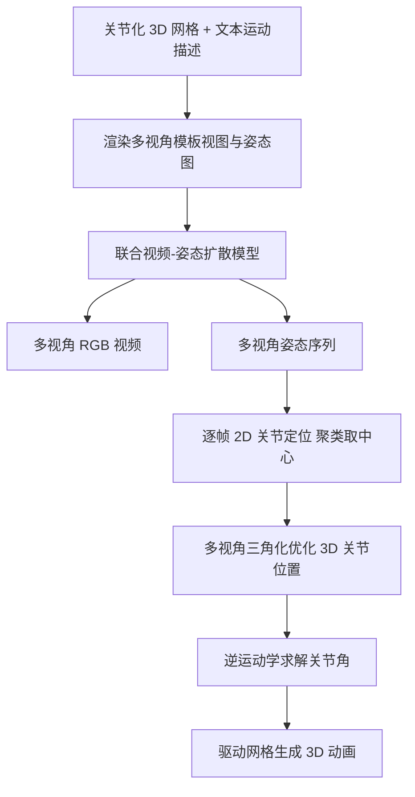

## 一句话总结

AnimaX 把视频扩散模型的运动先验迁移到骨骼动画上，用"多视角多帧 2D 姿态图 + 联合视频-姿态扩散"的表示，前馈式地为任意骨骼拓扑的 3D 网格生成动画，几分钟即可完成。

## 研究背景

给 3D 角色做动画在传统流程里需要绑定骨骼、手工设定关键帧，高度依赖熟练美术，费时费钱。现有自动化方法大致分两类，各有短板：

- 运动扩散/自回归类（如 MDM、MotionDiffuse）只能在预定义的固定骨骼系统或参数化人体模型上训练，难以泛化到动物、家具等多样类别。
- 基于视频/多视角视频扩散的 4D 生成类（如 Diffusion4D、Animate3D、MotionDreamer）通过蒸馏视频先验去优化神经形变场，自由度（DoF）过高，优化困难，常出现几何不一致、时序抖动、近乎静止的结果。最新的 AKD 用 Score Distillation Sampling 把运动限制到少数关节，但优化单个动画要约 25 小时。

本文的目标是：结合视频生成模型丰富的运动知识与骨骼动画低自由度、可控的优点，前馈式地为任意骨骼结构的关节化网格生成动画。核心难点在于如何对多样骨骼拓扑的稀疏 3D 姿态进行编解码，同时又能复用视频模型里的运动先验。

## 方法

整体框架分两个阶段：第一阶段用联合视频-姿态扩散模型，以网格渲染的模板视图、姿态图和文本提示为条件，同时生成多视角一致的 RGB 视频与对应的姿态序列；第二阶段把多视角姿态序列通过三角化恢复成 3D 关节位置，再用逆运动学求解关节角，驱动网格动画。

关键设计：

- **3D 运动表示为多视角多帧 2D 姿态图**：把每根骨骼的头部关节投影到 2D 图像平面，为每个关节赋予唯一颜色以便后续恢复，关节画成圆形标记、父子关节间用连线表示骨架。这样就能把稀疏的 3D 姿态转成视频模型天然擅长的图像模态。
- **联合视频-姿态扩散 + 共享位置编码**：直接微调视频模型只生成姿态序列会因姿态稀疏和 RGB 与姿态间的模态差异破坏时空先验，输出扭曲或近乎静止。因此把 RGB 视频 token 和姿态 token 沿时间维拼成统一序列 $$x_{total}\in\mathbb{R}^{(2f+4)\times h\times w\times c}$$ 联合去噪；并让空间对齐的两段 token 共享 RoPE 位置编码：$$PE_{i,j,k}=PE_{i+(f+2),j,k}=R(i,j,k)$$，从而把视频的时空先验有效"接地"到姿态生成上。
- **跨模态与多视角一致性建模**：用常量标识 0/1 经频率编码得到模态嵌入，加到时间步嵌入上以区分 RGB 与姿态；用 Plücker 射线图表示相机位姿并按通道拼接到隐表示，再通过跨视角自注意力（把 token 展平为 $$\dot{x}_{mv}\in\mathbb{R}^{(2f+4)\times(N\cdot h\cdot w)\times c}$$）强制多视角一致。
- **3D 运动恢复**：先聚类姿态图颜色得到逐帧 2D 关节位置，再以最小化多视角重投影误差、并约束骨长一致的非线性最小二乘做三角化得到 3D 关节，最后从根节点到末端逐关节用逆运动学估计旋转角。

模型基于 Wan2.1 文生视频架构的 1.3B 变体，采用两阶段训练：先用 LoRA 微调单视角联合视频-姿态扩散模型，再冻结预训练权重、只训练新增的相机嵌入与多视角注意力层扩展到多视角生成。训练数据来自 Objaverse、Mixamo、VRoid，清洗后约 161,023 个绑定动画片段。

## 实验结果

在 VBench 上与两类代表性 3D-to-4D 方法对比（数值越高越好，Dynamic Deg. 除外，因彻底失败如主体消失也会给出异常高分）：

| 方法 | I2V Subject ↑ | Smooth. ↑ | Dynamic Deg. | Quality ↑ |
| --- | --- | --- | --- | --- |
| Animate3D | 0.943 | 0.986 | 0.446 | 0.481 |
| MotionDreamer | 0.817 | 0.977 | 0.827 | 0.439 |
| Ours | 0.962 | 0.990 | 0.661 | 0.517 |

AnimaX 在主体一致性、运动平滑度、外观质量上均最优，得益于低自由度的骨骼动画设计。30 人用户研究中，本方法在运动-文本对齐（82.9%）、形状一致性（73.3%）、整体运动质量（77.9%）上都获得最高偏好。生成单个动画约 6 分钟，远快于 AKD 的约 25 小时。

## 亮点与局限

亮点：

- 用 2D 姿态图这一巧妙表示，把稀疏 3D 姿态转成视频模型可直接处理的模态，从而复用大规模视频先验，实现类别无关、任意骨骼拓扑的动画。
- 联合视频-姿态扩散 + 共享位置编码，有效解决了单独生成姿态时模态差异破坏时空先验的问题（消融表 4 中完整设置在外观质量 0.517 明显优于 Pose Only 的 0.448 与无共享位置编码的 0.429）。
- 前馈式、低自由度、几分钟出结果，相比优化式方法在效率与一致性上大幅领先。

局限：

- 依赖模板网格已正确绑定骨骼，姿态图靠颜色区分关节，关节数量多或投影重叠时的可靠性有待验证。
- Dynamic Deg. 指标本身不够稳健，评测主要基于 VBench 与 35 对测试样本，规模有限。
- 逐帧三角化 + 逆运动学的恢复流程对多视角一致性和标定精度较敏感。

## 延伸思考

把 3D 结构化信号"渲染"成 2D 图像模态、再借助大规模 2D/视频生成先验、最后反投影回 3D 的范式，正在成为一条通用路子（姿态、法线、深度都可以这么玩）。AnimaX 的共享位置编码给出一个很实用的启示：当引入与 RGB 空间对齐的新模态时，让二者共享几何位置编码能显著改善先验迁移。未来若能把物理约束（接触、重力、碰撞）或更长时序、可交互编辑纳入这套前馈框架，有望进一步逼近可直接生产使用的自动绑定-动画流水线。
