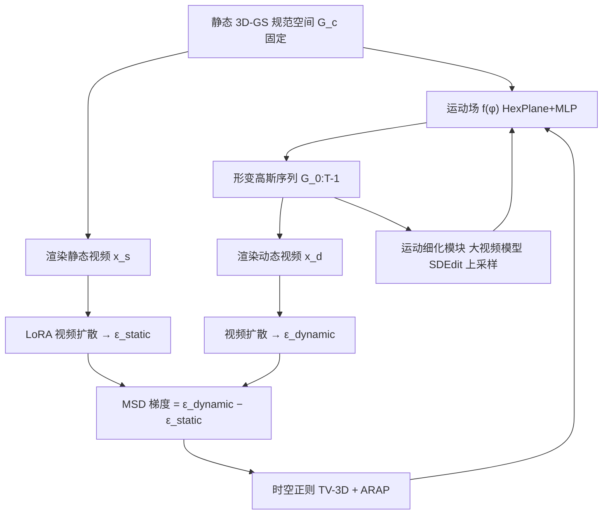

## 一句话总结

Animus3D 提出 Motion Score Distillation（MSD），把\"从纯噪声出发\"的传统 SDS 改造成\"从静态源分布向动态目标分布做最优传输\"，从而给静态 3D 资产自动生成既幅度充分又保持外观的文本驱动动画。

## 研究背景

文本驱动的 3D 动画在视觉叙事、娱乐与仿真中有广泛需求。近期主流做法是借助预训练的文生视频扩散模型，用 Score Distillation Sampling（SDS）把运动先验蒸馏到 3D 表示（如 NeRF 或 3D 高斯）上。SDS 的核心是：渲染 3D 场景图像、加噪、再用扩散模型去噪，用预测噪声与采样噪声之差作为梯度更新 3D 表示。理论上它被形式化为一个域传输问题，即把当前渲染分布推向文本描述的目标分布。

作者指出把原始 SDS 直接搬到运动生成上有两个根本问题：

1. 缺少明确的静态源起点。运动生成天然有一个静态初始状态，但 SDS 没有显式建模这个起点，导致优化轨迹起点模糊，蒸馏出的运动往往幅度很小。
2. 运动与外观纠缠。SDS 的梯度不区分二者，在只优化运动场时，外观损失只能靠几何扭曲来补偿，产生抖动、漂移甚至物体钻进背景等伪影。

因此需要一个专门面向运动蒸馏、能显式建模静态源并解耦外观的策略。

## 方法

整体框架：给定静态物体的规范空间 3D 高斯 $$G_c$$ 与文本提示，先用 3D-GS 重建静态物体并固定，仅优化一个由多分辨率 HexPlane 加 MLP 解码器建模的运动场 $$f(\phi)$$。运动场在每个时间戳 $$\tau \in \lbrace 0,\dots,T-1\rbrace$$ 输出高斯属性偏移，得到形变高斯序列 $$G_{0:T-1}$$，再经可微渲染得到视频。MSD 用两个噪声预测之差引导运动场优化，并叠加时空正则与运动细化。

关键设计：

1. 双分布建模（Dual Distribution Modeling）。MSD 把最优运动步近似为 $$\epsilon^{*}_{motion} = \epsilon_{dynamic} - \epsilon_{static}$$，替代 SDS 中\"预测噪声减随机噪声\"。动态分布由预训练视频扩散在动态提示词下给出；静态分布则用 LoRA 微调的去噪器 $$\epsilon_{lora}$$ 建模，因为即便给静态文本提示，原始视频扩散也不能稳定生成\"真正不动\"的视频，而 LoRA 用静态视频拟合后能给出干净的静态源分布。
2. 外观保持的忠实噪声估计（Faithful Noise）。SDS 加的随机噪声会让运动与外观纠缠。作者改用 DDIM 反演得到确定性噪声：先预测噪声、估计去噪图像 $$\hat{x}_0$$，再确定性地前向加噪迭代到时间步 $$t$$，使去噪结果与输入视频忠实一致，从而在引导运动时保住外观、抑制背景伪影。
3. 时空运动正则。时间上用 Gaussian trajectory total variation（TV-3D），惩罚相邻帧同一高斯位置的 L1 差异以促进时序平滑；空间上用 As-rigid-as-possible（ARAP），约束局部刚性形变，避免物体拉扯变形甚至断裂。
4. 运动细化模块。视频扩散帧长固定限制了细粒度运动。作者将时间序列插值到 $$T' = 2T-1$$ 帧，渲染更高分辨率视频后按 SDEdit 加噪再迭代去噪，借助更大的整流流文生视频模型细化，最后用细化视频与初始视频的 L1 损失优化运动场，得到更长、更细腻的动画。

## 实验结果

在 threestudio 上实现，以 ModelScopeT2V 为基础视频模型，分辨率 256、每段 16 帧，单张 24G GPU。与两种 SOTA 的 SDS 类 3D 运动生成方法 AYG、TC4D 对比，用 CLIP-Image、CLIP-Text、FID、FVD 评估（对比时不启用运动细化以保证公平）。

| 方法 | CLIP-Image ↑ | CLIP-Text ↑ | FID ↓ | FVD ↓ |
| --- | --- | --- | --- | --- |
| AYG | 91.75 | 44.31 | 105.33 | 647.6 |
| TC4D | 90.99 | 50.02 | 179.14 | 340.0 |
| Ours | 93.04 | 51.05 | 88.50 | 204.1 |

Animus3D 在四项指标上均领先：更高的 CLIP-Image 说明外观保持更好，更高的 CLIP-Text 说明运动更贴合文本意图，更低的 FID/FVD 说明整体视频质量更高。17 份有效问卷的用户研究中，本方法在整体质量、外观保持、运动幅度、运动-文本对齐、运动真实性五个维度上的偏好率均居首（如运动幅度 75.5%、外观保持 69.5%）。消融实验进一步验证：去掉双分布建模难以产生大幅运动，去掉忠实噪声会损伤外观并引入背景伪影，去掉 TV-3D 会导致相邻帧大位移，去掉 ARAP 会出现非刚性扭曲。

## 亮点与局限

亮点：

- 从最优传输视角重新定义运动蒸馏，用\"动态噪声减静态噪声\"取代原始 SDS，显式给出静态源起点，运动幅度与真实感明显提升。
- 用 LoRA 建模静态源分布，巧妙解决\"静态提示词无法生成真正静止视频\"的难题。
- DDIM 反演的忠实噪声有效解耦运动与外观，减少漂移和背景伪影。
- TV-3D 与 ARAP 从时间和空间两侧约束运动场，兼顾平滑与刚性。

局限：

- 只能形变给定 3D 物体，无法建模场景中\"新出现的内容\"（如火箭喷出的流体），此时模型倾向用扭曲来补偿。
- 优化耗时长，和多数分数蒸馏方法一样通常需要数小时，作者建议未来用摊销训练或更高效数据结构缓解。

## 延伸思考

MSD 的\"双分布差分\"本质上是把一个隐含的静态锚点显式化，这个思路可能不止适用于运动蒸馏：凡是\"只想改变某一属性而保持其余属性\"的分数蒸馏任务（如只改材质不改几何、只改风格不改结构），或许都能用\"目标条件噪声减源条件噪声\"来解耦。LoRA 拟合源分布的做法也提示，当预训练模型无法用提示词精确表达某个\"基线状态\"时，用少量样本微调出一个专用去噪器是一种通用补丁。至于耗时问题，若能把 MSD 与前馈式 4D 生成或摊销优化结合，可能才是走向实用的关键。
