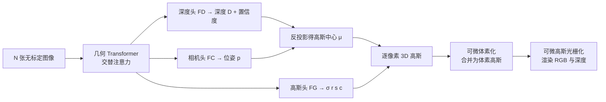

## 一句话总结

本文提出 AnySplat：一个只需一次前向传播、就能从无位姿、无标定的多视角图像（从单视角到数百视角）同时预测 3D 高斯基元与每帧相机内外参的前馈网络。它用可微体素化压缩冗余高斯、用来自预训练几何基础模型的伪标签蒸馏替代真实 3D 监督，在稀疏与稠密视角设定下都逼近甚至超过依赖精确位姿的基线，并把重建时间从分钟级压到秒级。

## 研究背景

从 2D 图像重建 3D 场景的主流路线各有短板。以 NeRF、3D Gaussian Splatting（3DGS）为代表的新视角合成（NVS）方法渲染质量极高，但依赖一条昂贵的预处理链：先用 Structure-from-Motion（如 COLMAP）估计相机位姿，再对每个场景做逐场景的神经场优化。这带来两个问题：一是从"拍摄"到"可用输出"之间存在明显延迟，二是计算成本随输入帧数增长，限制了实际可用性。

另一方面，近年的 3D 基础模型（如 DUSt3R、VGGT）能在数秒内从图像推断稠密点云，几乎绕开传统多阶段流程，但它们的几何先验虽强，却常常难以还原细节、照片级真实感与几何一致性，尤其在高度重叠的输入下会产生错位或噪声。

作者由此提出核心问题：能否让多视角捕获的新视角合成，直接受益于前馈架构带来的范式转变？目标是弥合"几何先验"与"可直接观看的渲染输出"之间的鸿沟——给几何基础模型加一个轻量渲染头，让它在一次端到端前向传播里同时输出几何、外观与相机参数，且训练时不需要任何真实 3D 标注。

## 方法

AnySplat 是一个基于 Transformer 的网络。给定 $$N$$ 张无标定图像 $$\{I_i\}_{i=1}^{N}$$，模型实现如下映射：

$$
f_{\boldsymbol{\theta}}: \{I_i\}_{i=1}^{N} \mapsto \big\{(\boldsymbol{\mu}_g, \sigma_g, \boldsymbol{r}_g, \boldsymbol{s}_g, \boldsymbol{c}_g)\big\}_{g=1}^{G} \cup \{p_i\}_{i=1}^{N}
$$

即同时输出 $$G$$ 个各向异性 3D 高斯（中心 $$\boldsymbol{\mu}$$、不透明度 $$\sigma$$、旋转四元数 $$\boldsymbol{r}$$、尺度 $$\boldsymbol{s}$$、球谐颜色 $$\boldsymbol{c}$$）与每张图的相机参数 $$p_i \in \mathbb{R}^{9}$$（内参+外参）。此外还附带产出全局点图、逐帧深度图与置信度等副产品。

### 几何 Transformer

沿用 VGGT 的骨干：用 DINOv2 把每张图切成 patch token（patch 尺寸 14，维度 1024），并为每张图加一个可学习的相机 token 与四个 register token。所有视角的 token 送入 24 层的"交替注意力"（Alternating-Attention）Transformer——每层先在单帧内做注意力，再在所有视角间做全局注意力，从而在多视角间传递信息。

### 双头预测与相机估计

- 相机头 $$F_C$$：由精炼后的相机 token 经若干自注意力层与线性投影预测每帧位姿；第一帧固定为单位变换，其余位姿都表达在这一共享局部坐标系下。
- 深度头 $$F_D$$：基于 DPT 解码器输出逐像素深度图与置信度，深度经预测位姿反投影得到每个高斯的中心 $$\boldsymbol{\mu}$$。
- 高斯头 $$F_G$$：把 DPT 特征与浅层 CNN 的外观特征相加，送入回归 CNN 预测不透明度、旋转、尺度、球谐颜色及逐高斯置信度。

### 可微体素化

逐像素分配高斯在稀疏视角（2–16 张）下可行，但视角超过 32 张后基元数量线性膨胀。为此把 $$G$$ 个高斯中心按体素大小 $$\epsilon$$ 聚类到 $$S$$ 个体素：

$$
\{\boldsymbol{V}_s\}_{s=1}^{S} = \left\lfloor \frac{\{\boldsymbol{\mu}_g\}_{g=1}^{G}}{\epsilon} \right\rfloor
$$

为保持可微，每个高斯预测一个置信度 $$C_g$$，在体素内经 softmax 转成权重：

$$
w_{g \to s} = \frac{\exp(C_g)}{\sum_{h: \boldsymbol{V}_h = s} \exp(C_h)}
$$

任意逐像素属性 $$a_g$$（如不透明度或颜色）按此权重聚合到所属体素：

$$
\bar{a}_s = \sum_{g: \boldsymbol{V}_g = s} w_{g \to s}\, a_g
$$

该模块消除 30–70% 的冗余基元、让基元数随视角数亚线性增长并最终饱和，同时保持梯度平滑流动、降低渲染显存。

### 伪标签知识蒸馏与训练目标

由于真实场景的 3D 标注常有噪声，AnySplat 完全不用 SfM/MVS 真值，而是从预训练 VGGT 蒸馏相机与几何先验作为外部监督。三项几何损失：

几何一致性损失，让 DPT 头输出深度 $$D_i$$ 与从高斯渲染出的深度 $$\hat{D}_i$$ 对齐，仅在置信度前 30% 的可信像素（掩码 $$M$$）上监督：

$$
\mathcal{L}_g = \frac{1}{N} \sum_{i=1}^{n} \big(D_i[M] - \hat{D}_i[M]\big)^{2}
$$

相机蒸馏损失（Huber 损失 $$\|\cdot\|_\epsilon$$，$$\tilde{p}_i$$ 为伪真值位姿）：

$$
\mathcal{L}_p = \frac{1}{N} \sum_{i=1}^{N} \|\tilde{p}_i - p_i\|_\epsilon
$$

几何蒸馏损失（$$\tilde{D}$$ 为 VGGT 伪深度）：

$$
\mathcal{L}_d = \frac{1}{N} \sum_{i=1}^{n} \big(\tilde{D}_i[M] - \hat{D}_i[M]\big)^{2}
$$

总目标结合 RGB 损失（MSE + 感知损失）：

$$
\mathcal{L} = \mathcal{L}_{rgb} + \lambda_2 \mathcal{L}_g + \lambda_3 \mathcal{L}_p + \lambda_4 \mathcal{L}_d
$$

值得注意的是，模型训练时只用上下文视角（不含新视角监督），却因蒸馏约束与强场景建模能力，在新视角渲染上表现优异。推理时提供可选的后优化（对稠密输入尤其有效），另有一套仅用于计算渲染指标的测试期相机尺度对齐策略。

## 实验结果

模型约 8.86 亿参数，几何 Transformer 与深度 DPT 头用 VGGT 权重初始化、其余随机初始化，在 9 个公开数据集（Hypersim、ARKitScenes、BlendedMVS、ScanNet++、CO3D-v2、Objaverse、Unreal4K、WildRGBD、DL3DV）上用 16 块 A800 训练约两天、15K 迭代，体素大小 $$\epsilon = 0.002$$。

新视角合成（Mip-NeRF360 与 VR-NeRF 零样本数据集，稀疏与稠密两种设定）：

- 稀疏视角下超过前馈的位姿无关方法 NoPoSplat、Flare，得益于多样化训练数据、随机视角采样带来的零样本泛化，以及更准的几何/位姿估计。
- 稠密视角（>32 张）下超过需 VGGT 初始化的优化式 3D-GS 与 Mip-Splatting，后者易对训练视角过拟合、在新视角产生伪影，而 AnySplat 重建更干净、速度快一个数量级（如 16 视角 0.767 秒 vs. 优化方法约 10 分钟）。

后优化：在 Matrixcity 200 视角上，基础前馈约 33 秒达 PSNR 19.46；再做 1000 步（<2 分钟）升到 20.81，3000 步升到 21.64。在 Mip-NeRF360 16 视角上，1000 步后优化把 PSNR 从 21.85 提到 25.51，超过 InstantSplat-VGGT 风格基线。

位姿估计与几何一致性：在 RealEstate10K（训练未见）与 CO3Dv2 上以 AUC 指标略优于 VGGT，说明基于渲染的监督施加了更强的多视角一致性约束。

消融（Hypersim）关键发现：

| 变体 | PSNR↑ | SSIM↑ | LPIPS↓ | $$\delta_1$$↑ | AbsRel↓ | #GS(M) |
| --- | --- | --- | --- | --- | --- | --- |
| 去蒸馏损失 | 7.28 | 0.217 | 0.832 | 75.5 | 14.7 | 4.80 |
| 去几何一致性损失 | 18.20 | 0.635 | 0.285 | 94.7 | 7.6 | 3.52 |
| 去可微体素化 | 17.77 | 0.609 | 0.303 | 95.8 | 5.7 | 4.82 |
| 冻结 AA 层 | 17.90 | 0.616 | 0.306 | 96.5 | 5.3 | 3.51 |
| 冻结全部 Transformer | 17.84 | 0.621 | 0.330 | 95.3 | 6.6 | 3.40 |
| 完整模型 | 18.25 | 0.648 | 0.279 | 96.3 | 5.9 | 3.45 |

蒸馏损失影响最大：去掉后模型只对输入视角过拟合、深度与位姿预测崩坏，PSNR 骤降到 7.28。可微体素化在略减基元的同时几乎不降质量，还带来显存与鲁棒性收益。训练策略上"冻结视觉分词器、只微调交替注意力层"效果最佳，比冻结全部/冻结 AA 层分别高约 0.41 dB 与 0.35 dB。

## 亮点与局限

亮点：
- 单次前馈同时输出 3D 高斯与相机内外参，从单视角到数百视角统一处理，秒级完成、无需位姿标定与逐场景优化。
- 伪标签蒸馏使训练完全摆脱真实 3D 标注（只用 RGB 图像），便于向无约束、大规模数据扩展。
- 可微体素化把基元数从线性增长压成亚线性并饱和，兼顾稀疏与稠密捕获、降低显存。

局限：
- 在天空、镜面高光、细薄结构等困难区域仍有伪影。
- 基于重建的渲染损失在动态场景或光照变化下稳定性较弱。
- 计算-分辨率的权衡（高斯数随输入与体素分辨率增长）在超高分辨率或极多视角时会拖慢性能。

## 延伸思考

AnySplat 把"3D 几何基础模型 + 轻量渲染头 + 伪标签蒸馏"组合成一条低延迟、可规模化的前馈流水线，实质是用可微渲染监督反过来强化几何基础模型的多视角一致性——这也解释了它为何能在位姿估计上略胜 VGGT。作者提出的下一步方向包括增强 patch 尺寸灵活性、提升对重复纹理的鲁棒性，以及把规模扩展到数千张高分辨率输入，指向了实时、交互式无约束 3D 捕获的应用前景。
