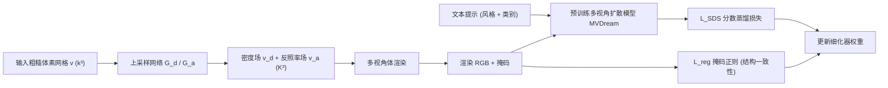

## 一句话总结

ART-DECO 通过对预训练多视角图像扩散模型做分数蒸馏（SDS），训练出一个前馈式「细化器（detailizer）」，能在 1 秒内把任意结构的粗糙 3D 体素代理转化为几何与纹理精细、且风格由文本提示统一控制的高质量 3D 资产。

## 研究背景

3D 生成模型已能从文本或图像轻松创建 3D 内容，但艺术创作往往需要对生成物的整体结构与局部细节同时进行精确控制，仅靠文本或图像难以实现。已有的结构可控方法主要有两类局限：

- 直接在 3D 数据上训练的生成模型（如 CLAY、Coin3D）受限于有限的 3D 训练数据，泛化能力不足，难以生成任意风格的局部细节，并且当输入的粗糙结构「超出分布」（out-of-distribution）时容易失效或不遵循输入结构。
- 基于 SDS 逐个优化单一形状的方法（如 DreamFusion 一类）虽借助图像扩散模型获得更强泛化性，但生成结构常偏离输入形状，且每个形状优化耗时从数分钟到数小时，无法交互；同时逐形状优化缺乏跨形状的风格一致性，无法在同一提示下生成风格统一、结构各异的形状集合。

作者的目标是构建一个既能遵循用户提供的粗糙结构（包括奇异的多座椅「椅子」、双头六腿的狗等超分布结构），又能按文本提示统一风格、且能被反复复用而无需重训的快速细化器。

## 方法

### 整体框架

ART-DECO 的核心思想是：不针对单一形状做 SDS 优化，而是把生成模型的知识蒸馏进一个 3D 卷积网络。细化器把分辨率为 $$k^3$$ 的二值占据体素上采样为分辨率 $$K^3$$ 的密度场与反照率（albedo）场（实验中 $$k=32$$，$$K=128$$）。训练时从这两个场做体渲染得到多视角图像，用文本条件下的预训练多视角扩散模型 MVDream 提供 SDS 监督；同时用一个基于渲染掩码的正则项保证生成结构与输入粗体素一致。训练完成后，细化器作为前馈模型可在 1 秒内完成上采样，无需 SDS 优化。

### 关键设计

- **两个上采样网络 + 结构掩码**：分别用 $$G_d$$ 生成密度场、$$G_a$$ 生成反照率场。为强制输出遵循输入结构，把输入体素膨胀一格后最近邻上采样为二值掩码 $$v_m$$，再与密度场逐元素相乘 $$v_d = v'_d \cdot v_m$$，避免网络在有效区域之外生成多余细节或伪影。

- **多视角 SDS 损失**：用 MVDream 一次生成 $$N=4$$ 个视角，对渲染图 $$x_i$$ 加噪后去噪得到 $$\hat{x}_i$$，损失为 $$L_{SDS} = \mathbb{E}_{t,\epsilon,c_i}\lVert x_i - \hat{x}_i\rVert_2^2$$。相比单视角 Stable Diffusion，多视角扩散模型带来的 3D 先验显著提升几何与纹理质量。

- **不透明度正则损失**：仅靠 SDS 与掩码仍会漏掉如扶手等结构（扩散模型偏好简单常见形状）。因此约束生成形状的渲染掩码与输入粗体素在同一相机位姿下的渲染掩码相似：$$L_{reg} = \mathbb{E}_{c_i}\lVert m_i - \hat{m}_i\rVert_2^2$$。总损失 $$L = L_{SDS} + \lambda_{reg}\cdot L_{reg}$$，训练中 $$\lambda_{reg}$$ 从 $$10^4$$ 逐步降到 10，先保结构后精修细节。

- **两阶段训练**：若一开始就用全部（含复杂结构）体素训练，扩散模型的偏置会使网络倾向简化结构。作者利用 3D 卷积网络即使只在单个简单形状上训练也具备强泛化性这一观察，第一阶段仅用单个简单结构粗体素训练作为良好初始化，第二阶段再在全部粗体素上训练至收敛。单个提示的训练在一块 NVIDIA 4090 上约需第一阶段 1.5 小时、第二阶段 3.5 小时。

## 实验结果

在椅子、桌子、沙发、床、建筑、动物、蛋糕七类形状上评测，与具备结构控制的 CLAY（以商用产品 Rodin 替代）、Coin3D、ShaDDR 对比。采用 Render-FID、CLIP Score 衡量保真度与文本一致性，Strict-IoU、Loose-IoU 衡量与输入粗体素的结构一致性。

| 方法 | Render-FID ↓ | CLIP score ↑ | Strict-IoU ↑ | Loose-IoU ↑ |
| --- | --- | --- | --- | --- |
| ShaDDR | 188.143 | 23.329 | 0.612 | 0.706 |
| Coin3D | 200.935 | 20.250 | 0.566 | 0.678 |
| CLAY | 175.402 | 23.943 | 0.626 | 0.725 |
| Ours | 171.703 | 26.047 | 0.639 | 0.739 |

ART-DECO 在全部四项指标上均优于对比方法：在超分布粗结构与创意文本提示下都能兼顾结构遵循与高质量细节；Coin3D 对复杂结构的几何与纹理生成困难，ShaDDR 在用 SDS 得到的含噪形状上训练时质量下降，CLAY 几何较干净但局部细节不足且在少见结构上会明显偏离输入。消融实验进一步表明：多视角扩散模型（MVDream）优于单视角（Stable Diffusion）；正则损失随 $$\lambda_{reg}$$ 增大使 IoU 提升、结构更忠实；两阶段训练能避免网络把非常规结构简化为常见形状。

## 亮点与局限

**亮点**

- 将「逐形状优化」转变为「蒸馏一个可复用前馈细化器」，训练一次后可对任意数量、任意结构的粗形状即时（<1 秒）细化，且风格一致，支持交互式建模。
- 借助 3D 卷积的局部性与归纳偏置，能处理超分布结构（多座椅椅子、双头六腿动物、字母造型书架等），显著优于现有文本到 3D 与文本到图像模型。
- 用一个通用提示词（如「furniture」）训练的单一模型可跨椅、桌、沙发、床等多类别生成风格统一的形状集合，且训练时无需类别标签。

**局限**

- 稠密体素表示限制了分辨率，表面会出现块状/锯齿伪影，平滑曲面与细小结构（如植物叶片、细丝）难以忠实表现。
- 每个体素存固定颜色而非视角相关颜色，无法表现光泽/反射材质。
- 每个不同文本提示都需要重新训练，且需要一批类别相关的粗形状作训练数据，在缺乏此类数据的领域难以扩展。

## 延伸思考

作者在结论中指出的方向颇具潜力：若有足够算力，可蒸馏出一个更通用的细化器，在推理时同时接受文本提示与粗形状作为输入，从而免去逐提示重训。这实际上是把当前「一提示一模型」的专用蒸馏推向「条件化的通用蒸馏」。此外，体素表示是当前质量瓶颈，若替换为稀疏/自适应表示或基于网格、隐式面的表示，或引入视角相关着色，有望突破分辨率与材质限制，同时保留 3D 卷积带来的强结构泛化能力——如何在更灵活的表示上保住这种「对超分布结构的鲁棒性」是值得探索的关键问题。
