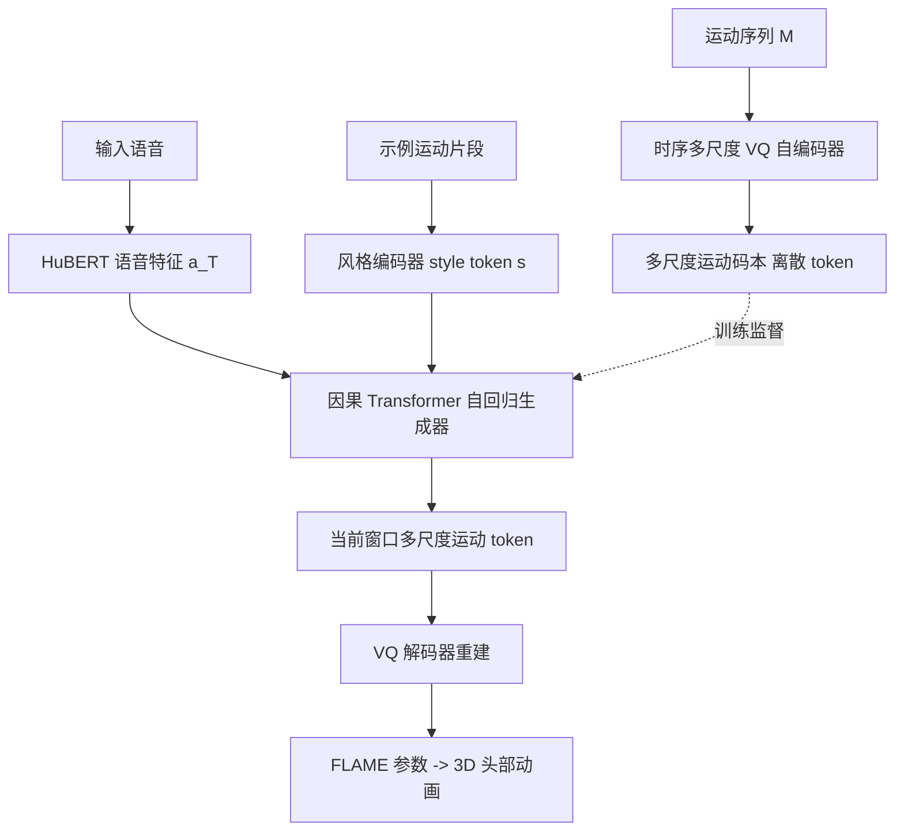

## 一句话总结

ARTalk 提出一种基于时间窗口与多尺度自回归的语音驱动 3D 头部动画框架，通过把语音映射到多尺度运动码本，实现实时生成高度同步的唇动、自然头部姿态与眨眼，并可迁移到未见过的说话风格。

## 研究背景

语音驱动 3D 面部动画的目标是从任意音频生成逼真的唇动与面部表情，是数字人交互的关键环节。已有方法存在明显短板：

- 直接在 3D 网格上做变形预测的自回归方法，难以刻画语音到细腻表情之间复杂的非线性映射，常导致非唇区过度平滑、缺乏细节。
- 扩散模型（如 FaceDiffuser、DiffPoseTalk）虽能生成高保真自然运动，但迭代采样计算开销大，难以满足实时、低延迟场景。
- 图像生成领域成功的多尺度自回归模型主要面向单张静态样本，直接套用到语音到运动的时序动态上存在困难。

作者据此提出一个兼顾生成速度与质量、并能同时产出自然头部姿态与任意风格的自回归框架。

## 方法

整体框架分为两个独立部分：先训练一个时序多尺度 VQ 自编码器，得到离散的多尺度运动码本与对应编解码器；再训练一个多尺度自回归模型，把语音信息映射到该离散运动空间。运动表示采用 FLAME 三维形变模型（$$3DMM$$），每帧由形状 $$\beta$$、表情 $$\psi$$、姿态 $$\theta$$ 参数化。

关键设计：

- 时间窗口 + 多尺度编码：将语音切分为连续时间窗口（如 4 秒 100 帧），窗内再用一组不同时间分辨率的多尺度表示（长度如 $$[1, 5, 25, 50, 100]$$）编码，兼顾全局时序上下文与逐帧细节，是低延迟合成的关键。
- 多尺度残差 VQ：采用残差向量量化 $$h^{(l)} = \mathrm{Interp}(\mathrm{Quant}(r^{(l-1)}), k_l)$$、$$r^{(l)} = r^{(l-1)} - h^{(l)}$$ 逐级细化，跨尺度共享码本以维持统一运动空间并简化自回归建模。
- 时序因果推理：在相邻两个时间窗口 $$T-1$$ 与 $$T$$ 之间施加因果掩码，使 $$T$$ 的预测只依赖已观测信息，避免未来信息泄露与时序不连续，保证长序列平滑。
- 两级自回归生成：概率分解为 $$p(\lbrace z_T^{(l)}\rbrace \mid z_{T-1}^{(L)}, a_T, s) = \prod_{l=1}^{L} p(z_T^{(l)} \mid z_T^{(<l)}, z_{T-1}^{(L)}, a_T, s)$$，跨尺度（粗到细）与跨窗口自回归，尺度内 token 并行预测；风格 token $$s$$ 用于解耦语音到运动的多对多映射，支持任意风格迁移。

## 实验结果

在 TFHP 数据集上与主流方法的定量对比（LVE、FFD、MOD 均为越低越好）：

| Method | LVE ↓ | FFD ↓ | MOD ↓ |
|---|---|---|---|
| FaceFormer | 12.72 | 22.06 | 2.73 |
| CodeTalker | 11.78 | 20.39 | 2.43 |
| SelfTalk | 12.07 | 23.74 | 2.57 |
| FaceDiffuser | 11.92 | 22.17 | 2.55 |
| MultiTalk | 12.23 | 24.42 | 2.48 |
| ScanTalk | 12.14 | 21.02 | 3.20 |
| UniTalker | 11.61 | 29.31 | 2.07 |
| DiffPoseTalk | 10.39 | 20.15 | 2.07 |
| ARTalk (Ours) | 9.34 | 18.15 | 1.81 |

ARTalk 在唇同步精度（LVE）与风格对齐（FFD、MOD）上均取得最优。推理效率方面，生成 1 秒运动在 A100 上仅需 0.01 秒、在 Apple M2 Pro 上约 0.057 秒；全部训练约 13 GPU 小时。在未参与训练的 VOCASET 上，ARTalk 也取得了有竞争力的泛化表现，超过多数专门在该数据集上训练的基线。

## 亮点与局限

亮点：

- 同时具备风格自适应、头部姿态生成与实时能力，是对比表中唯一三者兼备的方法。
- 多尺度残差量化 + 跨窗口因果推理，兼顾细粒度表现力与长序列时序一致性。
- 通过示例运动片段即可在推理时迁移到未见过的说话风格，无需预定义风格标签。

局限：

- 依赖 FLAME 参数化表示与 HuBERT 预训练特征，运动细节上限受这些先验约束。
- 生成质量依赖 VQ 码本容量（256 项），过度平滑或极端风格的建模仍可能受限。
- 主要在 25 fps 追踪数据上训练评测，对更高帧率或大幅头部运动的适应性有待验证。

## 延伸思考

多尺度自回归 + 时间窗口因果建模，为流式、低延迟的时序生成提供了一个可复用范式，思路上可迁移到手势、全身动作等其他语音/信号驱动的运动生成任务。将离散码本自回归与实时性结合，也提示在数字人交互中，自回归路线相较扩散路线在延迟敏感场景更具部署价值；后续若能引入更大规模数据与更强语音语义特征，风格解耦与情感表达能力可能进一步提升。
