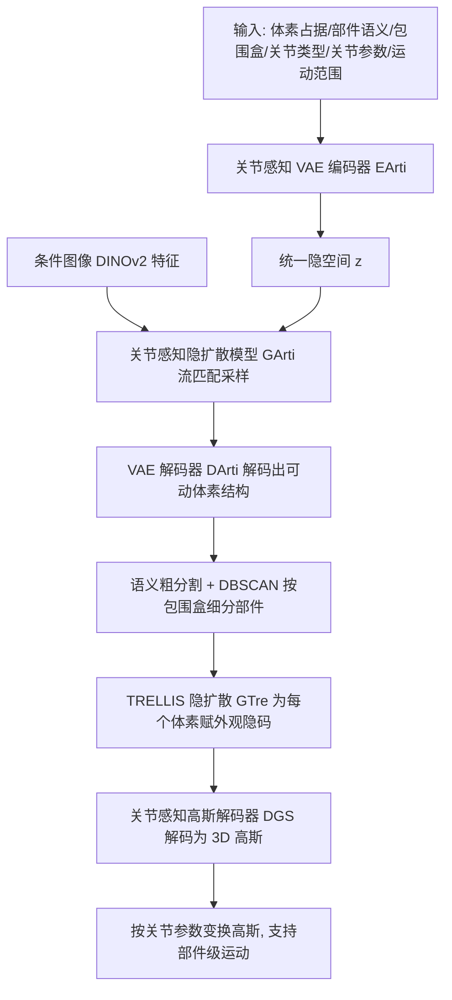

## 一句话总结

本文提出 ArtiLatent：把稀疏体素几何与关节属性（关节类型、轴、原点、运动范围、部件类别）联合嵌入统一隐空间，用隐空间扩散模型采样出"带关节的"体素结构，再用一个关节感知的高斯解码器把它解码成支持部件级物理运动的 3D 高斯，从而由单张真实图像生成几何精细、关节合理、外观逼真的人造可动 3D 物体。

## 研究背景

人造可动物体（抽屉、柜门、洗衣机门等）由多个语义部件经受约束的关节连接而成，是仿真、沉浸式虚拟环境和具身智能的关键交互资产。要生成这类物体，需要同时刻画三件紧耦合的事：精细几何、部件级关节运动、逼真外观。已有工作各有短板：

- 静态 3D 生成模型（如 CLAY、GaussianAnything、3DTopia-XL、TRELLIS）擅长刚性物体的全局几何与外观，但无法产出物理合理、部件感知的关节结构。
- NAP、CAGE 等尝试联合建模结构与关节，但用粗糙包围盒表示几何、靠隐式场或检索式部件拼装，常导致几何不一致、部件对齐不佳；SINGAPO 引入图像条件却仍受检索式流水线限制；MeshArt 提升了几何保真度但只做几何、缺乏纹理建模。
- PARIS、ArticulatedGS 等重建式方法依赖预先采集的起止状态；Articulate AnyMesh、ATOP 试图从静态网格推断关节，但本质都是重建，不支持生成式或条件式合成。

因此，缺一个能从单张真实图像条件生成、同时兼顾几何、外观与部件级关节属性的生成框架。

## 方法

整体分两阶段。阶段一把体素占据、部件语义、包围盒、关节类型与参数、运动范围等属性一起编码进关节感知 VAE 的隐空间，训练一个流匹配（flow matching）扩散模型在该隐空间中按条件（如图像）采样，解码出可动的体素结构；阶段二复用 TRELLIS 的结构化隐扩散与高斯解码器，并通过"关节感知微调"让外观解码适应关节引起的可见性变化，最终输出带关节参数的 3D 高斯。

### 关键设计 1：结构化稀疏体素作为统一表示

不同于以往逐部件独立建模、假定固定部件数上限并依赖检索拼装的做法，本文采用基于稀疏体素的结构化全局表示。占据网格 $$O \in \lbrace 0,1 \rbrace^{N \times N \times N}$$（$$N=64$$）刻画整体几何，充分利用 TRELLIS 等静态生成模型在"稀疏体素 + 高斯解码器"上学到的照片级先验，从而获得全局连贯、部件间自然过渡的几何。

### 关键设计 2：几何、语义与关节联合嵌入隐空间

观察到部件形状与功能往往暗含特定关节类型（抽屉倾向平移、门倾向旋转），本文把每个活跃体素附上：部件语义标签 $$l_i$$（base/drawer/door/handle/knob/tray/shelf/wheel 之一，独热编码）、包围盒 $$b_i \in \mathbb{R}^6$$、关节类型 $$j_i$$（fixed/revolute/prismatic/continuous/screw，独热）、关节轴 $$a_i \in \mathbb{R}^3$$ 与原点 $$o_i \in \mathbb{R}^3$$、运动范围 $$r_i \in \mathbb{R}^2$$。VAE 编码器输入 35 通道体素张量（1 通道占据 + 34 通道关节属性），压缩为 $$z \in \mathbb{R}^{C_z \times 16 \times 16 \times 16}$$（$$C_z=8$$）。同一部件实例的体素共享相同语义与关节属性，让扩散模型能学到形状-语义-关节的联合分布。VAE 训练用属性专属损失：占据用 Dice 损失缓解类不平衡，语义与关节类型用交叉熵，连续关节参数与包围盒用回归损失，总损失为 $$L_{total} = \alpha_{kl} L_{KL} + L_{occ} + L_{sem} + L_{joint} + L_{bbox}$$。

### 关键设计 3：关节感知的高斯解码器微调

直接用 TRELLIS 的高斯解码器 $$D_{GS}$$ 处理可动物体，会在"关闭时被遮挡、打开后才可见"的区域（如抽屉内壁）产生噪声或失真纹理，因为原 VAE 只在静态物体上训练、遮挡区几乎无监督。为此本文构建多状态数据：对每个物体均匀采样 $$k=8$$ 个关节状态、每状态渲染 $$n=48$$ 个视角，用 DINOv2 跨状态跨视角提取并平均每体素特征，赋给静止（关闭）状态体素。微调时把解码出的高斯按关节参数做刚性变换（每个体素解码为 32 个高斯），在多个关节状态下渲染并用重建损失 $$L_{GS} = L_{recon} + \lambda L_{reg}$$ 监督，使隐码 $$z_{Tre}$$ 对关节相关的几何暴露更有信息量，从而在不同关节状态下合成一致逼真的纹理。

### 关键设计 4：推理时的部件分割与参数聚合

推理时先由 $$G_{Arti}$$ 采样隐码解码出可动体素结构，再按语义标签做粗分割；由于同语义标签的体素可能属于相邻但不同的部件，用 DBSCAN 基于包围盒中心与尺寸做聚类细分，然后对每个部件内的体素关节参数取平均并回填，保证部件级运动一致。模型输入为静止状态、近正面视角的单张 RGB 图像，输出带关节参数的 3D 高斯，靠关节驱动的变换即可产生运动而无需重新推理。

## 实验结果

在 PartNet-Mobility（7 类家具、3063 训练物体、77 held-out 评测）与零样本 ACD 数据集（135 未见物体）的单图条件设定下，与图像条件基线 NAP-ICA、SINGAPO 及静态基线 TRELLIS 对比。指标为静止态 Chamfer 距离 RS-$$d_{CD}$$、关节后 AS-$$d_{CD}$$ 与 FID，均越低越好。

| 方法 | PartNet RS-$$d_{CD}$$↓ | PartNet AS-$$d_{CD}$$↓ | PartNet FID↓ | ACD RS-$$d_{CD}$$↓ | ACD AS-$$d_{CD}$$↓ | ACD FID↓ |
| --- | --- | --- | --- | --- | --- | --- |
| TRELLIS | 0.0051 | – | 153.45 | – | – | – |
| URDFormer | 0.5502 | 0.8374 | – | 0.7198 | 0.8995 | – |
| NAP-ICA | 0.0173 | 0.0914 | – | 0.1110 | 0.1887 | – |
| SINGAPO | 0.0168 | 0.0905 | 175.85 | 0.1011 | 0.1679 | 201.60 |
| Ours | 0.0063 | 0.0043 | 137.18 | 0.0690 | 0.0751 | 128.34 |

在涉及关节建模的方法中，ArtiLatent 在两个数据集上静止态与关节后 CD 均最低，FID 也最低，兼顾几何精度、关节一致性与视觉真实感；静止态相比 TRELLIS 性能相当（CD 0.0063 对 0.0051，FID 137.18 对 153.45），而 TRELLIS 不支持关节建模。消融显示去掉关节感知微调后 AS-$$d_{CD}$$ 与 FID 明显退化（FID 从 137.18 升到 156.02），证实微调对遮挡区外观的重要性。关节参数预测上，本文关节类型准确率 99.17%、关节轴误差 1.14°、关节原点误差 0.10，多数指标优于或接近 SINGAPO。单物体推理约 25.85 秒（体素结构采样 16.25s、外观特征采样 9.54s、高斯解码 0.06s），慢于 SINGAPO 的约 2.9 秒。

## 亮点与局限

亮点：
- 用统一隐空间把几何、部件语义与关节属性联合建模，避免了检索式部件拼装，实现全局连贯、部件-运动一致的生成。
- 提出关节感知高斯解码器微调，专门解决关节导致的可见性变化问题，显著改善抽屉内壁等新暴露区域的纹理真实感。
- 支持单张真实图像条件生成完整可动 3D 物体，输出带关节参数、即插即用地支持部件级运动，且对合成训练集之外的真实图像有一定泛化。

局限：
- 仅在运动学结构较简单的家具类物体（PartNet-Mobility、ACD）上验证，更复杂的运动学结构与更强泛化需要更大数据集支撑。
- 依赖准确的部件级包围盒与体素级语义标签来分割部件；当标注不精确或采样不一致时，部件分割质量下降，可能导致部件几何失真或运动行为错误。
- 推理耗时明显高于检索式基线 SINGAPO。

## 延伸思考

ArtiLatent 的核心价值在于把"可动结构"当成一等公民塞进结构化隐空间：几何、语义、关节被同一套体素属性统一表达，扩散模型因而能直接学到"什么形状配什么关节"的联合分布，而不必在生成后再检索、拼装、对齐。这条路线把静态 3D 生成的成熟先验（TRELLIS 的稀疏体素 + 高斯解码）平滑迁移到关节物体，关节感知微调则补上了"运动改变可见性"这一关节物体独有的外观难题，思路清晰且可复用。往前看，若能引入更大规模、更复杂运动学的数据，并把物理约束（碰撞、稳定性、可达性）纳入生成目标，这类方法有望直接产出仿真就绪、可用于具身智能与数字孪生的高保真可交互资产；而对部件分割精度的依赖也提示：把分割/关节推断与生成端到端联合优化，可能是减少标注依赖、提升鲁棒性的关键方向。
