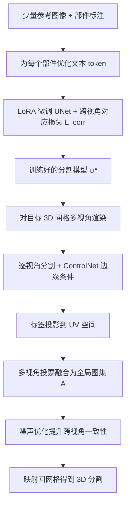

## 一句话总结

ASIA 只用少量带标注的"野外"图像作为参考，就能借助文本到图像扩散模型（Stable Diffusion）的先验，把 2D 分割迁移到任意 3D 网格上，实现可控的、甚至无法用文字描述的"部件"分割。

## 研究背景

3D 分割是图形学与视觉的核心问题，可支撑纹理映射、动画、编辑、装配等应用。但"部件"本身没有普适定义：现有方法大多聚焦语义、可用文字描述的部件，且依赖大规模标注数据或 2D 基础模型（如 CLIP、GLIP、SAM）的文本先验。

这带来三个痛点：其一，3D 数据标注昂贵，需要专业建模软件；其二，基于视觉语言模型的方法只能处理语义清晰、可文字描述的部件，难以刻画诸如"人脸上眼线与唇线之间的中段"这类非语义区域；其三，文本描述本身可能歧义。

作者提出一个新任务 ASIA：用户只提供少量在线收集、易于标注的参考图像（每类约 25~30 张），就能定义分割标准并迁移到几何或结构差异很大的目标 3D 形状上。参考对象与目标对象不必相同，甚至可以跨类别（如把车与马的标注迁移到"小马车"混合体上）。

## 方法

整体框架：训练阶段在少量带分割标注的参考图像上，为每个部件学习一个文本 token，并用 LoRA 微调 UNet，配合跨视角部件对应损失保证多视角一致；推理阶段对 3D 网格多视角渲染、逐视角分割，把标签投影到 UV 空间投票融合，再用噪声优化精修，最后映射回网格。

**关键设计 1：用扩散特征做逐视角分割。** 沿用 SLiMe 的思路，为每个部件优化一个文本嵌入 $$f_{txt}$$，通过 Stable Diffusion 的注意力图定位部件。分割掩码由加权累积自注意力（WAS）图 $$W$$ 给出：先对交叉注意力图 $$F_{ca}$$ 与自注意力图 $$F_{sa}$$ 分层平均，再把展平后的 $$F_{ca}$$ 与 $$F_{sa}$$ 相乘、reshape、resize，最后沿部件维 softmax 得到逐像素部件概率。训练损失沿用 $$L_{CE}$$、$$L_{MSE}$$、$$L_{LDM}$$ 组合。

**关键设计 2：跨视角部件对应损失。** 独立分割各视角会导致部件不一致。由于同一个文本 token 在所有参考图中对应同一部件，且 token 参与交叉注意力，作者在 $$F_{ca}$$ 上施加基于余弦相似度的对应约束：

$$L_{corr}=\frac{1}{R}\sum_{r=1}^{R}\left(\frac{1}{\lvert P_i^r\rvert}\sum_{p_i\in P_i^r}\left(1-\cos(F_{ca}^i(p_i),F_{ca}^j(p_j))\right)\right)$$

其中 $$p_j$$ 取另一参考图同部件像素集中与 $$p_i$$ 相似度最低的位置，以此强化同一部件跨视角特征的一致性。整体训练采用两阶段：先冻结模型只用高学习率优化文本嵌入，再用 LoRA 低学习率联合微调（此阶段才启用 $$L_{corr}$$）。

**关键设计 3：UV 空间投票 + 噪声优化。** 推理时渲染 $$m$$ 个视角，用 ControlNet 注入几何边缘先验，逐视角分割后投影到公共 UV 空间得到部分图集 $$A$$，再用众数投票 $$\phi(\cdot)=\mathrm{mode}(\cdot)$$ 聚合为全局图集 $$\mathcal{A}$$。由于各视角噪声 $$\varepsilon$$ 独立采样会造成碎片化，作者把 $$\mathcal{A}$$ 反投影回各视角得到伪真值 $$\hat{W}$$，通过测试时优化更新噪声：

$$E_{consis}=\frac{1}{m}\sum_{i=1}^{m}\lVert W_i-\hat{W}_i\rVert^2+\lambda L_{reg}$$

其中 $$L_{reg}$$ 约束 $$\varepsilon$$ 贴近标准正态分布，优化后的噪声 $$\varepsilon^{*}$$ 使各视角分割更一致，最终映射回 3D 网格。

## 实验结果

在 PartNetE 数据集的语义部件分割任务上（报告各类平均 mIoU，最后一列为 40 类总体平均），ASIA 全面超过现有方法：

| 方法 | Chair | Door | Lamp | Phone | Printer | Remote | Scissors | Overall（40 类） |
| --- | --- | --- | --- | --- | --- | --- | --- | --- |
| PartSLIP | 85.3 | 40.8 | 66.1 | 48.4 | 4.3 | 38.3 | 60.3 | 60.5 |
| PartSTAD | 85.3 | 61.4 | 68.4 | 63.2 | 7.9 | 53.4 | 68.5 | 66.1 |
| PartDistill | 88.4 | 55.5 | 69.2 | 50.8 | 6.3 | 40.7 | 68.8 | 67.1 |
| 3×2 | 84.4 | 54.4 | 59.5 | 41.0 | 8.5 | 54.1 | 65.7 | 65.9 |
| Ours | 90.1 | 77.5 | 76.9 | 69.3 | 38.4 | 74.7 | 83.7 | 75.8 |

此外，在 Objaverse 网格上的自适应分割用户研究中（32 名研究生参与），ASIA 平均排名 1.08、胜率 93.54%，显著优于 3D Highlighter 与 SATR。消融实验表明：在 SLiMe 基线上加入 LoRA 微调带来约 5% 的 mIoU 提升，再加入对应损失 $$L_{corr}$$ 进一步提升至最佳；推理端的边缘条件与噪声优化也各有贡献。

## 亮点与局限

亮点：首次提出"用少量图像标注做自适应 3D 部件分割"的任务与方法，能处理非语义、难以文字描述的部件；只需 2D 图像标注（远比 3D 建模标注轻量），且对几何/结构差异大甚至跨类别的形状有很强泛化；仅依赖单一 2D 生成基础模型（Stable Diffusion）即可完成 3D 分割。

局限：对小或细的部件（因掩码来自低分辨率注意力图）以及低置信区域，多视角 2D 预测可能定位不准；当这类区域在不同视角与其它部件重叠时，容易出现"分割溢出"，即一个部件的掩码错误蔓延到相邻部件。此外，基于多视角图像的方案会受自遮挡影响。

## 延伸思考

ASIA 的核心思路是把"3D 分割"转化为"可迁移的 2D 分割 + 多视角一致性融合"，充分复用了扩散模型的语义先验，避免了稀缺的 3D 标注。这条路径的关键杠杆在于文本 token 作为部件的跨视角锚点，以及 UV 投票与噪声优化对一致性的双重保障。

顺着作者的未来方向，几个值得探索的点：一是把分割从单物体扩展到 3D/4D 场景与多物体，并引入运动信息；二是用自适应相机采样缓解自遮挡，或干脆绕开 2D 投影、直接在 3D 表面上做分割与融合；三是低分辨率注意力图限制了细小部件的精度，若能引入更高分辨率的特征或边界细化模块，或可缓解"分割溢出"问题。
