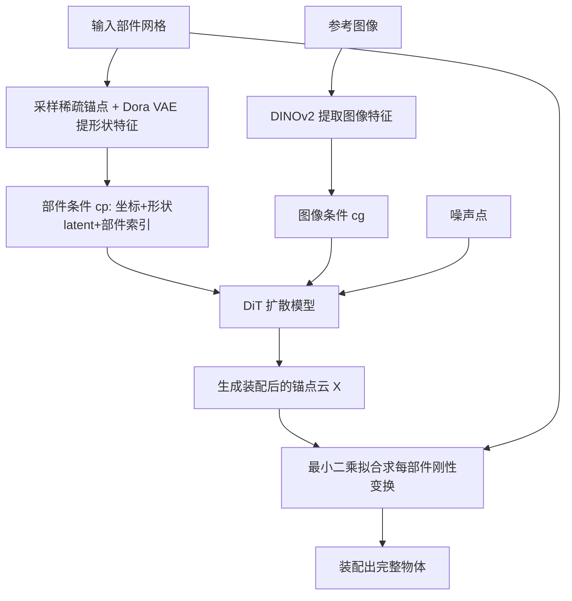

## 一句话总结

Assembler 把"用零件拼出完整物体"这一 3D 部件装配任务重新表述为生成问题，用扩散模型在欧氏空间里生成稀疏锚点云来表示装配结果，从而摆脱按类别训练与直接预测部件位姿的局限，首次实现对真实世界通用物体的高质量装配。

## 研究背景

3D 部件装配的目标是把一组模块化零件组合成完整物体，在 3D 内容创作、CAD、制造和机器人等场景都很关键。以往方法主要有两类局限：

- **确定性位姿预测**：多数工作把装配当作预测每个部件 6-DoF 位姿的确定性任务。但装配天然存在歧义（对称、重复部件、多种合理组合），确定性预测难以刻画这种一对多关系。
- **按类别训练**：现有方法大多只在 PartNet 的椅子、桌子、灯等规范类别上训练评测，部件简单且对齐良好，难以扩展到零件数量、几何和结构千差万别的真实物体。

此外，直接在 SE(3) 位姿流形上做生成建模，因分布不连续且多模态而不稳定；同时缺乏大规模通用装配数据。这些共同构成了"规模化"的核心障碍。

## 方法

Assembler 从任务表述、表示方式、数据三方面破解规模化难题：把装配表述为生成任务，用基于稀疏锚点云的形状中心表示，并构建 32 万级的大规模数据集。

关键设计：

- **锚点云形状表示**：每个部件采样为稀疏锚点，模型直接在共享全局坐标系里生成"装配后"的整体锚点云，而不是预测位姿。位姿事后用最小二乘拟合从初始锚点与生成锚点之间求出。这样把学习目标放到语义丰富、连续平滑的欧氏空间。总锚点数固定（$$M=256$$ 或 $$1024$$），按部件大小自适应分配，每部件至少 2 个点即可求变换，理论上可支持上百个部件，天然适配变数量零件。
- **装配扩散模型（DiT）**：去噪函数堆叠交叉与自注意力，形式为 $$\epsilon_\theta(x_t,t)=\{\mathrm{CrossAttn}(\mathrm{SelfAttn}(\mathrm{SelfAttn}(x_t\#c_p),m),c_g)\}_L$$。其中额外一层自注意力用块对角掩码 $$m$$ 限制 token 只关注同一部件内部，以编码部件内几何、保持刚性与点序。
- **对齐式条件注入**：图像条件用 DINOv2 特征经交叉注意力注入；部件条件 $$c_p\in\mathbb{R}^{M\times C}$$ 则直接与噪声 $$x_t\in\mathbb{R}^{M\times 3}$$ 逐点拼接，保证锚点级对齐，从而最大限度保持刚性与点序。部件条件含三部分：锚点坐标 $$p_i$$、Dora VAE 编码的形状 latent $$d_i$$、以及消除重复部件歧义的部件索引 Fourier 位置编码 $$e_i$$。
- **数据合成与过滤流水线**：利用艺术家建模网格"面连通分量天然可拆"的特性快速分割部件，再用 KNN 对质心分组（随机 3~100 个部件），并对每部件施加随机旋转平移模拟起始位姿。基于 TRELLIS-500K、ShapeNet、PartNet 等构建约 32 万个物体的装配数据集。

基于 Assembler 还搭了一个部件感知的 3D 生成原型：用 GPT-4o 从图像推断语义部件并生成各部件参考图，交给 TripoSG 等图生 3D 模型逐件生成，最后由 Assembler 装配成高分辨率、可编辑的完整模型。

## 实验结果

在 PartNet 上按类别训练对比，指标为 Shape Chamfer Distance（SCD，越低越好）、Part Accuracy（PA）、Connectivity Accuracy（CA）、Success Rate（SR）。Ours 为无图像条件版本，Ours-img 为带图像条件版本。

| Method | Chair SCD ↓ | Chair PA ↑ | Chair CA ↑ | Chair SR ↑ | Lamp PA ↑ | Lamp CA ↑ | Lamp SR ↑ |
|---|---|---|---|---|---|---|---|
| DGL | 9.60 | 37.50 | 24.26 | 7.60 | 32.33 | 42.06 | 12.38 |
| RGL | 10.23 | 43.82 | 25.97 | 7.43 | 34.19 | 47.18 | 14.86 |
| Score-PA | 7.41 | 41.74 | 28.38 | 5.06 | 31.05 | 48.12 | 8.59 |
| SPAFormer | 7.02 | 55.48 | 39.16 | 13.68 | 36.76 | 45.66 | 15.54 |
| Ours | 9.20 | 61.85 | 49.82 | 22.59 | 44.04 | 58.16 | 27.88 |
| Ours-img | 7.21 | 66.17 | 52.20 | 24.92 | 51.42 | 57.44 | 33.24 |

在 PA、CA、SR 上大幅超过基线，尤其是 PA 和 SR 体现更强的准确装配能力；SCD 略逊被归因于装配歧义（生成的合理配置可能与 GT 不同，而 SCD 对几何距离惩罚更重），加入图像条件可部分缓解并带来一致提升。消融显示：把部件条件从逐点拼接改为交叉注意力会破坏逐点对齐导致装配失败（SR 降到 0.00）；锚点数从 1024 降到 256 结果变差；引入 CFG 与拼接坐标／部件索引均有正向作用。在未参与训练的 Toys4K 上，模型首次实现对角色、生物、植物、食物、载具等通用物体的自动装配。

## 亮点与局限

亮点：
- 把 SE(3) 位姿预测的难题转化为欧氏空间点云生成，表示更平滑、语义更强、更易规模化。
- 锚点数固定 + 自适应分配的设计天然支持变数量零件，理论可达上百部件。
- 生成式表述天然容纳对称、重复、多解等歧义，配合图像条件消歧。
- 构建了约 32 万物体的大规模装配数据集及可复用的合成流水线。

局限：
- 面对大量细小部件、或需要精确边界对齐（如乐高式结构）的场景仍会失败。
- 部件感知 3D 生成流水线为多阶段，存在误差累积，保真度可能低于直接生成。

## 延伸思考

作者提出的方向包括扩大模型与数据规模、采用 rectified flow 等更先进的生成技术、引入预训练点云扩散或物体中心图等更强先验。更值得关注的是把"生成整体形状再反解部件位姿"这一思路推广：它本质上把结构装配问题转成了形状生成问题，是否也能迁移到场景级组合生成、缺失／多余部件的鲁棒装配，甚至与可微物理约束结合以保证结构可行性，都是有想象空间的路径。此外，锚点表示对点序和刚性的强依赖（靠逐点拼接和块对角掩码维持）也提示了这类方法对条件对齐的敏感性，值得进一步研究更鲁棒的条件注入方式。
