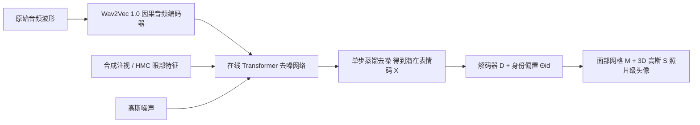

## 一句话总结

用一个在线扩散编码器把实时音频流转成潜在面部表情序列，再解码为高保真 3D 头像，在 VR 社交临场感场景中实现单步去噪、低延迟（GPU 时间 $$<15\text{ms}$$）的照片级面部动画。

## 研究背景

照片级临场感（telepresence）要在虚拟空间里自然地传递微表情，需要同时满足三点：高保真重建、低延迟实时传输、以及对任意用户的通用性。现有方案主要有两类瓶颈：

- 基于摄像头的驱动方式受遮挡、视角受限、算力与散热约束影响，随着 VR 设备向轻量化（乃至智能眼镜）演进而越发不切实际。
- 已有音频驱动方法要么用模板网格变形、细节不足，要么依赖完整音频序列离线处理、去噪迭代慢，无法满足实时与低延迟要求。

音频模态不受上述传感约束，且本身就是交流的主要媒介，包含生成面部表情所需的充分信息。本文因此聚焦：如何让音频驱动的高保真面部动画既通用又实时。

## 方法

整体框架采用编码器—解码器结构：编码器 E 把音频信号序列实时转换为潜在表情码序列与注视方向，解码器 D 再把表情码解码为网格 M 与一组 3D 高斯 S，得到照片级头像。潜在表情空间与解码器均沿用 Universal Relightable Prior Model 的跨身份共享表情分布，使同一表情可驱动多个身份，实现通用性。

关键设计：

- **在线 Transformer（消除对未来输入的依赖）**：在自注意力层施加窗口掩码，时刻 $$t$$ 只对 $$\lbrack t-w, t\rbrack$$ 的序列做注意力；同时用旋转位置编码（RoPE）适配任意序列长度，保证零前瞻的因果推理。
- **单步蒸馏加速去噪**：以迭代去噪的原始扩散模型 $$E_{orig}$$ 为教师，蒸馏出单步模型 $$E_{distill}$$。用 $$\mathcal{L}_{distill}$$ 对齐教师输出，用受 DMD 启发的 $$\mathcal{L}_{DMD}$$（KL 散度）让单步生成分布逼近扩散先验分布，蒸馏后推理无需 CFG，进一步提速。
- **面部几何损失**：在简化 ELBO 损失 $$\mathcal{L}_{simple}$$ 之外，加入速度损失与归一化抖动损失。抖动损失用比值归一化，避免大脸主导、小脸被忽视，保证跨身份的时间动态平滑准确。
- **实时直驱系统设计**：采用因果卷积的 Wav2Vec 1.0 保证零前瞻；用图像外绘（outpainting）思路在逐帧采样时保留已生成区域、只填充新帧，抑制扩散随机性带来的帧间不一致。
- **多模态扩展**：通过零卷积层注入 CLIP 情绪嵌入实现情绪条件；把注视向量替换为 VR 头显双 HMC 眼部特征 $$e \in \mathbb{R}^{160}$$，适配可穿戴传感场景。

## 实验结果

在自建多视角采集数据集（265 位被试，freeform 自由说话 + sentence 句子朗读）上与离线 SOTA 对比。本文方法在线运行且达到实时（100 FPS / 10ms），在多数指标上超越依赖未来信息的离线基线，推理速度快 100 至 1000 倍。

| 方法 | 条件 | 在线 | FPS(GPU) ↑ | freeform LVE ↓ | freeform FDD ↓ | freeform Lip Sync ↓ | sentence LVE ↓ | sentence FDD ↓ | sentence Lip Sync ↓ |
|---|---|---|---|---|---|---|---|---|---|
| TalkShow-Face | Audio | ✗ | 133 (7.5ms) | 6.423 | 0.255 | 5.114 | 5.541 | 0.132 | 4.583 |
| Audio2Photoreal-Face | Audio | ✗ | 0.77 (1.3s) | 8.490 | 0.259 | 6.109 | 6.298 | 0.167 | 4.897 |
| DiffPoseTalk w/o Style | Audio | ✗ | 0.22 (4.5s) | 11.506 | 0.579 | 9.515 | 10.805 | 0.506 | 9.254 |
| DiffPoseTalk w/ Style | Audio + Style(GT) | ✗ | 0.09 (11.4s) | 6.421 | 0.161 | 4.774 | 5.596 | 0.102 | 4.322 |
| Ours | Audio + Gaze(合成) | ✓ | 100 (10ms) | 6.329 | 0.185 | 4.751 | 5.177 | 0.146 | 4.178 |

感知实验（A/B 测试）中，用户偏好本文方法的比例：对 TalkShow 为 75.8%，对 DiffPoseTalk 为 84.59%，对 Audio2Photoreal 为 69.17%。消融显示：扩散+蒸馏优于直接回归；因果编码器与外绘组合能在保持精度的同时降低唇部速度误差。

## 亮点与局限

亮点：

- 首个在线、实时、通用地从音频驱动高保真 3D 面部头像的系统，同时满足高保真、通用、实时三要素。
- 在线 Transformer + 单步蒸馏两项设计有效攻克扩散模型的前瞻依赖与迭代慢两大实时化障碍。
- 展示了情绪条件与 VR 头显多传感器等多模态扩展，具备实际临场感落地价值。

局限：

- 逐帧注入与推理的直驱场景下，外绘虽保一致性，仍可能残留少量抖动。
- 解码器在头发、口腔内部（牙齿、舌头）等区域仍存在渲染伪影。
- 当前数据集缺少头部姿态信息，管线未显式建模头部姿态。

## 延伸思考

该工作把"扩散生成先验 + 单步蒸馏"这一在图像生成里已被验证的加速范式，成功迁移到序列化的面部表情生成，并额外解决了流式因果性与帧间一致性两个实时特有问题，思路对其他实时序列生成任务（手势、全身动作驱动）有借鉴意义。作者提到的模型量化与端侧部署、以及显式头部姿态建模，是走向智能眼镜等更轻量设备的自然下一步。另一方面，音频驱动的实时逼真头像也伴随伪造与滥用风险，负责任地部署（水印、身份校验等安全机制）值得同步推进。
