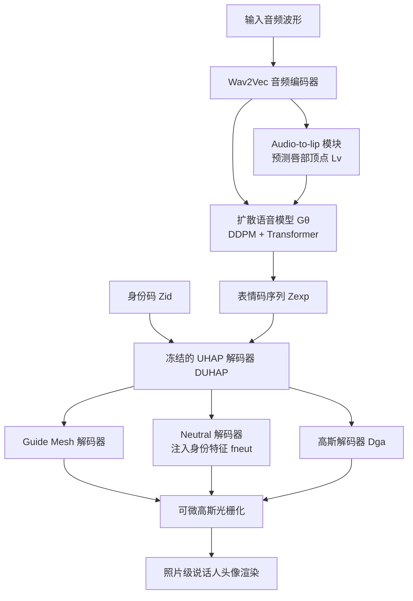

## 一句话总结

本文提出首个"音频驱动 + 通用先验"的照片级 3D 高斯头像合成框架：用跨身份多视角数据训练一个通用头像先验（UHAP），再用一个人物无关的扩散语音模型把原始音频直接映射到同时编码几何与外观的表情隐空间，从而生成口型精准、外观细节丰富、可自由视角渲染且能少样本个性化到新身份的说话人头像。

## 研究背景

从语音驱动照片级 3D 说话人头像，在虚拟通信与数字娱乐中价值很高，但同时满足三点很难：口型同步准确、表情自然、外观真实且视角一致。已有方案存在明显缺口：

- 2D 音频驱动视频方法（如 VASA-1）虽然逼真，但缺乏底层 3D 结构，无法自由视角渲染。
- 传统 3D 方案基于 3DMM 或模板网格，只建模几何形变，忽略音频相关的动态外观变化（如嘴内、眼神），难以渲染真实的口腔内部与凝视细节。
- 基于 NeRF / 3DGS 的照片级表示大多是"单人专属"，需要大量逐人数据与漫长优化（数小时到数天），难以做成通用、即插即用的模型。

因此，尚无一个既能跨身份泛化、又能从音频驱动外观合成的照片级头像方法，这正是本文要填补的空白。

## 方法

### 整体框架

方法由三个阶段组成：先训练通用头像先验 UHAP（学到解耦的身份码 $$Z_{id}$$ 与表情码 $$Z_{exp}$$）；再训练一个单目表情编码器用于少样本个性化；最后用扩散语音模型把音频映射到表情隐空间来驱动冻结的 UHAP 解码器。

### 关键设计

1. **通用头像先验 UHAP（含 Neutral Decoder）**：基于 3D 高斯泼溅，用 Ava-256 数据集的 230 个身份多视角动态视频训练，每个身份配有注册的中性 3D 扫描。核心是一个 Neutral Decoder，它把来自中性扫描、以 $$Z_{id}$$ 为条件的身份专属特征 $$f_{neut}$$ 注入主解码器，从而在身份与表情之间实现更好解耦、保持身份细节、稳定训练并提升渲染保真度。头像由 $$N_g = 256k$$ 个高斯基元表示。

2. **表情隐空间同时编码几何与外观**：用变分自编码器 $$E_{exp}$$ 处理相对中性态的纹理差与几何差 $$\Delta T_{exp} = T_{exp} - T_{neu}$$、$$\Delta G_{exp} = G_{exp} - G_{neu}$$，得到 256 维表情码 $$Z_{exp}$$。这个隐空间天然编码嘴部运动等几何变化，也编码凝视偏移、嘴内外观等外观变化，是与"仅几何"方法拉开差距的关键。

3. **扩散语音模型直接映射音频到表情隐空间**：采用 DDPM 扩散模型 $$G_\theta$$（Transformer 骨干，含自注意力、交叉注意力与用于时间步嵌入的 FiLM 层），以音频特征、预测唇部顶点 $$L_v$$、带噪表情码与扩散时间步为条件，预测加到干净表情码上的噪声，训练目标为标准 DDPM 去噪损失。不同于只预测几何参数的方法，其输出的 $$Z_{exp}$$ 同时驱动几何与外观。

4. **单目表情编码器实现少样本个性化**：预训练一个单目图像编码器 $$E_{image}$$，把单张图片映射到 UHAP 表情隐空间，训练时借助 LivePortrait 做跨身份表情迁移增强以学到身份无关的表情特征。个性化时先估计并"剥离"表情动态，随后两阶段微调（先优化 $$Z_{id}$$ 约 2k 次迭代，再微调解码器约 2k 次），只需刚性头姿、无需非刚性 3D 追踪；从一张静态扫描个性化整个过程在单张 NVIDIA A40 上约 20 分钟。

## 实验结果

在 Multiface 数据集留出的、UHAP 与音频模型训练均未见过的测试身份上，与几何类 SOTA 方法（其输出网格用逐人 GaussianAvatars 渲染以公平对比）比较，本文在图像重建质量与音视频同步上均领先：

| 方法 | PSNR ↑ | LPIPS ↓ | SSIM ↑ | LSE-D ↓ |
|------|--------|---------|--------|---------|
| CodeTalker | 26.23 | 0.37 | 0.6518 | 8.30 |
| FaceFormer | 25.93 | 0.38 | 0.6475 | 9.32 |
| FaceDiffuser | 26.32 | 0.43 | 0.6832 | 8.88 |
| Ours | **27.37** | **0.29** | **0.7293** | **6.32** |

由于这些指标测的是"从音频到图像"的端到端表现，结果印证了直接把音频输入与外观渲染打通所带来的综合收益。消融实验进一步验证了中性特征 $$f_{neut}$$（去掉后身份保持与渲染质量明显下降）与预训练单目编码器（若在微调时从头训练会把表情与身份外观纠缠，导致与音频模型输出语义不匹配、表情失真）的重要性。

## 亮点与局限

亮点：

- 首个能跨身份泛化、且能音频驱动外观合成的照片级 3D 头像方法，突破了以往"仅几何"驱动的表达力上限。
- 表情隐空间统一编码几何与外观，能自然渲染嘴内、胡须随说话形变、眼神偏移等细粒度细节。
- 个性化数据要求低、无需非刚性追踪，可从单张静态扫描或短单目视频适配，约 20 分钟完成；外观模型可实时渲染（A40 上 50 FPS）。

局限：

- 凝视行为有时不自然，可能与训练音频多为朗读脚本有关。
- 对相对皮肤独立运动的复杂元素（如胡须）注册不完美，几何拟合会平均掉细节。
- 音频到隐码模块因扩散去噪的迭代特性无法实时。
- UHAP 训练自统一光照的高质量影棚数据，对野外、手机、非受控光照的鲁棒性仍有限。

## 延伸思考

- 把"音频 → 表情隐空间"的思路推广开来：$$E_{image}$$ 可作为推理工具在大规模野外音视频数据上采集表情码，从而显式建模更广谱的人类情绪，这可能是从"影棚数据"走向"通用情感化头像"的关键路径。
- 中性 Decoder 的设计提示了一个通用范式——用可注入的"身份专属中性特征"来解耦静态身份与动态表情，这对其它需要跨身份泛化的生成先验（如全身、手部）或许同样适用。
- 扩散去噪的实时性瓶颈与蒸馏/一致性模型等加速方向结合，是让这类照片级说话人头像走向交互式应用的现实约束。
