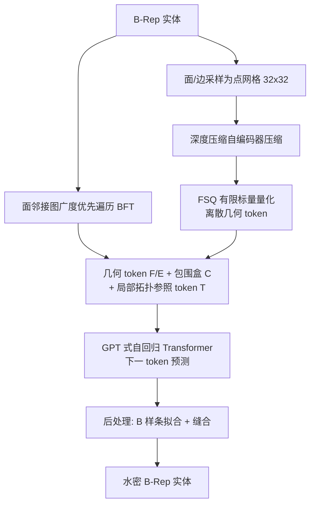

## 一句话总结

AutoBrep 用一个 GPT 式自回归 Transformer，把 CAD 边界表示（B-Rep）的几何与拓扑统一编码为一串离散 token，通过下一 token 预测直接端到端生成高质量、水密的 B-Rep 实体。

## 研究背景

B-Rep 是 CAD 中定义实体模型的标准数据结构，由顶点、边、环、面等拓扑元素及其承载的点、曲线、曲面等几何元素相互链接构成，是精确建模、仿真与制造的基础。自动生成高质量 B-Rep 有望重塑传统 CAD 设计流程。

现有深度学习方法分两条路线。一是"草图-拉伸"式的序列生成，先生成草图与拉伸/旋转等参数化建模指令再重建成 B-Rep，水密性和可编辑性好，但受限于建模序列数据集规模较小，且支持倒角、圆角等特征需要大量额外工作。二是直接生成，直接合成面、边等实体再缝合成实体，可利用大规模原始 B-Rep 数据、天然支持自由曲面，但要保证水密性和有效性很难，因为预测出的 B-Rep 元素必须精确对齐。

直接生成方法在历史上多采用多阶段训练：SolidGen 用三个独立模型分别生成顶点、边、面；BrepGen 有两个自编码器加四个扩散模型共六个模块。多阶段带来推理时误差累积、难以学习实体间联合分布、难以扩展到复杂模型等问题。AutoBrep 的目标就是用单一自回归模型统一几何与拓扑，克服这些痛点。

## 方法

### 整体框架

AutoBrep 分两大部分：先用离散表示学习把面/边的几何压缩为紧凑的潜在 token，再用统一 tokenization 把几何、包围盒与拓扑串成序列，交给自回归 Transformer 做下一 token 预测。序列顺序遵循 B-Rep 面邻接图的广度优先遍历（BFT）。

### 关键设计

1. **统一离散 tokenization**：把每个面表示为参数域内均匀采样的 $$32\times32$$ 点网格、每条边为 $$32$$ 点的一维网格，用深度压缩自编码器压缩后再用 FSQ 量化成离散 token（面 4 个、边 2 个 token，码本大小 $$\mathrm{prod}([8,5,5,5])=1000$$）。每个几何 token 配一组量化到 1024 个 bin 的 3D 包围盒 token $$C$$，用来还原全局位置与尺寸。FSQ 相比 VQ-VAE 无需辅助损失即可自动最大化码本利用率。

2. **广度优先遍历（BFT）定序**：把面看作节点、边看作连接，从实体左下角的面出发按层遍历。每到新一层就加入未访问的邻接面及连回上一层的边；边在其两个相连面都遍历后立即被 token 化并分组，体现"边来自面相交"的自顶向下视角。相比按全局坐标排序，BFT 显著提升有效率与覆盖率。

3. **局部拓扑参照 token $$T$$**：由于 BFT 中某层的边只可能连到上一层或同层更早的面，边的面-边关联被限制在最近两层的局部窗口内。$$T$$ 只在这个动态滑动的局部窗口内给面编号（$$T_0, T_1, \ldots$$），随遍历推进而重置更新。实验证明局部参照相比全局参照对性能至关重要。分配 200 个面 ID 可支持跨两层最多 200 个面。

4. **自回归预训练 + 微调补全**：用交叉熵下一 token 预测预训练基础模型，训练时随机旋转改变遍历起点以减少过拟合，并用"层级注意力 dropout"随机屏蔽局部窗口外的 token，促使模型关注局部结构。之后在 ABC-Constraint 上做监督微调支持 B-Rep 自动补全：把用户给定面作为第一层 token 附在序列开头，只对生成层计算损失，从而保证用户面被精确保留（用哑元 token $$T_u$$ 处理尚未连接的悬挂边）。

## 实验结果

在自建的 ABC-1M 数据集（约 130 万唯一实体）上做无条件生成评测。BrepGen 与 HoLa 在同数据集上重训（最多 100 面），DTGBrepGen 用其发布模型。指标含覆盖率 COV、最小匹配距离 MMD、JS 散度 JSD、Novel、Unique、Valid 及每面平均推理时间（MMD 与 JSD 乘以 $$10^2$$）。

| 方法 | COV % ↑ | MMD ↓ | JSD ↓ | Novel % ↑ | Unique % ↑ | Valid % ↑ | Time ↓ |
| --- | --- | --- | --- | --- | --- | --- | --- |
| DTGBrepGen* | 59.39 | 1.60 | 1.47 | - | - | 64.3 | 0.69 |
| BrepGen | 67.41 | 1.91 | 3.50 | 99.7 | 94.5 | 46.6 | 1.25 |
| HoLa | 67.80 | 1.62 | 2.86 | 99.8 | 95.3 | 54.8 | 1.68 |
| AutoBrep coord | 66.28 | 1.53 | 1.61 | 99.9 | 95.8 | 63.6 | 0.49 |
| AutoBrep global | 68.09 | 1.58 | 1.03 | 99.7 | 94.5 | 65.3 | 0.48 |
| AutoBrep | 71.49 | 1.45 | 0.97 | 99.8 | 93.7 | 70.8 | 0.46 |

AutoBrep 在覆盖率、MMD、JSD 上全面领先，有效率最高达 70.8%，推理速度也最快（得益于自回归模型可用 KV 缓存，而扩散基线不能）。随面数增加，基线有效率快速下降，AutoBrep 在多达 100 面时仍保持约 50% 有效率。消融显示：去掉局部窗口改用全局参照（AutoBrep global）、或改按全局坐标排序（AutoBrep coord），几乎所有指标都下降。

## 亮点与局限

**亮点**：
- 把几何与拓扑统一为单一离散 token 流，用一个自回归 Transformer 联合建模，把模块数从六个（BrepGen）减到三个（含两个编码器），训练流程大幅简化。
- 相比多阶段扩散方法，推理提速 2× 到 5×，生成质量与水密率更高。
- 可扩展到远超基线（约 50 面）的复杂实体，同时保持更高有效率与水密率。
- B-Rep 自动补全在统一 tokenization 下是特例，可保证用户提供的面被精确保留，适合装配接口约束下的可控生成。

**局限**：
- 存在典型失败情形：面在狭小空间密集堆叠时的自相交；螺纹（螺钉）等细长缠绕面难以正确生成；薄壳结构产生伪影。
- 生成结果仍依赖 OpenCascade 的后处理缝合，靠其鲁棒性容忍轻微不一致才能重建实体。
- 局部参照上限为跨两层 200 个面，超复杂拓扑的支持仍有边界。

## 延伸思考

把 CAD B-Rep 生成彻底"语言模型化"是这篇工作最有想象力的地方：一旦几何与拓扑都成为离散 token，NLP 领域成熟的可扩展性（长序列、KV 缓存、GPT 架构）与可控性（条件前缀、微调）就能直接迁移过来，自动补全就是最自然的"前缀续写"。这也提示未来可探索文本、图像等多模态条件到 B-Rep 的统一生成，或复用大模型的指令微调范式做交互式 CAD 编辑。另一方面，螺纹、薄壳等失败案例说明纯离散点网格表示对高频/极端长宽比几何仍有精度瓶颈，如何在 token 化中保留参数曲面的解析先验，或将有效性检查纳入训练回路（而非仅靠后处理），是值得深入的方向。
