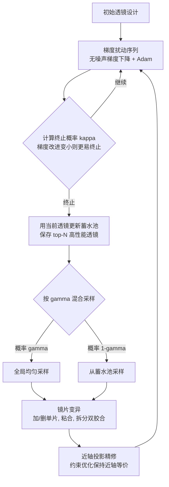

## 一句话总结

本文提出一种自动设计复合透镜的方法，用马尔可夫链蒙特卡洛（MCMC）采样把连续参数的梯度优化与改变镜片数量、类型的离散变异统一起来，从而在无需专家反复手工干预的情况下，联合优化透镜的连续与离散参数，突破以往仅靠梯度优化所能达到的清晰度-速度权衡边界。

## 研究背景

现代镜头设计需要在越来越苛刻的性能要求下优化越来越复杂的复合透镜。可微渲染的进展让连续参数（如单个镜片的曲率、间距）的梯度优化变得高效，但这类方法只能在固定拓扑（镜片的数量与类型）下改进设计，无法优化拓扑本身。要改变拓扑，只能靠专家手动增删或替换镜片，再交回优化器继续微调——这一过程繁琐、依赖直觉，且往往是满足严苛性能指标（例如从半幅传感器升级到全幅时保持全视场清晰度、极暗光下提升速度、或缩小体积同时保清晰与速度）的唯一途径。

另一条思路是用深度学习或遗传算法生成好的初始设计，但这些方法虽能做离散的拓扑改动，却无法有效优化连续参数，因此难以准确评估不同拓扑的潜力，产出的设计常常次优。核心矛盾在于：透镜性能高度依赖连续与离散参数的联合优化，而现有方法只优化其中一类。本文正是要填补这一空白，实现自动化的混合离散-连续镜头优化。

## 方法

### 整体框架

作者把复合透镜表示为向量 $$\theta \in \mathbb{R}^{N}$$，每个折射面含四个参数（曲率、横向尺寸、到下一面的距离、折射率），$$K$$ 个折射面对应 $$N = 4K$$ 维。图像形成用序贯光线追迹模拟，且传感器落点函数 $$x_s(\cdot;\theta)$$ 对 $$\theta$$ 可微，其值与梯度可通过前向及伴随光线追迹高效计算。设计目标是清晰度（基于方差的光斑尺寸损失）、速度（吞吐量损失）、焦距约束损失与厚度正则的加权组合 $$L(\theta)$$。

关键在于把混合离散-连续设计转化为一个采样问题：将损失转成玻尔兹曼分布 $$\pi(\theta) = e^{-L(\theta)/T}$$，用 MCMC 采样。作者发现常规 Metropolis-Hastings（MH）在此并不好用——朗之万扰动必须加噪声，而多镜片透镜对随机扰动极其敏感，被迫用极小步长导致收敛缓慢；且变异后需要连续优化精修，使得 MH 所要求的可逆反向提议分布难以（甚至无法）计算。因此作者转而采用无拒绝、不要求可逆的 RESTORE 算法。

### 关键设计

1. **RESTORE 采样替代 MH**：RESTORE（随机探索并随机再生过程）用两类提议——小幅"扰动"与大幅"变异"，无拒绝、不要求可逆。因为不需可逆，扰动可用无噪声的纯梯度下降 $$\theta \leftarrow \theta - \eta\, \mathrm{d}L/\mathrm{d}\theta$$ 并配合 Adam 大步长加速；扰动序列的终止概率 $$\kappa = (\pi(\theta) - \pi(\tilde{\theta}) + C) / (\pi(\theta) + C)$$ 会在梯度优化陷入局部最优、相对改进变小时自适应地提高，从而适时触发变异。

2. **蓄水池变异分布**：变异分布按 $$\gamma\, p_{\text{global}}(\theta) + (1-\gamma)\, p_{\text{reservoir}}(\theta, R)$$ 混合，以小概率 $$\gamma$$ 全局均匀采样（满足 RESTORE 对"任意透镜非零概率"的要求），其余时候从蓄水池 $$R$$（保存历史 top-N 高性能透镜）采样。蓄水池实现"回溯"，当某条扰动链陷入劣质区域时可从此前的好透镜"热启动"，并让终止概率有可计算的近似形式。

3. **四类跨维度变异**：受镜头设计教科书启发，实现加单片、删单片、粘合单片、拆分双胶合四种改变镜片数量与类型的变异，均匀采样元素与变异类型。

4. **近轴投影精修**：直接变异往往得到聚焦与吞吐急剧变差的透镜。作者用 $$2\times 2$$ 光线传输矩阵这一近轴近似，定义"近轴等价"（两透镜对平行于光轴的近轴光线作用相同），并把变异后的透镜通过约束优化（牛顿法+拉格朗日乘子）投影回与原透镜近轴等价的设计：在 $$\lVert \theta - \theta^{*} \rVert^{2}$$ 最小的同时约束二者传输矩阵对近轴光线作用一致。该精修仅用于变异微调，整体方法仍用完整光线追迹以计入非近轴效应；相同运行时间下它比全光线追迹梯度下降带来大得多的目标改进。

## 实验结果

作者在四种初始镜头（28mm 广角、50mm 标准、105mm 微距、135mm 长焦，均假设 35mm 全画幅传感器）上做了近轴投影的消融研究（表 1），报告"采样透镜优于初始透镜的迭代占比"，分别在 1000 与 5000 次迭代时统计：

| 镜头 | 投影 1k | 投影 5k | 无投影 1k | 无投影 5k |
|---|---|---|---|---|
| 广角（28 mm） | 0.356 | 0.358 | 0.225 | 0.241 |
| 标准（50 mm） | 0.964 | 0.972 | 0.554 | 0.828 |
| 微距（105 mm） | 0.118 | 0.424 | 0.0 | 0.015 |
| 长焦（135 mm） | 0.087 | 0.281 | 0.009 | 0.122 |

结果显示，使用近轴投影时，方法能显著更频繁地采到优于初始设计的透镜，尤其在难度更高的微距与长焦上差距明显；投影还大幅缩短了"预热期"（蓄水池被好透镜填满前的阶段）。此外，方法能在改变损失中清晰度与速度权重时拓展清晰度-速度的帕累托前沿，超过仅靠梯度优化或商用软件所能达到的边界；与基于 MH 的可逆跳跃采样器相比，本方法用大步长且无拒绝，能持续找到更好的透镜；与暴力搜索（在每个可能位置增删单片再梯度优化）相比，本方法更能避开局部最优、探索更大设计空间。在 NVIDIA RTX 3090 上，实现 12,000 次迭代约 40 分钟。

## 亮点与局限

亮点：
- 首次在自动镜头设计中真正联合优化连续参数与离散拓扑，无需专家在离散与连续步骤间反复手工切换。
- 用 RESTORE 替代 MH，规避了可逆性约束，使无噪声大步长梯度下降与"变异后连续精修"成为可能。
- 近轴投影用轻量的光线传输矩阵把变异后的透镜快速拉回近轴等价，显著提升变异质量并缩短预热期。
- 提供开源实现与交互式可视化。

局限：
- 仍对初始化敏感，需要高质量初始设计，随机采样几乎不可能得到可用起点。
- 未纳入可制造性与制造公差，部分产出设计含极薄镜片，可能难以加工或对公差不稳定。
- 目标仅针对单一波长与单一焦距，未直接处理消色差、变焦等更广的设计目标（作者指出可通过对多波长/多焦距求平均来扩展）。

## 延伸思考

这项工作的核心启发在于：把"结构会变、维度会变"的设计问题重新表述为跨维度的采样问题，并用无拒绝、免可逆性的 RESTORE 框架把梯度优化与离散变异自然融合——这套范式对其他"连续参数+离散拓扑"耦合的图形与工程设计问题（如机械装配、超材料结构、光学系统之外的物理装置）都可能迁移。近轴投影则展示了"用廉价的低阶物理近似做变异后的可行性修复、再交给昂贵的完整模型精修"这一分层策略的价值，本质上是在设计空间里用物理先验构造更聪明的提议分布。真正落地仍需跨过可制造性与公差这道坎：当性能对镜片微小变化极其敏感时，如何在目标函数或采样过程中显式建模制造鲁棒性，是把"仿真最优"变成"实物可用"的关键一步。
