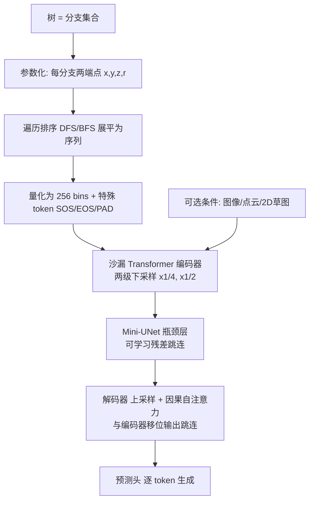

## 一句话总结

提出 HourglassTree——一种为树木结构量身定制的自回归 Transformer 框架，用"分支序列 + 沙漏形多分辨率架构 + 遍历式 token 排序"高效生成静态 3D 树与随时间生长的 4D 树，并支持点云、图像、草图等条件生成。

## 研究背景

树木生成是计算机图形学的经典问题。树木具有复杂的层级结构和多样的分枝模式，传统方法主要依赖过程式技术或基于规则的生长模拟（如 L-系统、粒子系统、生物生长规则），虽然在特定场景有效，但需要大量参数调试，且难以灵活适配不同树种与环境。

深度生成模型（GAN、VAE、自回归模型、扩散模型）为生成复杂结构开辟了新途径，但直接迁移到树木生成面临独特挑战：树木具有层级和递归结构，分枝模式必须保持空间连贯性并遵循生物生长原理。已有的深度学习方法大多依赖间接表示（如 L-系统语法或体素扩散），限制了对树木结构的精细控制。此外，主流的自回归网格生成方法（MeshGPT、MeshAnything 等）在无条件生成时通常只能产生 800～1600 个面，远不足以表达树木这类复杂结构。因此需要一种专门面向树结构、既能保持层级结构又计算高效的方法。

## 方法

### 整体框架

方法核心由两部分组成：一套简洁的树表示与 tokenization 方案，以及一个用于高效学习的沙漏形（Hourglass）Transformer 架构。树被视为分支的集合，每个分支由两个带半径的端点构成一段圆柱；将分支按遍历顺序展平为 token 序列后，用因果自回归 Transformer 逐 token 预测生成。

### 关键设计

1. **简洁的分支参数化**：把树表示为无序分支集合 $$\tau = \lbrace b_0, b_1, \ldots, b_{n-1} \rbrace$$，每个分支 $$b = (p_s, p_t)$$ 由起止两点定义，每点 $$p = (x, y, z, r)$$ 含 3D 坐标与半径。这样一棵 200 分支的树只需 1600 个参数，而直接生成网格需要超过 10 万个参数，大幅降低复杂度。连续值量化为 256 个 bin，坐标与半径因分布不同采用不同的 bin 边界。

2. **遍历式 token 排序**：token 顺序对自回归训练至关重要。作者先构建反映植物学分枝结构的树图（节点为分支、边为父子关系），再用深度优先（DFS）或广度优先（BFS）遍历确定序列顺序 $$\tau_\pi = \pi(\tau)$$。与网格生成常用的 zyx、Hilbert 排序不同，遍历式排序能捕捉父子因果关系，让每个分支继承祖先节点信息，避免生成断裂或物理上不合理的结构。实验证明 DFS 效果最佳。

3. **沙漏 Transformer 架构**：采用类 U-Net 的多分辨率结构，中间层处理的 token 数少于外层。编码器两级下采样（局部平均池化）：第一级缩短 4 倍（合并 x,y,z,r 为一个顶点 token），第二级再缩短 2 倍（合并两顶点为一个分支 token）；每个尺度只用一层自注意力。瓶颈处构建 mini-UNet，前半层通过可学习尺度参数 $$b_i \leftarrow b_i + \alpha \circ$$ 自适应地把早期特征重新注入后期。解码器逐级上采样并与编码器移位输出做跳连。相比原始 Transformer，该设计显著提升处理速度、降低显存占用，从而能处理更复杂的树。

4. **条件生成与 4D 生长扩展**：把生长的十个阶段各自转成 token 列表并按时间顺序拼接成一条连续序列，即可自回归地建模树从萌芽到成熟的动态演化（4D 生长）。条件生成方面，用 ViT/CLIP 编码器接入图像与 2D 草图条件；点云条件则通过 50 个可学习 query 向量与点云 embedding 的交叉注意力，把几何信息注入定长 token 列表作为生成提示。

## 实验结果

在 Elm 树上比较不同 token 排序策略，DFS 综合表现最佳（FID 最低、连通性最高）：

| Metric | zyx | Hilbert | DFS | BFS |
|---|---|---|---|---|
| FID ↓ | 36.30 | 83.36 | **5.64** | 10.21 |
| Connect ↑ | 0.6233 | 0.2290 | **0.9866** | 0.9466 |
| Novel ↑ | 1.0000 | 1.0000 | 1.0000 | 1.0000 |
| Unique ↑ | 1.0000 | 1.0000 | 1.0000 | 1.0000 |
| MMD-CD ↓ | 0.0291 | 0.0260 | **0.0242** | 0.0268 |
| COV-CD ↑ | 0.4440 | 0.3850 | **0.5180** | 0.4850 |
| JSD ↓ | 0.0607 | 0.1012 | 0.0406 | **0.0375** |

消融实验显示，从原始 Transformer（PT）到完整沙漏模型（HG2+R+L），FID 从 9.111 降到 5.641，训练时间从 10 分 15 秒缩短到约 5 分 21 秒，单卡显存从 15.9G 降到 6.1G，验证了沙漏架构在质量、速度、显存上的全面优势。此外，随训练数据从 9k 增至 50k，FID 从 5.64 降到 2.97，连通性升至 0.9994，显示良好的可扩展性。图像到树任务中 DFS 同样全面优于 BFS（IoU 0.3045 对 0.2657）。

## 亮点与局限

**亮点**：
- 首个明确面向树结构的深度生成方法，用分支集合这一"原生表示"替代 L-系统、体素等间接表示，实现更精细的结构控制。
- 沙漏多分辨率架构配合遍历式 token 排序，兼顾层级结构保持与计算效率，能生成远超主流网格生成方法面数上限的复杂树木。
- 单一框架统一支持无条件生成、树补全、图像/草图/点云到树、以及 4D 生长模拟等多种任务。

**局限**：
- 训练数据由 Li 等人的植物学生长模型合成（仅选取 6 个树种），生成分布受限于该过程式模型，尚未在真实扫描树木数据上验证。
- 分支数上限受限（elm 限 200 分支、其他树种限 1000 分支），面对更大规模、更复杂的真实树冠仍需进一步优化架构与内存管理。
- 方法只生成树骨架，树叶靠过程式方式补充，叶片细节不在生成范围内。

## 延伸思考

分支集合 + 遍历排序 + 沙漏 Transformer 的组合，本质上是把"层级结构"编码进 token 顺序与多分辨率处理中，这一思路对其他天然具有层级或递归结构的数据同样有启发意义——作者也在展望中提到血管系统、城市布局、分子组装等方向。另一个值得关注的点是"排序即先验"：同一套网络下，仅改变 token 遍历策略（DFS vs zyx）就带来 FID 从 36 到 5.6 的巨大差异，说明对结构化生成任务而言，序列化顺序的设计可能比网络容量更关键。未来若把线性注意力引入，或结合真实扫描数据，有望进一步突破规模与真实度的瓶颈。
