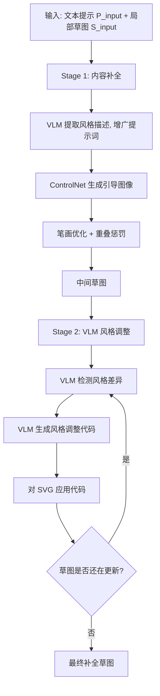

## 一句话总结

AutoSketch 借助视觉语言模型（VLM）把"风格描述"引入向量草图补全，先按内容优化补齐笔画，再用 VLM 迭代地检测并修正风格差异，使补全后的草图既符合文本提示又保持输入部分草图的独特风格。

## 研究背景

草图是快速表达想法的重要媒介，但把一张粗略的局部草图补全成风格统一的复杂场景，对多数人仍是难题。已有的文本驱动草图生成方法（如 SketchDreamer、DiffSketcher）主要关注让生成内容匹配文本提示、并采用预定义的固定风格，却忽视了输入局部草图本身的风格，由此带来两个问题：

- 会生成大量与已有笔画重复的冗余笔画，浪费了本可用于描绘新内容的笔画预算。
- 忽视输入草图的全局抽象层级（整体简繁程度）与局部笔画风格（粗细、平滑度、曲率、不透明度），导致新旧笔画风格不一致。

作者的核心观察是：用自然语言描述草图风格，可以在自动补全过程中保留风格。因此他们提出 AutoSketch，输入为文本提示 $$P_{input}$$ 与局部草图 $$S_{input}$$，输出为内容完整且风格协调的补全草图 $$S_{complete} = S_{input} \cup S_{opt}$$。

## 方法

整体框架分两阶段：第一阶段"以内容为中心"补齐笔画，第二阶段用 VLM 迭代调整风格。

关键设计：

- **自适应提示词增广**：把 $$S_{input}$$ 渲染成栅格图，让 VLM 生成描述其全局抽象层级与局部风格的文本，拼接到输入提示词后。相比固定的"non-photorealistic"增广，自适应描述能引导 ControlNet 产生更贴合目标风格、边界更清晰的引导图像，从而让更多内容被笔画表达出来。
- **带重叠惩罚的笔画优化**：每条笔画用三次贝塞尔曲线控制点加不透明度 $$o_i$$、宽度 $$w_i$$ 参数化，即 $$s_i = \{\{p_i^j\}_{j=1}^4, o_i, w_i\}$$。优化目标结合 CLIP 视觉相似度、LPIPS 损失，以及一个重叠惩罚项：对每条笔画采样 10 个点，若落入输入草图已有笔画的二值掩码 $$M$$ 区域则施加惩罚，避免生成与已有笔画重叠的冗余笔画。
- **VLM 生成"调整代码"而非直接改 SVG**：把中间草图表示为 SVG（输入草图笔画渲染为蓝色、新笔画为黑色），让 VLM 先列出风格差异（粗细、不透明度、平滑度、曲率、全局抽象层级等），再补全一段 Python 骨架代码来修改笔画属性。由于 VLM 的 token 上限与幻觉问题，直接改 SVG 会丢内容；改用生成代码可处理更多笔画、支持删除/简化等离散调整，同时保留内容。
- **迭代直到收敛**：单次调整常有遗漏，故重复"检测差异 → 生成代码 → 应用"直到草图不再更新。

## 实验结果

作者用 GPT-4o 作为 VLM，第一阶段用 PyTorch + Adam 优化 512 条笔画（1000 次迭代约 5 分钟），第二阶段约 3 分钟（RTX 4080）。在 10 张草图的评测集上，用 DreamSim、DINO 衡量视觉相似度，用 VQA score 衡量内容与提示对齐度，与 SketchDreamer、DiffSketcher、Gemini Co-Drawing 对比：

| 方法 | DreamSim ↓ | DINO ↑ | VQA score ↑ |
| --- | --- | --- | --- |
| SketchDreamer | 0.471 | 0.556 | 0.554 |
| DiffSketcher | 0.465 | 0.525 | 0.816 |
| Gemini Co-Drawing | 0.365 | 0.584 | 0.804 |
| Our method | 0.290 | 0.591 | 0.788 |
| Our first stage | 0.434 | 0.488 | 0.332 |
| Our + Qwen3 | 0.305 | 0.578 | 0.781 |

本方法在所有视觉指标上明显领先，文本指标（VQA score）与其他方法相当。作者指出视觉指标会偏爱"只保留输入草图、其余留白"的结果，因此需结合视觉与文本指标共同评估。用户评估中，在风格保留与内容表达两个维度上，参与者相对 SketchDreamer、DiffSketcher 乃至人工补全都更偏好本方法；换用开源 Qwen3 也能取得与 GPT-4o 相当的结果。

## 亮点与局限

亮点：

- 首次把输入草图的风格（全局抽象层级 + 局部笔画风格）作为一等目标纳入补全，用自然语言风格描述作为桥梁。
- 用 VLM 生成"调整代码"而非直接输出 SVG，巧妙绕开 token 限制与幻觉，能处理笔画量更大的复杂场景，并支持删除、简化等离散风格操作。
- 重叠惩罚有效避免冗余笔画，把笔画预算留给待补内容；方法对不同 VLM（GPT-4o、Gemini、Qwen3）具有泛化性。

局限：

- 依赖 ControlNet 与 VLM 两个预训练模型，若引导图像缺失目标内容，则无法补出对应笔画。
- 非实时：整体需约 8 分钟，难以支持交互式补全。
- 不支持纹理风格：当前方法难以区分几何笔画与纹理笔画。

## 延伸思考

这项工作展示了"用语言描述风格、再用代码执行风格迁移"的思路，把风格从难以参数化的隐式属性转成可被 VLM 显式读写的对象，这对更广义的向量图形编辑（图标、示意图、UI 草图）都有借鉴意义。生成可执行代码而非直接产出结果，本质是让 VLM 承担"规划者"角色、把繁重的逐元素操作交给确定性代码，这种"VLM 出策略、程序做执行"的分工能有效规避 token 与幻觉瓶颈，值得推广到其他需要大规模结构化编辑的场景。后续若能把 ControlNet 与 VLM 联合微调、并加入纹理笔画的分类与差异化处理，配合优化步数与本地推理的加速，有望把它推进到真正可交互的创作工具。
