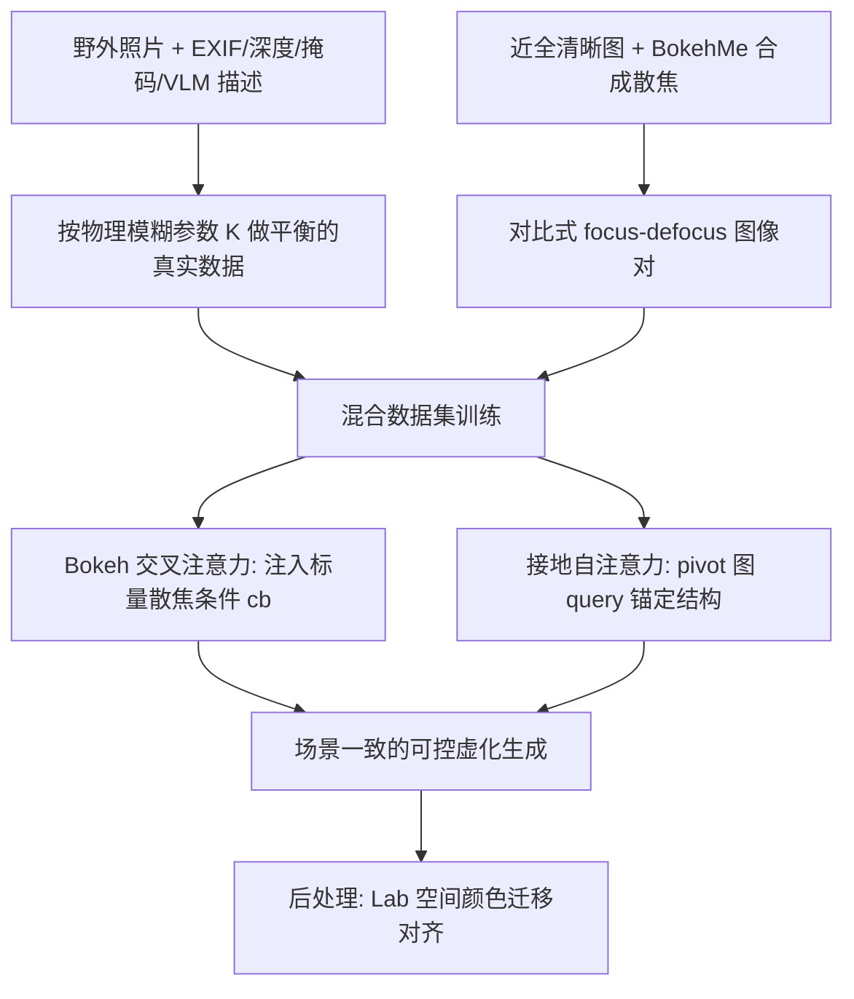

## 一句话总结

本文提出 Bokeh Diffusion：给文生图扩散模型显式地条件化一个物理散焦模糊参数，配合针对性设计的"接地自注意力"（grounded self-attention），实现在不改变场景内容的前提下、可双向连续调节背景虚化（bokeh）强度的镜头级景深控制，并同时适配 Stable Diffusion（UNet）与 FLUX（MMDiT）两种架构。

## 研究背景

传统摄影靠光圈、焦距等相机设置精细塑造画面美学，尤其是景深带来的背景虚化。但在文生图（T2I）生成中复现这类镜头效果却出奇地困难：现有做法多依赖提示词工程（如在 prompt 里写"f/1.8 光圈"），结果往往只是粗糙近似，并且会连带改变场景内容——换个光圈可能不只是虚化程度变了，整个物体布局都变了。

已有的可控生成路线也各有短板：

- 把相机内参当作 token 注入（如 CSaT）虽能条件化光圈，但没有约束场景一致性，改光圈常常改场景；即便叠加 ControlNet 做结构引导，细粒度内容仍不稳定。
- Generative Photography 把相机内参建模在文生视频（T2V）的时间轴上以获得一致性，但推理时需要一次生成多帧（最多 7 帧/prompt），开销与冗余大，且不兼容最新的 T2I 模型；在大幅虚化过渡下仍难保留精细细节。
- 后处理路线（先估深度再渲染模糊，如 BokehMe）依赖外部深度估计，在细结构、半透明材质、深度不连续处易出现颜色渗漏等瑕疵，且难以"去除"已有的模糊。

一个根本瓶颈是数据稀缺：同一场景、同一视角下用不同相机设置（如 f/1.8 与 f/16）成对拍摄的真实照片极为罕见，模型因而难以把"散焦模糊"从"场景布局"中解耦。

## 方法

整体框架在预训练 T2I 扩散模型上做两处轻量增强：其一是通过解耦交叉注意力注入标量散焦参数（bokeh cross-attention），其二是通过接地自注意力用一张 pivot 参考图锚定场景结构，从而在改变虚化时保住内容。训练则依靠一套混合数据管线，把带 EXIF 元数据的野外真实照片与合成散焦增强配对，为"内容与模糊解耦"提供监督。

散焦模糊的物理依据来自薄透镜模型的弥散圆（CoC）直径 $$d = \dfrac{f^2}{N(S_1 - f)} \cdot \dfrac{\lvert S_2 - S_1\rvert}{S_2}$$，其中 $$f$$ 为焦距、$$N$$ 为光圈（F 数）、$$S_1$$ 为对焦距离、$$S_2$$ 为物距。将其改写为随视差差线性变化的形式后，可与合成渲染使用的"每单位视差模糊半径 $$K$$"统一，得到从 EXIF 反推的物理模糊参数 $$K \approx \dfrac{f^2 S_1}{2N(S_1 - f)} \cdot \text{pixel\_ratio}$$，使真实数据与合成数据在同一散焦表示下联合训练。

### 关键设计 1：混合数据管线（真实 + 合成）

从 Flickr 采集公共领域野外照片，标注深度图、前景掩码、EXIF 元数据与 VLM 文本描述，过滤掉镜头信息不可靠、前景面积异常、深度范围过小的样本，再按物理散焦标注做平衡以削弱真实照片的长尾偏置，得到约 15K 样本（其中约 10% 接近全清晰）。对这批近全清晰图用 BokehMe 渲染合成模糊，生成同一图像的"清晰-散焦"对比对。真实数据提供多样场景与真实镜头模糊，合成对则直接示范"同一布局可清晰也可虚化"，帮助模型跳出局部最优并支撑接地自注意力训练。

### 关键设计 2：Bokeh 交叉注意力条件注入

借鉴 IP-Adapter 的解耦交叉注意力，在 UNet 解码器的交叉注意力层新增一对键值投影 $$W'_k, W'_v$$，绑定由标量散焦参数经小型 MLP 得到的 bokeh 特征 $$c_b$$；原有文本键值保持冻结。新旧注意力用同一 query 线性组合：$$h_{\text{new}} = \text{Attention}(Q, K, V) + \lambda \cdot \text{Attention}(Q, K_b, V_b)$$。经验上把适配器接在较深的交叉注意力层即可塑造纹理并减少泄漏，并借用注意力定位策略把 bokeh 注意力引向背景区域。

### 关键设计 3：接地自注意力保证场景一致

单图能控虚化，但对同一场景施加不同模糊等级时会出现内容漂移。基于"query 编码空间结构、key 作为特征关联、value 承载外观风格"的注意力角色分析，在每个对比批次随机指定一张 pivot 图作为结构锚。对目标图特征 $$h_{\text{tgt}}$$ 的自注意力替换为 $$\text{Attention}\big(Q_{\text{piv}}, [K_{\text{tgt}}, K_{\text{piv}}], [V_{\text{tgt}}, V_{\text{tgt}}]\big)$$：pivot 的 query 锚定布局，拼接的键让注意力同时参考 pivot 的意图结构与目标当前布局，而 value 只取自目标以继承其外观与散焦。训练时令目标图与 pivot 图共享噪声和时间步做同步扩散。此外用 Reinhard 的经典颜色迁移在 $$L^*a^*b^*$$ 空间对齐目标与 pivot 的通道均值方差，消除偶发的光照/色彩偏差。

### 关键设计 4：适配 MMDiT（FLUX）

FLUX 用 MMDiT 把文本与图像 token 拼接做联合自注意力，并对图像 query/key 施加旋转位置编码 RoPE。由于不再区分自注意力与交叉注意力，作者把 bokeh 条件与 pivot 接地直接插入其联合注意力模块，统一为 $$\text{Attention}\big(Q_{\text{piv}}, [K_{\text{tgt}}, K_{\text{piv}}], [V_{\text{tgt}}, V_{\text{tgt}}]\big) + \lambda\,\text{Attention}(Q_{\text{piv}}, K_b, V_b)$$，从而让框架兼容最新的 MMDiT 主干。

## 实验结果

在 20 个多样 prompt、每个 5 种 bokeh 条件（共 100 样本）上评测。准确性用拉普拉斯方差趋势与参考的皮尔逊相关（LVCorr）及 GPT-4o 估计衡量；一致性用 LPIPS、DINOv2、DreamSim（越接近参考越好）与 GPT-4o 衡量；质量用 ImageReward 衡量。BokehMe 作为参考渲染。

| 类型 | 方法 | LVCorr↑ | GPT-4o(准确)↑ | LPIPS | DINOv2 | DreamSim | GPT-4o(一致)↑ | ImageReward↑ |
| --- | --- | --- | --- | --- | --- | --- | --- | --- |
| 参考 | BokehMe | 1.000 | 0.941 | 0.075 | 0.994 | 0.012 | 96.65 | – |
| 预训练 | SD1.5 | -0.206 | 0.362 | 0.314 | 0.966 | 0.099 | 68.75 | 1.065 |
| 预训练 | FLUX | -0.033 | 0.336 | 0.177 | 0.983 | 0.058 | 78.25 | 1.280 |
| 微调 | CSaT | -0.044 | 0.628 | 0.155 | 0.961 | 0.082 | 73.00 | 0.509 |
| 微调 | CSaT + ControlNet | 0.498 | 0.784 | 0.178 | 0.972 | 0.071 | 67.25 | 0.335 |
| 微调 | GenPhoto | 0.796 | 0.826 | 0.197 | 0.949 | 0.066 | 86.50 | -1.471 |
| 本文 | Bokeh Diffusion (SD1.5) | 0.904 | 0.960 | 0.080 | 0.992 | 0.017 | 94.75 | 0.988 |
| 本文 | Bokeh Diffusion (FLUX) | 0.917 | 0.985 | 0.052 | 0.996 | 0.005 | 98.16 | 1.093 |

本文方法在准确性与一致性上大幅领先所有基线，生成质量则与各自的预训练主干相当，说明在引入场景一致虚化控制的同时基本保住了原有画质。消融实验表明：仅用真实数据（ITW）一致性高但准确性低（模型只学到有限的虚化范围），仅用合成数据（SYN）收敛快但泛化与画质下降，混合数据取得最佳综合准确性；在此之上加入接地自注意力使一致性显著提升（LVCorr 0.902、GPT-4o 一致性 94.00），再加颜色迁移进一步微调。20 人用户研究中，本方法在虚化控制、场景一致、图文对齐三项上偏好率分别达 91.00%、92.67%、74.00%，明显优于对比方法。

## 亮点与局限

亮点：
- 完全在 T2I 范式内实现场景一致的物理化景深控制，无需多帧生成，可直接集成进最新 T2I 系统并继承其画质。
- 接地自注意力支持双向调节（既能加也能减虚化），并可选任意 pivot 图与目标等级，天然支持生成图编辑与"反演后重新去噪"的真实图像编辑。
- 借助生成先验与混合数据，在细结构、半透明材质等困难区域产生比"深度估计+渲染"更自然的虚化。
- 同一框架在 UNet（SD1.5）与 MMDiT（FLUX）上都取得强结果，通用性好。

局限：
- 真实数据缺乏同场景多光圈成对样本，物理模糊参数 $$K$$ 依赖 EXIF 与启发式对焦距离估计（如取前景较近 50% 像素的中位深度），是近似而非精确标定。
- 仅用真实数据训练时虚化范围受限，仍需合成对比对补充监督，说明对合成渲染质量有一定依赖。
- 偶发的跨等级光照/色彩偏差需要额外的颜色迁移后处理来纠正。

## 延伸思考

Bokeh Diffusion 的核心巧思在于把"可控性"拆成两层解耦：用轻量交叉注意力注入物理参数管"虚化多少"，用接地自注意力借 pivot 的 query/key 管"场景不变"，再用物理薄透镜模型把真实与合成两种数据源统一到同一散焦标度。这种"query 锚结构、value 承外观"的注意力角色利用，本质上是一种无需额外网络的结构-外观解耦手段，思路可迁移到其他需要"改一个属性而保其余不变"的可控生成任务（如运动模糊、曝光、光照）。而它对 EXIF 启发式与合成渲染的依赖也提示：要让生成模型真正学到镜头级物理，长期看仍需更大规模、真正成对的多相机设置真实数据，或更精确的可微光学先验。
