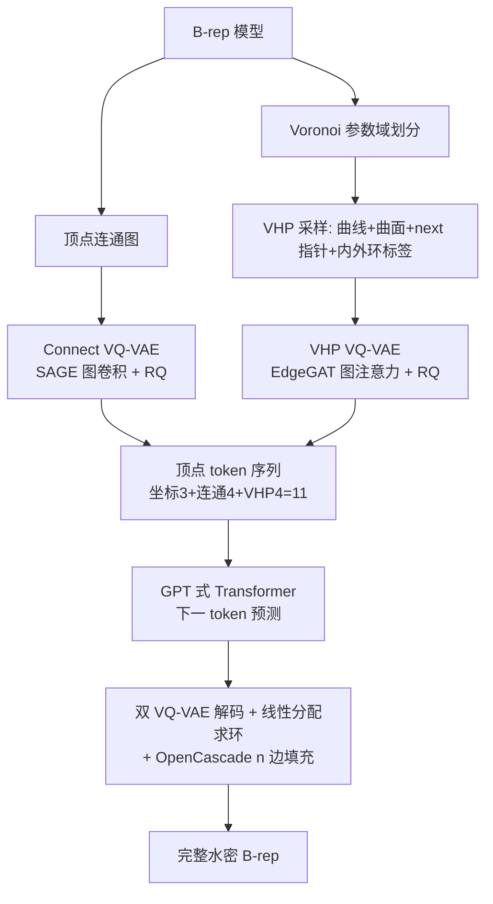

## 一句话总结

BrepGPT 提出 Voronoi Half-Patch（VHP）表示，把 CAD 边界表示（B-rep）的几何与拓扑统一解耦为以半边为中心的局部单元，再用双 VQ-VAE 编成以顶点为单位的紧凑 token 序列，交给单个 GPT 式解码器自回归生成完整、水密的 B-rep 模型。

## 研究背景

边界表示（B-rep）是现代工业设计中 CAD 模型的事实标准，通过几何定义的面、边、顶点及其拓扑连接关系精确描述复杂三维形体，在编辑、分析、仿真等下游任务中不可或缺。但 B-rep 自动生成极其困难：它把连续的几何参数与离散的拓扑结构混合在一起，设计空间高度复杂；而且每个三维形体的数据结构都会变化，面数、边数、内环数量都不固定，难以直接套用要求固定维度输入的深度学习框架。

绕开 B-rep 的做法之一是生成"草图-拉伸"建模指令序列，契合成熟的序列生成技术，但受限于操作类型少、数据集规模小（带操作序列的数据集比原始 B-rep 数据集小 5 倍），且不支持放样、扫掠、圆角、倒角等高级命令。

现有直接生成 B-rep 的方法大多建立在层级表示之上，因而引出多阶段流水线，存在阶段间不一致的问题。SolidGen 用指针网络顺序定义顶点、边、面，但无法处理自由曲面；BrepGen 用多阶段扩散模型从面到边到顶点分层生成，靠合并重复元素恢复拓扑，其为满足扩散模块固定长度而做的填充策略带来计算开销并对去重过程敏感；DTGBrepGen 先生成邻接关系再用一系列扩散模型生成几何，虽提升了可解释性，但多阶段扩散仍带来误差传播、推理时间长的问题。所有基于扩散的方法都有一个根本局限：需要填充到固定长度，与 B-rep 的可变本质冲突，引入训练开销和推理脆弱性。BrepGPT 的目标是用单阶段自回归框架统一几何与拓扑，彻底摆脱层级表示和填充去重。

## 方法

### 整体框架

BrepGPT 的核心是把 B-rep 编码为以顶点为单位的特征序列。每个顶点特征含三部分：三维坐标、刻画顶点间连接关系的连通性特征、以及聚合了该顶点相连所有半边信息的 VHP 特征。连通性与 VHP 特征分别由两个独立的 VQ-VAE 量化成离散 token，与直接量化的坐标 token 拼成每顶点 11 维的 token（3 坐标 + 4 连通性 + 4 VHP），再由 GPT 式解码器自回归生成。

### Voronoi Half-Patch 表示

VHP 把 B-rep 分解为以半边为中心的局部单元，同时编码几何属性与拓扑关系。

1. **半片几何（Half-Patch Geometry）**：曲线几何沿每条边的参数域均匀采样 $$N_c$$ 个三维点，得到 $$C \in \mathbb{R}^{N_c \times 3}$$。曲面几何的关键创新是不把面当作单一整体，而是"像切派一样"把面沿参数域用 Voronoi 图划分成多个区域，每块指派给参数域中距离最近的边。在流形假设下每条边恰被两个面共享，每条半边负责编码相邻面的一块区域，从而把可变长度的面表示自动转化为定长的、以半边为中心的描述。对曲线上 $$N_c$$ 个采样点，沿其法向再各采 $$N_s$$ 个点，一个半片表示为 $$P \in \mathbb{R}^{N_c \times N_s \times 3}$$。

2. **半边拓扑（Half-Edge Topology）**：为把属于同一面的多个 VHP 重连成环，需要确定每个 VHP 的 next 指针。BrepGPT 不用直接的拓扑链接，而是沿下一条半边的起始段采样几何点（选取最近的 $$N_n$$ 个曲线采样点，实践中 $$N_n = N_s$$），把这些"next 指针采样"存进当前 VHP，得到 $$\mathbb{R}^{(N_c+1) \times N_s \times 3}$$。重建时把 next 指针指派表述为每个顶点上的线性分配问题，通过最小化 next 指针采样与候选半边采样间的欧氏距离来匹配进出半边。相比 SpaceMesh 依赖局部邻域排序的做法（对含自环、平行边的 B-rep 失效），这种基于采样的方案更鲁棒。此外每条半边再用一个二值标签标记它属于内环还是外环。完整 VHP 表示为 $$V \in \mathbb{R}^{(N_c+1) \times N_s \times 3 + 1}$$。

### 以顶点为单位的 tokenization

直接用半边序列会导致序列过长。作者从欧拉-庞加莱公式出发：

$$V - E + F = 2(1 - G)$$

其中 $$V, E, F$$ 分别是顶点、边、面数，$$G$$ 是亏格。重排为 $$V = E - F + 2(1 - G)$$，对典型 CAD 模型（$$G \geq 0$$、$$F \geq 2$$）可得 $$V \leq E$$，即顶点数从不超过边数。对 DeepCAD 数据集 2000 个模型的统计证实半边数在面数超过 100 时约为顶点数的 5 倍。这促使作者选用以顶点为单位的特征序列，比以半边为单位更紧凑，从而降低自回归建模的生成误差。

一个 B-rep 表示为顶点特征序列 $$B := (v_1, v_2, \ldots, v_N)$$，每个顶点特征为 $$v_i = (x_i, y_i, z_i, f^c_i, f^v_i)$$，其中坐标直接量化为 $$[0, 128)$$ 内的 7-bit 整数，连通性特征 $$f^c_i$$ 与 VHP 特征 $$f^v_i$$ 各经 VQ-VAE 编成 4 个 token。token 语义层层递进：仅坐标 token 类似点云，坐标加连通性 token 得到图式表示，再加 VHP token 才是完整 B-rep。

### 双 VQ-VAE

作者用两个独立 VQ-VAE 分别编码连通性与 VHP，均采用残差向量量化（RQ）。

- **连通性 VQ-VAE**：顶点为图节点，无向边表连接，编码器用多层 SAGEConv 提取每顶点嵌入 $$E_{conn}(G_c) = Z_c$$，再经 RQ 量化为 $$D_c$$ 个码 $$t^c_i = \mathrm{RQ}(z^c_i; B_c, D_c)$$。ResNet 解码器取两顶点拼接嵌入预测其间连接 $$\hat{y}^c_{ij} = D_{conn}(z^c_i \oplus z^c_j)$$，损失含二值交叉熵与向量量化损失。为避免遍历所有顶点对的二次复杂度，把 B-rep 顶点图分解为连通分量，只在各连通子图内做组合搜索，用 `<sep>` token 分隔各分量边界，把 100 顶点模型的顶点对组合数从约 13000 降到约 5000。

- **VHP VQ-VAE**：顶点仍为节点，但边为有向且携带完整 VHP 数据，用带边特征的图注意力（EdgeGAT）编码局部邻域的几何与拓扑，$$E_{VHP}(G_v) = Z_v$$，同样经 RQ 得 $$t^v_i$$。ResNet 解码器从两顶点拼接嵌入重建 $$\hat{V}_{ij} \in \mathbb{R}^{(N_c+1) \times N_s \times 3 + 1}$$。训练损失为

$$L_{VHP} = \alpha(L_{geo} + L_{next}) + \beta L_{cls} + \lambda L_{vq}$$

其中 $$L_{geo}$$ 与 $$L_{next}$$ 用 MSE，$$L_{cls}$$ 用加权二值交叉熵。

### 自回归生成与去 token 化

序列含 `<start>`、`<end>`、`<sep>` 特殊 token。为在解码时正确恢复连通性，需对顶点分层排序：每个连通分量内按 $$(z, y, x)$$ 升序排顶点，分量之间按其构成顶点的最小 $$(z, y, x)$$ 坐标排序。GPT 式解码器 Transformer 逐 token 预测，配离散位置编码。推理时用有效性掩码约束输出 logits：顶点 token 只能取各自词表范围，分隔符只能出现在完整顶点描述（11 个 token）之后。

去 token 化时双 VQ-VAE 顺序工作：连通性 VQ-VAE 先建立顶点连接，几何 VQ-VAE 再解码各半边的 VHP。共享同一边的两条半边从相同端点解码、中间采样点取平均以保证几何一致。环检测把 next 指针指派表述为线性分配问题：

$$\min_{\pi} \sum_{i=1}^{|E_{in}|} d(p_i, c_{\pi(i)}) \quad \text{s.t.} \quad \pi(i) \neq twin(i)$$

约束保证半边不与其孪生半边配对。找到环后按 VHP 标签分内外环，用 OpenCascade 的 n 边填充算法从外环生成初始面，内环按与已生成外环面的最小平均距离归属父面。

### 实现细节

VHP 采样取 $$N_c = 6$$、$$N_s = N_n = 4$$；顶点特征维度 16；两个 VQ-VAE 各用 4 个独立码本，每本 4096 项。连通性编码器用 SAGE 卷积、VHP 编码器用 EdgeGAT 卷积，各 6 层、隐藏维 1024；解码器为 4 个残差块、隐藏维 512。损失超参 $$\alpha = 0.02$$、$$\beta = 1$$、$$\lambda = 0.1$$。无条件生成用 GPT2-medium、块大小 3072 token（支持最多 256 顶点），条件生成用 GPT2-base。在 8 张 RTX 4090D 上用 PyTorch 训练，AdamW + 余弦退火 300 轮；ABC 上双 VQ-VAE 训一天、Transformer 训四天。

## 实验结果

在 DeepCAD、ABC（更复杂、含自由曲面的工业件）、Furniture（10 类家具，用于类别条件生成）三个数据集上评测。指标分两类：分布指标（覆盖率 COV、最小匹配距离 MMD、Jensen-Shannon 散度 JSD）和 CAD 指标（Novel 新颖率、Unique 唯一率、Valid 水密有效率）。由于两个数据集含大量简单形体会干扰指标，作者用两套配置：未过滤（保留全集）与过滤（DeepCAD 只留顶点数 ≥12、ABC 只留 ≥24 的复杂模型）。

未过滤配置下（MMD、JSD 均乘 $$10^2$$）：

| 数据集 | 方法 | COV ↑ | MMD ↓ | JSD ↓ | Novel ↑ | Unique ↑ | Valid ↑ |
| --- | --- | --- | --- | --- | --- | --- | --- |
| DeepCAD | DeepCAD | 65.46 | 1.294 | 1.670 | 89.8 | 89.1 | 72.6 |
| DeepCAD | BrepGen | 73.87 | 1.046 | 1.286 | 99.7 | 99.2 | 61.7 |
| DeepCAD | DTGBrepGen | 74.29 | 1.083 | 1.284 | 99.8 | 98.9 | 90.5 |
| DeepCAD | Ours | 79.32 | 0.960 | 0.840 | 97.9 | 98.4 | 83.9 |
| ABC | BrepGen | 69.91 | 1.185 | 0.945 | 99.6 | 99.0 | 42.9 |
| ABC | DTGBrepGen | 71.60 | 1.217 | 1.142 | 99.7 | 99.1 | 64.3 |
| ABC | Ours | 73.19 | 1.130 | 0.933 | 98.2 | 98.5 | 59.0 |

过滤配置（复杂模型）下：

| 数据集 | 方法 | COV ↑ | MMD ↓ | JSD ↓ | Valid ↑ |
| --- | --- | --- | --- | --- | --- |
| DeepCAD ≥12 | DeepCAD | 75.44 | 1.445 | 1.286 | 60.9 |
| DeepCAD ≥12 | BrepGen | 69.98 | 1.292 | 1.104 | 61.5 |
| DeepCAD ≥12 | DTGBrepGen | 67.12 | 1.347 | 1.438 | 89.6 |
| DeepCAD ≥12 | Ours | 75.87 | 1.160 | 1.094 | 80.6 |
| ABC ≥24 | BrepGen | 67.26 | 1.319 | 1.246 | 42.4 |
| ABC ≥24 | DTGBrepGen | 66.87 | 1.431 | 1.595 | 57.4 |
| ABC ≥24 | Ours | 71.34 | 1.297 | 1.172 | 57.4 |

BrepGPT 在 COV、MMD、JSD 上跨数据集、跨配置全面领先，说明能生成更多样、结构更复杂的 B-rep。Valid 上略逊于 DTGBrepGen，但在复杂配置下取得质量与有效性的更好平衡。Novel/Unique 稍低，作者归因于向量量化带来的离散词表空间，且指出这两个指标会把噪声与结构缺陷也算作"新颖/唯一"，需谨慎解读。定性上，随复杂度增长 DeepCAD 生成多样但常不合理，BrepGPT 在高复杂区能生成 60+ 顶点的样本（其他方法约 40）。作者还单独在 ABC 复杂样本（128-256 顶点）上重训以自证复杂形体生成能力。曲线离散化验证显示：以 100 点离散化重建，B-rep 采样均方误差 2.32e-5，远优于等价网格采样的 2.36e-3。

**可控生成与操作**：借 GPT 架构可迁移语言模型的条件生成技术。类别条件（Furniture 10 类）通过用类别嵌入替换起始 token 实现。点云条件借鉴已有工作，用冻结的预训练点编码器把 4096 点编成 257 个特征 token 前置到序列。图像条件用 Rodin Gen-1.5 先生成中间网格再采点云；文本条件用 ChatGPT-4o 从文本合成图像再走图像管线。此外分层顶点排序天然支持渐进式 B-rep 自动补全，简单部分输入产生多样解、复杂部分输入约束解空间。B-rep 插值通过在两输入形状的点云特征间线性插值来引导自回归生成，兼顾定长隐空间的连续性与变长自回归的灵活性。

**消融**：增大码本或量化器数量都提升重建精度，量化器数量增益更明显；连通性编码上 SAGE 一致优于 EdgeGAT，故默认连通性用 SAGE、VHP 用 EdgeGAT，码本 4096、4 量化器。token 排序上顶点交错、坐标优先、拓扑优先三种方案生成质量相近，但各有专长（交错利于自动补全、坐标优先利于拓扑变化、拓扑优先利于几何变化），默认采用交错排序。

## 亮点与局限

**亮点**：
- 提出 Voronoi Half-Patch 表示，用参数域 Voronoi 划分把变长的面几何转成定长、以半边为中心的局部单元，把几何属性与拓扑关系统一进单层相干格式，摆脱层级表示。
- 基于欧拉-庞加莱公式论证 $$V \leq E$$，据此选用以顶点为单位的 tokenization，得到每顶点仅 11 维的紧凑序列，无需填充与去重。
- 首个把完整 B-rep 模型 token 化并用 GPT 式解码器直接生成的工作，单阶段训练避免多阶段误差累积。
- 在无条件生成上达 SOTA，且可无缝支持类别、点云、图像、文本等多模态条件生成及自动补全、插值等下游任务。

**局限**：
- 生成阶段缺乏显式约束，仅靠无效掩码，仍可能产生孤立顶点、自相交面等无效 B-rep；可引入带回滚的验证步骤缓解。
- 仍受自回归架构在长序列上的固有限制，需探索更强码本设计或改进 VQ-VAE 架构。
- 向量量化的离散化带来精度损失，在几何复杂的 B-rep 上尤为明显；由于 VHP 与具体网络无关，未来可探索扩散或自回归-扩散混合方法提升几何精度。

## 延伸思考

这篇工作最优雅的地方在于用 Voronoi 划分把"面"这个变长的拓扑难点转化为定长的半边局部单元，再借欧拉公式把序列锚定到顶点这一最稀疏的元素上——两次降维使 B-rep 真正"语言模型化"，从而让 KV 缓存、条件前缀、插值等 NLP/生成范式几乎零成本迁移过来。它与同期同主题的 AutoBrep 形成有趣对照：两者都走单阶段自回归、都强调统一几何与拓扑，但 AutoBrep 走面邻接图 BFT 定序加局部拓扑参照，BrepGPT 则以半边几何采样隐式编码 next 指针、再用线性分配在解码时求环，把拓扑推断从"生成时"推迟到"重建时"。这提示 B-rep 生成的关键分歧在于拓扑该显式建模还是靠几何信号隐式恢复。局限也很诚实：VQ 离散化对高精度曲面仍是瓶颈，且水密性最终仍依赖 OpenCascade 后处理容错，如何把有效性检查纳入生成回路（而非仅靠掩码与后处理）是值得深入的方向。
