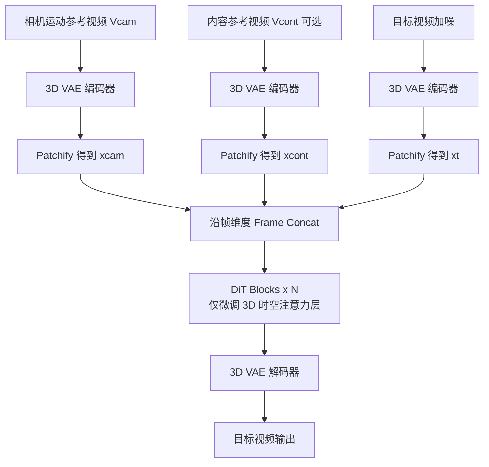

## 一句话总结

CamCloneMaster 让用户只需提供一段参考视频，就能把其中的相机运动"克隆"到新生成的视频里，无需相机参数、也无需测试时微调，并在同一个模型中统一了图生视频（I2V）与视频重拍（V2V）两种任务。

## 研究背景

相机运动是影视表达的核心手段：推镜头能聚焦细节、拉镜头能营造疏离感。现有的相机可控视频生成方法大多依赖显式的相机参数序列作为控制条件，但这种方式存在两个痛点：一是普通用户很难手工构造复杂的相机轨迹参数；二是若改用"先从参考视频估计相机参数、再喂给参数化生成模型"的间接路线，控制精度会被相机位姿估计模型的性能所限制，动态场景下的位姿估计本身就很不准，误差会直接劣化可控性，同时还带来额外的交互与计算开销。

一个更直观的方案是：直接给一段"相机运动参考视频"，让模型模仿其中的镜头运动。此前的免训练方法 MotionClone 借助稀疏时序注意力权重作为运动表示来引导生成，但需要一个反演（inversion）过程，既增加推理开销，又容易受到不可靠先验的影响，且难以处理复杂镜头。本文希望用一种基于训练、直接从参考视频克隆相机运动的框架来解决这些问题。

## 方法

### 整体框架

CamCloneMaster 建立在基于 Transformer 的隐空间扩散模型（DiT）之上：用 3D VAE 做隐空间映射，用一系列 Transformer 块做序列建模，文本提示经 T5 编码后通过交叉注意力注入，训练采用 Rectified Flow 框架。核心思路是把参考视频编码成条件隐变量后，与噪声隐变量沿"帧维度"拼接成一条统一输入序列，让 DiT 的 3D 时空注意力层直接建模条件与噪声之间的交互，从而不引入任何额外控制模块。

### 关键设计

1. **Token 拼接注入（Frame Concat）**：把相机参考、内容参考与噪声隐变量都 patchify 成 token，然后沿帧维度拼接为单一序列输入 DiT。这一设计参数高效、不新增网络层，让原有的 3D 时空注意力层承担条件-噪声交互建模。消融显示，跨所有层拼接、且沿帧维度拼接优于通道拼接、仅时序层拼接，以及类 ControlNet 的特征相加方案。

2. **统一 I2V 与 V2V**：同一模型既能做相机可控的图生视频，也能做视频重拍。I2V 设定下，内容参考隐变量 $$z_{cont}$$ 被替换为全零隐变量；V2V 设定下则额外提供内容参考视频，模型用参考相机运动"重拍"该场景。

3. **选择性微调策略**：只微调 DiT 块内的 3D 时空注意力层，冻结其余参数，从而在学会克隆相机运动的同时保留基础生成能力。训练时按 50% I2V、50% V2V 的比例平衡采样，让单一模型同时具备两种能力。

4. **Camera Clone 数据集**：由于现实中难以采集"相同相机轨迹、动态场景配对"的视频，作者用 Unreal Engine 5 渲染合成数据集，包含 40 个 3D 场景、66 个带动画的角色，共 391K 段视频、来自 39.1K 个位置、97.75K 条相机轨迹，并构造出 1155K 组三元视频集（相机参考、内容参考、目标视频）。同一位置用 10 台同步相机各走一条预设轨迹，并把位置按四个一组分组以复现配对轨迹。

## 实验结果

在 RealEstate10K 测试集（相机参考）与 Koala-36M（内容参考）上，与需要相机参数的方法及免训练的 MotionClone 对比。下表为主实验（表 1）中 I2V 与 V2V 的部分核心指标，箭头表示优劣方向：

| 任务 / 方法 | 相机输入 | FVD ↓ | RotErr ↓ | TransErr ↓ | CamMC ↓ | Bg. Cons. ↑ |
|---|---|---|---|---|---|---|
| I2V · CameraCtrl | 相机参数 | 1294.97 | 2.82 | 4.52 | 6.48 | 89.29 |
| I2V · CamI2V | 相机参数 | 1013.23 | 1.62 | 3.07 | 4.22 | 89.99 |
| I2V · MotionClone | 参考视频 | 1355.55 | 3.10 | 5.15 | 7.31 | 79.06 |
| I2V · CamCloneMaster | 参考视频 | 993.06 | 1.49 | 2.37 | 3.50 | 93.86 |
| V2V · DaS | 相机参数 | 721.68 | 2.71 | 8.18 | 9.62 | 93.77 |
| V2V · ReCamMaster | 相机参数 | 718.69 | 1.53 | 3.12 | 4.17 | 88.82 |
| V2V · TrajectoryCrafter | 相机参数 | 1086.89 | 3.08 | 7.46 | 10.22 | 86.09 |
| V2V · CamCloneMaster | 参考视频 | 678.06 | 1.36 | 2.02 | 3.05 | 94.32 |

在相机精度（RotErr / TransErr / CamMC）、视觉质量与动态质量上，CamCloneMaster 在两种任务上均取得最优。V2V 的视角一致性（表 2）中，其 Matching Pixels 1332.34、FVD-V 176.02、CLIP-V 88.77 也全面领先。47 名参与者的用户研究（表 4）显示，用户对本方法在相机精度、视频-文本一致性、时序一致性上的偏好率大幅高于各基线（如 I2V 相机精度偏好率达 85%）。另一项用户研究（表 3）表明，参数化方法的效果高度依赖相机参数精度，即使 SOTA 位姿估计模型也难以提供足够准确的参数，从侧面印证了参考式控制路线的价值。

## 亮点与局限

亮点：
- 用户体验直观，免相机参数、免测试时微调，直接用参考视频指定镜头运动。
- 极简架构：仅靠帧维度 token 拼接就把 I2V 与 V2V 统一进单一模型，不新增控制模块，参数高效。
- 构建并将开源大规模合成 Camera Clone 数据集，为相机克隆学习提供配对数据。

局限：
- Token 拼接会显著增加计算开销，作者将稀疏注意力、隐变量丢弃（latent drop）等降本手段留作未来工作。

## 延伸思考

该工作揭示了一个更普适的思路：与其把"控制信号"抽象成显式参数（相机位姿），不如让模型在共享隐空间里直接从示例视频中隐式学习高层属性。这种"以示例为条件"的范式可能迁移到光照、运镜节奏、镜头语言乃至物体运动等其他难以参数化的维度。同时，帧维度拼接带来的序列变长与计算负担，也提示未来需要在条件注入的表达力与效率之间做更精细的权衡，例如仅保留参考视频中与相机运动强相关的稀疏 token。此外，训练数据完全来自 Unreal Engine 5 合成场景，其风格与真实电影镜头之间的域差距，对复杂真实片段的泛化能力仍值得进一步验证。
