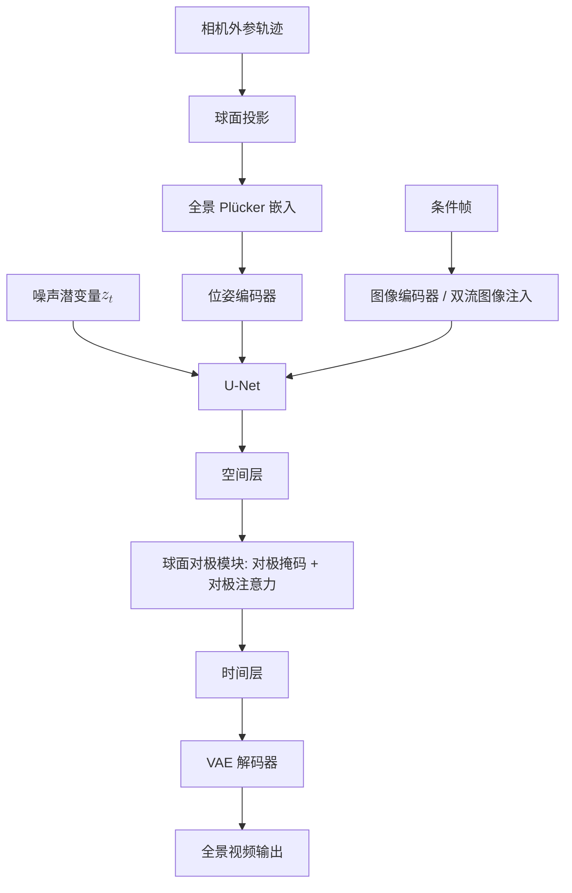

## 一句话总结

CamPVG 是首个由精确相机位姿引导的全景视频生成扩散框架，通过全景 Plücker 嵌入编码球面相机位姿、并借助球面对极模块施加跨视角几何约束，从而生成与相机轨迹一致、几何连贯的高质量全景视频。

## 研究背景

VR、元宇宙与具身智能的发展带动了对 360 度全景视觉内容的强烈需求。然而现有工作存在两方面局限：

- 全景视频生成方法（如 360DVD、Imagine360、4K4DGen）主要关注动态内容合成，对相机视角的控制能力很弱，生成结果视点变化极小。
- 相机可控视频生成方法（如 MotionCtrl、CameraCtrl、CamCo、CamI2V）虽能实现精确位姿控制，但都是为透视投影设计的。它们的位姿编码与对极注意力在等距柱状投影（equirectangular）的全景数据上表现很差。

根本原因在于全景相机位姿表示困难，以及球面投影带来的固有几何复杂性。传统 Plücker 嵌入依赖已知的相机内参，而这对全景图是未定义的；透视对极线在全景图中也不再是直线。CamPVG 针对这两点重构了全景域下的位姿编码与对极几何。

## 方法

### 整体框架

CamPVG 以图像到视频模型 DynamiCrafter 为基座（去掉文本条件分支），冻结基座参数，仅训练新增的全景位姿编码器与球面对极模块。流程为：将输入相机轨迹经球面投影转成全景 Plücker 嵌入，通过位姿编码器注入 U-Net 引导全景几何学习；球面对极模块依据跨视角几何约束计算对极掩码，并在时间注意力之前施加球面对极注意力以增强多视角一致性。

### 关键设计

1. **全景 Plücker 嵌入**：对等距柱状全景图的每个像素 $$(u,v)$$，先按 $$\phi=\frac{u}{W}\cdot 2\pi,\ \theta=\frac{v}{H}\cdot \pi$$ 计算球坐标方位角与俯仰角，再转成笛卡尔方向向量 $$x=\cos\theta\sin\phi,\ y=\sin\theta,\ z=\cos\theta\cos\phi$$。这样无需相机内参即可为每个全景像素建立一致的 3D 方向映射，进而按外参 $$E=[R,t]$$ 得到 Plücker 坐标 $$d=R\,(\hat{x},\hat{y},\hat{z})^{\top},\ m=t\times d$$，整条轨迹编码为 $$P\in\mathbb{R}^{N\times H\times W\times 6}$$ 注入扩散过程。

2. **球面对极线**：给定两个视角的相对位姿 $$R_{i\to j}=R_j R_i^{-1},\ t_{i\to j}=t_j-R_{i\to j}t_i$$，源视角像素在目标视角对应的对极线是包含相机原点与投影点的平面 $$\Pi$$ 与坐标球面的交线。由平面方程系数可推得对极线在目标全景图上的非线性参数化 $$v=-\frac{H}{\pi}\arctan\!\left(\frac{A'\sin\frac{2\pi u}{W}+\cos\frac{2\pi u}{W}}{B'}\right)$$。

3. **球面对极掩码**：沿对极曲线均匀采样 $$K$$ 个点，用最小球面距离 $$d_{\min}=\min_{1\le k\le K}\lVert p-c_k\rVert_2$$ 近似像素到对极线的距离；当 $$d_{\min}$$ 小于特征网格对角线长度一半时判为有效参考，得到二值掩码 $$M_i\in\mathbb{R}^{HW\times N\times HW}$$。

4. **球面对极注意力**：在时间注意力之前施加，将掩码乘入注意力权重 $$\text{SphericEpiAttn}(q_i,k,v)=\text{softmax}\!\left(\frac{q_i k^{\top}}{\sqrt{d}}\odot M_i\right)v$$，把跨视角注意力限制在几何上对齐的区域，从而在无需显式 3D 重建的情况下保持视点变化中的场景结构一致性。

## 实验结果

数据集基于 3D-FRONT 构建：渲染 5616 个场景的立方体贴图并转为全景图，每条轨迹生成 40 帧、随机采样 16 帧、分辨率 256 × 512。所有基线均迁移到全景数据并在相同设置下重训，评测在 1000 个随机片段上进行。主实验定量对比如下（对极采样点 $$K=250$$）：

| Method | LPIPS↓ | SSIM↑ | PSNR↑ | FAED↓ | FVD (VideoGPT)↓ | FVD (StyleGAN)↓ | VBench↑ |
| --- | --- | --- | --- | --- | --- | --- | --- |
| MotionCtrl | 0.1741 | 0.6008 | 29.51 | 0.2993 | 94.84 | 73.75 | 0.4878 |
| CameraCtrl | 0.1816 | 0.5926 | 29.29 | 0.3967 | 151.08 | 135.90 | 0.4832 |
| CamI2V | 0.1867 | 0.5887 | 29.24 | 0.2621 | 91.83 | 76.25 | 0.4931 |
| CamPVG (ours) | **0.1480** | **0.6544** | **30.05** | **0.1066** | **66.24** | **56.34** | **0.5043** |

CamPVG 在相机视角一致性（PSNR/SSIM/LPIPS）、视觉保真度（FAED）与整体视频质量（FVD、VBench）三个维度全面领先。消融实验表明：移除全景 Plücker 嵌入导致的性能下降最大（说明它是建立全景相机位姿感知的基础），移除球面对极模块次之（负责跨视角细粒度一致性），随机条件帧策略则对模型的鲁棒性与泛化很关键。采样密度实验显示 $$K=250$$ 最佳，过少会漏掉有效对应、过多则引入噪声。用户研究中 CamPVG 在相机一致性、条件一致性与视频质量上均获最高评分，且在真实全景图输入下仍保持最优。

## 亮点与局限

亮点：

- 首个精确相机位姿引导的全景视频生成框架，填补了全景域相机可控生成的空白。
- 全景 Plücker 嵌入巧妙绕开全景图内参未定义的问题，用球面投影建立像素到相机射线的几何关系。
- 将对极注意力从透视直线重构为球面曲线约束，以显式几何先验换取跨视角一致性，且无需 3D 重建。

局限：

- 受限于带精确相机位姿标注的全景数据集稀缺，在复杂室外环境表现受影响。
- 由于数据集约束，生成的全景视频主要来自静态场景，缺乏动态内容。

## 延伸思考

作者提出的未来方向是引入动态场景全景数据以增强运动真实感与泛化能力。更广义地看，全景 Plücker 嵌入这种"用球面投影替代内参"的思路，可能推广到其他等距柱状投影任务（如全景深度估计、全景重建）中的几何编码；而球面对极掩码作为一种可插拔的几何注意力约束，也有望迁移到多视角全景一致性以外的场景。当前对极掩码的采样点数 $$K$$ 需要人工调参且对分辨率敏感，如何自适应地确定采样密度是一个值得优化的工程点。
