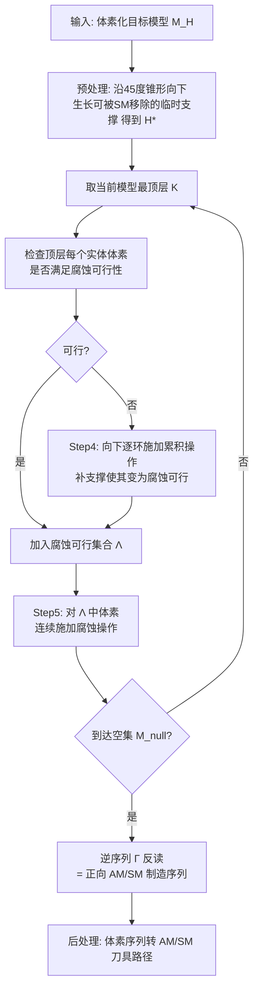

## 一句话总结

面对"复杂形状既无法单靠 3D 打印（大悬垂需支撑）、也无法单靠 CNC 铣削（刀具够不到）"的困境，本文提出一种**逆向操作规划**方法：把目标模型反过来一步步"清零"成空集，每一步逆操作对应一次增材或减材，从而反推出可交替执行的增-减材混合制造序列，并在理论上证明任意模型都能被精确制造。

## 研究背景

增材制造（AM，即 3D 打印）几何自由度高，但对大悬垂区域仍需支撑结构，即便多轴打印也无法完全避免；减材制造（SM，如 CNC 铣削）精度高、速度快，却受刀具可达性限制。混合制造（HM）把两者结合，既有 AM 的几何自由度，又有 SM 的精度，还能"先打印支撑、再铣掉支撑"，理论上能扩大可制造形状的范围。

但现有 HM 规划方法有明显短板：许多方法只把 SM 用于表面精加工，并不解决"无支撑就打不出来"的根本问题；另一些方法会产生不可避免的过切/欠切，无法保证最终件与输入几何完全一致。更关键的是，正向搜索（从空模型逐步加材料逼近目标）容易陷入**拓扑死胡同**——某个需要打印的区域此刻才发现缺少支撑，而此时已经无法再补加支撑了。

这一能力对拓扑优化（TO）得到的结构尤其重要。因为把制造约束（如自支撑约束）塞进 TO 会牺牲力学性能：论文中 MBB 梁的例子显示，加了自支撑约束后柔顺度（compliance）从 $$0.37\,\mathrm{J}$$ 升到 $$0.44\,\mathrm{J}$$（即刚度变差）。若能不加约束地自动制造 TO 结果，就能兼顾性能与可制造性。

作者由此提出核心问题：**任意模型都能被制造吗？** 并给出一个能保证精确复现任意目标几何的计算框架。

## 方法

核心思想是**反向规划（nullification，清零）**：与其从空模型正向堆叠，不如从完整目标模型出发，逐步施加逆操作把它化为空集 $$M_{null}$$。逆序列一旦求得，反过来读就是可执行的正向 AM/SM 制造序列。定义两个逆算子：

- **腐蚀（Erosion）**：把一个实体体素变空，是 AM 操作的逆；
- **累积（Accretion）**：把一个空体素变实，是 SM 操作的逆。

反向规划的妙处在于：可以用累积算子在"本该需要支撑"的悬垂区域下方"补出"临时支撑（这些支撑在正向制造里是先被打印、最后被铣除的），从而绕开正向搜索的拓扑死胡同。

体素化建模与操作规则：

模型离散在分辨率 $$(n_x, n_y, n_z)$$ 的规则体素网格上，状态函数 $$M(v_{i,j,k})$$ 取 1（实体）或 0（空）。**稳定性**定义为：每个实体体素都通过"面邻接或棱邻接"（不含仅靠顶点接触）连通到底层。工具方面，AM 工具只能竖直向下沉积（占据其上方空间），SM 工具可沿 $$-z, \pm x, \pm y$$ 五个方向进刀、按刀长 $$\bar{L}$$ 深入。

- **AM 可行**：自支撑（邻居在下一层 $$k-1$$）且无碰撞；自支撑角取 $$\pi/4$$。
- **SM 可行**：无碰撞且结果模型仍稳定。
- **累积可行**：对应 SM 无碰撞，且邻域内至少有一个实体体素——因而累积**无需显式检查稳定性**（有邻居实体加上原模型稳定，即可推出结果稳定），这对算法可扩展性很关键。
- **腐蚀可行**：对应 AM 可行，且移除后模型仍稳定。

关键设计与理论结果：

1. **序列生成规则**。腐蚀只作用于当前模型最顶层（因打印头形状扁平）；先做累积让更多顶层体素变得可腐蚀；尽量连续执行多次腐蚀以保持 AM 连续性。当某顶层体素不可腐蚀时，在其下方逐环（ring by ring）施加累积补支撑，直到它变为可腐蚀。

2. **完备性证明**。作者证明：只要累积仅施加在最顶层之下、且用刀长 $$\bar{L} \ge 2$$ 的 SM 工具，任何顶层边界体素都能通过累积变为腐蚀可行——因为可在 $$v_{i\pm1,j\pm1,K-1}$$ 处补出环绕支撑，保证移除后仍稳定且自支撑。由此任意体素模型都能被清零，对应的正向序列即可精确制造任意几何。这是**首个在理论上保证任意形状混合可制造性**的方法。

3. **局部稳定性检查（可扩展性）**。全局 flood-fill 检查稳定性开销巨大。作者基于两条引理，把检查限制在被移除体素的 $$\Delta$$-邻域内：只需判断该邻域内连通分量是否都连到底层。该局部检查是**保守**的——可能把稳定误判为不稳定，但绝不会把不稳定误判为稳定，因此不损害可制造性。$$\Delta$$ 越大越准但越慢，论文用 $$\Delta = 10$$ 或 $$20$$。

4. **预处理去冗余**。纯清零算法偶尔产生冗余临时支撑。预处理阶段先识别输入模型中需支撑的体素（按到包围盒距离排序，优先内部体素），沿向下 $$45^\circ$$ 锥形搜索区生长可被 SM 移除的支撑直到触地或触及自支撑区，得到富化模型 $$H^*$$。在 Fertility 模型上这一步把临时支撑体素数从 14,765 减到 2,399（减少约 $$83.75\%$$）。

5. **实现细节**。体素单位 1.2mm（等于 SM 刀直径、为 AM 喷嘴直径 0.6mm 的两倍）；后处理把体素序列分组成 AM/SM "patch" 并生成之字形刀路（SM 需按刀向分组）。针对丝材 FDM 的最小可打印特征尺寸（MPFS），可限制腐蚀为"顶层至少 $$M$$ 个连通体素一起移除"（论文用 $$M=10$$）。

## 实验结果

计算实验用 C++ 实现，跑在 Intel Core i9-13900K + 128GB RAM 上。作者在多个复杂模型上验证，统计见下表（均用刀长 $$\bar{L}=10$$ 体素）：

| 模型 | 体素分辨率 | 实体体素数 | 总时间(s) | 操作数 | 支撑体素总数 |
| --- | --- | --- | --- | --- | --- |
| GE-Bracket（TO 结果） | 100×60×34 | 16,403 | 12.09 | 31,745 | 7,671 |
| MBB Beam | 100×20×20 | 4,008 | 0.82 | 8,908 | 2,450 |
| Fertility（Δ=20） | 100×38×74 | 62,152 | 204.16 | 80,774 | 9,311 |
| Jennings Dog | 80×66×100 | 111,910 | 196.11 | 124,310 | 6,200 |
| TPMS（genus 72） | 50×50×50 | 47,824 | 30.15 | 65,868 | 9,022 |

其他要点：

- **稳定性检查仍是瓶颈**：即便用了局部检查，某些情形下清零时间的多达 $$76.9\%$$ 仍花在稳定性评估上。
- **刀长研究**：过短的 SM 刀（如 $$\bar{L}=2$$）导致大量额外支撑体素与更高计算时间；更长的刀显著减少清零阶段新增体素。
- **可扩展性**：在 Fertility 模型最高做到 $$250\times95\times186$$、约 979k 实体体素，产生逾 126 万次 HM 操作仍能处理。分辨率越高、模型相对刀长越大，SM 越难进入内部，预处理阶段加的支撑反而更少。
- **完备性验证**：在从 Thingi10K 随机抽取的 100 个模型上，全部成功生成 HM 序列。

物理制造在改装自 5 轴 CNC（5XM600XL）的混合机上完成，新设计的支架让打印头与主轴正交布置，可自动切换 AM/SM，并借 B 轴让 SM 刀在竖直/水平间切换、借 C 轴实现四个水平进刀方向。AM 用 0.6mm 喷嘴的 FDM 挤出（PETG 料，耐高温且铣削性能好），SM 用 1.2mm 单刃立铣刀（12mm 刀长，$$\bar{L}=10$$）。

- GE-Bracket：仅 AM（末端用 SM 去掉预加支撑）在大悬垂区失败，而本文交替 AM/SM 成功制造，3D 扫描验证吻合。
- 商用软件 Adobe MeshMixer 生成的支撑，10mm 的 SM 刀铣不到（存在碰撞干涉），凸显本文支撑"可被移除"的设计价值。
- MBB 梁：不加自支撑约束的 TO 结果经本文 HM 制造，三点弯曲测试（INSTRON 3344）显示刚度提升 $$30.51\%$$，且重量相当（8.1g vs 8.2g）。
- 复杂拓扑 TPMS（genus 72）也被成功制造。

## 亮点与局限

亮点：

- **反向"清零"框架**巧妙绕开正向搜索的拓扑死胡同，把"何时该加支撑"这一难题自然化解为累积算子。
- **首个理论保证**任意体素模型都可被混合制造精确复现的方法，并给出干净的完备性证明。
- **保守的局部稳定性检查**在保证可制造性（绝不把不稳定误判为稳定）的前提下大幅提速，配合预处理去冗余，实现对近百万体素模型的可扩展处理，并通过真实硬件闭环验证。

局限：

- 稳定性定义假设材料刚度极高，**未建模重力导致的形变**。
- 未显式处理**封闭腔体内 SM 碎屑的排出**，实验中靠高压气吹这类工程手段，对深或曲折的内腔不保证有效。
- "任意形状可制造"的论断**忽略材料各向异性**，仅针对各向同性材料；强各向异性复合材料仍需设计-制造联合优化。
- 不以最小化**换刀次数**为目标，频繁切换可能引入机械误差；物理实验受限于低刚度主轴，目前仅验证聚合物材料。

## 延伸思考

- 将重力形变纳入稳定性判据，是把该方法推向大尺寸、悬臂结构真实制造的关键一步；可借鉴 AM 领域已有的形变预测工作。
- 把 CNC 刀换成激光切割，或扩展到金属基 HM 系统，能处理更深/更难达的腔体，但需考虑光束发散、焦深、材料烧蚀特性等新约束。
- "换刀次数最小化"目前只被隐式鼓励，若把它显式纳入序列优化目标，配合精密标定与高刚度切换机构，有望进一步提升成品精度——这对工业级混合制造的落地尤为重要。
- 体素表示简单直观但受分辨率与刀具尺寸耦合影响，未来若能与其他表示（如隐式场）结合，或能在保持完备性的同时进一步降低支撑冗余与内腔处理难度。
