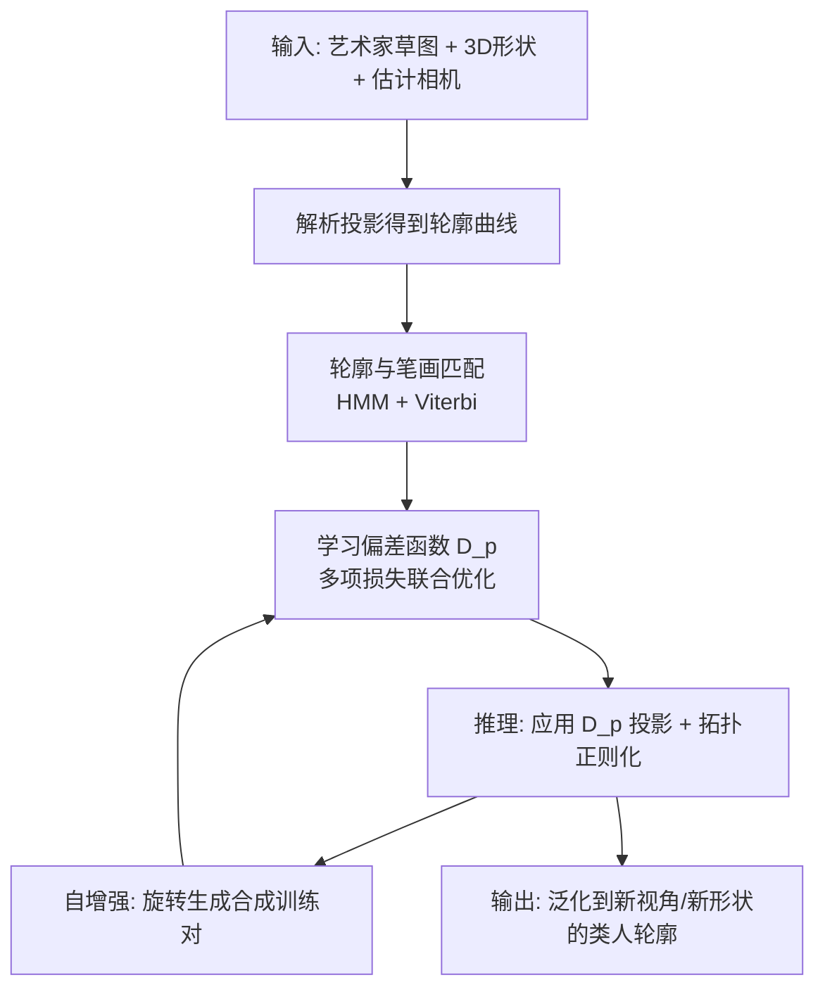

## 一句话总结

本文提出首个可学习"人类透视偏差"的方法：从单张艺术家草图与其对应 3D 形状的解析投影轮廓出发，学习一个在 3D 空间中平滑变化的透视偏差函数，使计算机渲染的轮廓线呈现出与人手绘一致的非线性透视，并能泛化到新视角与新形状。

## 研究背景

艺术家在描绘 3D 物体时会做三类选择：画哪些 3D 曲线、用什么 3D 到 2D 的投影、以及如何风格化这些 2D 投影。前者与后者已被大量研究，但"投影"这一环节却很少被建模。计算机图形学普遍采用解析投影模型（单灭点透视或正交投影），而大量用户研究表明：艺术家几乎从不使用精确的线性透视，其手绘透视与解析模型之间存在持续且有据可查的偏差——本文称之为"人类透视偏差"（human perspective deviation）。这种偏差部分源于人为的不精确，部分源于艺术家有意通过局部扭曲来强调关键特征、降低认知负荷，从而更有效地传达形状。

此前仅有一项工作（DifferSketching）尝试建模该偏差，其用 2D MLP 把解析轮廓变形到手绘轮廓，但把上述三类绘画选择混在一起处理，缺乏因子化，且即使在训练集上也会产生带高频噪声的、不像人手绘的变形。核心难点在于：人类绘画选择高度异质，而可用数据极度稀缺（数据集仅有几十到上百对训练样本）。

本文的目标是学到满足以下四点的偏差函数：$$(i)$$ 在训练数据上模仿艺术家偏差；$$(ii)$$ 泛化到其他形状；$$(iii)$$ 对同一形状的不同视角保持一致；$$(iv)$$ 输出看起来像人手绘。

## 方法

整体框架：给定一张艺术家草图与其对应 3D 形状（以及最佳匹配的相机参数），先在 2D 图像空间把解析投影轮廓与手绘笔画建立对应，再学习一个逐点的 3D 透视偏差矩阵函数 $$D(p)$$，把轮廓投影推向对应笔画位置，最后通过正则化与自增强提升跨视角与跨形状的一致性和泛化性。

透视偏差被建模为对投影算子的局部乘性修正：对归一化世界坐标下的任一点 $$p \in \mathbb{R}^3$$，人类透视投影为 $$p \to D(p)C[p;1]$$，其中 $$C=PM$$ 是相机投影矩阵，$$D(p)$$ 是一个 $$4 \times 4$$ 偏差矩阵，随后再做透视除法。形状被归一化到原点、限制在 $$[-1,1]^3$$ 单位盒内。$$D$$ 由一个 MLP 表示：输入 3D 归一化坐标，输出 15 个值，重排为 $$4 \times 4$$ 矩阵（末元素固定为 1）。

关键设计：

1. **轮廓到笔画的匹配（兼容性 + 一致性）**：由于对应关系并非一一对应（存在过度勾画、一条轮廓对应多笔等），本文用隐马尔可夫模型（HMM）建模匹配，兼顾"兼容性"（$$S_v$$，2D 距离与切线方向相似度）与"一致性"（$$S_e$$，连续顶点连线的长度与朝向相似）。总得分用乘积形式 $$M(S,Q)=\prod_i S_v(p_i,q_i)S_e(p_i,p_{i+1},q_i,q_{i+1})$$ 以抑制离群匹配，并用 Viterbi 算法求解；随后再做一轮匹配解决多条曲线匹配到同一笔画的冲突。

2. **多项损失学习偏差**：总损失 $$L(D)=w_1 L_{data}+w_2 L_{shape}+w_3 L_{slope}+w_4 L_S+w_5 L_{depth}$$。数据项把投影顶点推向匹配笔画（按置信度 $$\alpha_i$$ 加权，置信度由局部多段线角度差衡量）；形状项惩罚非均匀缩放与剪切但允许均匀缩放；斜率项保持轮廓斜率；平滑项让偏差矩阵在 3D 空间平滑变化；深度项保持相对深度以避免旋转视角时的深度翻转。权重设为 $$w_1{=}0.001, w_2{=}10, w_3{=}w_4{=}1, w_5{=}10^{-5}$$，即把形状保持与先验置于数据拟合之上。

3. **3D 而非 2D 建模**：实验发现跨视角与跨形状的泛化要求学习 3D 偏差函数而非 2D，因此偏差被定义在归一化世界坐标空间而非图像空间。

4. **自增强精炼**：用初次学到的 $$D$$ 把形状绕竖直轴小角度旋转（先 $$[-5,5]$$ 度后 $$[-10,10]$$ 度），生成"解析轮廓 / 偏差轮廓"合成训练对，再用相同架构与损失重新训练。由于数据项权重极小，形状、斜率、平滑项会抵消匹配误差而非放大它们，从而防止对输入视角的过拟合，显著提升跨视角一致性。

## 实验结果

在 169 对草图/形状（96 来自 OpenSketch、68 来自 DifferSketching 数据集、5 张新采集立方体草图）上训练与评估。主要定量与感知结果如下：

| 评估维度 | 本文方法 | 对比项 |
| --- | --- | --- |
| 对齐：到艺术家草图的 $$L_1$$ Chamfer 距离（越小越好） | 2.45e-3 | 解析轮廓 7.75e-3 |
| 感知：更像人手绘的比例 | 71% | 解析 12%（两者相当 8%，都不像 9%） |
| 感知：泛化到新形状关系更相似的比例 | 63% | 其他模型 21%（都相似 2%，都不相似 14%） |
| 消融：旋转后更准确描绘的比例 | 79% | 2D MLP 6%（都好 7%，都不好 8%） |

一致性评估中，用学到的 $$D$$ 从新角度渲染轮廓再反推偏差 $$D'$$，两者 Chamfer 距离在 $$\alpha=\pi/4$$ 时约 3.4e-3、$$\alpha=\pi/2$$ 时约 3.8e-3，表明跨视角高度一致。与 DifferSketching 的对比显示：其预训练模型带高频噪声，且在小规模子集上微调会出现灾难性失真，而本文方法能在同样输入上成功训练并泛化。

## 亮点与局限

亮点：
- 首个显式建模并学习"人类线画透视偏差"的方法，将投影选择从曲线选取与风格化中因子化出来。
- 用单对草图/轮廓即可学习，避开数据稀缺与风格异质难题；自增强机制在几十对数据下实现跨视角、跨形状泛化。
- 3D 逐点偏差矩阵 + 形状/斜率/平滑/深度多项约束，兼顾"像人手绘"与几何属性保持。

局限：
- 主要失败源于输入形状的矢量轮廓提取错误或相机估计不准。
- 每个输入只产出单一学到的偏差，需用户自行挑选最满意结果。
- 增大训练语料反而会削弱偏差幅度，与"捕捉个体艺术家偏差"的目标相悖，因此难以直接学习通用平均模型。

## 延伸思考

论文提出的一个诱人方向是"逆向"该偏差：把自由手绘草图反解为艺术家意图 3D 曲线的解析投影，从而提升基于草图的 3D 建模鲁棒性——这本质上是把本文的"人类透视生成器"当作先验来做去偏与重建。另一方面，该框架可作为分析工具，研究不同艺术家、不同形状间偏差函数的异同，进而尝试为新输入自动选择或合成"视觉最优"的透视偏差。更广义地看，用可学习的连续场去建模人类感知偏差这一思路，或许可迁移到色彩、比例、构图等其他"系统性人类偏差"的建模上。
