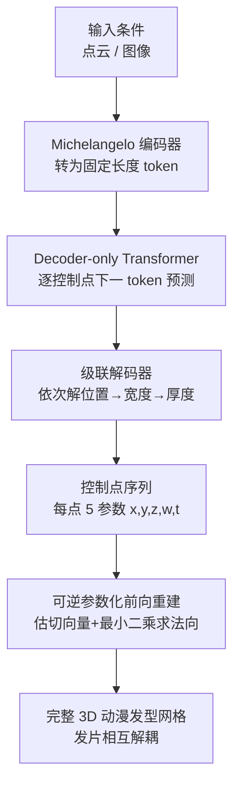

## 一句话总结

本文提出 CHARM：把每根动漫发片压缩成一串"控制点"（每点仅 5 个几何参数），并将整个发型视作一门可自回归生成的"头发语言"，由 Transformer 从点云或图像条件出发逐点生成，实现紧凑、可逆、可编辑且可规模化学习的 3D 动漫发型建模与生成。

## 研究背景

- 领域现状：头发建模是计算机图形学的长期难题，已有大量工作围绕写实头发展开，采用发丝（strand）、发网（hair mesh）、隐式函数、发丝引导的 3D 高斯等显式/隐式/混合表示。
- 核心痛点：动漫发型与写实头发有本质区别——它是高度风格化、分片状（piecewise）的几何结构，具有非均匀的发片厚度、可变发密度、不固定的发根位置和特殊的片内结构。现有方法要么把动漫头发当作单一整块多边形网格（缺乏发片分离，不利于编辑与动画），要么依赖艺术家手工绘制的 Bézier 样条曲线（直观但难以自动重建与生成，拟合 Bézier 曲线本身高度病态）。因此缺少一种既紧凑又结构化、适合数据驱动学习的动漫发型参数表示。
- 本文 idea：受工业平台 VRoid Hub 用重复"头发单元"拼接发片这一建模范式启发，作者不去建模全分辨率网格，而是用一串控制点（每点 5 个参数）来编码发片，并利用其天然的序列性，把发型建模成"头发语言"（单元是"词"、发片是"句子"），用自回归 Transformer 来学习生成。

## 方法

### 整体框架

CHARM 由两部分组成：一是可逆的控制点参数化，把动漫发片在原始 3D 网格与紧凑控制点序列之间双向转换（token 成本降到原网格的 2% 以下）；二是自回归发型 Transformer，以点云（或图像转来的点云）为条件，逐个控制点做"下一 token 预测"，配合级联解码器和特殊分隔 token，生成任意数量、任意长度发片构成的完整发型。为支撑大规模训练，作者从 VRoid-Hub 公开模型中构建了 AnimeHair 数据集（3.7 万个高质量动漫发型，发片已分离、网格已处理）。

### 关键设计一：控制点式可逆参数化

每根发片由 $$N$$ 个控制点表示，每个控制点仅存 5 个浮点值：3D 位置 $$(x,y,z)$$、宽度 $$w$$、厚度 $$t$$。给定控制点序列，切向量 $$\bm{\tau}_i$$ 用四阶精度的五点中心差分估计（系数 $$[-1/12, 2/3, 0, -2/3, 1/12]$$）。宽度方向（即法向）的估计被转化为一个最小二乘优化：要求法向与局部几何正交、且相邻法向平滑变化，目标函数为

$$\sum_i \left(\mathbf{n}_i^T D_i \mathbf{n}_i\right) + \lambda \sum_i \lVert \mathbf{n}_i - \mathbf{n}_{i+1}\rVert^2$$

其中 $$D_i = d_{i,\text{prev}}d_{i,\text{prev}}^T + d_{i,\text{next}}d_{i,\text{next}}^T$$ 由相邻差分向量构成。该问题化为块三对角稀疏线性系统 $$A\mathbf{n}=0$$，固定首个法向（PCA 初始化）避免平凡零解，一次线性求解即得全局一致平滑的法向场，从而定义宽度方向 $$\bm{\omega}_i=\mathbf{n}_i$$ 与厚度方向 $$\bm{\psi}_i=\mathbf{n}_i\times\bm{\tau}_i$$，再据此重建每个重复单元的顶点与整片网格。逆过程则取每个单元底面质心为控制点、对角线映射为宽厚值，实现完全可逆。

### 关键设计二：把发型建成"头发语言"的序列构造

在发型级（"句子"级），生成顺序从后脑开始，每根发片按其平均 $$x,z$$ 坐标从上往下俯视逆时针排列，以捕捉相邻发片依赖并保证空间连续性。在发片内（"词"级），控制点按连接关系从发根到发梢排序（发根定义为更靠近发型中心竖轴顶部的端点）。序列开头加 `<SOS>`、结尾加 `<EOS>`，并在发片之间插入特殊的 `<MOS>` token 作为切换信号，配合 $$D_{mos}$$、$$D_{eos}$$ 两个解码器判断发片与整个发型何时终止，从而支持任意发片数与长度。

### 关键设计三：级联属性解码与结构一致性约束

Transformer 输出特征 $$f_i$$ 后，采用级联解码显式建模属性间依赖：先解位置 $$\hat p_i = D_p(f_i)$$，再以位置嵌入为条件解宽度 $$\hat w_i = D_w(f_i, e_p(\hat p_i))$$，最后解厚度 $$\hat t_i = D_t(f_i, e_p(\hat p_i), e_w(\hat w_i))$$。推理时若某控制点是发片中第 6 个及以后的点、且其位置与前序点拟合的三次样条外推位置偏差超过阈值（0.03），则替换为 MOS token，以防止片内出现不合理的几何断裂。训练损失为 $$L = L_{ce} + L_{eos} + L_{mos}$$，其中 $$L_{ce}$$ 为监督离散控制点属性的交叉熵，另两项为发型级与发片级终止判断的二元交叉熵。

## 实验结果

在 AnimeHair 测试集（100 个与训练集无重叠的发型）上，与主流形状条件 3D 网格生成方法对比，CHARM 在几何精度（Chamfer、EMD、Hausdorff、Voxel-IoU）上全面领先：

| 方法 | CD ↓ | EMD ↓ | Hausdorff ↓ | Voxel-IoU ↑ |
| --- | --- | --- | --- | --- |
| MeshAnything | 0.0179 | 0.0190 | 0.0584 | 0.7014 |
| MeshAnythingV2 | 0.0118 | 0.0132 | 0.0510 | 0.7503 |
| BPT | 0.0270 | 0.0317 | 0.0767 | 0.6328 |
| DeepMesh | 0.0172 | 0.0198 | 0.0613 | 0.7313 |
| 本文 | 0.0117 | 0.0128 | 0.0497 | 0.7566 |

在感知对齐（对每个发型固定光照、8 个水平等距视角渲染后用 CLIP 编码算平均余弦相似度）上优势更明显：本文 CLIP 相似度 0.9258 排名第一，显著高于第二名 MeshAnythingV2 的 0.8618，说明基线方法往往把发型建成连续曲面、丢失了动漫头发离散且独立分片的体积结构。消融实验表明：逆时针排序优于按 x/y/z 单轴排序（y 轴最差）；本文 5 参数控制点参数化优于加入宽厚方向向量的 11 参数"扩展向量"方案，也远优于直接预测所有顶点的"显式顶点"方案，印证了在表达力与可学习性之间的良好平衡。

## 亮点与局限

亮点：
- 提出首个专门面向 3D 动漫发型的紧凑、可逆、可编辑参数化：每控制点仅 5 个参数，token 成本压缩至原网格的 2% 以下，兼顾艺术家友好设计与深度模型学习。
- 用"头发语言"视角把发型生成建模为自回归序列任务，天然支持可变发片数、可变长度与不固定发根，并同时捕捉片内与片间结构关系。
- 用最小二乘线性系统一次求解全局法向场，替代不稳定的 PCA 或昂贵的梯度下降，兼具确定性、效率与鲁棒性。
- 构建并开放 AnimeHair 数据集（3.7 万个发片分离的高质量动漫发型），为该方向的训练与评测奠定基础。

局限：
- 数据与表示均源自 VRoid 风格的重复单元（菱形/三角锥两类），对偏离该建模范式的非常规动漫发型泛化性未充分验证。
- 图像条件生成依赖先把图像转成点云再送入模型，属于间接管线，端到端的图像到发型生成质量受中间步骤影响。
- 需要结构一致性约束（三次样条外推阈值）等推理期启发式手段来抑制片内几何断裂，说明纯自回归生成仍可能产生不合理跳变。

## 延伸思考

- "把结构化几何压成极简参数序列 + 自回归生成"是一条很有生命力的路线：当对象本身具有明显的重复单元与拓扑规律（如动漫发片、建筑构件、机械零件）时，用领域先验设计紧凑可逆表示，往往比直接生成高分辨率网格更可学、更可控。
- 5 参数优于 11 参数的消融结果值得玩味：更多显式自由度反而降低精度，提示生成式建模中"表达力"与"可学习性"存在权衡，把可由几何约束确定的量（如宽厚方向）交给确定性求解而非交给网络预测，是提升学习效率的有效手段。
- 把发型类比为"语言"（词/句子/标点）不仅是叙事技巧，更实质性地引入了顺序、分隔与终止机制；这提示对其他"可分解为可变数量部件"的 3D 内容（发型、服饰配件、场景物体布局），语言式序列建模都是值得迁移的通用框架。
