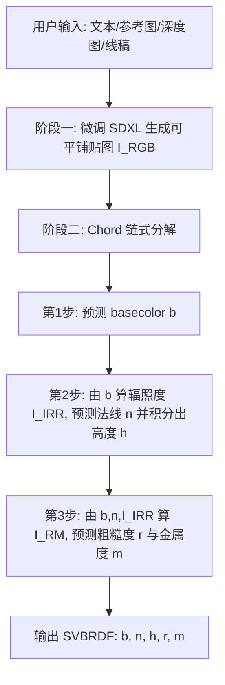

## 一句话总结

提出"生成—估计"两阶段框架：先用微调的扩散模型生成可平铺的贴图 RGB 图像，再用一条源自渲染方程的链式分解流程（Chord）依次估计 SVBRDF 各通道，实现高效、高质量且可灵活控制的 PBR 材质生成。

## 研究背景

物理渲染（PBR）工作流把材质表示为空间变化的双向反射分布函数（SVBRDF），通常包含 basecolor、法线、粗糙度、金属度等多个通道。相比早期只合成 RGB 贴图，这带来两个难点：需要同时处理多个物理含义不同的通道，且要保证它们之间精确的空间对齐。

已有工作大致有两条路线。一条是把多个通道压缩进一个隐空间、用专用生成模型直接产出材质，但受耦合架构限制，灵活性和质量都受约束。另一条是材质估计（逆渲染），用视觉基础模型对单张或多张图像做本征分解；这类方法需要大量训练数据，且往往忽略通道之间的内在关系，难以准确还原材质外观。作者的核心观察是：SVBRDF 各通道之间存在由渲染方程决定的内在依赖关系，应当被显式建模，而不是各自独立预测。

## 方法

### 整体框架

框架分两阶段。阶段一用微调的 SDXL 生成与用户输入对齐、且可平铺（tileable）的贴图 RGB 图像 $$I_{RGB}$$；阶段二用 Chord 流程把该图像分解为 SVBRDF 各通道。两阶段共享一套隐式预定义的光照与相机条件（固定俯视视角 + 方向光），这一假设把逆渲染这个欠约束问题大幅简化。

### 关键设计

1. **链式渲染分解（Chord）**：预测顺序由 PBR 渲染方程推导而来。先预测 basecolor（其数据分布与输入 RGB 最接近，最易迁移、误差累积最小）；再预测法线（用近似辐照度图 $$I_{IRR}=I_{RGB}/b$$ 作为条件，剥离漫反射颜色、保留几何与光照线索），并用 Simchony 等的方法从法线积分出高度；最后预测粗糙度与金属度（先用能量衰减启发式估计光照方向，再在离散空间做逐像素网格搜索得到近似最优组合图 $$I_{RM}$$ 作为条件）。每一步都把上一步的结果加工成更接近目标通道的表征再喂入。

2. **LEGO-conditioning 模块化条件机制**：直接把链式流程套用到共享权重的 U-Net 上会产生模态间的权重冲突。作者为每个目标通道配备独立的首个 Down-Block、末个 Up-Block 与 Conv-Out，同时共享中间层以保持空间对齐。多路条件隐码取平均以保持幅值一致：$$\hat{v}_t=v_{\theta'}\!\left(\frac{\sum_{i=1}^{k}\phi_i(c_i)+\phi_z(z_t)}{k+1},\,\tau(D_z),\,t\right)$$，其中 $$c_i$$ 为条件隐码、$$z_t$$ 为目标通道的噪声隐码、$$\tau(D_z)$$ 为通道文本描述的 CLIP 嵌入充当通道开关。

3. **单步微调**：链式流程依赖干净的中间表征，与使用噪声样本的标准扩散训练不同。作者采用单步方法，令 $$t=T$$、省略噪声项，直接在图像空间计算损失。这既保证输出确定性，又省去多步去噪、提升推理效率。

4. **图像空间复合损失**：损失同时含像素项、感知项（VGG-16）与渲染项 $$\lVert R(\hat{MAT};l)-R(MAT;l)\rVert_1$$。法线通道用余弦相似度损失 $$L_n=1-\hat{n}\cdot n$$ 惩罚角度偏差；渲染损失每次迭代随机采样 8 个方向光生成 8 组渲染对，感知项系数取 $$\lambda=0.005$$。

## 实验结果

在 Substance 测试集上与其他全模态材质估计方法对比（PSNR 越高越好，LPIPS 越低越好），本方法在 basecolor、金属度、高度、重光照（Relit）等指标上均领先，法线通道 LPIPS 也最优：

| 方法 | Basecolor PSNR↑ | Basecolor LPIPS↓ | Normal PSNR↑ | Normal LPIPS↓ | Metalness PSNR↑ | Relit PSNR↑ |
|------|------|------|------|------|------|------|
| Material Palette* | 16.04 | 0.384 | 19.97 | 0.417 | — | — |
| SurfaceNet† | 24.60 | 0.326 | 21.91 | 0.508 | 64.45 | 21.54 |
| MatFusion† | 25.35 | 0.347 | 20.69 | 0.503 | 32.66 | 21.75 |
| RGB→X† | 25.72 | 0.317 | 22.56 | 0.364 | 64.96 | 21.91 |
| Ours | 29.05 | 0.269 | 23.32 | 0.334 | 77.67 | 22.94 |

注（†：在作者数据集上重训；*：作者提供权重）。推理速度方面，本方法全模态估计约 2.1 秒，相比 RGB→X 的 23.6 秒约有 11 倍加速。消融实验表明单步、复合损失、链式、LEGO-conditioning、近似辐照度、RM 网格搜索、渲染损失与预训练阶段各组件均带来增益。

## 亮点与局限

亮点：

- 用渲染方程显式推导出的预测链条，把欠约束的逆渲染拆成三个逐步收窄的子问题，显式建模了 SVBRDF 通道间的内在依赖。
- LEGO-conditioning 以极小的计算与显存开销解决了多模态共享权重的冲突。
- 单步微调兼顾确定性输出与推理效率，全模态估计相比扩散基线约 11 倍加速。
- 得益于生成阶段沿用大文生图模型，天然支持文生材质、图生材质、结构可控生成与材质编辑等多种应用。

局限：

- 光照假设要求生成的 RGB 贴图具有一致的方向光照；对光泽（glossy）表面，可平铺约束下的循环填充会让高光沿边缘环绕、扩散到整图，造成光照不一致、估计变差。
- basecolor 偶尔会烘焙进阴影，源于训练数据中不少材质带有烘焙的环境光遮蔽（AO）。
- 单步微调虽在 PBR 测试集上更强，但会削弱对真实野外图像的泛化能力。

## 延伸思考

作者提出的改进方向颇有意思：为解决光泽表面问题，可为每个材质生成两张图——一张不加平铺约束以捕捉高光、一张可平铺以保留非高光细节，再分两支处理；泛化问题则可尝试 rectified flow、mean flow 等替代的单步/少步生成建模。更广地看，"把渲染方程的因果结构编码为预测顺序"这一思路，可能迁移到其他多模态、强物理先验的逆问题上（如光照分解、几何重建），链式条件比一次性联合预测更能利用领域知识来约束解空间。此外，Ubisoft 已开源模型与 ComfyUI 节点，说明该框架在实际内容生产管线中具备落地价值。
