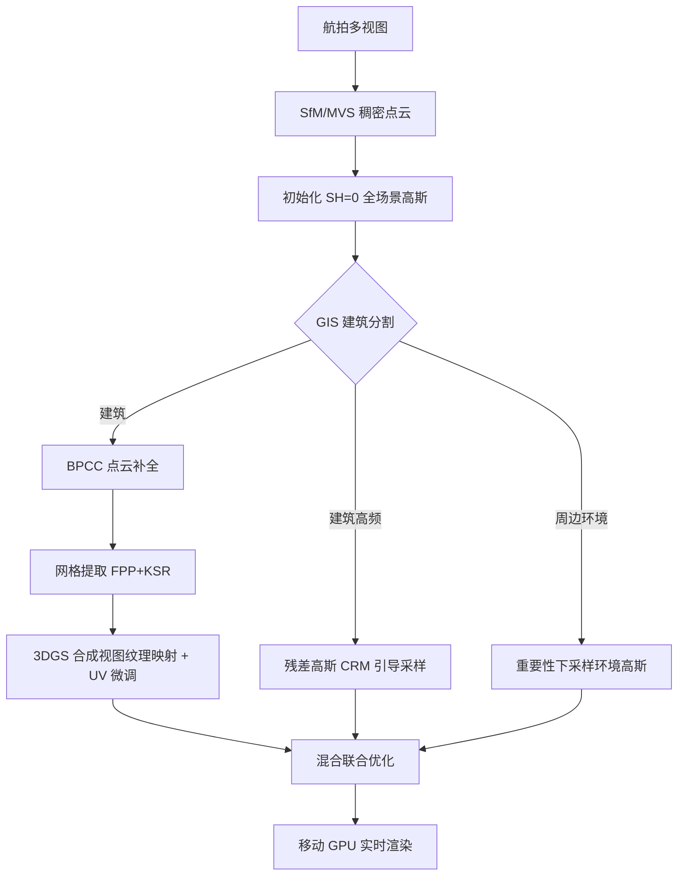

## 一句话总结

CityGo 用"带纹理的代理建筑网格 + 残差高斯 + 环境高斯"的混合表达来重建并渲染大规模航拍城市场景，把建筑规则几何交给轻量网格、把高频细节和周边环境交给稀疏 3D 高斯，从而在移动 GPU 上实现实时渲染，同时显著压缩模型体积、缩短训练时间。

## 研究背景

大规模城市建模与渲染是城市规划、自动导航、智慧城市数字孪生的基础技术，其中建筑物的建模尤为关键。无人机航拍相比地面影像能覆盖屋顶和空间布局，是可扩展城市建模的理想数据源；但同时对边缘设备（无人机、手机、AR 眼镜）的实时轻量渲染提出了内存、功耗、时延的严格约束。现有路线各有短板：

- **传统几何方法**（SfM、MVS、纹理映射）在弱纹理、反射表面、复杂几何处易产生破碎点云和噪声网格，稠密网格内存开销大，纹理映射还会出现接缝、鬼影等伪影。
- **NeRF 类神经方法** 渲染质量高，但训练慢、运行时性能有限，隐式体表达难以压缩、编辑和部署到受限设备。
- **3D Gaussian Splatting（3DGS）** 显式高效，但用它建模整座城市可能需要上亿个高斯、占用数十 GB 显存，远超移动平台承受能力；且高频纹理往往要靠稠密高斯堆叠，在简单几何区域造成冗余和模糊。

CityGo 的出发点是：城市中大量建筑其实是规则的多面体几何，用网格表达远比堆高斯高效；只需把网格搞不定的高频外观和不规则环境元素交给稀疏高斯补充。

## 方法

整体是一个混合表达管线：先由航拍图像生成全场景稠密点云并初始化零阶球谐（SH=0）高斯，再借助 GIS 建筑分割把场景拆成"建筑"与"周边环境"两部分分别处理。建筑用"代理网格 + 残差高斯"，环境用下采样的稀疏高斯，最后联合优化。

### 建筑点云补全（BPCC）

MVS 得到的单栋建筑点云常因遮挡、重复纹理、表面反射而残缺，妨碍后续网格提取与纹理映射。作者受层式代理几何方法启发，对稠密点云沿竖直方向切成一系列水平层 $$L = \{L_1, \cdots, L_n\}$$，逐层把该层及以上的点投影到当前层平面得到投影点集，再由轮廓构造代理几何、采样补洞。

相比原始做法，作者做了三点改进以适应稀疏噪声的 SfM/MVS 点云与复杂建筑（凹形布局、双子塔等）：

1. 用**稠密点云**而非稀疏点云作为输入；
2. 对每层投影的 2D 点做**聚类**（DBSCAN）后再分簇求轮廓；
3. 用 **alpha-shape 算法**替代凸包，得到更贴合的轮廓。

处理方向也从自顶向下改为**自底向上**：从最底层 $$L_n$$ 聚类求初始主导轮廓集合 $$S$$，向上逐层继承下层聚类结果并重新聚类。当满足以下任一条件时引入新的主导轮廓——(1) 某簇分裂为多簇，或 (2) 仍为单簇但其 alpha-shape 轮廓面积相对下层显著缩小，即

$$\frac{\mathrm{Area}(\hat{C}^k_i)}{\mathrm{Area}(\hat{S}^k_{i+1})} \le \gamma$$

其中 $$\gamma$$ 为固定阈值。若两条件都不满足则沿用下层轮廓。这样自底向上逐层处理，得到更忠实的层式代理几何，并据此采样点填补建筑底面与侧面的缺洞。

### 网格提取与纹理映射

对补全后的无洞点云，先用拟合平面基元（FPP）算法以平面近似点云，其目标函数为

$$U(x) = w_f U_f(x) + w_s U_s(x) + w_c U_c(x)$$

其中 $$U_f、U_s、U_c$$ 分别为保真度、平滑度、完整度项，权重 $$w_f=w_s=w_c=1$$。得到的平面基元再输入动力学形状重建（KSR）方法，将空间划分为内外区域并生成代理建筑几何。

纹理映射上，直接用航拍原图会因跨视图色差和邻近建筑遮挡产生接缝、黑斑、错位。作者改用**单栋建筑的 3D 高斯模型渲染合成图**作为受控输入——可精确控制虚拟相机位姿，清晰呈现门窗、结构轮廓并减少遮挡。每栋建筑渲染 28 个视图（竖直三层，仰角 20°–90°；水平 8 个视点绕建筑均布 0°–360°，另加 4 个顶视），纹理分辨率按包围盒大小在 1024–4096 之间动态取值。

**UV 微调**：通过可微光栅化进一步修正代理几何渲染与真值的差异。标准光栅化下 UV 图按重心坐标一一采样，每次迭代只更新少量 UV 像素会导致椒盐噪声。作者对 UV 图做平滑变换

$$T_{smooth} = \mathrm{cov}(T, g)$$

其中 $$g$$ 为固定卷积核，用于优化过程中平滑纹理，从而得到更锐利真实的颜色渲染。

### 残差高斯

代理建筑擅长表达简单多面几何，但难以刻画高频细节与复杂外观。作者引入残差 3D 高斯作为互补分量，与代理建筑组成混合表达。残差高斯从初始高斯集里稀疏采样，采样受**色彩残差图（CRM）**引导，CRM 量化代理渲染纹理与真值外观之差：

$$c_{res} = |c_{GT} - c_m|$$

其中 $$c_m$$ 为代理网格渲染出的颜色。为隔离建筑本身的误差，把代理建筑投影到真值图上生成建筑掩膜，只在建筑区域计算 CRM。

给定三角网格 $$M = \{V, F, T\}$$（顶点、面、UV 坐标），对某视点穿过像素 $$m$$ 的光线 $$r_m$$，光栅化产出从 UV 图采样的颜色 $$c_m$$ 和 z-buffer 深度 $$d_m$$：

$$d_m, c_m = R(M, r_m)$$

由于 UV 图走表面渲染范式，其不透明度固定为 1.0，使网格被视作光线上最终交点面。网格深度是 3DGS 训练早期可靠的弱监督信号。作者引入保护区间 $$d_g$$，在混合渲染时只激活深度 $$d < d_m + d_g$$ 的高斯，把高斯约束在网格表面附近。最终混合颜色由激活高斯与网格表面累积得到：

$$c_h(x) = \sum_{k=1}^{K} T_k \alpha_k c_k + T_m c_m, \quad T_m = \prod_{k=1}^{K}(1-\alpha_k)$$

其中 $$\alpha_k$$ 为第 $$k$$ 个高斯的不透明度，$$T_k$$ 为其透射率。为选出有意义的残差高斯，基于 CRM 计算每个高斯在视点 $$\gamma$$ 下的得分：

$$E^\gamma_k = \max_{r \in P_\gamma} c_{res}(r)\, \alpha_k(r)\, T_k(r)$$

其中 $$P_\gamma$$ 是视点 $$\gamma$$ 所有像素对应的采样光线集合。为消除视角偏差，取跨所有训练视图的最大得分：

$$E_k = \max_{\gamma \in \Gamma} E^\gamma_k$$

得分高于预设阈值的高斯被选为残差高斯，阈值可按可接受的像素误差灵活调整。

### 环境高斯

道路、车辆、树木等周边细粒度元素难用传统 MVS 准确重建，常被过度简化。作者直接用 3D 高斯表达周边环境，且不用建筑分割剩下的高斯，而是从初始全场景高斯里下采样一个稀疏子集。采用基于重要性的采样：第 $$k$$ 个高斯的重要性定义为其在所有光线上的累积混合权重

$$I_k = \sum_{i=1}^{N} w_{k,i}$$

据此给每个高斯分配采样概率以保证空间分布均匀：

$$P_k = \frac{I_k}{\sum_{j=1}^{K} I_j}$$

由此得到轻量的环境高斯集，与建筑表达（代理网格 + 残差高斯）合并成统一城市模型。在后续混合优化阶段联合细化环境高斯的位置、尺度、不透明度和外观，其中位置用较低学习率更新以保持空间一致性。

## 实验结果

在三个真实城市数据集上评测：作者自采的两个航拍数据集 Area-H（密集商业区高层建筑，8047 张图，各覆盖约 1.5 km²）、Area-L（住宅区低层建筑，6192 张图），以及公开的 UrbanBIS 数据集。对比方法包括 3DGS、2DGS、OctreeGS、CityGS-V1、CityGS-V2，实验主要在 NVIDIA RTX A6000 上进行。

UrbanBIS 数据集上的对比：

| 方法 | PSNR↑ | Size(MB)↓ | #GS(M)↓ | Time(h)↓ | FPS↑ |
|------|------|------|------|------|------|
| 3DGS | 18.20 | 356 | 2.27 | 1.6 | 189.11 |
| 2DGS | 16.85 | 147 | 0.93 | 2.5 | 12.83 |
| OctreeGS | 17.39 | 55 | 1.87 | 2.52 | 73.10 |
| CityGS-v1 | 18.38 | 404 | 1.71 | 3.5 | 130.90 |
| CityGS-v2 | 17.98 | 88 | 0.562 | 5.5 | 58.65 |
| Ours | 18.48 | 117 | 0.72 | 1.4 | 253.86 |

Area-H / Area-L 大场景对比（节选）：

| 方法 | Area-H PSNR↑ | Area-H Size(MB)↓ | Area-H FPS↑ | Area-L PSNR↑ | Area-L Size(MB)↓ | Area-L FPS↑ |
|------|------|------|------|------|------|------|
| 3DGS | 22.44 | 6319 | 33.60 | 25.00 | 6986 | 30.93 |
| 2DGS | 22.19 | 4127 | 4.59 | 24.41 | 3849 | 5.09 |
| CityGS-v2 | 21.04 | 1140 | 5.27 | 23.95 | 1335 | 6.19 |
| Ours | 21.93 | 741 | 161.14 | 23.97 | 624 | 196.00 |

- **速度与体积**：在 UrbanBIS 上取得最高 PSNR（18.48）的同时，训练时间最短（1.4h）、FPS 最高（253.86），模型体积约为 3DGS 的 1/8。大场景 Area-H/Area-L 上 FPS 达 161/196，远超各基线，模型体积和训练时间也最小。
- **质量折中**：PSNR 相比 3DGS 最多下降约 1.03 dB，作者认为效率的大幅提升使其仍具竞争力。
- **移动端实测**：在 NVIDIA Jetson AGX Orin、720p（车载典型分辨率）下，CityGo 在三个数据集上分别达 20/24/51 FPS，而 3DGS 仅 5/6/29 FPS，可对最大 1.5 km² 的城市场景实现至少 20 FPS 实时渲染。
- **代理网格压缩**：Area-H 上代理网格相比 MVS 网格体积压缩约 61.7×（53.96 MB vs 3329.24 MB，面数 5.7 万 vs 2846 万）。
- **视觉表现**：缓解了 3DGS 在场景表面产生的漂浮高斯问题，并消除了分块训练在大场景合并时的块间色差。

消融（UrbanBIS）：去掉 UV 微调会需要更多残差高斯来补偿外观差异，导致模型变大（Size 从 112 升到 126，#GS 从 0.72 升到 0.81）；去掉 CRM 采样改用随机采样则降低渲染质量并引入明显的高斯漂浮物。

## 亮点与局限

亮点：
- **按几何复杂度分工的混合表达**：规则建筑用轻量带纹理网格、高频细节用残差高斯、不规则环境用稀疏高斯，从表征层面消除了纯 3DGS 在简单几何上堆高斯的冗余。
- **用合成渲染图做纹理映射**：以单栋建筑的 3D 高斯渲染合成图替代原始航拍图，规避了跨视图色差与邻近建筑遮挡带来的纹理伪影。
- **CRM 引导 + 深度保护区间**：残差高斯只放在代理渲染与真值差异大的区域，并被约束在网格表面附近，兼顾保真与紧凑。
- **真正落到边缘设备**：在移动 GPU 上实测实现大规模城市场景实时渲染，训练时间和显存显著下降。

局限：
- 系统高度依赖准确的代理几何。起重机、标识牌等非建筑结构可能被误分类为建筑。
- 纹理不透明度固定为 1.0，使 3DGS 无法纠正这类误分类误差，导致伪影和 PSNR 下降。
- 作者指出未来将探索语义感知建模与自适应透明度来缓解上述问题。

## 延伸思考

- 固定不透明度 1.0 是当前误差无法自愈的根源，若引入可学习的网格透明度或语义门控，或许能在保持网格紧凑性的同时让高斯层"接管"误分类区域。
- "按几何复杂度分配表征预算"的思路（规则→网格、高频→残差、杂乱→稀疏高斯）具有普适性，是否可迁移到室内场景、工业设施等同样存在大量规则结构的场景。
- BPCC 与代理提取依赖 GIS 建筑分割作为先验，若分割不可得或不准确，管线的鲁棒性如何，是否可用自监督的几何规则性检测替代外部先验值得探索。
