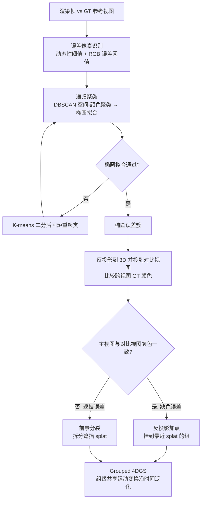

## 一句话总结

针对 4D Gaussian Splatting（4DGS）在动态区域"致密化不到位"与"跨帧对应模糊"两大痛点，本文提出椭圆误差聚类加误差校正式加点（缺色靠反投影补点、遮挡靠前景分裂），并用组级共享运动变换维持 splat 与动态物体的稳定对应，在 Neural 3D Video 与 Technicolor 数据集上取得最优感知质量，Technicolor 上 PSNR 提升 0.39dB。

## 研究背景

把真实世界的动态场景搬进沉浸式内容，需要高质量的动态新视角合成（Novel View Synthesis）。3DGS 因实时渲染而流行，后续大量工作把它扩展到动态场景（4DGS），但仍有两个未解难题：

- **动态区域致密化失效**：3DGS 用平均视角梯度决定在哪加 splat；扩展到 4D 后，splat 外观随时间变化，梯度受时间变换误差与可见性变化干扰，无法精确定位真正需要补点的动态区域，导致动态细节缺失。
- **跨帧对应关系模糊**：单个 splat 只覆盖一小片单色区域，相邻帧里存在多个颜色相近的候选像素（见条纹的例子），一个 splat 在优化中可能被错误地映射到邻近条纹，难以用正确的运动把动态 splat 沿时间延展，从而产生闪烁与细节退化。

已有工作（如 E-D3DGS 的多视图 DSSIM 损失、STG 的高误差 patch 采样）只能间接、粗略地判断哪里需要补点，缺乏对误差区域的精确定位与对跨帧 splat 对应关系的显式建模。

## 方法

整体框架分两阶段。第一阶段按 Ex4DGS 的渐进式训练学出一个 Grouped 4DGS 模型（含组分裂、类 3DGS 致密化与剪枝）；第二阶段冻结 splat 的组归属，每隔数百步触发一次"椭圆误差聚类 + 误差校正式加点"，同时继续优化组与 splat 的动/静态参数。

关键设计：

- **组级共享运动 + splat 级相对静态变换（Grouped Temporal Modeling）**：把每个 splat 的变换分解为组级动态变换 $$x_G(t), r_G(t)$$ 与 splat 相对组的静态变换。splat 在时刻 $$t$$ 的位姿为 $$x(t) = x_G(t) + R_G(t)\,x + t\cdot d$$，$$R(t) = R_G(t)\,R$$，组运动用 $$K$$ 个关键帧插值。同组 splat 共享运动，从而稳定跨帧对应、抑制时间抖动。

- **基于图的动态分组（Graph-based Dynamic Grouping）**：初始全部视为静态，训练中用正则鼓励一致运动的 splat 保持小位移 $$d$$；位移大的 splat 被视为新组候选。在这些 splat 上建无向图，当两 splat 满足空间重叠且位移方向余弦相似度超过阈值时连边：$$\lVert x_i(t) - x_j(t)\rVert_2 < s_i + s_j$$ 且 $$\dfrac{d_i^\top d_j}{\lVert d_i\rVert\,\lVert d_j\rVert} \ge \tau_d$$。连通分量形成新动态组，并用代表 splat 的变换初始化组关键帧、对齐组内其余 splat。

- **椭圆误差聚类（Elliptical Error Clustering）**：先按"动态性"（GT RGB 在前/当前/后帧的最大 L1 距离超阈值 $$\tau_D$$）与"RGB 误差"（绝对阈值 $$\tau_a$$ 加相对阈值 $$\tau_r$$ 取高误差百分位）筛出误差像素；再用 DBSCAN 做空间-颜色联合聚类，对每簇拟合椭圆（用最小外接矩形内切椭圆的填充率判定），不达标的簇用 K-means 二分后递归重聚类，直到全部簇都能被椭圆良好拟合，便于直接映射为盘状 Gaussian splat。

- **误差校正式加点（Error-Correcting Splat Addition）**：对每个椭圆簇，从渲染深度图采样中心及邻域深度反投影到 3D 点，再投到同帧的对比视图取 GT 颜色。若跨视图颜色高度一致（缺色误差）则做反投影加点：$$\min_{j=1,\dots,k}\lVert c_{\text{main},j} - c_{\text{comp},j}\rVert_\infty < \delta_{\text{rgb}}$$，新 splat 初始化为盘状、挂到最近 splat 的组，不透明度设为 $$1 - \min_j \lVert c_{\text{main},j} - c_{\text{comp},j}\rVert_\infty$$；否则判为遮挡误差，对最近 splat 做前景分裂（类似 3DGS 致密化）以缓解过重建。

## 实验结果

在 Technicolor Light Field 数据集（动态物体占画面比例大，5 个场景，分辨率 2024×1088，取 50 帧）上与主流方法比较感知质量指标（PSNR 越高越好，DSSIM/LPIPS 越低越好）：

| 方法 | PSNR ↑ | DSSIM1 ↓ | DSSIM2 ↓ | LPIPS ↓ | Size ↓ |
|------|--------|----------|----------|---------|--------|
| DyNeRF | 31.80 | N/A | 0.021 | 0.140 | 30 MB |
| HyperReel | 32.73 | 0.047 | N/A | 0.109 | 60 MB |
| 4DGS | 29.54 | 0.065 | 0.032 | 0.149 | N/A |
| 4DGaussians | 30.79 | 0.079 | 0.040 | 0.178 | N/A |
| STG | 33.56 | 0.040 | 0.019 | 0.084 | 55 MB |
| SWinGS | 33.65 | 0.033 | N/A | 0.117 | N/A |
| E-D3DGS | 33.24 | 0.047 | N/A | 0.100 | 77 MB |
| Ex4DGS（基线） | 33.62 | 0.042 | 0.019 | 0.088 | 144 MB |
| **Ours** | **34.04** | 0.040 | **0.018** | **0.081** | 177 MB |

本文方法在 Technicolor 上 PSNR、DSSIM2、LPIPS 均最优，PSNR 较基线 Ex4DGS 提升 0.42dB、较前最优 SWinGS 提升 0.39dB（DSSIM1 位列第二）。在 Neural 3D Video 数据集上取得最佳 PSNR（32.23），文件大小与基线相当。消融实验表明：单纯降低致密化阈值加更多 splat 并不能有效定位补点位置；去掉分组会显著削弱误差校正效果；反投影加点与前景分裂两种策略结合优于单用其一。运行时上（RTX A6000）训练 3.21 小时、渲染 0.021 秒/帧、显存 3.37GB，时间稳定性 tPSNR 37.60 略优于基线 37.43。

## 亮点与局限

亮点：

- 把"往哪加、加什么"的动态致密化问题拆成可诊断的两类误差（缺色 / 遮挡），用跨视图颜色一致性做判别，加点位置与方式都有明确依据，比误差 patch 采样更精准且更省 splat。
- 椭圆误差聚类天然对应盘状 Gaussian splat，递归"聚类→椭圆拟合→二分"保证簇形状与颜色都适配 splat 初始化。
- 组级共享运动变换显式建模 splat 与动态物体的对应，配合组分裂与逐 splat 时间不透明度，明显降低时间抖动、提升跨帧一致性。

局限：

- 假设每个 splat 颜色固定、运动用关键帧插值（沿用基线设定），难以刻画显著的外观变化。
- 更适合刚性或几何连续的形变；半透明物体与体积效果（如火焰）仍是 3DGS/4DGS 的共同难题。
- 误差校正阶段额外训练带来更长训练时间与更大显存开销。

## 延伸思考

这项工作把动态 4DGS 的改进思路从"更强的运动场/更多 splat 预算"转向"用多视图信号精确诊断并局部修正误差"，本质上是一种以渲染残差为驱动、可解释的自适应致密化。它对固定颜色与关键帧运动的依赖，恰好指出了下一步方向：若把误差驱动的加点框架与可学习外观（如时变外观编码）或体积表示结合，或许能在保持精准补点与稳定对应的同时，攻克半透明与剧烈外观变化这类当前难点，也可能迁移到单目动态重建等更稀疏输入的场景。
