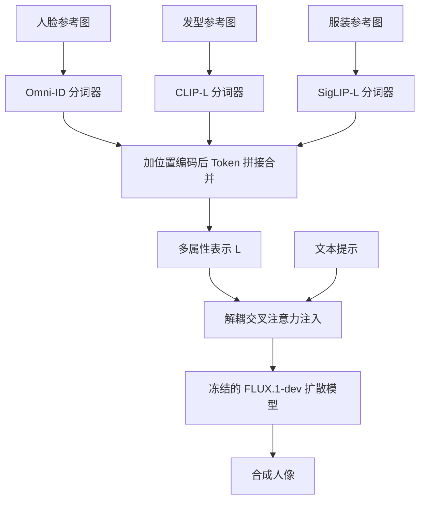

## 一句话总结

ComposeMe 提出"属性专属图像提示"（Attribute-Specific Image Prompts）的新范式，用不同参考图分别指定人脸、发型、服装，并通过多属性交叉参考训练实现解耦与自然合成，在冻结的文本到图像扩散模型上完成可控、可组合的高保真人像生成。

## 研究背景

大规模文本到图像（T2I）扩散模型让个性化生成成为可能，但现有方法大多把"一个身份"当作单一不可分的概念来处理，缺乏模块化能力：用户无法用来自不同来源的参考图，分别控制人脸、发型、服装等具体视觉属性并把它们无缝组合起来。

这种"整体身份"的处理方式带来两个问题。一是控制粒度不够，无法做到"这张脸 + 另一来源的发型 + 第三来源的服装"这类混搭；二是当强行把来自不同来源的图像提示拼在一起时，属性会与身体姿态、表情、头部朝向等混杂因素纠缠，导致生成结果出现拼贴式（collage-like）的不自然痕迹，同时削弱对文本提示的遵循度。作者希望构建一个既能分属性提供视觉参考、又能忠实自然地组合它们的框架，并将其自然扩展到单图多身份（Multi-ID）场景。

## 方法

### 整体框架

ComposeMe 把每个人物分解为若干可配置属性（人脸、发型、服装，$$K=3$$）。每个属性用一组专属参考图，经各自的分词器（tokenizer）编码为属性专属 token；这些 token 加上可学习的位置编码后简单拼接合并，再通过解耦交叉注意力（decoupled cross-attention）注入到冻结的预训练扩散模型中。训练上采用两阶段策略：先做复制粘贴预训练热身，再用多属性交叉参考微调来解耦纠缠、实现自然合成。

### 关键设计

1. 属性专属分词（Attribute-Specific Tokenization）：每个属性用专门的编码器捕捉其独特视觉特征——人脸用 Omni-ID、发型用 CLIP-L、服装用 SigLIP-L，再各接一个线性投影层 $$W_{a_i}$$ 把维度对齐到统一维度 $$D$$。这种以人为中心的设计相比 CLIP–CLIP–CLIP 等统一分词方案能显著提升各属性保真度。

2. 多属性与多主体合并（Multi-Attribute Merging）：先在属性维度做 token 拼接得到单个主体表示 $$L_e$$，再在主体维度拼接支持多身份，每一级都加入可学习位置编码 $$\mathrm{PE}$$ 以区分属性和主体。某属性缺省时用全零黑图的无条件嵌入代替。

3. 解耦交叉注意力注入：在原文本交叉注意力之外新增一组可学习注意力处理多属性表示，输出加权相加 $$Z_{out} = Attn_T + \lambda \cdot Attn_L$$，其中 $$\lambda \in (0,1)$$ 在推理时平衡视觉提示与文本提示的影响，训练时设为 1。注入仅作用于单流块（block 索引 19 到 56）。

4. 多属性交叉参考训练（Multi-Attribute Cross-Reference Training）：这是自然合成的关键。第一阶段用同一张图作输入与目标做复制粘贴预训练，属性保真高但合成僵硬；第二阶段从同一主体的多张不同姿态/表情图中，为每个属性采样不同来源图作为输入、另取一张作为目标 $$L = E(X \setminus X_s)$$，人为制造属性级与图像级的错位，迫使模型学会从错位输入生成自然对齐的输出，避免拼贴痕迹并提升文本遵循度。

## 实验结果

作者在多属性/单属性、单身份/多身份等多种设置下与 OmniGen、GPT-4o、PuLID、Omni-ID、InfiniteYou 等对比，用 FaceNet 衡量身份保持、CLIP 特征距离衡量发型与服装保持、HPSv2 衡量生成质量、CLIP-T 衡量文本遵循。主结果如下（↑ 表示越高越好）。

| Method | FaceNet ↑ | CLIP-Clothing ↑ | CLIP-Hair ↑ | CLIP-T ↑ | HPSv2 ↑ |
|---|---|---|---|---|---|
| **多属性-单主体** | | | | | |
| Ours | 0.6870 | 0.8526 | 0.8778 | 0.2843 | 0.2904 |
| OmniGen | 0.5496 | 0.7817 | 0.8450 | 0.2893 | 0.3001 |
| GPT-4o | 0.2992 | 0.8288 | 0.8430 | 0.2974 | 0.2967 |
| **单属性-单主体** | | | | | |
| Ours | 0.6881 | – | 0.8735 | 0.2877 | 0.3006 |
| PuLID | 0.7639 | – | 0.8720 | 0.2799 | 0.2783 |
| Omni-ID | 0.7873 | – | 0.8898 | 0.2688 | 0.2674 |
| InfiniteYou | 0.7788 | – | 0.8252 | 0.2909 | 0.2947 |
| **单属性-单主体-全身** | | | | | |
| Ours | 0.6845 | 0.8631 | 0.8745 | 0.2820 | 0.2888 |
| OmniGen | 0.6403 | 0.7980 | 0.8522 | 0.2900 | 0.3057 |
| GPT-4o | 0.6095 | 0.8355 | 0.8618 | 0.2921 | 0.2976 |
| InstantCharacter | 0.3301 | 0.8392 | 0.8322 | 0.2834 | 0.2856 |
| **单属性-多主体** | | | | | |
| Ours | 0.7161 | – | 0.8756 | 0.2821 | 0.3110 |
| OmniGen | 0.5650 | – | 0.8556 | 0.2820 | 0.3147 |
| StoryMaker | 0.7453 | – | 0.8692 | 0.2579 | 0.2283 |
| UniPortrait | 0.6555 | – | 0.8872 | 0.2560 | 0.2552 |
| MIP-Adapter | 0.3062 | – | 0.8529 | 0.2778 | 0.2670 |
| MS-Diffusion | 0.5078 | – | 0.8932 | 0.2463 | 0.2314 |
| UNO | 0.1799 | – | 0.8317 | 0.2774 | 0.2997 |

在生成质量与文本遵循上，ComposeMe 与 OmniGen、GPT-4o 相当；在多数设置下取得最高的身份保持。例外是单属性-单主体任务：作者指出该场景下先前方法倾向生成表情一致的人脸，恰好被 FaceNet 偏好，因而其 FaceNet 分数偏高。消融实验显示，去掉人脸/发型的交叉参考训练会削弱表情与头部姿态的文本对齐，去掉服装的交叉参考训练会引入姿态泄漏等伪影；分词方案上 Omni-ID–CLIP–SigLIP 的组合优于各类替代配置。

## 亮点与局限

亮点：
- 提出属性专属图像提示这一新范式，首次实现人脸、发型、服装可从不同来源图像混搭的解耦控制，并自然扩展到多属性多身份（Multi-Attribute Multi-ID）这一此前无解的场景。
- 多属性交叉参考训练巧妙地用"错位输入-自然目标"的配对，从根本上解决了拼贴式伪影和姿态泄漏，兼顾属性保真与自然合成。
- 方法在冻结的 FLUX.1-dev 上以轻量适配器实现，无需微调主干，训练成本相对可控（每阶段约 4 GPU-天，8×A100）。

局限：
- 属于闭集个性化方法，训练面向最多 2 个身份、3 个属性；扩展新视觉提示（如场景、配饰）需要额外微调或训练新适配器。
- 在整体图像质量和指标上与 GPT-4o 仍有差距，作者认为高质量数据微调与强化学习调优是可能的改进方向。
- 存在失败案例：当文本要求远景、生成人脸过小（小于图像 1% 面积）时会出现明显扭曲，源于训练数据过滤掉了小脸样本。

## 延伸思考

ComposeMe 的核心洞见在于把"个性化"从"整体身份注入"细化到"属性级组合"，这与人类对外观的直觉认知（脸、发、衣是可独立替换的维度）高度契合，为虚拟试穿、造型探索等模块化应用打开了空间。其"制造错位以学习解耦"的训练思路颇具启发性——纠缠往往来自训练时输入与目标同源，主动引入跨来源错位反而能逼出解耦能力，这一思想或可迁移到其他多条件生成任务（如物体、场景的组合式控制）。另一方面，方法依赖大规模内部数据（约 3200 万图、600 万身份）与专属分词器，可复现性和向开放属性集扩展的成本仍是现实挑战；小脸失败案例也提醒，数据过滤策略会直接决定可控生成的适用边界。
