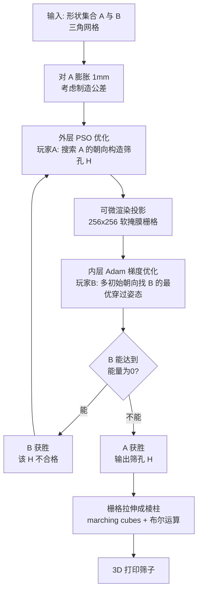

## 一句话总结

给定"应该通过"的形状集合 A 和"应该被拦住"的形状集合 B，本文把筛孔设计建模为一个两人零和博弈，并用可微渲染的梯度优化 + 粒子群优化（PSO）联合求解，自动算出一个能让所有 A 通过、拦住所有 B 的二维筛孔，并可真实 3D 打印制造。

## 研究背景

筛子是分离物体的古老工具：某些物体能穿过筛孔，某些则不能。机械工程界对筛子的研究主要关注物理层面（颗粒大小、重量、振动方式），而几何处理社区几乎没有系统研究过"筛孔的几何性质"这一问题。

本文只关注纯几何问题：一个二维孔洞具有什么性质，才能让某些三维形状在某个朝向下平移穿过、而让另一些形状无论如何旋转都无法通过？这与影子艺术（shadow art，给定二维轮廓求可投影出该轮廓的三维形状）、装箱问题（packing）、路径规划（path planning）等问题密切相关，但目标不同：这里要反过来找一个二维轮廓，使得指定的一批三维形状投影后能塞进去、另一批永远塞不进去。

作者形式化地引入了描述筛子的数学语言：筛孔 $$H \subseteq \mathbb{R}^2$$ 是一个单连通区域；若存在刚体变换 $$R \in SO(3), t \in \mathbb{R}^2$$ 使得投影 $$\mathrm{proj}(RM)+t \subseteq H$$，则称 $$H$$ 接纳 $$M$$。由此定义偏序关系 $$A \preceq B$$（任何接纳 $$B$$ 的筛孔也接纳 $$A$$），并证明它是一个偏序而非全序——存在既非 $$A \preceq B$$ 也非 $$B \preceq A$$ 的例子，这正是问题有趣且非平凡之处。

## 方法

整体框架：把筛孔设计写成两名玩家的博弈——玩家 A 想找一个筛孔 $$H$$ 让所有 $$A_i$$ 通过、所有 $$B_i$$ 被挡；玩家 B 则想为每个 $$B_i$$ 找到能穿过 $$H$$ 的刚体变换。该博弈是无限策略集上的两人零和博弈，可化为一个 maximin 优化问题：外层由 A 最大化"B 无法通过的投影面积"，内层由 B 最小化同一目标。

关键设计：

1. **两层优化分工**。内层最小化问题（玩家 B 找穿过姿态）用可微渲染 + Adam 梯度下降求解；外层最大化问题（玩家 A 找筛孔）用零阶的粒子群优化 PSO 求解。目标能量对形状相对大小敏感，因此用 $$\mathrm{area}(\mathrm{proj}(B'))$$ 归一化，把内层目标 $$\beta$$ 约束在 $$[0,1]$$ 区间。多个 $$B_i$$ 时取各自 $$\beta_i$$ 的最小值。

2. **可微渲染实现投影**。用 Kaolin 把每个网格的正交投影渲染成软掩膜栅格（边界处从 0 到 1 平滑过渡以保证可微），分辨率 256×256。面积由像素求和得到，区域交集 $$\mathrm{area}(G \cap H)$$ 用逐像素相乘实现，全程可微。这让方法对输入几何极其鲁棒——任何能渲染的三角网格都可处理，不要求流形性、连通性或水密性。

3. **多形状 A 的连通筛孔构造**。当 A 含多个形状时，简单地把各投影取并集可能造出反而接纳某个 $$B_i$$ 的孔。作者引入促进重叠的能量项（含 $$\tanh$$ 激活与惩罚孔面积 $$\alpha\,\mathrm{area}(H)$$ 的项，取 $$\tau=10,\rho=200,\eta=0.02,\alpha=5$$），并按投影面积从大到小逐个把 $$A_i$$ 叠加进 $$H$$，以更好保证最终筛孔单连通。

4. **面向制造的修正**。考虑摩擦与打印公差，对 $$A_i$$ 先膨胀（默认 1mm）再优化，而非事后扩张筛孔（后者可能误纳 $$B$$）；填充孔内浮空部件以保证单连通可打印；把筛子做得足够厚（至少为形状外接球直径），从而保证只能沿 $$z$$ 轴平移穿过、杜绝复杂的扭动穿越。

## 实验结果

论文的结果以定性展示（大量筛孔与实际 3D 打印件）为主，并系统地做了超参数消融，验证方法各组件的必要性。下表汇总了作者报告的消融：在一个 A 本应获胜的例子中，把某个超参数降到远低于默认值会导致错误结论（B 反而获胜）。

| 超参数 | 默认值 | 削减后取值 | 削减后结果 |
| --- | --- | --- | --- |
| PSO 粒子数 | 10 | 5 | 由"A 胜"退化为"B 胜" |
| B 的初始朝向数 | 10 | 3 | 由"A 胜"退化为"B 胜" |
| PSO 迭代次数 | 10 | 3 | 由"A 胜"退化为"B 胜" |
| Adam 迭代次数 | 100 | 5 | 由"A 胜"退化为"B 胜" |

此外，方法能为两个极其相似的机械零件构造出区分二者的筛子（无论哪个当 A）；也验证了"一个 A 挡多个 B"并不等价于逐个求解——存在能单独挡住 $$B_1$$、也能单独挡住 $$B_2$$，却无法同时挡住 $$\{B_1,B_2\}$$ 的情形。作者用 UltiMaker S5（PLA）与 Stratasys F370（ABS）打印筛子与形状，人工验证了接纳/拦截行为符合预期。

## 亮点与局限

亮点：

- 首次在几何处理视角下系统形式化"筛孔"问题，给出偏序关系等干净的数学语言，并证明其为偏序而非全序。
- 把设计问题优雅地转化为两人零和博弈的 maximin 优化，梯度法与 PSO 分层求解内外层，思路清晰。
- 基于可微渲染，对脏输入极其鲁棒（无需流形/水密/连通），并认真处理了膨胀公差、单连通、厚度等真实制造约束，做到了可打印可验证。

局限：

- 内层梯度优化与外层 PSO 都不保证找到全局最优，因此不能保证真的挡住所有 $$B$$；只能靠调大超参数缓解。
- "宣布获胜"的判定可能误判：$$B$$ 有时只被极小的余量挡住，实际打印后仍能通过（可通过提高栅格分辨率或放大网格缓解）。
- 假设形状只能沿 $$z$$ 轴平移穿过，仅当筛子足够厚时成立；薄筛子下被判"挡住"的形状可能通过复杂的平移加旋转穿过。
- 要求 $$A$$ 与 $$B$$ 都能可靠达到最优朝向，未建模真实筛分中"抖动 + 随机朝向接触"的物理过程。

## 延伸思考

- 未来若能结合具备理论保证的算法（例如对 $$SO(3)$$ 做可保证全局最优的空间划分，或引入 ICP 一类经典配准算法），有望把"B 一定无法通过"从经验判定升级为可证明的结论，这对工业分选的可靠性很关键。
- 把"沿 z 轴平移"放宽到允许 xy 平面平移与旋转的复杂穿越运动（类似路径规划/连续碰撞检测），能让薄筛子的设计更贴近现实。
- 引入抖动物理与朝向概率分布，将"必须精确对准"的理想假设替换为随机接触模型，才能真正对接厨房或工业筛分场景——这也是把纯几何成果落到实际应用的关键一步。
