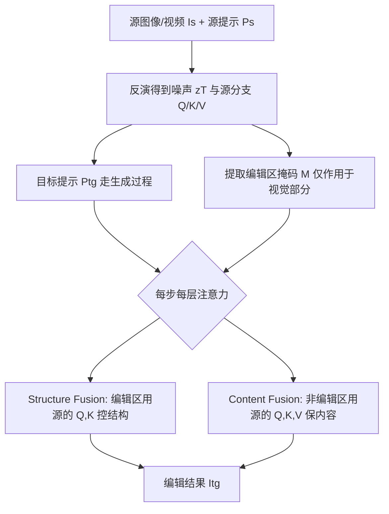

## 一句话总结

ConsistEdit 是一种专为 MM-DiT（多模态扩散 Transformer）设计的免训练注意力控制编辑方法，通过"只改视觉 token、全层全步生效、对 Q/K/V 分工控制"三招，在编辑区做到强编辑力与结构一致性兼得，同时严格保住非编辑区，并支持结构一致性强度的平滑调节。

## 研究背景

- 领域现状：免训练的注意力控制方法（如 Prompt-to-Prompt、MasaCtrl）通过操纵注意力中的 Q、K、V token，让预训练生成模型无需重训即可完成文本引导的图像/视频编辑，灵活高效。同时，底层架构正从 U-Net 转向 MM-DiT（如 SD3、FLUX、CogVideoX），后者把文本与视觉信息合并进同一套自注意力中处理，带来生成质量的显著提升。
- 核心痛点：现有方法有两大顽疾。其一，很难同时做到"编辑够强"与"与源图一致"——改颜色时编辑区结构会走样、非编辑区也被误改；这在多轮编辑和视频编辑里尤其致命，因为误差会随迭代和时间维度不断累积。其二，大多方法强制"全局一致性"，无法只改纹理而保结构（或反之），限制了精细化编辑。此外，绝大多数方法依赖人工挑选"在哪些推理步/哪些注意力层"施加控制，鲁棒性差；针对 MM-DiT 编辑的注意力机制此前几乎无人系统研究。
- 本文 idea：先系统剖析 MM-DiT 的注意力机制，提炼三条关键洞察，再据此设计专门适配 MM-DiT 的注意力控制策略，直接对症解决上述两大痛点。

## 方法

### 整体框架

ConsistEdit 完全运行在扩散推理过程中，不做任何训练或测试时优化。它采用"源重建 + 目标编辑"的双分支（共享同一套网络权重）：先把真实图像/视频按源提示反演（inversion）得到初始噪声与源分支的 Q/K/V，再让目标提示走一遍生成过程；在每一步、每一层的注意力计算前，用一个从源注意力图提取的掩码把编辑区与非编辑区分开，分别施加"结构融合"和"内容融合"，且所有替换只作用于 token 的视觉部分、文本部分保持目标不变。

### 关键设计

1. 三条 MM-DiT 洞察（方法的地基）：(a) **只改视觉部分至关重要**——干预文本 token 会导致生成不稳定，编辑只应作用于视觉 token；(b) **各层同等重要**——对 Q/K/V 视觉部分做 PCA 可视化发现，MM-DiT 不像 U-Net 有编码/解码分段，每一层都保有丰富语义，因此注意力控制必须施加到所有层（只改后半段会削弱结构控制甚至破坏生成）；(c) **Q、K 携带强结构可控性**——只对视觉部分的 Q、K 做控制即可实现强力的结构保持。

2. 视觉-only、全层全步的注意力控制：把控制限制在 token 的视觉部分（文本部分沿用目标），并在所有 block、所有推理步上生效。作者论证现有方法把 MasaCtrl/DiTCtrl 那套"只在后半段 block 编辑"的 U-Net 经验硬搬到 MM-DiT 会产生结构伪影，而全层视觉-only 控制才是稳健编辑的关键。这也让方法首次无需人工挑选"步/层"。

3. 结构融合（Structure Fusion）：把掩码混合操作提前到注意力计算之前（pre-attention fusion）。在编辑区，用源分支的视觉 Q、K 替换目标的对应部分以锁定结构；并定义一个一致性强度 $$\alpha$$，表示施加控制的步数占比——只在 $$t > (1-\alpha)T$$ 的时间步替换，从而平滑调节结构保持的强弱。这样既强制结构一致，又保留文本对外观/纹理的精确控制，实现结构与纹理的解耦。

4. 内容融合（Content Fusion）：在非编辑区，只用源的 Q、K 能保结构但会出现色偏，于是进一步把源的视觉 V 也用于非编辑区，达到最佳的高保真内容保持。最终形态是对编辑区用 $$\tilde{Q},\tilde{K}$$ 控结构、对非编辑区用源的 $$\hat{Q},\hat{K},\hat{V}$$ 全面保内容，编辑区的 V 则取自目标以承载新外观。

## 实验结果

在 PIE-Bench（700 个编辑对、10 类编辑）上评测，图像用 SD3、视频用 CogVideoX-2B，均为纯 MM-DiT 架构。指标包括 Canny 边缘图上的 SSIM（结构一致性）、非编辑区 PSNR/SSIM（背景保持）、以及整图与编辑区的 CLIP 相似度（语义对齐）。下表为"改颜色 + 改材质"结构一致任务的主实验对比（节选自原文，忠于原始数据）：

| 方法 | Canny SSIM↑ | 背景 PSNR↑ | 背景 SSIM↑ | CLIP 整图↑ | CLIP 编辑区↑ |
|------|------------|-----------|-----------|-----------|-------------|
| SDEdit | 0.6795 | 23.99 | 0.8697 | 26.59 | 22.80 |
| UniEdit-Flow | 0.8029 | 30.56 | 0.9554 | 26.55 | 22.59 |
| DiTCtrl | 0.8235 | 29.54 | 0.9632 | 26.63 | 22.97 |
| 本文 | 0.8811 | 36.76 | 0.9869 | 27.19 | 23.73 |

本文在所有指标上均取得最优，尤其背景 PSNR/SSIM 大幅领先，说明非编辑区保持极好。在与 RF-Solver、FireFlow 的结构一致性专项对比中，本文的 Canny SSIM 达 0.87 以上，而两个基线的指标接近"固定种子直接生成"，几乎无法保结构。消融实验证实：全 block 的视觉-only Q/K 替换优于"只换全部 token"或"只换后半段 block"；在非编辑区叠加 V token 的内容融合能进一步把背景 PSNR 从仅换 Q/K 的 24.32 提升到 38.85。此外方法可平滑调节一致性强度（高强度严格保结构、低强度允许改形状，纹理编辑始终稳定），并成功泛化到 FLUX.1-dev 与 CogVideoX-2B 视频编辑，支持重上色、重打光、动画、形变、材质替换等多种应用。

## 亮点与局限

亮点：

- 首个在 MM-DiT 上跨所有推理步与所有注意力层、无需人工调参的编辑方法，显著提升可靠性与一致性。
- 通过对 Q、K、V 的差异化控制实现结构与纹理解耦，既能做结构一致编辑（改色/改材质），也能做结构改变但身份保持的编辑（改形状）。
- 提供可平滑滑动的一致性强度旋钮，天然适合交互式/迭代式编辑界面。
- 强通用性：跨采样器、跨生成算法（rectified flow 与 diffusion）、跨模态（图像与视频），在 SD3、FLUX、CogVideoX 上均验证有效。

局限：

- 方法的编辑上限受底层 MM-DiT 生成模型能力约束，面对高复杂度或陌生场景时表现受限。
- 依赖反演与掩码提取质量；虽然作者用 noise-to-image 设置来隔离这一影响，但在真实图像编辑中反演误差仍可能传导。
- 视频编辑中静态图上不易察觉的微小不一致会被放大，对底层视频模型的时序一致性提出更高要求。

## 延伸思考

这项工作的核心价值在于把"针对具体架构做机制分析"当作方法设计的前提，而非把 U-Net 时代的经验直接套用到新架构上——三条 MM-DiT 洞察正是从可视化和对照实验中得来的，这提示后续在任何新生成骨干上做免训练编辑时，都应先重新审视其注意力/信息流结构。另一个值得追问的点是一致性强度作为连续旋钮的潜力：它把"结构保持"从二元选择变成可微调的谱系，若能进一步与区域级、属性级控制结合，可能催生更细粒度的交互式编辑范式。此外，方法对 Q/K 管结构、V 管内容的分工，本质上是对注意力语义角色的经验性拆解，能否给出更理论化的解释、或推广到多物体强遮挡与长视频场景，都是自然的下一步。
