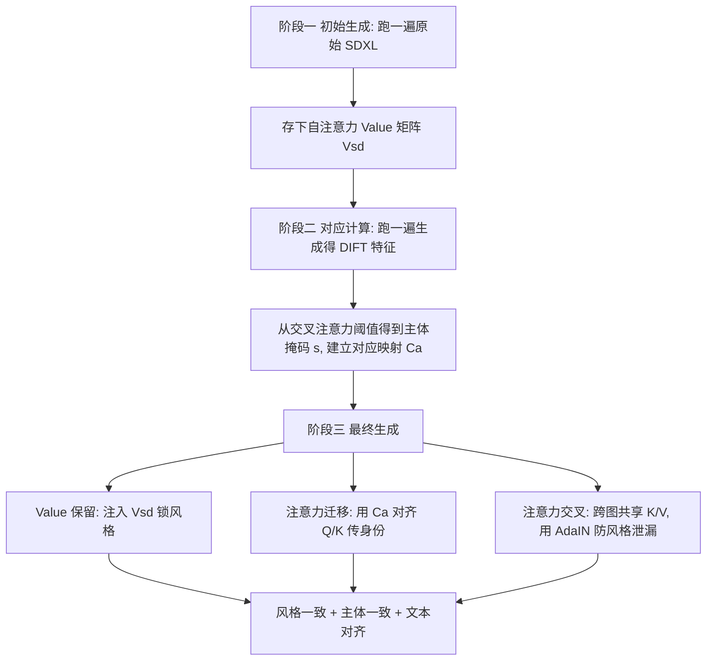

## 一句话总结

本文提出 ConsiStyle：一种无需训练的注意力操纵方法，通过把自注意力中的 Query/Key/Value 分开处理——用锚图定义主体身份、用并行的原始 SDXL 生成保留风格、再用自适应实例归一化（AdaIN）对齐 Value 统计量——首次在无训练前提下同时实现了主体一致性、风格保真与文本对齐，使同一角色能在多种差异极大的风格中保持一致。

## 研究背景

在漫画、动画、电影等视觉叙事中，同一个角色常常穿梭于风格迥异的世界：可能是超写实肖像、极简线稿，也可能是像素风的恶搞画面。人眼能识别这些不同风格下是同一个角色，但对生成模型而言，"保身份"与"变风格"是尖锐矛盾——因为风格本身就是外观的重要组成部分。

文本到图像扩散模型能从提示词生成高质量的风格化图像，但它们通常独立生成每张图，难以在多张图/多个提示间保持主体身份一致。作者指出有三个希望独立控制的因素：（i）与提示对齐的场景与设定，（ii）与提示对齐的图像风格，（iii）跨图的角色一致性。

已有方法只覆盖了其中的部分组合：

- 注意力共享类方法可在无训练下对齐风格，或把一张图中物体的外观迁移到另一张，但不解决身份一致性。
- 角色一致性被当作个性化问题（给定目标主体的一组输入图）或一致生成问题（只要求生成的主体在各图间固定）来研究。前者需要逐主体训练，后者可基于微调（退化为个性化）或无训练方法实现。
- 无训练方法能忠实对齐提示，却难以在多样风格下保持主体一致——因为风格与外观往往纠缠在一起。

核心难点在于：现有方法注入隐藏状态或跨图共享 Key/Value 时，会连带把风格（颜色、纹理）一起传过去。例如把一张彩色图的隐藏状态注入到灰度语境中，会导致意外的颜色迁移，破坏风格一致性。

## 方法

现代 T2I 扩散模型在 U-Net 层里嵌入 transformer 块，让潜空间的图块彼此关注。给定输入特征 $$X \in \mathbb{R}^{B \times N \times d}$$（$$B$$ 为批大小，$$N = H \times W$$ 为图块数，$$d$$ 为特征维度），自注意力用三个可学习线性投影得到 Query、Key、Value 矩阵，并用缩放点积计算：

$$
\text{Attention}(Q_i, K_i, V_i) = \text{softmax}\!\left(\frac{Q_i K_i^{\top}}{\sqrt{d}}\right) V_i
$$

ConsiStyle 的核心洞察是：Value 天然携带细粒度的纹理和颜色（即风格），而 Query/Key 更多编码结构与语义对应关系。因此应对三者区别对待——用 Query/Key 来对齐主体身份，用 Value 来锁定风格。整个流程分三个阶段（批内 $$B$$ 张图并行生成）：

### 阶段一：风格提取（Value 保留）

先用目标提示跑一遍原始 SDXL，在解码器最高分辨率 transformer 块（$$64 \times 64$$）记录自注意力的 Value 矩阵 $$V_{sd}$$。这些 Value 捕获了后续生成保持风格一致所需的细粒度纹理与颜色，充当"风格锚"。同时用交叉注意力图中匹配主体 token 查询的阈值得到主体掩码 $$s_1, s_2, \dots$$。

### 阶段二：对应计算

再跑一遍生成以计算 DIFT 特征，用于建立主体图块之间的对应映射 $$C_\alpha$$（把图 $$\alpha$$ 的主体图块映射到其他图的对应图块）。若有多个锚图，则取跨锚图中最相似的图块。这一阶段不做后面的 Q/K 修改（因为那需要 DIFT 给出的主体位置信息），但已应用注意力交叉以获得一定的主体一致性。

### 阶段三：迁移风格同时保持外观

只在早期扩散步骤（第 $$\frac{n}{10}$$ 到 $$\frac{3n}{10}$$ 步，$$n$$ 为总步数）对文本引导部分做 Query/Key 注入，并回注存好的 Value：

$$
K_i[s_i] \leftarrow K_a[C_a(s_i)]
$$

$$
Q_i[s_i] \leftarrow Q_a[C_a(s_i)]
$$

$$
V = V_{sd}
$$

其中 $$a$$ 为锚图索引。关键在于：只在早期步骤、只对主体图块交换 Query/Key（对齐结构与身份），而 Value 始终来自原始 SDXL（锁住各图各自的风格），从而避免了直接 Value 迁移带来的风格污染。

### AdaIN 保风格的注意力交叉

为了让主体收敛到同一结构，还引入"注意力交叉"：让 Query 能关注批内其他图的 Key 与 Value。但直接引入其他图的 Value 会造成风格污染（Value 携带纹理与颜色）。作者用自适应实例归一化（AdaIN）在跨主体注意力前规整 Value 的统计量——因为特征的统计分布正是风格的关键刻画，纹理常以这类统计量定义。AdaIN 算子定义为：

$$
\mathcal{A}(x, y) = \sigma(y)\left(\frac{x - \mu(x)}{\sigma(x)}\right) + \mu(y)
$$

其中 $$\mu(\cdot)$$、$$\sigma(\cdot)$$ 为均值与标准差。于是对 $$i \in [B]$$ 的注意力交叉为：

$$
V_i \leftarrow \left[\mathcal{A}(V_1[s_1], V_i), \cdots, V_i, \cdots, \mathcal{A}(V_n[s_n], V_i)\right]
$$

$$
K_i \leftarrow \left[K_1[s_1], \cdots, K_i, \cdots, K_n[s_n]\right]
$$

即把其他图主体的 Value 先按当前图的统计量做 AdaIN 归一，再拼接进来。仅归一化到常量会扭曲分布、改变风格；AdaIN 匹配统计量则能在传递语义内容的同时保留目标风格。这一 Value 处理策略正是 ConsiStyle 区别于 Consistory、Cross-Image Attention、StyleAligned 等方法的核心：其他方法多直接从锚图导入 Value（或注入隐藏状态），而 ConsiStyle 唯独对 Value 施以"对齐原始 SDXL + AdaIN 归一"的定向处理，是表中唯一同时具备身份目标、风格目标和提示忠实目标的方法。

## 实验结果

作者构造了 25 组提示（每组一个主体描述配十个不同提示），主体分为人类、动物、幻想生物、无生命物体四类；另有两组各含十种风格，组合后得到 500 张图、50 个独立集合，每个集合是 $$B = 10$$ 的批次且提示与风格互不重复。对比四个 SOTA 基线：无训练的 Consistory、编码器式 IP-Adapter、以及个性化训练的 DreamBooth-LoRA（DB-LoRA）与 Break-for-Make（B4M）。

指标包括：文本对齐用 CLIPScore（含/不含风格描述），主体一致性用去背景后的 DreamSim，风格对齐用 Gram 矩阵距离，感知相似度用 LPIPS 与 DINO。

在全数据集（500 样本）上的主要结果：

| 方法 | DreamSim↓ | CLIPScore↑ | CLIPScore Styled↑ | LPIPS↓ | Gram L2↓ | DINO↑ |
| --- | --- | --- | --- | --- | --- | --- |
| ConsiStyle（ours） | 0.40 | 32.84 | 36.03 | 0.21 | 1.25 | 0.85 |
| Consistory | 0.33 | 32.75 | 35.34 | 0.27 | 1.85 | 0.78 |
| IP-Adapter | 0.25 | 30.98 | 32.07 | 0.43 | 2.96 | 0.54 |
| DB-LoRA | 0.28 | 32.43 | 34.33 | 0.42 | 2.60 | 0.59 |

ConsiStyle 在提示对齐与风格对齐上超越所有基线。作者也指出一个关键局限：在风格多样的设定下，自动一致性指标（如 DreamSim）会过度惩罚风格变化，反而奖励那些缺乏风格多样性的"过度一致"输出——这解释了为何 DB-LoRA、IP-Adapter 的 DreamSim 更低（它们过拟合参考图、忽略风格）。

延迟方面：在 A100（40GB）、批大小 5 上，SDXL 与 IP-Adapter 每图 12 秒，Consistory 两趟共 24 秒，ConsiStyle 三趟共 36 秒；而训练类基线开销大得多——DB-LoRA 每主体约 10 分钟训练，B4M 单个主体-风格对高达 210 分钟。

由于自动指标只能部分反映人类感知（尤其变风格时的主体一致性），作者做了用户研究，对 Consistory、ConsiStyle、DB-LoRA 两两比较风格对齐、文本对齐、主体一致性三项：

| 问题 | 方法 A | 方法 B | A % | B % |
| --- | --- | --- | --- | --- |
| 风格 | DB-LoRA | Ours | 25.2% | 74.8% |
| 主体 | DB-LoRA | Ours | 64.5% | 35.5% |
| 文本 | DB-LoRA | Ours | 39.7% | 60.3% |
| 风格 | Consistory | Ours | 15.1% | 84.8% |
| 主体 | Consistory | Ours | 46.8% | 53.2% |
| 文本 | Consistory | Ours | 40.0% | 60.0% |

ConsiStyle 在风格对齐、文本对齐上大幅胜出，主体一致性也优于 Consistory；DB-LoRA 仅在主体一致性上更受偏好，但它常忽略风格与文本描述。

消融研究（六个变体）验证了各组件的必要性：给 Consistory 增加步数预算（75 步）并不显著改变其表现；去掉 Query 注入、Key 注入或两者都去，相似度分数变差（注意力注入正是为增强主体一致性）；用直接身份注入替代基于 DIFT 的主体映射会导致非主体区域特征泄漏、背景色调偏移、风格对齐退化；去掉 AdaIN 则因 Value 被直接跨图迁移而明显削弱风格对齐（Gram 指标骤降、出现可见伪影）。全模型在综合表现上优于所有消融版本。

## 亮点与局限

亮点：
- 首个无训练下同时解耦风格与身份、并保证提示对齐与跨风格主体一致的方法。
- 核心思想简洁而有效：Query/Key 管身份、Value 管风格，用原始 SDXL 的 Value 锁风格，用 AdaIN 在跨图共享时对齐 Value 统计量以防风格泄漏。
- 无需任何训练或逐主体优化，单次生成 36 秒即可完成，远快于训练类基线；还能实现图像和谐化，让角色自然融入风格化场景而非"贴图式"拼接。

局限：
- 当对应映射或交叉注意力掩码未能准确捕捉图间关系时，结果会次优。
- 对结构复杂的主体（如船、飞船等大型载具，或人物精细的面部/服饰）一致性会退化，尤其当各图对同一提示的初始诠释差异很大时（如把"船"分别生成为木帆船与现代游艇），有时需换种子缓解。
- 对高度独特的艺术风格（如 Papercraft Collage、Voxel Art 等小众 3D 美学）可能出现风格错配，因为这些风格带来的独特结构变形或夸张纹理挑战了作者所用的统计对齐技术。
- 生成图中的伪影主要源自基础模型：人工标注 400 样本显示轻微伪影在 SDXL/本方法/Consistory 中分别为 18.8%/20.0%/23.2%，严重伪影为 2.0%/2.2%/4.0%。

## 延伸思考

ConsiStyle 最值得借鉴之处，是把自注意力的三个分量按语义职责显式拆开——这是对"风格与内容纠缠"这一顽疾的一次干净的手术式解法。它揭示了一个可推广的原则：Value 是风格的载体，因此跨图共享时必须先做统计对齐（AdaIN）而非直接注入；Query/Key 承载结构对应，适合用来传递身份。这种分工也解释了为何以往注入隐藏状态的方法会连带迁移风格。

同时，论文对自动一致性指标"过度惩罚风格多样性"的观察是一个有价值的方法论提醒：在风格可变的一致生成任务里，DreamSim 这类指标会系统性偏向缺乏风格变化的输出，因此用户研究不可或缺。这也指向一个开放问题——如何设计出能在风格差异下正确度量"同一角色"的自动指标。至于对复杂结构主体和小众风格的失败，则提示统计对齐（AdaIN）虽轻量有效，但对带强结构变形的风格仍力有不逮，未来或需更结构感知的风格表示来补足。
