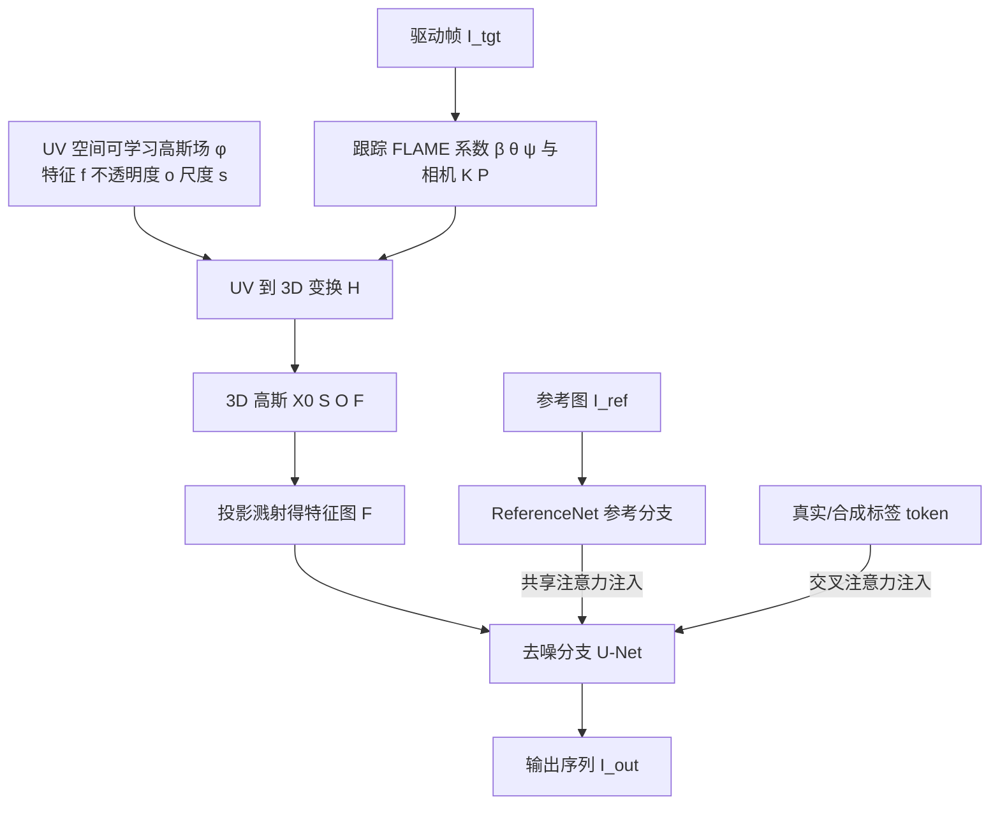

## 一句话总结

把一组可学习的神经高斯嵌入到参数化头部表面上，将其溅射（splatting）成稠密、自适应、3D 一致的特征图作为扩散模型的控制信号，并配合大规模合成头部数据集与真实/合成标签机制，实现了高保真、强表现力且视角一致的通用数字头像生成。

## 研究背景

基于扩散模型的数字人生成近年进展显著，但现有方法在 3D 一致性、时序连贯性与动作准确性上仍有明显短板。作者指出，问题根源在于常用控制信号的表达能力有限：

- 关键点（landmarks）过于稀疏，难以刻画细微的面部肌肉运动，也不能准确描述头部姿态。
- 深度图、法线图只表征特定几何属性，且天然依赖相机视角，本身不具备 3D 一致性；把这类不一致的信号喂给扩散模型，会进一步放大生成结果的不一致。

此外，公开数据集在身份多样性与姿态丰富度上不足（多数身份数少于 1000），限制了模型的泛化能力；用游戏引擎生成的合成数据又与真实数据存在真实感鸿沟。传统头部模型多采用"一对一"映射范式，而控制信号到渲染图像本质是"一对多"关系，这也制约了模型的表现力与泛化。

## 方法

### 整体框架

给定一张参考图像 $$I_{ref}$$ 和一段目标驱动序列 $$I_{tgt}$$，模型生成在动作上忠于 $$I_{tgt}$$、在身份上保持 $$I_{ref}$$ 的输出序列。核心流程：先对驱动帧跟踪 FLAME 系数，把 UV 空间中的可学习高斯变换到 3D 空间，再投影溅射成 2D 特征图作为控制信号，注入到参考引导的双分支扩散网络中去噪生成。

### 关键设计

1. 可学习高斯嵌入控制信号。仿照 FlashAvatar，在 FLAME 的 UV 域维护一个可学习高斯场，每个像素带有可学习特征 $$f$$、不透明度 $$o$$、尺度 $$s$$。经验发现各向同性高斯与各向异性效果相近，故简化为 $$g(x)=e^{-\frac{1}{2s}\lVert x-x_0\rVert_2^2}$$，省去四元数。UV 到 3D 变换后按 FLAME 网格形变，再按 $$F=\sum_m f_m\alpha_m\prod_{j=1}^{m-1}(1-\alpha_j)$$ 溅射为特征图。该信号具备四个优势：稠密（相较关键点）、自适应（与去噪网络联合优化）、富表现力（用高维神经特征而非颜色/球谐系数）、3D 一致（视角无关，天然利于一致性），且便于跨身份重演——只需把形状系数 $$\beta$$ 换成参考图的 $$\beta_{ref}$$。

2. 参考引导的双分支去噪。以 Stable Diffusion 为骨干，参考分支用与 SD 同架构的 ReferenceNet，通过多尺度共享注意力把参考图细节注入去噪分支；控制信号特征图经姿态引导网络下采样后加到 U-Net 编码器；并在每个块加时序层保证时序一致。仅用 v-parameterization 损失 $$L(\theta,\phi)=\mathbb{E}_{z_0,t,\epsilon}(\lVert v_\theta(z_t,C,z_{ref})-v\rVert_2^2)$$，无需直接监督特征图，高斯特征在去噪损失引导下自发演化为高表现力表示。

3. 大规模合成数据集 + 真实/合成标签。用 SphereHead 生成 10000 个身份、每个约 60 个视角（偏航 $$[-60°,45°]$$ 附近、俯仰 $$[-30°,45°]$$）的稠密姿态数据，并拟合 FLAME 估计相机与系数。由于合成图在耳朵、牙齿、眼镜等处存在瑕疵，引入两个可学习 token 区分"真实/合成"，注入交叉注意力；推理时只用"真实"标签，从而既利用合成数据的多样性又保住真实感。

## 实验结果

在 VFHQ 测试集上与网格法（ROME）、NeRF 法（Portrait4D-v2、VOODOO 3D）、3D 高斯法（GAGAvatar）及视频扩散法（Follow-Your-Emoji、X-Portrait）对比，自重演与跨重演均取得最优。

| 方法 | 自重演 PSNR ↑ | 自重演 SSIM ↑ | 自重演 LPIPS ↓ | 自重演 CSIM ↑ | 跨重演 CSIM ↑ | 跨重演 AED ↓ |
| --- | --- | --- | --- | --- | --- | --- |
| ROME | 25.77 | 0.878 | 0.132 | 0.610 | 0.426 | 0.242 |
| Portrait4D-v2 | 27.39 | 0.887 | 0.104 | 0.792 | 0.584 | 0.247 |
| VOODOO 3D | 22.10 | 0.856 | 0.152 | 0.499 | 0.357 | 0.250 |
| GAGAvatar | 26.58 | 0.886 | 0.117 | 0.810 | 0.599 | 0.247 |
| Follow-Your-Emoji | 26.39 | 0.878 | 0.111 | 0.792 | 0.432 | 0.388 |
| X-Portrait | 26.47 | 0.878 | 0.103 | 0.813 | 0.416 | 0.335 |
| Ours | 27.84 | 0.890 | 0.099 | 0.831 | 0.648 | 0.232 |

在更具挑战性的 NeRSemble 测试集上同样全指标领先（如自重演 PSNR 26.78、跨重演 CSIM 0.624）。新视角合成实验表明，给定单张参考图即可通过调整 FLAME 姿态参数在大姿态下生成视角一致的头像。消融实验显示：用关键点+法线图+深度图的基线难以准确还原表情与姿态；去掉合成数据集则大姿态生成失败；去掉真实/合成标签则合成数据的瑕疵会污染生成结果。

## 亮点与局限

亮点：
- 提出全新的头部控制信号——从可学习高斯溅射得到的特征图，同时满足稠密、自适应、富表现力、3D 一致，突破了关键点/法线/深度等传统视觉线索的表达瓶颈。
- 无需对特征图直接监督，高斯特征在去噪损失下自发学得语义丰富的表示，体现了控制信号的自适应本质。
- 用 SphereHead 合成万级身份、稠密视角的野外分布数据集，并以真实/合成标签巧妙规避合成瑕疵污染，兼顾多样性与真实感。

局限：
- 强依赖 FLAME 跟踪与 SphereHead 生成质量，合成数据在耳朵、牙齿、眼镜等区域的瑕疵需靠标签机制缓解而非根除。
- 论文主要在头部/面部重演任务上验证，向人体或更通用视频生成的扩展仍属未来工作。
- 采用两阶段训练且第二阶段冻结外观参数，训练流程较为复杂。

## 延伸思考

这项工作最具启发性的地方在于把"3D 可控表示"直接编码进扩散控制信号，而不是沿用 2D 视觉线索——这为解决扩散模型的一致性顽疾提供了一条通用思路。作者也明确指出，用可学习高斯嵌入增强扩散模型的范式不限于头部，理论上可推广到人体动画、通用视频生成等需要 3D 感知控制的场景。一个值得追问的方向是：当目标物体不像人头那样有 FLAME 这类成熟参数化先验时，如何构造等价的"可学习高斯 + 参数化表面"载体？此外，真实/合成 token 这种用离散标签隔离数据域偏差的做法，可能对更广泛的"合成数据增强 + 真实感保持"问题都有借鉴价值。
