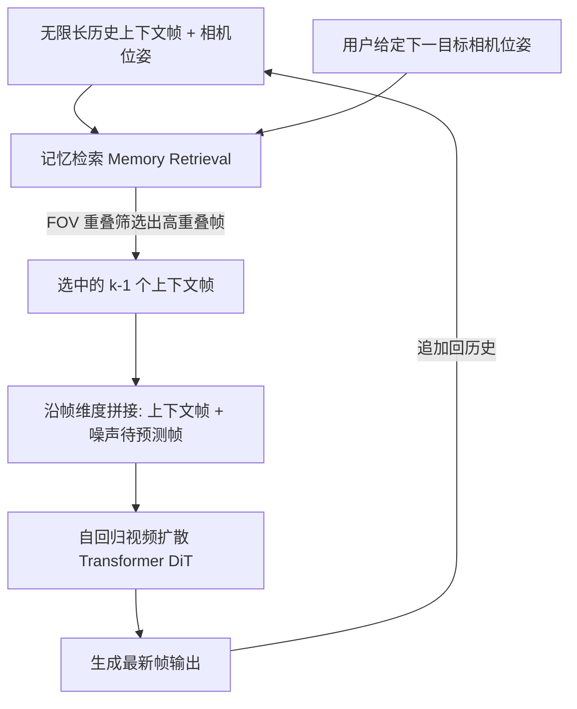

## 一句话总结

把已经生成的历史帧直接当作"记忆"，通过基于相机轨迹 FOV 重叠的检索机制挑出真正相关的上下文帧作为条件，实现场景一致的交互式长视频生成。

## 研究背景

交互式长视频生成在游戏、仿真等场景有广泛需求，视频以流式方式随用户交互不断生成。然而现有方法普遍缺乏"记忆能力"，即在连续生成过程中维持内容一致性的能力：当相机回到之前看过的位置时，场景往往已经完全变样。例如 Oasis 这类方法生成 Minecraft 视频时，简单的先左转再右转就会得到完全不同的场景。

根本原因在于：现有方法（如 Diffusion Forcing）生成每一新帧时只能参考固定窗口内的少量近邻帧，这对短期续帧有效，却无法维持长期一致性。理想情况下，若每一新帧都能参考所有历史帧，模型就能主动复用相关内容以保持场景一致。但"全部历史作为记忆"直接落地不现实：一是计算开销巨大；二是绝大多数历史帧与当前帧无关，处理它们浪费算力；三是无关帧还会引入噪声干扰生成。因此作者主张从历史上下文中检索少量相关帧作为条件，即"记忆检索"（Memory Retrieval）。

## 方法

### 整体框架

方法名为 Context-as-Memory，包含两个简单有效的设计：（1）存储格式——直接把生成的历史帧以帧的形式存为记忆，无需特征嵌入提取或 3D 重建等后处理；（2）条件注入方式——沿帧维度把上下文帧与待预测帧拼接作为输入，无需额外的控制模块（如适配器或交叉注意力）。为削减开销并只在真正相关的上下文上做条件，引入基于相机轨迹的记忆检索模块。

### 关键设计

1. **上下文帧学习机制**：待条件的干净上下文隐变量 $$z_c$$ 与带噪的待预测隐变量 $$z_t$$ 一同参与 DiT 块内的注意力计算，学习条件去噪器 $$p(z_{t-1} \mid z_t, z_c)$$。输出时只用预测噪声 $$\epsilon_\phi(\{z_t, z_c\}, p, t)$$ 更新 $$z_t$$，保持 $$z_c$$ 不变。这种沿帧维度拼接的方式天然支持变长上下文，优于只支持定长条件的通道拼接或适配器方案。

2. **位置编码处理**：为保留预训练全序列文生视频模型的能力，待预测隐变量沿用预训练阶段的位置编码，而新加入的上下文隐变量则分配新的位置编码。基座模型采用 RoPE，可方便地适配变长位置编码。

3. **基于相机轨迹的 FOV 重叠检索**：由于视频生成模型已引入相机控制，上下文帧带有用户提供的相机位姿标注，无需额外的位姿估计器。作者将相机运动限制在 XY 平面，因此只需考虑每个相机原点射出的左右两条射线，通过检查两相机四条射线的交点判断视场（FOV）是否重叠；再用预测帧相机到交点的距离过滤掉相机过远（重叠很小）的情况。若 FOV 过滤后帧数仍超限，则进一步策略筛选：从连续帧组中只随机选一帧（Non-adj，去冗余），并可补选时空上最远的少量帧（Far-space-time，补充长程信息）。

4. **数据集**：现有带相机位姿的数据集多为短片段，作者用 Unreal Engine 5 采集了 100 段各 7601 帧的长视频，含 12 种场景风格，每 77 帧由多模态 LLM 标注字幕；相机位置变化限制在 2D 平面、旋转仅绕 z 轴。

## 实验结果

在留出 5% 测试集上，用 FID/FVD 评估视频质量、PSNR/LPIPS 量化记忆能力，并设计两种评估：Ground Truth Comparison（从真值帧选上下文，评估预测帧是否匹配真值）与更具挑战性的 History Context Comparison（比较新生成帧与先前生成帧的一致性）。

| 方法 | GT PSNR↑ | GT LPIPS↓ | GT FID↓ | GT FVD↓ | HC PSNR↑ | HC LPIPS↓ | HC FID↓ | HC FVD↓ |
|---|---|---|---|---|---|---|---|---|
| 1st Frame as Context | 15.72 | 0.5282 | 127.55 | 937.51 | 14.53 | 0.5456 | 157.44 | 1029.71 |
| 1st Frame + Random Context | 17.70 | 0.4847 | 115.94 | 853.13 | 17.07 | 0.3985 | 119.31 | 882.36 |
| DFoT | 17.63 | 0.4528 | 112.96 | 897.87 | 15.70 | 0.5102 | 121.18 | 919.75 |
| FramePack | 17.20 | 0.4757 | 121.87 | 901.58 | 15.65 | 0.4947 | 131.59 | 974.52 |
| Context-as-Memory（本文） | **20.22** | **0.3003** | **107.18** | **821.37** | **18.11** | **0.3414** | **113.22** | **859.42** |

本文方法在所有指标上均最优。值得注意的是，只能利用近邻帧的 DFoT 与 FramePack 因相邻帧冗余，效果甚至不如随机选取上下文——随机虽不保证选到有用信息，但平均而言获取的信息比只看近邻更多。消融显示：上下文规模从 1 增至 30 记忆能力持续提升但速度下降，规模 20 是性能与速度（0.97 fps）的较优折中；检索策略上，FOV 与 Non-adj 的过滤带来显著提升，Far-space-time 影响较小。方法还能泛化到训练未见的开放域场景（用互联网图片作首帧，"转出再转回"轨迹下仍保持记忆一致）。

## 亮点与局限

亮点：
- 设计简单直接——历史帧原样存储、拼接注入，无需 3D 重建、外部适配器或交叉注意力模块，易于在预训练全序列文生视频模型上适配。
- 基于相机轨迹 FOV 重叠的规则式检索，用几何先验高效筛出真正相关的上下文帧，大幅降低候选帧数而信息损失小。
- 充足的上下文条件不仅增强记忆，还通过减少长视频中的误差累积提升了生成质量。

局限（作者自述）：
- 仅适用于静态场景，动态场景的记忆检索更具挑战。
- 复杂多遮挡场景（如相互连通的室内房间）中，FOV 重叠可能难以准确识别真正相关的帧。
- 长视频固有的误差累积问题仍存在，目前只能靠更大数据集、更多训练与更强基座模型缓解。

## 延伸思考

把"记忆"简化为可检索的历史帧集合，本质是用相机几何的显式先验替代了隐式的 3D 表征，绕开了 3D 重建的精度与速度瓶颈——这在持续扩张的大场景里尤其务实。但该思路强依赖已知且受限（XY 平面、绕 z 轴）的相机轨迹，一旦进入六自由度、动态物体或强遮挡场景，纯几何的 FOV 判据就会失效，此时或许需要结合可学习的相关性度量（如基于内容或语义的检索）来补足。另一个值得探索的方向是把"存原始帧"升级为"存可压缩且低损的记忆表征"，从而在不牺牲记忆能力的前提下进一步压小上下文规模、提升推理速度。
