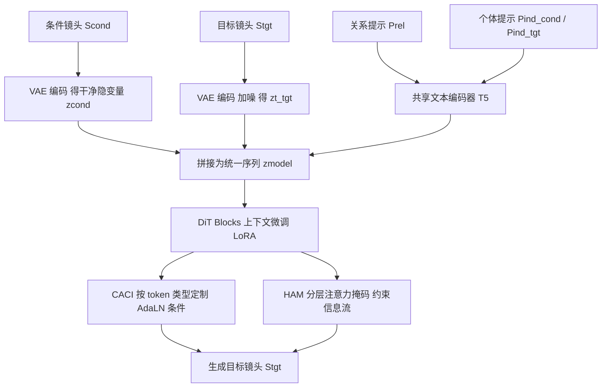

## 一句话总结

Cut2Next 提出"下一镜头生成（Next Shot Generation）"任务，并基于扩散 Transformer 用上下文微调（in-context tuning）与分层多提示策略，从给定的当前镜头出发生成既遵循专业剪辑范式（如正反打、切出、切入）又保持严格电影连贯性的后续镜头。

## 研究背景

视频生成在单镜头层面已经相当成熟，学界正转向由多个相互关联的镜头组成的叙事视频。已有的多镜头方法大致分两类：一类做故事板生成，先由文生图产出关键帧再动画化；另一类直接在大规模视频上训练多镜头模型。它们大多追求"长片、多样内容、基本一致性"，例如 IC-LoRA 利用 Flux 的上下文生成能力产出环境与人物一致的高分辨率故事板，SynCamMaster 合成多视角 3D 一致镜头。

但这些工作普遍忽视了专业叙事电影中最核心的概念——"剪辑（cut）"。在成熟影片里，切镜并非随意，而是承担明确的叙事功能：正反打（Shot/Reverse Shot）服务于对白与反应、切入/切出（Cut-In/Cut-Out）用于强调细节或回到大景、切出插叙（Cutaway）提供外部或主观语境、多机位（Multi-Angle）切换视角。这类序列传统上拍摄昂贵，需要逐个角度反复表演并重置场景与灯光。

作者据此定义新任务 NSG：给定一个已有镜头，生成一个高度连贯的后续镜头，既要维持人物与环境一致，又要遵循电影连贯性原则与特定剪辑范式。其难点在于双重张力——既要在人物身份、空间关系、光照色调、时间推进等多维度保持连续，又要按指定剪辑范式产出显著多样的视觉输出。

## 方法

### 整体框架

Cut2Next 建立在 FLUX.1-dev（一个 DiT 文生图模型）之上，通过参数无关的改造与轻量 LoRA 微调实现上下文微调。条件镜头 $$S_{cond}$$ 经共享 VAE 编码为干净隐变量 $$z_{cond}$$，目标镜头 $$S_{tgt}$$ 编码并加噪得到 $$z^{t}_{tgt}$$；分层多提示（关系提示 $$P^{rel}$$、条件个体提示 $$P^{ind}_{cond}$$、目标个体提示 $$P^{ind}_{tgt}$$）经共享文本编码器（T5）编码。所有文本与视觉 token 拼接成统一输入序列 $$z_{model}=\mathrm{concat}(c^{rel}, c^{ind}_{cond}, c^{ind}_{tgt}, z_{cond}, z^{t}_{tgt})$$ 送入 DiT，不引入任何新增参数。

### 关键设计

1. **分层多提示标注（Hierarchical Multi-Prompting）**：用 Gemini-2.0-flash 对每个镜头对自动标注两类提示。关系提示 $$P^{rel}$$ 描述两镜头间的场景/人物一致性、转场剪辑技法与整体语境；个体提示 $$P^{ind}$$ 对每个镜头单独给出内容描述与结构化摄影属性（景别、构图、机位角度、焦距等）。个体提示的细节部分在训练时按 20% 概率随机丢弃，以增强对不完整真实描述的鲁棒性。

2. **上下文感知条件注入（CACI）**：标准 Flux 用统一时间步 $$t$$ 调制 AdaLN-Zero，但本文输入是异构的——干净的 $$z_{cond}$$、带噪的 $$z^{t}_{tgt}$$、以及多种文本嵌入。CACI 按 token 角色定制条件：干净视觉 token 用 $$t=0$$ 并配以条件个体上下文；带噪目标 token 用扩散时间步 $$t$$；个体文本 token 与其视觉对应物同步时间步；关系文本 $$c^{rel}$$ 经验上用 $$t=0$$（初始 loss 更低），视作"初始干净上下文"的一部分。

3. **分层注意力掩码（HAM）**：一个预定义、不可学习的二值掩码，约束自注意力中的信息流。视觉 token（$$z_{cond}$$ 与 $$z^{t}_{tgt}$$）互相关注；个体文本仅与其对应视觉段互相关注、与其他文本及非对应视觉段互相屏蔽，避免交叉污染；关系文本 $$c^{rel}$$ 与两个视觉段跨模态交互以建立镜头间关系，但对个体文本屏蔽，保持文本独立性。

4. **两阶段数据与训练**：构建大规模 RawCuts（从 MovieNet 经镜头分割、运动/美学/画质/OCR/NSFW 过滤后配对相邻关键帧，超 20 万对）用于打基础，再人工精选高质量的 CuratedCuts 用于精修电影连贯性。先在 RawCuts 预训练 2 个 epoch，再在 CuratedCuts 微调 2500 步。

## 实验结果

在自建基准 CutBench 上，与改造自 IC-LoRA 的强基线 IC-LoRA-Cond 对比。评估视觉一致性（DINO / CLIP-I 相似度）、文本保真（CLIP-T）与感知质量（FID）。下表为主实验（表 1），箭头表示优劣方向：

| 方法 | DINO ↑ | CLIP-I ↑ | CLIP-T ↑ | FID ↓ |
|---|---|---|---|---|
| IC-LoRA-Cond | 0.4669 | 0.7152 | 0.2805 | 80.43 |
| Cut2Next (ours) | 0.4952 | 0.7298 | 0.2979 | 59.37 |

Cut2Next 在全部指标上领先：视觉连续性（DINO、CLIP-I）更高，文本保真更好，FID 由 80.43 显著降至 59.37。消融（表 2、表 3）显示两阶段训练与关系提示 $$P^{rel}$$ 都对提升视觉一致性关键——去掉 $$P^{rel}$$ 会使 DINO 从 0.4952 降到 0.4752，但 CLIP-T 略有反向（0.2979 对 0.2984），提示视觉连贯与文本保真间存在细微权衡。CACI 消融（图 7）表明其比同步条件注入收敛更快、loss 更低。15 名参与者的用户研究（表 4）中，Cut2Next 在电影连贯性上偏好率 93.7%、剪辑范式遵循度上 96.5%，压倒性优于基线。

## 亮点与局限

亮点：
- 提出并形式化了"下一镜头生成（NSG）"任务，明确把专业剪辑范式与电影连贯性作为目标，而非仅追求基本视觉一致。
- 分层多提示 + CACI + HAM 三者配合，在不新增基座模型参数的前提下，把关系语境与逐镜头摄影属性有机注入 DiT。
- 构建了 RawCuts、CuratedCuts 两级数据集与 CutBench 评测基准，为该任务提供了配套资源。

局限：
- 聚焦以人为中心的经典剪辑范式，因而局限于人物场景。
- 为保证关键帧质量过滤掉了高运动镜头，故难以生成动作序列。
- 长程连贯仍是挑战：朴素自回归方式因剪辑切镜带来的大幅视觉跳变会导致人物身份丢失。

## 延伸思考

Cut2Next 的核心启发在于：把"如何切镜"这一原本靠导演与剪辑师经验驱动的高层语言，显式建模为可提示、可训练的条件信号，并用注意力掩码把不同层级的语义精确路由到对应视觉段。这种"分层提示 + 结构化注意力"的思路，或可迁移到其他需要区分全局关系与局部细节的多模态生成任务。另一方面，作者坦言的长程连贯与动作序列缺失，恰恰指向下一步的关键：如何把单步的下一镜头生成扩展为可自回归、可跨越大幅视觉跳变仍保持身份的多镜头链，可能需要引入显式的角色记忆或跨镜头身份约束。此外，训练数据依赖 Gemini 自动标注与 MovieNet 影片，其标注偏差与影片风格分布对模型审美取向的影响也值得关注。
