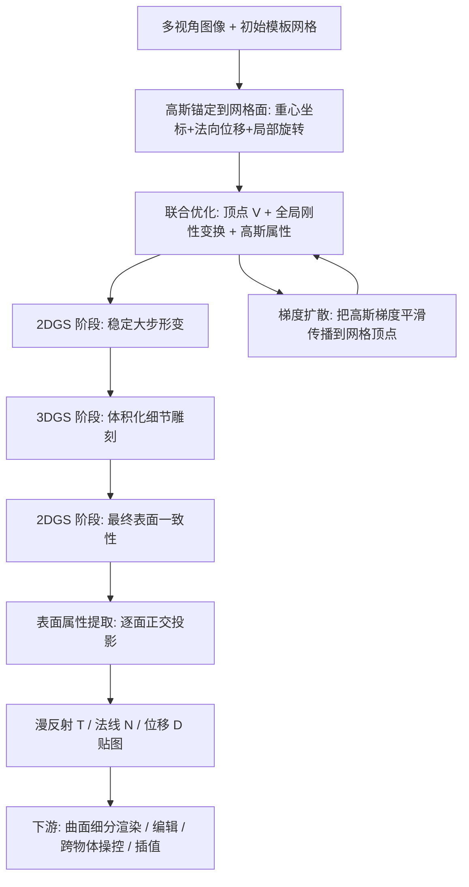

## 一句话总结

本文提出 DeMapGS，把 2D/3D 高斯泼溅锚定到一张可形变的模板网格表面，联合优化网格顶点与表面高斯属性，实现大幅度网格形变与高保真几何重建，并从优化后的高斯中直接提取漫反射、法线、位移贴图，让重建网格继承高斯泼溅的照片级渲染质量，同时支持编辑、跨物体操控等下游应用。

## 研究背景

从多视角图像重建高质量网格对计算机视觉、扩展现实与机器人等应用至关重要。NeRF 与 3D Gaussian Splatting（3DGS）等可微渲染方法带来了高保真图像合成能力，也被越来越多地用于形状重建，但它们得到的表示往往是非结构化或隐式的：难以提取精确的表面几何、难以强制拓扑一致性，且从体密度场或泼溅点云中提取网格通常要靠 marching cubes 等稠密后处理，计算开销大、产出的网格质量还低于渲染结果。

一类工作把高斯泼溅附着到网格表面以引入几何结构，从而支持结构化动画、编辑与更快的渲染，但这些方法中网格通常只是**静态锚点**，不被直接优化；另一类方法在训练中优化网格几何，却只允许相对初始网格的**微小偏移**。这就留下了一个空白：能否既支持网格的大步形变、又能联合优化高斯参数，同时保证最终网格满足高斯泼溅的视觉保真度？

本文正是针对这一空白，提出一个结构化高斯泼溅表示。可形变表面保留了网格拓扑，从而天然支持动画、编辑与跨物体操控；其关键创新之一是**表面对齐的属性提取**流程，把高斯中的几何与光度属性蒸馏成高质量的漫反射、位移、法线贴图，使显式表面表示能直接接入 mipmap、GPU 曲面细分、多分辨率渲染等标准图形管线，也能导入 Blender 或游戏引擎复用。

## 方法

给定模板网格（顶点 $$V=\lbrace \boldsymbol{v}_i \rbrace$$、面 $$F=\lbrace \boldsymbol{f}_j \rbrace$$）与多视角图像 $$I=\lbrace I_l \rbrace$$，方法联合优化网格形变与一组附着在表面的高斯 $$G=\lbrace \boldsymbol{g}_k \rbrace$$：

$$
(\hat{V}, \hat{G}) = \arg\min_{V,G} \mathcal{L}(V,F,G,I,\Pi), \quad \mathcal{L}=\mathcal{L}_{photo}+\mathcal{L}_{ssim}+\mathcal{L}_{reg}+\mathcal{L}_{normal}+\mathcal{L}_{dist}
$$

其中顶点数 $$N_V$$、面数 $$N_F$$ 固定，而高斯数量 $$N_G$$ 按 3DGS 的自适应稠密化策略变化。每个高斯沿用 3DGS 参数化 $$\boldsymbol{g}_k=(\boldsymbol{p}_k,\boldsymbol{q}_k,\boldsymbol{s}_k,o_k,\boldsymbol{c}_k)$$，在交替优化中 2DGS 省略 $$\boldsymbol{s}_k$$ 的第三分量。最终从优化模型中提取贴图 $$\Gamma:(\hat{V},F,\hat{G})\to(T,D,N)$$。

### 关键设计 1：可形变表面上的高斯参数化

每个高斯 $$\boldsymbol{g}_k$$ 附着到某个面 $$\boldsymbol{f}_{<k>}$$，其中心用该面（经全局变换后）三个顶点的重心坐标 $$\boldsymbol{\beta}_k$$ 加上沿面法线 $$\boldsymbol{n}_{f<k>}$$ 的位移 $$d_k$$ 表示：

$$
\boldsymbol{p}_k = \sum_{m=1}^{3}\beta_{k,m}\boldsymbol{v}'_{\boldsymbol{f}<k>,m} + d_k \boldsymbol{n}_{\boldsymbol{f}<k>}
$$

其中 $$\boldsymbol{\beta}_k$$ 与 $$d_k$$ 均可优化，面法线每次迭代随顶点更新重算，优化后的位移值导出位移贴图 $$D$$。旋转在世界系下用面坐标系表达：以局部旋转 $$\bar{\boldsymbol{q}}_k$$ 与面旋转 $$\boldsymbol{q}^f_{<k>}$$ 组合得到 $$\boldsymbol{q}_k=\bar{\boldsymbol{q}}_k\otimes\boldsymbol{q}^f_{<k>}$$（$$\otimes$$ 为四元数 Hamilton 积），优化的是 $$\bar{\boldsymbol{q}}_k$$，从而把每个高斯的旋转直接解释为法线贴图 $$N$$ 的分量；不透明度 $$o_k$$ 与颜色 $$\boldsymbol{c}_k$$ 共同充当漫反射贴图 $$T$$。此外还联合优化一个全局刚性变换 $$\boldsymbol{v}'=\boldsymbol{S}^*R(\boldsymbol{q}^*)\boldsymbol{v}+\boldsymbol{t}^*$$ 以增强对初始模板网格尺度/朝向/位置差异的鲁棒性。

针对高斯梯度导致的切向漂移（walk-on-triangles，高斯漂出所属三角形），提出轻量三步策略：把变负的重心坐标截断为零、对剩余坐标重新归一化、把高斯重新分配到跨越被截断顶点对边的相邻三角形，从而避免额外的投影 MSE 损失开销。

### 关键设计 2：2D-3DGS 交替优化

2DGS 把高斯当作 3D 空间中的薄椭圆片，能计算精确的射线-高斯交点，从而得到准确的逐像素深度与法线，支持法线一致性损失 $$\mathcal{L}_{normal}$$ 与深度畸变损失 $$\mathcal{L}_{dist}$$；其表面感知梯度会推动锚定高斯的网格面而非高斯厚度，适合早期需要稳健大步顶点移动的粗对齐。但 2DGS 的位置梯度被约束在垂直于视线的平面内，当高斯位于凹陷区域、仅在近乎正交视角才可见时，梯度缺少沿表面法线方向的分量，难以把高斯推入凹陷深处。相比之下，3DGS 提供全方向位置梯度：沿相机射线平移 3D 高斯会因投影协方差对相机空间逆深度的非齐次依赖而改变，梯度不会塌缩到固定平面（附录给出正式证明）。

于是采用三阶段流程：（1）2DGS 做稳定的大尺度形变；（2）3DGS 做细节体积化雕刻；（3）2DGS 做最终表面一致性收敛，末阶段施加法线与深度畸变损失以得到物理合理的收尾。

### 关键设计 3：梯度扩散

网格引导框架把梯度导向固定拓扑的顶点。顶点更新为 $$\boldsymbol{v}_i \leftarrow \boldsymbol{v}_i + \Delta\boldsymbol{v}_i + \Delta\boldsymbol{m}_i$$，其中原始梯度由所属面上各高斯按重心权重聚合：

$$
\left(\frac{\partial \mathcal{L}}{\partial \boldsymbol{V}}\right)_{[i]} = M^{-1}\sum_{\boldsymbol{g}_k \in G_{<\boldsymbol{v}_i>}}\beta_{k,i}\frac{\partial \mathcal{L}}{\partial \boldsymbol{p}_k}
$$

为把局部高斯梯度平滑传播到整张网格，借鉴大步梯度扩散思想，在优化前先做类似热扩散的平滑：

$$
\Delta\boldsymbol{v}^*_i = -\eta\left((\boldsymbol{I}+\lambda_l \boldsymbol{L})^{-2}\frac{\partial \mathcal{L}}{\partial \boldsymbol{V}}\right)_{[i]}
$$

其中 $$\boldsymbol{L}$$ 是网格的 Laplacian 矩阵，$$\lambda_l$$ 控制正则强度；这引出每个顶点按扩散权重 $$w_{i,l}=\big((\boldsymbol{I}+\lambda_l\boldsymbol{L})^{-2}\big)_{[i,l]}$$ 汇聚其他顶点梯度的分层更新，权重随测地距离衰减。

由于该步骤不直接正则化位移参数 $$d_k$$，位移若激进更新会使顶点滞后、造成网格几何与高斯位置不一致。为此引入**顶点重对齐**：为每个顶点计算目标位置 $$\hat{\boldsymbol{v}}_i=\frac{\sum_{\boldsymbol{g}_k\in G_{<\boldsymbol{v}_i>}}\beta_{k,i}\boldsymbol{p}_k}{\sum_{\boldsymbol{g}_k\in G_{<\boldsymbol{v}_i>}}\beta_{k,i}}$$（邻近高斯中心的加权平均），再把该拖拽力扩散到邻近顶点：$$\Delta\boldsymbol{v}^+_i = M^{-1}\big((\boldsymbol{I}+\lambda_l\boldsymbol{L})^{-2}(\hat{\boldsymbol{V}}-\boldsymbol{V})\big)_{[i]}$$。此步每 50 次迭代执行一次、开销可忽略，能让顶点在强曲率区域与演化中的高斯几何保持同步。

### 关键设计 4：表面属性提取与加速

优化后，把形变网格每个三角面当作局部正交投影面（类似屏幕空间的图像平面）。对面上任一 texel，按重心插值得到 3D 位置 $$\hat{\boldsymbol{p}}_{(j)}$$，沿面法线投射射线与高斯平面求交得到局部 2D 坐标 $$\hat{\boldsymbol{x}}_{(j),k}$$，再用 2D 高斯核算出该 texel 的 alpha 贡献 $$\alpha_{(j),k}=\exp\!\big(-\tfrac{1}{2}(\hat{x}^2_{(j),k,[1]}+\hat{x}^2_{(j),k,[2]})\big)\cdot o_k$$，通过体积渲染得到该 texel 的位移、法线、颜色。

为缓解 3DGS 对高频纹理与 SH 视角相关颜色带来的不一致，追加轻量**纹理精化**：把 texel 的 UV 映射到 3D 表面点并施加位移得到形变位置 $$\hat{\boldsymbol{p}}^*=\hat{\boldsymbol{p}}+d\boldsymbol{n}$$，重投影到图像空间，用重投影深度与泼溅渲染深度之差（阈值 $$D_{th}=0.01$$）判可见性，对可见 texel 用其与真值图像颜色的 $$\ell_2$$ 损失优化颜色，仅需少量迭代即可跨视角一致。贴图光栅化上以每面一个线程块并行处理：块内加载锚定到该面及三跳内邻面的高斯，存入共享内存并按深度降序排序，逐 texel 求交并做前到后的体积 alpha 混合。

## 实验结果

两组实验评测 DeMapGS。**Sketchfab 3D 扫描**（CC-BY，bust 为 CC-BY-NC）：每场景在 Blender 渲染 100 张图，80 训练 20 测试，用细分立方体作为初始模板；**ActorsHQ 数据集**：用单一静态姿态的 160 视角训练，以估计姿态初始化的 SMPL-X 作为初始模板，并用 Sapiens 得到的参考法线图作为 $$\mathcal{L}_{normal}$$ 监督。由于方法输出位移贴图可用于曲面细分渲染，评测时把网格均匀细分两次（三角形数 ×16，等效 tessellation level 4）记为 Ours-s，运行时动态细分记为 Ours-d。

几何质量上，用 Chamfer 距离（CD1、CD2）评局部几何保真、L1 Sinkhorn 距离（SD）评全局分布对齐。对比分两类：重建类（SuGaR、2DGS、GOF、DG-Mesh）与形变类（NRICP、Point2Mesh、GaMeS）。形变类基线跨场景表现不稳定，重建类（尤其 2DGS）更一致；本文虽属形变类方法，却显著超越所有形变类基线，并在多数场景达到与 2DGS 相当的几何精度。唯一例外是 cat 场景略逊，因其高度凹陷区域难以靠表面形变到达。

| 方法 | 类型 | CD1+CD2 表现 | 备注 |
| --- | --- | --- | --- |
| 2DGS | 重建 | 强 | 逐顶点颜色，渲染偏模糊 |
| SuGaR | 重建 | 中 | 极稠密网格+UV 纹理，几何常有噪声/伪影 |
| GaMeS / NRICP / Point2Mesh | 形变 | 弱且不稳定 | 跨场景表现波动大 |
| Ours-s / Ours-d | 形变 | 最优的形变类，媲美 2DGS | 兼顾几何与高质量贴图 |

渲染性能上（OpenGL，1080×1080）：2DGS 因逐顶点颜色渲染质量偏低；SuGaR 用超稠密网格与 UV 纹理获得高视觉质量但几何常带噪声伪影。本文在质量相当的同时效率显著更高，Ours-s 的 FPS 约为 SuGaR 的 4 倍；Ours-d 因实时曲面细分略慢，但仍快于 SuGaR。在 ActorsHQ 上，因初始模板已与目标较好对齐，法线贴图与位移驱动的曲面细分对恢复关节、高曲率处的褶皱与细纹至关重要。

消融（CD1+CD2 求和）表明：去掉梯度扩散（w/o Diff）性能下降最大，凸显其把监督跨表面传播的关键作用；去掉 3DGS 阶段（尤其同时移除末阶段 2DGS 正则的 w/o 3DGS∗）明显变差；去掉顶点重对齐（w/o Align）在高曲率处产生局部错位；去掉位移贴图或曲面细分也会损失细节。

## 亮点与局限

亮点：
- 提出可同时支持网格**大步形变**与高斯参数联合优化的结构化高斯泼溅表示，弥补了"网格仅作静态锚点"与"仅允许微小偏移"两类方法之间的空白。
- 梯度扩散策略把局部高斯梯度平滑传播到固定拓扑网格，实现大步且规则的顶点更新，是性能提升的关键；配合顶点重对齐保证网格与高斯几何同步。
- 2D/3DGS 交替渲染兼顾表面对齐监督（法线）与全方向体积梯度（凹陷区域），并从理论上分析了 2D 位置梯度塌缩到视线垂面的问题。
- 表面对齐属性提取直接从高斯蒸馏出漫反射/法线/位移贴图，产出兼容标准图形管线（mipmap、GPU 曲面细分、Blender、游戏引擎）的显式表示，天然支持表面级编辑、跨物体操控与物体间插值。

局限：
- 缺乏拓扑灵活性：框架依赖固定的网格模板，无法改变拓扑，难以应对更复杂的形变与几何变化。
- 高度凹陷区域仍难以靠表面形变充分到达（如 cat 场景几何精度略降）。
- 对初始模板与其对齐程度有一定依赖：ActorsHQ 上因 SMPL-X 模板已较好对齐才获得高质量细节，且腋下等原始数据纹理覆盖缺失处会出现轻微纹理噪声。

## 延伸思考

DeMapGS 的核心价值在于把"非结构化高斯"与"结构化可形变网格"通过表面参数化统一起来，让高斯泼溅的照片级外观能够落到可编辑、可复用、可接标准管线的显式网格资产上。梯度扩散把逐高斯的稀疏监督在网格上做 Laplacian 平滑传播，这一思路对任何"点/片元锚定在可形变几何上"的联合优化都有借鉴意义。作者指出的拓扑自适应扩展是最自然的下一步——若能在优化中允许拓扑变化（如凹陷区域的开洞或分裂），将突破固定模板的表达上限；此外，纹理精化步骤与任意可微反射模型兼容、可恢复反照率等本征属性，暗示了向 PBR 材质提取、重光照方向延伸的空间。
