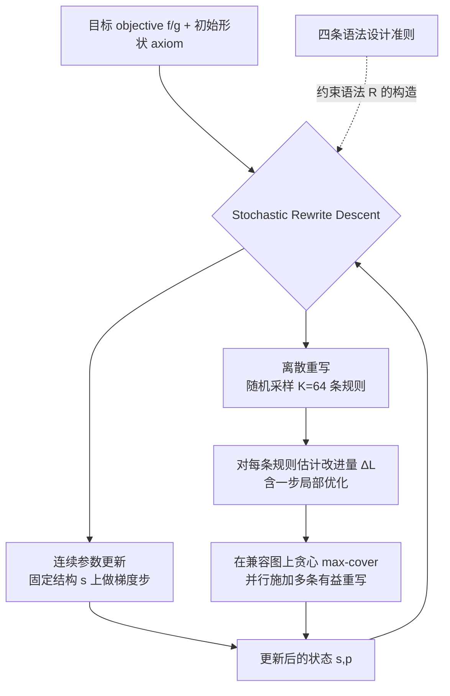

## 一句话总结

与其为固定语法设计复杂搜索算法，不如反过来问"什么样的形状语法本身就适合梯度下降"，本文提炼出四条语法设计准则，并配套一个在离散重写与连续参数之间交替下降的优化器 SRD，把结构化表示上的逆向设计变成简单的梯度迭代。

## 研究背景

程序化建模（procedural modeling）能用简洁的形状语法生成丰富多样的形状，但长期难题是"控制"：给定一个目标，如何找到能生成它的产生式规则序列。这是一个混合离散-连续的逆问题，离散结构空间复杂，传统上只能依赖手工设计的、领域专用的搜索算法（如 MCMC、进化算法、神经引导搜索）。

与此同时，基于梯度的黑盒优化在机器学习等高维非凸问题上极为成功——写下目标函数、迭代下降即可求解。作者的核心洞见是把惯常视角反过来：不是先固定语法再设计搜索算法，而是问"什么样的语法天生适合梯度下降"。这把关注点从算法转移到语法设计本身，从而可以主动构造出更易优化的语法。

难点有两方面：一是参数梯度虽好算，但规则应用（rewrite）构成的巨大组合空间会改变参数的数量与含义；二是即便有了好的优化算法，在设计不当的语法上做下降往往会陷入坏的局部极小，或爆炸成无意义的形状。

## 方法

整体框架分两层：一层是"如何设计对下降友好的语法"（四条准则），另一层是"如何在这种语法上做优化"（SRD 算法）。

优化问题形式化为：在离散结构 $$s\in S$$ 与随结构变化的连续参数 $$p\in\mathbb{R}^{d(s)}$$ 上，求 $$(s^*,p^*)=\arg\min\; f(I(s,p))+g(s,p)$$，其中 $$I$$ 是可微渲染函数，$$f$$ 为可微目标，$$g$$ 为不可微目标（如简洁度）。设计空间是所有维度可能不同的参数空间的无交并 $$X=\bigsqcup_{s\in S}\{s\}\times\mathbb{R}^{d(s)}$$。

关键设计如下。

一、四条语法设计准则（本文的核心贡献）。
- 可达性 → 可逆性（Reversibility）：若存在规则 $$A\to B$$，就应存在互补规则 $$B\to A$$。构造式语法只能从公理逐步搭建，无法删除已有基元，导致错误无法纠正；可逆性让优化器能细粒度地增删修正。
- 连续性 → 跳跃连续（Jump Continuity）：施加规则对形状本身的瞬时改变应可忽略，即 $$\lvert I(x,p)-I(\rho(x,p))\rvert<\epsilon$$。这让结构切换时目标近似连续，可类比 Lipschitz 连续，使优化平滑推进。
- 避免坏极小 → 局部几何控制（Local Geometric Control）：应存在规则能在形状任意局部做改动而不影响远处。这带来"过参数化"，让任一目标解有多种参数配置、多条改进轨迹，降低陷入局部极小的风险。
- 约束满足 → 可修复性（Repairability）：若存在硬约束，应有规则把违反约束的设计以最小改动投影回可行集，从而允许优化过程临时越界、事后再修复。

作者还给出理论说明：对图灵完备、词问题不可判定的形状语法，不可能要求目标关于重写变成凸的（附录 Thm. A.1），因此转而借鉴 SGD 在高度非凸地形上的成功经验。

二、SRD（Stochastic Rewrite Descent）优化器。在固定结构内做常规梯度步 $$p\leftarrow p-\eta\nabla_p f(s,p)$$；离散重写时随机选 $$K=64$$ 条有效规则，对每条用一步局部优化估计改进量 $$\Delta\mathcal{L}_\rho\approx\mathcal{L}(s,p)-\mathcal{L}(s',\hat p)$$，理想上施加所有改进为正的规则，但因规则间可能互斥，改为在邻域隐式定义的兼容图上做贪心 max-cover 并行施加。

三、三个案例语法。作者据准则改造出三个语法：Tree（受 L-system 启发的向上生长二叉树，节点带渲染叶片）、Arc-Line（由直线与圆弧组成的多闭环 2D 草图，用缠绕数判断内外）、Union-Rect（多个可旋转缩放矩形的并集）。每个语法都配套了 Split/Merge、Add/Remove、以及修复类重写。

## 实验结果

在图像匹配任务上，用不同 Tree 语法变体（逐步加入四条准则对应的重写）以及 Arc-Line、Union-Rect 变体，评估优化质量（PSNR，越高越好）与简洁度（基元数量，越少越好），数据集为 OneComp（One）、Donut（Dnt.）、TwoComp（Two）。

| 语法 | 描述 | PSNR One | PSNR Dnt. | PSNR Two | 基元 One | 基元 Dnt. | 基元 Two |
|------|------|------|------|------|------|------|------|
| Tr-1 | AddLeaf*（近似 L-system，不满足任何准则） | 15.4 | 9.7 | 10.3 | 155 | 93 | 45 |
| Tr-2 | + RemoveLeaf*（可逆性） | 15.4 | 9.7 | 10.3 | 145 | 86 | 42 |
| Tr-3 | AddLeaf + RemoveLeaf（跳跃连续） | 21.5 | 21.1 | 11.4 | 182 | 195 | 76 |
| Tr-4 | Tr-3 + RemoveBranch + Split（局部几何控制） | 23.0 | 21.3 | 11.4 | 206 | 218 | 85 |
| Tr-5 | Tr-4 + AddAnywhere | 23.2 | 21.0 | 14.6 | 197 | 208 | 121 |
| Tr-F | Full（完整） | 22.0 | 21.7 | 22.6 | 246 | 274 | 212 |
| AL-1 | 无 AddLoop | 44.1 | 11.4 | 20.9 | 9 | 6 | 10 |
| AL-F | Full | 44.3 | 48.1 | 49.3 | 9 | 10 | 11 |
| UR-1 | 无 AddRect | 26.3 | 26.7 | 20.3 | 11 | 13 | 9 |
| UR-2 | 无 AddHole | 26.7 | 27.0 | 26.1 | 10 | 12 | 10 |
| UR-F | Full | 27.6 | 26.6 | 26.9 | 11 | 14 | 11 |

可以看到，每增加一项准则对应的能力，性能要么提升要么持平：跳跃连续（Tr-3）带来跨数据集的显著 PSNR 提升；局部几何控制与 AddAnywhere（Tr-4、Tr-5、Tr-F）尤其在含多个分离连通分量的 TwoComp 上把 PSNR 从 10 级别拉到 22.6。缺失关键重写的对照组（AL-1 无法处理 Donut 的额外环、UR-1 无法新增分量）在相应拓扑上明显退化，验证了准则的重要性。此外，作者还在文本驱动生成（SDS 损失）与拓扑优化（悬臂梁、MBB 梁）上验证了框架的通用性，并与 RJMCMC 对比显示梯度引导能更快收敛且得到更简洁的表示。

## 亮点与局限

亮点：
- 视角新颖，把"设计搜索算法"的问题转化为"设计易优化的语法"，并系统化提炼出四条可操作准则与设计建议表，具有跨领域指导意义。
- 一个反直觉但重要的结论：与传统语法设计追求最少规则相反，为了利于梯度下降，往往应"过参数化"、增加更多规则。
- SRD 同时利用离散与连续两侧的梯度信息，在三个差异极大的语法、多种任务（图像拟合、文本生成、拓扑优化）上统一有效。

局限：
- 四条准则是指导性建议而非硬性要求，某些任务下它们之间可能相互冲突，需要人工权衡取舍。
- 理论上已证明对一般（图灵完备）形状语法无法获得凸性保证，因此不能提供全局最优的收敛保证，仍依赖 SGD 式方法应对非凸地形。
- 案例语法仍需人工工程化改造以满足准则，自动化地"为下降而设计语法"尚未解决。

## 延伸思考

这项工作把机器学习里"参数化决定可优化性"的经验迁移到了结构化程序表示上，本质上是在为离散-连续混合空间设计一个"好走的地形"。一个自然的方向是让准则驱动的语法改造自动化——能否从一个原始语法自动推导出满足可逆性、跳跃连续、局部控制、可修复性的等价语法。另一个值得探索的点是把 SRD 与神经引导结合：用网络预测哪些重写值得尝试，替代当前随机采样 $$K$$ 条规则的策略，可能在更大规模语法上进一步提速。此外，"过参数化利于优化"这一结论若推广到 CAD、材料图、机器人形态等更工程化的语法，或许能改变这些领域中长期以最小化规则数为目标的建模习惯。
