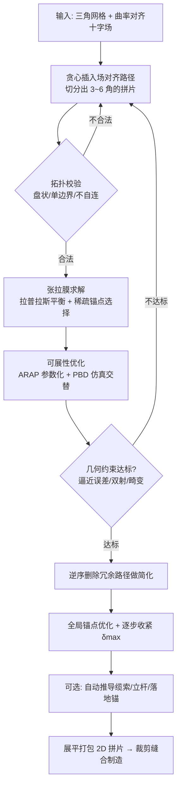

## 一句话总结

给定一张自由曲面，本文提出首个全自动流水线，把它近似成一组"近可展"的织物拼片（patch），这些拼片在少量锚点处张紧、彼此缝合后达到力学平衡，形成兼具材料轻量、结构高效与视觉美感的张拉结构，且直接可制造。

## 研究背景

领域现状：张拉结构（tensile structures）是靠张力成形、在离散支撑点处锚固的轻量曲面，能以极低的材料成本和结构自重覆盖大跨度空间，近年在建筑与工业界受到越来越多关注。然而几何处理社区大多聚焦于网格壳（gridshell）、砌体结构或张拉整体（tensegrity）的优化设计，真正针对张拉膜结构做计算设计的方法很少。

核心痛点：设计一个张拉结构要在几何精度、制造约束与美观之间反复权衡，两个关键难题是——用尽可能少且视觉连贯的拼片准确逼近目标曲面；同时保证结构在稀疏锚点处张紧时仍能维持平衡。此外，为了用普通织物制造，每个拼片必须具有高可展性，张紧时只允许极小的拉伸。已有工作要么局限于优化预先给定的平面板排布，要么需要人工指定初始拼片布局，缺少"从目标形状反推出可物理实现的张拉结构"的自动方法。

本文 idea：反转传统工作流，从目标曲面出发反向推导张拉结构。以曲率对齐的十字场（cross field）为引导，用组合式流程增量地插入路径把曲面切分成拼片；每加一条路径就模拟一次对应张拉结构，评估逼近误差、可展性与拓扑合法性，仅保留必要的路径，最后再删除冗余元素以提升简洁与优雅。全局优化会挑选出一组稀疏锚点，使其余曲面能松弛到平滑的张拉平衡态。

## 方法

整体框架：输入目标三角网格与一条曲率对齐的 4-RoSy 十字场。算法迭代插入沿场方向的路径，把曲面切成拼片；每次更新布局后先做拓扑校验，再模拟张拉膜、优化可展性并评估几何约束；用贪心策略只添加必要路径，随后逆序删除冗余路径做简化；最后做一次锚点位置的全局优化并把拼片展平打包，可选地再自动推导支撑缆索与立杆。

关键设计：

1. **张拉曲面即膜（membrane）**。张力下的曲面内力纯为面内力、可忽略弯曲刚度，其几何由每个顶点处的静力平衡决定：每个内部（膜）顶点是其邻居的凸线性组合。作者用固定的余切权重，以最小二乘施加约束 $$\mathbf{v}_i=\sum_{j\in N(i)} w_{ij}\mathbf{v}_j$$，配合逼近能量 $$E_{\text{approx}}=\sum_{v_i\in V}\lVert \mathbf{v}_i-\mathbf{v}_i^{\text{target}}\rVert^2$$ 让曲面贴近目标。

2. **稀疏锚点选择**。引入二元变量 $$b_i\in\{0,1\}$$ 标记顶点是否为锚点，用正则项 $$E_{\text{anchor}}=w_{\text{anchor}}\sum_{v_i\in V} b_i$$（论文取 $$w_{\text{anchor}}=10$$）鼓励锚点稀疏；再用逐顶点约束 $$C_i=\lVert \mathbf{v}_i-\mathbf{v}_i^{\text{target}}\rVert-\delta_{\max}\le 0$$ 防止退化为"无锚点"解。整体是一个在膜约束与偏差上界下最小化 $$E_{\text{approx}}+E_{\text{anchor}}$$ 的混合整数优化，每次布局变化都重新求解。

3. **可展性优化（两步交替）**。先对每个拼片用 ARAP 参数化算出局部单射的 2D 嵌入，得到各边的静止长度；再用基于位置的动力学（PBD）把展平拼片当作近乎不可拉伸的材料在张力下仿真（用距离约束与弯曲约束）。两步交替直到参数化畸变（边拉伸）低于阈值，并要求映射双射，否则该拼片标记为未解、后续继续加路径细化。

4. **路径布局生成与自动缆索**。把"沿场追踪路径"建模为图上的最短路问题——每个网格顶点按十字场四个方向配四个节点，边按场的平行传输连接；用贪心策略优先插入"离已有路径与边界最远"的路径，只允许正交相交、禁止相切。可选地自动推导缆索：为每根连接锚点与立杆的绳索引入张力 $$t_{ij}\ge0$$ 与可行高度 $$h_{ij}$$，通过带 $$\ell_0$$ 稀疏项的优化 $$\min\sum_i\lVert\sum_j t_{ij}\mathbf{d}_{ij}-\mathbf{f}_i\rVert^2+\lambda\sum_{i,j}\lVert t_{ij}\rVert_0$$（论文取 $$\lambda=0.5$$，实际用 $$\ell_1$$ 松弛或混合整数求解）平衡内力，残余力过大处补立杆、超限则直接落地锚固。

## 实验结果

系统用 Eigen 与 libigl 实现，混合整数与布尔约束优化交给 Gurobi，跑在 Apple M3 Pro 上，单个模型处理时间 1~20 分钟；实体样件从裁剪缝合到张紧组装约需 120~200 分钟。主参数是最大允许逼近误差 $$\delta_{\max}$$。下表摘自论文 Table 1（选取部分代表性算例），逼近误差为相对目标网格的 Hausdorff 距离、以包围盒对角线百分比表示，畸变为 2D 映射的边拉伸百分比。

| 算例 | 拼片数 #P | 锚点数 #A | 平均误差 Avg E (%) | 最大误差 Max E (%) | 平均畸变 Avg D (%) |
| --- | --- | --- | --- | --- | --- |
| 8.a | 13 | 43 | 1.56 | 3.77 | 0.69 |
| 8.b | 10 | 24 | 1.17 | 4.03 | 0.69 |
| 8.c | 19 | 30 | 3.41 | 8.44 | 0.36 |
| 11.a | 10 | 26 | 3.73 | 11.90 | 0.82 |
| 11.b | 8 | 52 | 1.37 | 5.51 | 1.09 |
| 11.c | 4 | 30 | 1.24 | 5.28 | 1.94 |
| 11.d | 2 | 14 | 1.82 | 5.83 | 2.64 |
| 12.a | 4 | 15 | 2.24 | 5.34 | 2.14 |
| 12.b | 6 | 18 | 2.79 | 9.69 | 0.78 |
| 12.c | 4 | 25 | 0.69 | 4.98 | 1.90 |
| 12.d | 10 | 68 | 2.09 | 10.47 | 0.78 |
| 13 顶 | 12 | 25 | 0.23 | 0.50 | 0.47 |
| 13 底 | 8 | 15 | 0.03 | 0.07 | 0.32 |

此外，作者把方法的数字模型与 3D 扫描的实体复制品对比，平均误差仅为包围盒对角线的 0.73%；再用离散薄壳模型（厚织物 $$t=1.2$$ mm、$$E=120$$ MPa、$$\nu=0.35$$、$$\rho=250$$ kg/m³）在重力下做静力仿真，最大应变 10.6%、平均应变仅 0.18%，且较大应变只出现在锚点周围，整体面内应变很低。与 Voronoi 划分的对照实验显示，曲率场对齐的划分能得到更简单紧凑的拼片、缝线更短且逼近更好。

## 亮点与局限

亮点：

- 据作者所述，这是首个从任意自由曲面自动生成"近可展张拉膜结构"的完整流水线，填补了"从目标形状反推可物理实现张拉结构"的研究空白。
- 把膜平衡、稀疏锚点选择、可展性与美学（缝线对齐主曲率线）统一进一个增量式组合优化框架，几何、结构与视觉目标兼顾。
- 对输入曲面的拓扑与几何不作限制，并用多个建筑算例与实体样件（含缆索、立杆、落地锚多种支撑方式）验证，实测逼近误差与面内应变都很低。

局限：

- 计算复杂度较高，不支持实时交互，用户无法即时可视化手动固定锚点或插入缝线的结果。
- 2D 制造拼片的映射阶段并未显式强制张力约束，虽然对最终外观影响不大，但从功能角度仍值得进一步强制。
- 仿真假设材料各向同性，超过一定拉伸后需考虑纤维朝向才能准确预测织物行为（当前认为拼片所需拉伸远低于常见织物的自然拉伸，故影响不大）。
- 布局细化过程为贪心策略，实验多聚焦建筑常见的开放网格，水密模型虽支持但被认为与目标应用关联较弱。

## 延伸思考

- 把纤维朝向作为额外自由度引入优化（如作者提到的服装/数字裁片相关工作），可望处理大拉伸下的各向异性织物，并让拼片朝向也成为可优化变量，从而扩展到更广的材料与更极端的形态。
- 若能在 2D 拼片映射阶段也显式强制张力，理论上能让裁剪好的平面片本身更贴合张紧后的目标几何，减少缝合后的偏差，对功能性更强的场景有意义。
- 当前锚点/缆索优化不保证每个锚点严格力平衡，而是用阈值 + 补杆 + 落地锚兜底；结合更系统的结构分析与材料物理属性优化，是把这类结构从"视觉可行"推进到"工程可靠"的关键方向。
- 贪心的布局细化是显式的性能瓶颈与次优来源，引入全局或学习式的路径插入/删除策略，有望同时改善拼片数量、逼近质量与求解效率。
