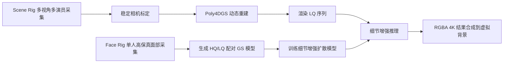

## 一句话总结

本文提出一套面向高端影视制作的大规模、多演员、4K 分辨率 4D 体积捕捉系统：先用双机位采集（大场景 Scene Rig 记录多人全身表演、小型 Face Rig 记录单人高保真面部），再用定制的 Poly4DGS 重建动态表演，最后用一个基于扩散模型的细节增强模型把场景机位偏低的画质提升到面部特写可用的制作级 4K 水准。

## 研究背景

4D 体积表演捕捉在影视制作中越来越常用，而电影电视要求 4K 分辨率输出、需要在一个较大区域内捕捉多名演员的交互，并且要在远景、中景、特写等不同景别下都显得高分辨率。把相机布置在更大的表演区域（本文为 $$6\,m \times 9\,m$$）会拉大相机到被摄对象的距离，使得捕捉动态表演的高频细节变得困难。

作者指出已有方法的不足：

- 基于网格的多视角重建（含 IR 相机、深度传感器）难以重建头发等高频细节，缺乏照片级真实感；
- NeRF 及其动态扩展（4D NeRF）质量高但速度慢，且难以处理长序列与复杂运动；
- 3DGS 与 4DGS 带来了速度与质量突破，但现有方法多受限于同步静态相机阵列，无法满足制作对线性色彩空间与 4K 分辨率的要求；
- 现有针对 NeRF/3DGS 的修复模型主要是"精修"输入信号，无法生成超出输入图像的新细节，或其细节来自通用先验而非特定演员的外观；
- 据作者所知，没有基于视频的超分方法支持 4K。

本文的目标是弥合"可扩展的大规模表演捕捉"与"影视制作所需高分辨率标准"之间的鸿沟。

## 方法

整体是一个两阶段流水线：第一阶段用 Scene Rig 采集并以 Poly4DGS 重建动态表演；第二阶段用 Face Rig 高保真面部数据训练一个细节增强扩散模型，对第一阶段渲染结果做后处理增强，最后合成到虚拟背景上。

### 双机位硬件

- **Scene Rig**：$$6\,m \times 8\,m$$ 舞台上布置 180 台同步 4K 电影摄影机（30 台天花板、25 台地面、其余装在 12 个可移动小车上），含 90 台静态广角相机与 40 台带云台变焦追踪相机（用 OptiTrack 标记追踪演员面部），以及 50 台竖向追踪相机。白色 LED 灯带以 1 ms 闪光与 24 fps 快门同步、72 Hz 频闪以减少运动模糊并避免闪烁不适。
- **Face Rig**：由黑色 LED 面板围成的封顶圆柱体，捕捉体积约 250 cm 高、276 cm 直径，含 75 台同步 4K 相机与 110 盏白色 LED 灯提供均匀平光。

### 阶段一：Poly4DGS 动态重建

**稳定的动态相机标定**：动态变焦相机的浅景深使背景模糊、焦距变化易与相机运动混淆。作者采用两步标定：先用激光雷达扫描和序列中间帧标定固定焦距的静态广角相机，再固定其位姿单独标定追踪相机；对焦距变化拟合平滑函数作为跨帧正则，避免突跳。此举使初始点云识别点数增加近 50%。

**Poly4DGS 表示**：不同于用 4D-Rotor 或双四元数在 4D 空间参数化的做法，作者直接把每个高斯的各属性运动参数化为随时间的多项式展开，便于基于现有 3DGS 光栅器实现：

$$
\mu_t = \sum_{i=0}^{n_\mu} \mu_i (t - t_0)^i
$$

$$
q_t = \sum_{i=0}^{n_q} q_i (t - t_0)^i, \quad s_t = \sum_{i=0}^{n_s} s_i (t - t_0)^i
$$

$$
o_t = o_0\, e^{-\frac{1}{2} \sum_{i=1}^{n_o} \lambda_i (t - t_0)^{2i}}
$$

其中 $$t_0$$ 是高斯的时间中心，$$\lambda_i$$ 控制其生命周期长度。当 $$n_\mu = 1, n_q = 0, n_s = 0, n_o = 1$$ 时退化为对 4D 高斯做时间切片；引入高阶项可捕捉更复杂运动。经验上取 $$n_\mu = 2, n_q = 1, n_s = 0, n_o = 2$$ 可提升约 $$0.2\,dB$$ PSNR 且无明显开销。由于表演序列纹理变化很小，使用时间恒定的球谐系数。整段序列被切分为小段并行训练以提升可扩展性，并用每帧约 200k 点的稠密点云初始化以加速收敛。

**训练色彩空间**：为保留输入的动态范围，用线性 OpenEXR 训练，但直接在线性空间训练会导致约 $$5\,dB$$ 的 PSNR 下降（推测是优化的条件数问题）。方案是把颜色参数存储在无界的色调映射空间，而光栅化时用线性化颜色：

$$
c_{linear} = f^{-1}_{srgb}(c_G), \quad C_{rast} = R(c_{linear}, \dots)
$$

**曝光与黑电平优化**：变焦镜头产生明显的杂散光与镜头眩光，作者用 $$32 \times 32$$ 的空间可变曝光与黑电平网格校正：

$$
C_{adjusted} = (C_{rast} + B_c(x,y)) \cdot E_c(x,y)
$$

最终输出颜色：

$$
C_{final} = f_{srgb}\!\left( R\!\left( f^{-1}_{srgb}(c_G) \right) + B_c \right) \cdot E_c
$$

网格通过 FFT 上采样（补零到目标尺寸后 IFFT），其反向传播比高分辨率下的双边网格切片快数个数量级。

**训练目标**：在无界 sRGB 空间计算重建损失 $$L_{recon}$$（$$L_1$$ 与 $$L_{SSIM}$$ 组合），并加入曝光与黑电平正则：

$$
L_{exposure} = \left( \sum_{x,y,c} \frac{E_c(x,y) - 1}{N_x N_y N_c} \right)^2
$$

$$
L_{black} = -\frac{1}{N} \sum_{pixels} B_c(x,y)
$$

$$
L_{total} = L_{recon} + \lambda_e L_{exposure} + \lambda_b L_{black}
$$

其中 $$\lambda_e = 10, \lambda_b = 0.05$$。

### 阶段二：细节增强扩散模型

由于视频扩散模型内存占用大、分辨率通常仅 480p–768p，远低于 2160p 目标，作者转而修改图像扩散模型 **Flux**（原生支持 1080p–1440p、含强自然图像先验），做出三处关键改动：

- **图像条件化**：扩展 DiT 首个线性层的权重矩阵，使输入通道从 $$L_{ch}$$ 变为 $$(N+1)L_{ch}$$，条件图像经 VAE 编码后与潜噪声拼接。
- **时间稳定性**：用光流将上一帧输出重投影，并附一个有效性掩码作为额外条件（首帧置零、训练时对这些输入做 50% dropout）；此外针对 VAE 难以保留低频信息导致的低频闪烁，对 LQ 输入与增强结果各算 5 级拉普拉斯金字塔，把输出最低层（$$120 \times 68$$）替换为输入的最低层。
- **Alpha 通道增强**：为便于合成，模型额外以 LQ Alpha 为条件并联合预测 RGB 与 Alpha。最终架构接收四路条件（LQ RGB、LQ Alpha、warp 后的上一帧输出、有效性掩码）与两路潜噪声，共 $$6 \times L_{ch}$$ 输入通道，输出 $$2 \times L_{ch}$$ 通道，RGB 与 Alpha 独立解码。

**配对训练数据**：让参演演员在 Face Rig 单独做多样面部表情表演（4K, 24 fps）。每位演员均匀采样 60 个 8 帧子序列，每段重建两个 Poly4DGS 模型——高质量（每帧约 100 万高斯）与低质量（5 万至 20 万高斯，对应 Scene Rig 裁剪上半身后的高斯数区间），以 $$4096 \times 4096$$、16-bit RGBA EXR 渲染约 3600 对低/高质量序列/每位演员，覆盖多样的伪影、表情、相机运动与焦距。模型对全部演员同时训练，每个子组用不同文本提示。

## 实验结果

**重建消融**（保留 12/140 相机做测试，比较前先优化留出视角的曝光与黑电平）：

| 方法 | PSNR ↑ | SSIM ↑ | LPIPS ↓ |
| --- | --- | --- | --- |
| Full | 27.29 | .9752 | .0160 |
| w/o black level | 24.11 | .9576 | .0200 |
| w/o expo. opt. | 25.50 | .9718 | .0161 |
| w/o dense pt. | 25.31 | .9576 | .0288 |
| per-frame GS | 26.11 | .9697 | .0204 |
| 4D-Rotor | 27.08 | .9730 | .0171 |

所有新增组件均对最终质量有贡献：黑电平与曝光优化避免了眩光和曝光变化被"烘焙"进高斯，稠密点云初始化帮助重建细节；Poly4DGS 优于逐帧 3DGS 和 4D-Rotor，且时间稳定性更好。

**细节增强消融与对比**（Face Rig 数据用参考类指标，Scene Rig 数据用无参考类指标）：

| 方法 | MS ↑ | TF ↑ | MUSIQ ↑ | NIQE ↓ | PSNR ↑ | SSIM ↑ | LPIPS ↓ | TPSNR ↑ | FID ↓ | FVD ↓ |
| --- | --- | --- | --- | --- | --- | --- | --- | --- | --- | --- |
| Ours | 95.34 | 94.29 | 51.79 | 5.28 | 31.29 | 0.8871 | 0.1812 | 31.27 | 102.77 | 213.52 |
| w/o OFW | 94.72 | 94.06 | 52.24 | 5.48 | 31.43 | 0.8872 | 0.1614 | 31.42 | 103.44 | 202.90 |
| w/o OFW, w/o LFS | 94.73 | 93.90 | 53.17 | 5.89 | 30.61 | 0.8604 | 0.1612 | 30.60 | 99.88 | 209.85 |
| ResShift (FT) | 93.36 | 92.34 | 59.12 | 5.77 | 29.78 | 0.8517 | 0.2146 | 29.78 | 87.93 | 405.16 |
| Upscale-A-Video | 94.64 | 93.66 | 34.87 | 7.87 | 30.30 | 0.8329 | 0.3620 | 30.29 | 191.96 | 341.74 |
| KEEP | 94.09 | 93.20 | 45.33 | 6.16 | 30.08 | 0.8627 | 0.2996 | 30.07 | 176.90 | 350.91 |
| Input Poly4DGS | 94.18 | 93.25 | 37.22 | 6.89 | 31.72 | 0.9009 | 0.2474 | 31.72 | 150.51 | 333.11 |

光流 warp 与低频交换均改善时间一致性（低频交换贡献最大，warp 进一步增强），代价是轻微图像平滑。本文方法在参考类图像质量与 NIQE 上大幅领先，时间稳定性与 Upscale-A-Video 相当但细节远更丰富。输入 Poly4DGS 在 PSNR/SSIM 上更高是意料之中的（它更像 GT 的"模糊版"），而本文方法生成的发丝等新细节可能与 GT 不对齐，但 LPIPS 更优表明视觉相似度更高。最终结果由美术师合成到 3DGS 重建或生成视频背景上。

## 亮点与局限

亮点：
- 两阶段"大场景捕捉 + 单人面部参考"设计，把可扩展的多演员表演捕捉与制作级 4K 面部特写结合。
- Poly4DGS 用多项式时间参数化，易于在现有 3DGS 光栅器上实现，配合稳定标定、线性/色调映射色彩空间与曝光/黑电平优化，兼顾动态范围、色彩保真与时间一致性。
- 首个面向 4K、联合 RGB 与 Alpha、并具时间稳定机制的细节增强扩散模型，能去除高斯伪影并生成基于特定演员外观的新细节。

局限：
- 硬件与计算资源密集，非普遍可及（但适用于专业制作）。
- 时间稳定机制虽有大幅改善，剪影处仍可能残留闪烁。
- 未探索重光照，难以更好地融入不同背景。
- 眼部反射会把 Face Rig 的稀疏灯光转移到结果中，未来需针对给定环境合成真实眼部反射。

## 延伸思考

该工作把"生成式细节增强"作为体积捕捉流水线的后处理后端，提示了一条弥合采集规模与制作分辨率鸿沟的实用路径：与其追求单一模型同时兼顾大范围捕捉和极致细节，不如让可扩展的重建负责几何与运动、让在演员专属高保真数据上微调的扩散模型负责补齐特写细节。低频交换这类简单技巧对时间稳定性的显著作用也值得注意。未来若能引入重光照与环境相关的眼部反射合成，将进一步提升其在虚拟制作中的可用性。
