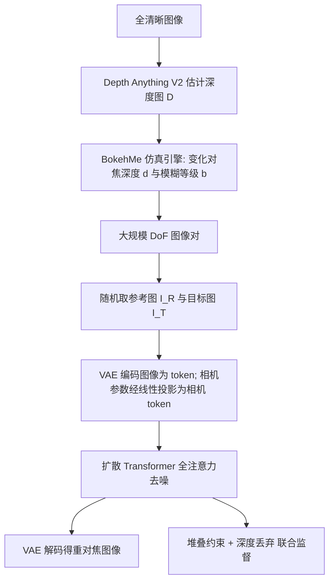

## 一句话总结

DiffCamera 提出一个基于扩散 Transformer 的重对焦模型，可以对已经拍好或生成好的图像，按任意指定的对焦点和模糊（虚化）等级重新调整景深效果，同时保持场景内容一致。

## 研究背景

景深（Depth-of-Field, DoF）带来的虚化（bokeh）能突出主体、提升照片美感，但一旦图像被拍摄或生成出来，这种模糊就固定下来、难以修改。当模糊落错地方（例如主体失焦）时就成了问题。文本生成图像模型同样面临 DoF 控制难题：训练用的图文对里几乎不含对焦点或景深的显式描述，仅靠提示词很难精确控制对焦位置与虚化程度。

由此引出核心问题：能否对一张已有图像任意重对焦——像在相机屏幕上点按对焦、调节光圈那样，选一个对焦点、设一个模糊等级，无论原图景深如何都能重新对焦。已有工作各有局限：光场相机、焦点扫描相机等依赖特殊硬件，单图反卷积方法会在边缘产生明显的环状伪影，虚化渲染方法（如 BokehMe）只能对全清晰图像加虚化且高度依赖深度图，而相机条件扩散模型要么只能从文本生成、要么由模型隐式决定对焦主体，无法自由指定对焦点。

## 方法

整体框架：先用一条基于仿真的数据管线，从全清晰图像生成大规模、同场景但不同对焦平面与模糊等级的图像对；再用这些配对数据训练一个带全注意力的扩散 Transformer，学习"给定参考图 $$I_R$$、新对焦点 $$(f_x, f_y)$$ 和模糊等级 $$b$$，输出目标重对焦图 $$I_T$$"。训练中引入堆叠约束（stacking constraint）与深度丢弃（depth dropout）两个关键设计以提升精度与鲁棒性。

关键设计：

1. 仿真数据管线：真实世界很难拍到同场景、仅对焦参数不同的对齐图像对。作者收集真实照片、手机照片、AI 生成图三类全清晰图像，用 Depth Anything V2 估计深度图 $$D$$，再用 BokehMe 系统性变化对焦深度 $$d$$ 与模糊等级 $$b$$ 合成图像对。一个对焦深度对应满足 $$\lvert D(f_x, f_y) - d \rvert < \epsilon$$ 的一组对焦点像素，模拟真实镜头中同一深度平面同时清晰的行为。

2. 扩散 Transformer 与整流流目标：把参考图 $$I_R$$、深度图 $$D$$、噪声潜变量经 VAE 编码展平为 token，把相机参数 $$(f_x, f_y, b)$$ 经可学习线性投影映射为相机 token，全部拼成一维序列送入全注意力 Transformer，用整流流（rectified flow）预测速度 $$v$$，损失为 $$$L_{flow} = \lVert v - \delta(I_T^t, t, f_x, f_y, b, I_R, D) \rVert$$$。

3. 堆叠约束：单一扩散目标不足以保证精确的景深条件控制。受摄影中"焦点堆叠"启发——同场景不同对焦平面的照片可用掩码 $$M$$ 线性融合成多焦点图像 $$$M \odot I_1 + (1 - M) \odot I_2 = I_{stack}$$$。将该关系代入整流流的速度预测，得到约束 $$$v_{stack} = M \odot v_1 + (1 - M) \odot v_2$$$，并在潜空间用连续值掩码 $$\tilde{M}$$ 构造正则项 $$L_{stack}$$，总损失 $$$L = L_{flow} + \lambda L_{stack}$$$（默认 $$\lambda = 0.1$$）。这迫使两次对焦结果都忠实对齐场景结构与各自相机条件，否则无法堆叠成正确的多焦点图像。

4. 深度丢弃：深度图虽有助于理解场景结构，但预测深度常不准（如透明玻璃只测到表面而非其后被遮挡物体，导致景深错误）。训练时随机将 50% 的深度图置零丢弃，迫使模型在无深度输入时也能独立推断正确虚化，从而突破深度图精度的限制。此外训练采用自适应采样调度，随优化步数逐步提升 AI 合成数据、降低网络照片的采样比例以兼顾质量。

## 实验结果

作者构建了含 150 个场景的基准（60 张相机照片、30 张手机照片、60 张 AI 生成图），涵盖重对焦、加虚化、去虚化（去模糊）三类子任务。下表为重对焦与加虚化子任务上与 GPT-4o 图像编辑能力的定量对比：

| 子任务 | 方法 | CLIP-I ↑ | MAE ↓ | LVCorr ↑ | CLIP-IQA ↑ |
|--------|------|----------|-------|----------|------------|
| 重对焦 | GPT-4o | 0.859 | 0.138 | – | 0.724 |
| 重对焦 | DiffCamera | 0.954 | 0.025 | – | 0.834 |
| 加虚化 | GPT-4o | 0.792 | 0.087 | – | 0.567 |
| 加虚化 | DiffCamera | 0.969 | 0.022 | 0.920 | 0.857 |

在去虚化（去模糊）子任务上，DiffCamera 相比 SOTA 去模糊方法 Restormer 与 GPT-4o，在 LPIPS（0.176）、PSNR（25.200）、CLIP-IQA（0.883）等指标上均取得更好结果。消融实验进一步验证：自适应数据平衡、深度丢弃、堆叠约束三者分别带来景深一致性与画质的提升（例如 LVCorr 从无堆叠约束的 0.858 提升到 0.920）。

## 亮点与局限

亮点：

- 首次支持对单张已有图像按任意对焦点 + 任意模糊等级自由重对焦，覆盖重对焦、加虚化、去虚化多任务，且不受原图景深状态限制。
- 用仿真管线解决了同场景多对焦配对数据难获取的痛点，规避了真实拍摄难以对齐的问题。
- 堆叠约束把摄影中的焦点堆叠原理转化为物理有据的训练正则，显著提升景深条件的精确性与一致性。
- 深度丢弃缓解了对不可靠深度图的过度依赖，在透明物体、复杂场景等深度模糊情形下优于依赖深度图的传统模拟器 BokehMe。

局限：

- 仅支持 512×512 或 1024×1024 分辨率，难以处理 16:9 等不同宽高比或更高分辨率图像。
- 从严重模糊恢复清晰内容是病态问题，可能生成合理但不符合用户预期的内容（如人像不像本人），且复杂情形下受限于骨干模型容量可能出现伪影。
- 只能指定模糊等级与对焦点，无法进行更精细的虚化控制（如虚化光斑形状）。

## 延伸思考

DiffCamera 的价值在于把"相机后处理"变成一个可条件化的生成问题：对焦点与模糊等级作为标量条件注入扩散 Transformer，而堆叠约束为这类物理可组合的编辑任务提供了一种通用的自监督思路——凡是满足线性叠加关系的编辑（如多曝光合成、分层光照），或许都能借类似约束把物理先验嵌入扩散训练。

模型高度依赖仿真数据（BokehMe + 单目深度估计）构造监督信号，这既是规模化的优势，也意味着模型上限受仿真管线保真度约束；当仿真与真实光学的差异较大时可能引入系统性偏差。作者提出的深度丢弃从侧面说明：与其被不完美的中间表征（深度图）牵着走，不如让模型学会在其缺失时自行补偿。此外，把宽高比/分辨率、虚化形状等更多相机语义统一编码进"相机 token"，有望让这类模型逐步逼近一个可微、可控的软件相机。
