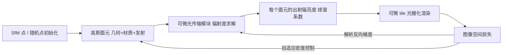

## 一句话总结

本文以高斯面元（Gaussian surfels）为基元，把经典的辐射度（radiosity）理论改造成一套支持半透明基元与非二值可见性的**可微全局光照**框架：在球谐系数空间中求解光传输，推导出比自动微分快约 $$10\times$$、显存占用大幅降低的解析反向梯度，训练后可在视点无关的前提下以数百 FPS 渲染含视相关反射的全局光照效果，从而在稀疏视角下同时实现高质量重光照与精确几何重建。

## 研究背景

辐射场（尤其是高斯泼溅）在新视角合成与几何重建上非常成功，但它们直接参数化出射辐亮度，牺牲了对材质与光照的建模能力，导致几何歧义大、无法重光照。要解决这些问题就得引入基于物理的渲染与全局光照，但把完整全局光照放进逆向渲染的内循环代价极高。

已有工作因此走了两条捷径：

- **简化物理**：只算单次弹射、忽略/冻结/二值化可见性、只处理远场环境光等。这类方法效率上去了，但精度受损，且通常只针对静态光照。
- **数据驱动**：用神经网络压缩所有光照细节（如 GS3、NRHints），能得到高质量重光照，但缺乏对光传输的真正理解，往往需要非常密集的 OLAT（一次一灯）采集，训练图像常超过 500 张。

作者观察到：高斯面元本身就是离散有限元，天然契合上世纪八九十年代成熟的**有限元辐射度**框架，而现代半透明基元又恰好消解了传统辐射度最头疼的可见性离散化与网格细分难题（可见性是连续、非二值的）。于是作者重访辐射度理论，构建首个针对高斯面元、不妥协间接光照与可见性、且完全可微的高效光传输框架，覆盖近场与远场光源、漫反射与一定程度的镜面材质。

## 方法

整体流水线沿用 Gaussian surfel 的优化范式：从 SfM 点或随机点初始化一组二维高斯面元，用图像空间监督做优化与自适应密度控制。核心区别是插入一个**可微光传输模块**：不再把出射辐亮度当作可学习变量，而是从底层几何、材质、光源出发，通过求解光传输推导出每个面元的出射辐亮度，再送入可微的 tile 光栅化器渲染。

### 表示：几何、材质、光照都在球谐系数空间

几何用二维高斯面元表示的随机几何场（stochastic geometry field），可见性连续非二值。材质、发射、出射辐亮度都假设在核支撑内为常数（辐射度经典假设）。BRDF 采用漫反射 + Phong 的混合模型：

$$f_i(\boldsymbol{\omega}_I, \boldsymbol{\omega}_O) = k_i \frac{\boldsymbol{a}_i^d}{\pi} + (1-k_i)\,\boldsymbol{a}_i^s \frac{s_i+1}{2\pi} |\boldsymbol{\omega}_r \cdot \boldsymbol{\omega}_I|^{s_i}$$

关键在于借助 Ramamoorthi 与 Hanrahan 对 Phong BRDF 的球谐闭式展开，所有球面函数（BRDF、辐亮度、发射）都用低阶（实用中 9 项）球谐系数存储，既支持漫反射也支持视相关的镜面效果。所有光源被统一建模为特殊的无穷小发射高斯面元：点光源直接采样中心点，方向光则把点光源放到极远处并关闭平方反比衰减，环境光同理处理。

### 前向渲染：把辐射度推广到半透明基元

直接光照是一个非递归、可直接求值的方程；全局光照则从渲染方程出发，在"任意两个核不重叠"的假设下用加权残差法建立。吸收若干系数后，前向渲染方程写成类似经典辐射度的递归形式：

$$\boldsymbol{B}_i^c = \boldsymbol{E}_i^c + \sum_{j=1}^{N} \int_{P_i} \int_{P_j} f_i(\boldsymbol{\omega}_I)\,(\boldsymbol{Y}(\boldsymbol{\omega}_I)^T \boldsymbol{B}_j^c)\,V_{ji}\, d\boldsymbol{x}' d\boldsymbol{x}$$

其中 $$\boldsymbol{B}_i^c$$、$$\boldsymbol{E}_i^c$$ 分别是辐亮度与发射的球谐系数，$$V_{ji}$$ 是融合了角度因子、核响应与非二值透过率的衰减项。它形式上像经典辐射度方程，但符号含义不同且可见性连续。$$\boldsymbol{B}^c$$ 两侧都出现，因此是递归的，需要专门的求解器。

### 反向梯度：前向与反向的对偶

作者没有用自动微分，而是解析推导梯度，发现前向传播与反向传播之间存在**对偶关系**：对发射的梯度 $$\partial \mathcal{L} / \partial \boldsymbol{E}_i^c$$ 满足一个和前向方程几乎一致（只是衰减项方向翻转、传播的是梯度而非发射）的递归式：

$$\frac{\partial \mathcal{L}}{\partial \boldsymbol{E}_i^c} = \frac{\partial \mathcal{L}}{\partial \boldsymbol{B}_i^c} + \frac{1}{\boldsymbol{f}_i^c} \sum_{j=1}^{N} \int_{P_i}\int_{P_j} f_i(\boldsymbol{\omega}_I)\,\big(\boldsymbol{Y}(\boldsymbol{\omega}_I)^T (\boldsymbol{f}_j^c \times \tfrac{\partial \mathcal{L}}{\partial \boldsymbol{E}_j^c})\big) V_{ji}\, d\boldsymbol{x}' d\boldsymbol{x}$$

更妙的是，材质梯度可用已算好的 $$\boldsymbol{B}^c$$ 与 $$\partial \mathcal{L}/\partial \boldsymbol{E}^c$$ 解析、非递归地得到：

$$\frac{\partial \mathcal{L}}{\partial \boldsymbol{f}_i^c} = \frac{\partial \mathcal{L}}{\partial \boldsymbol{E}_i^c} \times \frac{(\boldsymbol{B}_i^c - \boldsymbol{E}_i^c)}{\boldsymbol{f}_i^c}$$

几何梯度（中心点、缩放、切向等）也有类似的解析非递归形式，分别来自衰减项与方向效应，且只需对互相可见的核对求和。因此复用同一套求解器即可同时服务前向与反向。实测该方案比自动微分快约 $$10\times$$，显存少约 28 GB。

### 求解器：渐进精化 + 蒙特卡洛的混合策略

递归方程无法在每步优化时都精确求解庞大线性系统（可有数十万核）。作者组合两种求解器：

- **渐进精化（Progressive Refinement）**：从发射初始化，按"shooting"视角迭代地把某核的未发射辐亮度打向其他核。作者发现"给定未发射辐亮度求剩余辐亮度"本身又是同形式的光传输子问题，从而能与其他求解器拼接。
- **蒙特卡洛求解器**：对求和用单点估计，把"选下一个核"当作 next event，借助强化学习里的时序差分 TD(0) 思想同时缓存并更新所有核的辐亮度估计；next event 用加权蓄水池采样在线完成，避免显式构造 $$O(N^2)$$ 概率矩阵，并借鉴 light cuts 进一步降复杂度。默认时间步 $$T=64$$。
- **混合求解器**：先用渐进精化处理光源到所有核的直接光照（类似直接光分解 / light tracing），再用蒙特卡洛求解间接光照。相同耗时下方差更低。

### 关键近似：中心到中心，解耦几何与材质

由于"核内常数"假设，一个核的出射辐亮度是其所有入射光线响应的平均，而这些光线的可见性对几何微小扰动极其敏感，使几何与材质的联合优化很难。作者提出无方差、高效的"中心到中心"近似：只考虑连接两核中心点的光线，把 BRDF、辐亮度、衰减项视作积分内近似常数，从而消掉双重积分。为补偿误差，给每个核加一个可优化的缩放因子 $$\lambda_i \in \mathbb{R}^+$$。该近似显著放松了几何与材质的耦合，是稳定优化的关键。

## 实验结果

实现基于 PyTorch 与 OptiX，单张 NVIDIA 6000 Ada GPU。含全局光照的优化约需 5–10 小时，仅直接光照约 20 分钟。评测覆盖稀疏视角重光照、新视角合成与几何重建。

重光照（RenderCapture / Synthetic 数据集及自制场景，测试集约 2000 张）：

| 方法 | 25 视角 PSNR↑ | 25 视角 SSIM↑ | 25 视角 LPIPS↓ | 50 视角 PSNR↑ | 50 视角 SSIM↑ | 50 视角 LPIPS↓ |
| --- | --- | --- | --- | --- | --- | --- |
| GS3 | 21.80 | 0.8607 | 0.1175 | 24.67 | 0.8992 | 0.0888 |
| NRHints | 23.18 | 0.9050 | 0.0871 | 25.41 | 0.9273 | 0.0741 |
| Ours (直接光照) | 24.36 | 0.8794 | 0.1085 | 26.24 | 0.8982 | 0.0942 |
| Ours (全局光照) | 25.29 | 0.8950 | 0.0985 | 27.43 | 0.9151 | 0.0830 |

本文方法在 PSNR 上明显领先；SSIM/LPIPS 略逊于 NRHints，作者解释是这两个指标对阴影误差不敏感、且偏好 MLP 产生的过平滑结果。

Stanford-ORB 数据集（未知环境光，新视角合成 NVS 与几何重建 CD，$$\times 10^3$$）：

| 方法 | NVS PSNR↑ | NVS SSIM↑ | NVS LPIPS↓ | CD↓ |
| --- | --- | --- | --- | --- |
| TensoIR | 33.03 | 0.9839 | 0.0314 | 0.503 |
| GS-IR | 35.59 | 0.9784 | 0.0398 | 0.308 |
| GI-GS | 34.78 | 0.9752 | 0.0412 | 0.306 |
| Relightable3DGS | 28.87 | 0.9506 | 0.0329 | 0.280 |
| GaussianShader | 37.44 | 0.9894 | 0.0210 | 0.224 |
| Ours | 39.30 | 0.9894 | 0.0251 | 0.173 |

在该数据集重光照上，本文方法 PSNR 32.72、SSIM 0.9721、LPIPS 0.0365，均为最佳。

消融与附加实验的主要结论：
- **中心到中心近似**：去掉后优化更难，"Cup"场景测试 PSNR 从 30.01 降到 26.44，几何变噪。
- **梯度计算**：约 89K 基元、$$T=32$$ 时，本文反向 0.26s，自动微分 2.34s 且多占 28.25 GB；去掉几何解析梯度只靠光栅化梯度会导致优化发散。
- **混合 vs 纯蒙特卡洛**：混合求解器方差显著更低；用纯蒙特卡洛训练 PSNR 降 0.25 dB、训练时间增 35.77%。
- **光照条件数量**："PlateOfFruit"仅用 5 种不同光照条件即可达到接近 50 种的效果。
- **批量优化**：视点无关渲染允许一次光传输渲染多张监督图，batch size 4 训练时间仅约为原来的 1/4 多一点，NVS 质量提升。
- 时间成本随基元数大致线性增长；方法还能做场景分解（漫反射/镜面、直接/间接光）、点光源位置优化、环境光旋转重光照，以及封闭盒内富含互反射的初步实验（此时仅直接光照完全失败，全局光照可给出合理结果）。

## 亮点与局限

亮点：
- 首次在高斯面元上推导出可微的全局光照，把经典辐射度扩展到非二值可见性与半透明基元，本身即重要的理论进展。
- 前向/反向对偶带来解析、非递归的梯度公式，比自动微分显著更快且更省显存。
- 视点无关渲染使推理阶段达数百 FPS，并天然支持批量训练与场景分解。
- 稀疏视角下（甚至已知/未知光照）在重光照、新视角合成、几何重建上均优于逆向渲染与数据驱动基线。

局限：
- 稀疏视角下高斯面元布局未必最优，会漏掉细节（如毛球阴影、视频中锯齿状阴影）。
- 扩展到场景级会因复杂遮挡带来效率与方差挑战，封闭盒实验的几何重建仍不完美。
- 依赖有限阶球谐表示材质，对过于光亮的物体会出现明显伪影；单面可见性假设与简化材质模型也限制了半透明等复杂外观。

## 延伸思考

这项工作最有意思的一点，是把被光线追踪"边缘化"多年的辐射度方法，在离散半透明基元与逆向渲染的新语境下重新激活：正因为高斯面元本就是有限元、可见性又连续，历史上困扰辐射度的网格细分与可见性离散化不复存在，反而让"视点无关 + 低方差梯度"的优势凸显出来。前向-反向对偶给出的解析梯度，也提示在这类结构化表示上，手推梯度相比自动微分仍有巨大的效率红利。未来若能在保持低方差的同时提速并扩展到场景级、引入 BSDF 或神经材质并去掉单面可见性假设，这条"用离散基元做可微物理渲染"的路线值得持续关注。
