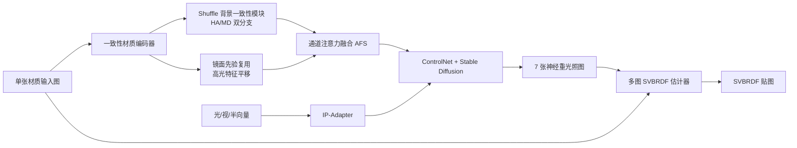

## 一句话总结

利用扩散模型的强先验，从单张材质照片生成同一材质在多种光照下的"重光照"图像，再喂给多图 SVBRDF 估计器，从而恢复出不受强高光"烘焙"污染的高保真反射率贴图。

## 研究背景

- 领域现状：从图像恢复空间变化的双向反射分布函数（SVBRDF）是外观建模的核心问题。多图方法靠多视角/多光照的冗余来对抗强高光，鲁棒但采集成本高；单图方法采集方便，却在强高光下容易失效。
- 核心痛点：单张图像在传感器饱和的高光区域会丢失漫反射纹理，导致预测的 SVBRDF 把高光"烘焙"进贴图（bake-in artifacts），换新光照渲染时出现明显瑕疵。已有的自相似修补、双流高光感知网络受限于卷积网络的生成能力，无法在大面积饱和区域合成合理结构。
- 本文 idea：既然多图能缓解高光，那就用扩散模型的生成先验，从单张输入"造"出同一材质在不同光照下的多张图像，把单图问题转化为多图问题。难点在于扩散模型的随机性会导致多张生成图之间结构、高光形状、颜色不一致，因此需要专门的条件化设计来稳定背景与高光。

## 方法

整体框架：核心是一个基于 Stable Diffusion 2.1 + ControlNet 的神经重光照框架。输入单张材质图，通过"一致性材质编码器"分离并稳定背景（漫反射）与高光（镜面）两类特征，再融合后作为条件注入 ControlNet；同时用 IP-Adapter 把光照/视角向量编码进交叉注意力，从而在指定光照下生成结构一致、高光稳定、颜色忠实的重光照图像。生成 7 张重光照结果连同原图，送入 Luo 等人的多图 SVBRDF 估计器恢复贴图。

关键设计：

- **一致性材质编码器（双分支解耦）**：受渲染着色模型启发，用双分支网络把漫反射（背景）与镜面（高光）分量解耦，再通过通道注意力（AFS）融合成统一表示。原始 ControlNet 编码器是为法线、深度、边缘这类低层条件设计的，难以处理带强高光的材质图；解耦后再按任务重组，能给扩散模型更可靠的条件先验。

- **基于 Shuffle 的背景一致性模块**：包含 HA 分支与 MD 分支。MD 卷积用 sigmoid 生成注意力图 $$M=\sigma(\mathrm{Conv}(F))$$ 调制特征、专注稳定背景；HA 分支带 Inception 结构，倾向于定位镜面高光区域。训练时对一批同材质、不同光照的图像提取背景特征 $$b_i=\mathrm{BCE}(I_i)$$，再做特征洗牌 $$b_i'=FS(b_i)$$，打破"图像—特征"一一对应，迫使网络从更广的上下文学到稳定的背景结构，并隐式标记饱和高光区，从而在高光区生成连贯内容、去除烘焙伪影。Shuffle 只在训练阶段使用。

- **镜面先验复用策略**：只用 MD 分支的镜面先验编码器，从输入图提取高光特征 $$l_0$$，训练时按给定光照位置把 $$l_0$$ 平移得到各光照下的特征 $$l_i$$（缺失区域用边界值填充）。MD 卷积中的实例归一化分支学结构、sigmoid 分支预测高光概率，二者逐元素相乘得到既保留背景信息又捕获高光轮廓的特征。即使平移在像素级会与输入有色彩错位，扩散模型仍能借此重建近似的颜色分布，稳定高光位置/形状并保持背景色调一致。

## 实验结果

在神经材质重光照任务上与当前最优的 Bieron 等人方法对比（为公平起见用相同数据集、分辨率与光照采样重训基线）。每个材质生成 7 张不同光照下的重光照结果，用 MSE、RMSE、PSNR、LPIPS 评估。本文在 INRIA 与真实数据集上全面领先；在含更多高频细节的 MatSynth 上 LPIPS 略逊，作者归因于仅部分微调 Stable Diffusion 导致高频细节缺失。

| 数据集 | 方法 | MSE↓ | RMSE↓ | PSNR↑ | LPIPS↓ |
|--------|------|-------|--------|--------|--------|
| INRIA | Bieron | 0.011 | 0.099 | 20.4 | 0.182 |
| INRIA | 本文 | 0.006 | 0.070 | 22.9 | 0.147 |
| MatSynth | Bieron | 0.012 | 0.103 | 19.9 | 0.213 |
| MatSynth | 本文 | 0.009 | 0.089 | 20.9 | 0.244 |
| Real-world | Bieron | 0.018 | 0.126 | 18.6 | 0.210 |
| Real-world | 本文 | 0.014 | 0.112 | 19.2 | 0.166 |

下游 SVBRDF 恢复实验中，用单图 + 7 张生成重光照图喂入多图估计器，重建质量在"1 张真值输入"与"8 张真值输入"两个设定之间，且在多数指标上优于 Bieron 与 MatFusion，说明重光照策略确实能激活多图估计器的能力。消融实验表明：去掉 Shuffle 背景一致性模块会明显破坏材质纹理与底色（LPIPS 从 0.244 恶化到 0.525）；去掉 HA/MD 卷积会拖慢颜色收敛并在中心产生烘焙伪影；去掉镜面先验则高光位置与背景色一致性变差。增加重光照输入数量（1→4→8）可持续提升 SVBRDF 收敛精度。

## 亮点与局限

- 亮点：
  - 思路巧妙——把"病态的单图问题"转化为"鲁棒的多图问题"，用扩散生成先验补齐被高光吞掉的信息，且能即插即用地对接现成多图 SVBRDF 估计器。
  - 针对扩散模型随机性带来的不一致，用背景一致性模块 + 镜面先验复用做了有的放矢的条件化设计；消融清晰证明每个组件都在起作用。
  - 对光照角度、光源距离、视角偏差表现出鲁棒性，实用性较好；代码与预训练模型开源。
- 局限：
  - Stable Diffusion 2.1 + ControlNet 规模大，训练需 30 GB 以上显存、约 5 天；推理受高分辨率与去噪步数限制（每张约 1.6 秒）。
  - 受 VAE 的 KL 正则与部分参数微调影响，生成结果高频细节被削弱、对比度下降，漫反射材质尤为明显。
  - 重光照被限定在有限的视角/光照集合内，且不支持光照强度的动态变化，牺牲了表现力换取训练简化与更好的 SVBRDF 解耦。

## 延伸思考

- 该工作本质上是"用生成模型合成额外观测来喂给一个鲁棒但需要多输入的下游估计器"，这种"生成即数据增广/虚拟采集"的范式在其他病态逆问题（法线估计、几何重建、光照估计）里可能同样奏效，值得推广。
- 高频细节丢失是当前主要短板，未来若改用全参数微调或更强的基础模型（如 SD3、FLUX），或引入 latent 分辨率更高、KL 正则更弱的自编码器，或许能兼顾结构一致性与细节保真。
- 目前只支持点光源、固定强度的有限光照配置。若把光照条件扩展为连续的环境光/HDR 或可变强度，并支持各向异性、多层反射（如车漆、甲虫壳），会更接近真实外观采集的需求。
- 与 DiLightNet、RGB↔X、DiffusionRenderer 等"扩散先验 + 逆渲染"工作同属一条主线，本文的差异在于面向平面材质、显式解耦背景与高光；如何把这套解耦条件化思想迁移到完整场景级的逆渲染，是一个有意思的追问方向。
