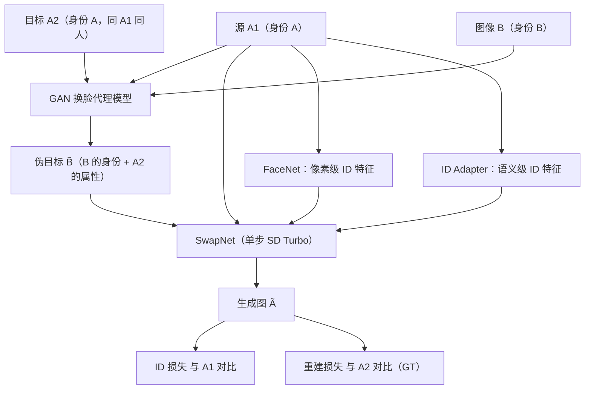

## 一句话总结

DreamID 通过构造 Triplet ID Group 数据为换脸任务建立显式监督，并借助单步扩散模型 SD Turbo 实现高效的像素级端到端训练，在 $$512\times512$$ 分辨率下仅需 0.6 秒即可生成高保真、高身份相似度且属性保持良好的换脸结果。

## 研究背景

换脸任务的目标是把源图像的身份信息迁移到目标图像上，同时保留目标图像的属性信息（背景、光照、表情、头部姿态、妆容等）。这一任务长期面临两条技术路线的困境：

- 基于 GAN 的方法训练不稳定、需要大量超参搜索，且在大角度、面部边缘等场景容易产生低保真伪影。
- 基于扩散模型的方法虽然提升了生成质量，但换脸任务的核心难点是缺乏真实的 Ground Truth——对于给定的 源图像与目标图像 组合，很难找到一张"真实"的换脸结果图。

因此以往工作大多依赖隐式监督：当源与目标为不同身份时用源图像算 ID 损失，当源与目标相同时用目标图像算重建损失。这种隐式监督存在偏差、容易收敛到不理想状态，难以同时获得高身份相似度和细粒度属性（光照、妆容）保持。DreamID 正是针对"缺乏显式监督"这一根因提出解决方案。

## 方法

### 整体框架

DreamID 由两大部分构成：一是 Triplet ID Group 显式监督训练框架，二是包含 SwapNet、FaceNet、ID Adapter 三个模块的改进型扩散模型架构。核心思路是：用一个 GAN 换脸代理模型伪造出"配对数据"，从而把无监督的换脸问题转化为有明确 Ground Truth 的端到端监督问题，再借助单步扩散模型 SD Turbo 让像素级损失得以高效计算。

### 关键设计

- **Triplet ID Group 构造**：取同一身份的两张图 $$A_1$$、$$A_2$$ 和另一身份图 $$B$$，用 GAN 代理模型把 $$B$$ 的身份换到 $$A_2$$ 上得到伪目标 $$\tilde{B}$$（身份来自 $$B$$，属性来自 $$A_2$$）。于是三元组 $$(A_1, \tilde{B}, A_2)$$ 中，当 $$A_1$$ 作源、$$\tilde{B}$$ 作目标时，理论 Ground Truth 恰好是真实图 $$A_2$$。学习目标是真实图 $$A_2$$ 而非代理伪造的 $$\tilde{B}$$，因此监督信号的上界很高。

- **单步扩散 + 像素级损失**：扩散模型的迭代去噪特性使得 ID 损失、重建损失需要跨多步累积梯度，代价高昂。作者用蒸馏得到的 SD Turbo 把推理压缩到单步（训练时 $$t=999$$），从而可以高效施加图像空间损失。总损失为 $$\mathcal{L}=\lambda_{id}\mathcal{L}_{id}+\lambda_{DM}\mathcal{L}_{DM}+\lambda_{rec}\mathcal{L}_{rec}$$，其中 ID 损失用余弦距离 $$\mathcal{L}_{id}=1-\cos(e_{A_1}, e_{\tilde{A}})$$，重建损失用 L2 距离。

- **三模块架构**：SwapNet 是从 SD Turbo 初始化的基础 UNet，输入拼接了由 3DMM 重组得到的面部关键点（源的身份系数 + 目标的表情姿态系数）与目标图 latent，负责主换脸流程；FaceNet 继承 SwapNet 权重，从源图像直接抽取像素级 ID 特征，通过自注意力与 SwapNet 特征拼接融合；ID Adapter 用人脸 ID 编码器抽取语义级 ID 特征，经线性层映射后通过交叉注意力注入 SwapNet。FaceNet 擅长像素级特征但易出现"复制粘贴"伪影，ID Adapter 特征弱但更本质，两者互补。

- **特征级可控扩展**：通过显式修改 Triplet ID Group 数据即可微调保留特定属性。例如筛选 $$A_1$$、$$A_2$$ 眼镜一致的数据并用后处理模型去掉伪目标眼镜，可强制模型保留用户眼镜；类似地用脸型后处理模型可实现脸型迁移。

## 实验结果

在 FFHQ 测试集（1000 组源/目标）上与多种 SOTA 方法的定量对比如下，DreamID 在所有指标上均领先：

| Model | FID↓ | ID Similarity↑ | ID Retrieval (Top-1/Top-5)↑ | Pose↓ | Expression↓ |
|---|---|---|---|---|---|
| Inswapper | 8.03 | 0.65 | 99.20% / 99.90% | 2.74 | 1.51 |
| SimSwap | 19.77 | 0.55 | 95.24% / 97.09% | 3.21 | 1.742 |
| CSCS | 10.17 | 0.68 | 99.10% / 99.80% | 3.81 | 1.493 |
| FaceDancer | 4.91 | 0.48 | 92.70% / 97.20% | 2.32 | 0.854 |
| DiffFace | 8.66 | 0.51 | 93.40% / 97.60% | 3.78 | 1.280 |
| DiffSwap | 8.65 | 0.32 | 66.50% / 46.17% | 2.84 | 1.084 |
| FaceAdapter | 9.39 | 0.52 | 93.50% / 97.60% | 4.15 | 1.188 |
| REFace | 5.58 | 0.57 | 96.50% / 99.20% | 3.77 | 1.040 |
| **DreamID** | **4.69** | **0.71** | **99.9% / 100%** | **2.20** | **0.789** |

推理速度方面，DreamID 单次仅需 0.6 秒，远快于其他扩散类方法（DiffFace 25.8 秒、DiffSwap 7.82 秒、FaceAdapter 3.42 秒、REFace 3.75 秒）。消融实验显示：去掉 FaceNet 会显著降低身份相似度（0.71→0.63），去掉 ID 损失会使相似度崩塌（0.71→0.32），去掉重建损失则会因扩散模型的复制粘贴倾向而产生不合理输出，说明各模块与各损失彼此互补、缺一不可。

## 亮点与局限

亮点：

- 用 Triplet ID Group 把无 Ground Truth 的换脸问题转化为有显式配对监督的问题，是一个简单而有效的新范式，以真实图作 GT 甚至能突破代理模型的属性保持上界（DreamID 的 Pose/Expression 2.20/0.789 优于代理模型 FaceDancer 的 2.32/0.854）。
- 借助 SD Turbo 单步推理，在获得像素级损失训练能力的同时把速度提升到 0.6 秒，兼顾质量与效率。
- 在妆容保持、大角度、风格化、复杂光照、遮挡等挑战场景表现突出，甚至能泛化到素描、油画、水彩等非真人域。

局限：

- 方法依赖 GAN 换脸代理模型来构造伪目标，代理模型的属性保持能力会影响训练数据质量（作者发现需选属性保持好的代理，最终选 FaceDancer）。
- 特征级可控（眼镜、脸型）依赖额外的后处理模型和针对性的数据筛选与微调，并非端到端自动完成。
- 论文未深入讨论换脸技术潜在的伪造滥用风险与相应防范。

## 延伸思考

DreamID 最值得借鉴的是"用代理模型伪造配对数据以获得显式监督"这一思路——它把一个本质上没有真值的生成任务，通过巧妙的数据构造转化为可端到端监督的回归问题，这种范式或可迁移到其他缺乏 Ground Truth 的图像编辑任务（如重打光、表情迁移、虚拟试妆）。另一方面，单步扩散模型让像素级损失重新变得可用，这提示在追求可控生成时，加速采样不仅是推理优化手段，更能反过来改变训练目标的设计空间。同时，换脸技术的高保真与易用也带来更强的伪造滥用隐忧，配套的检测与溯源机制值得同步研究。
