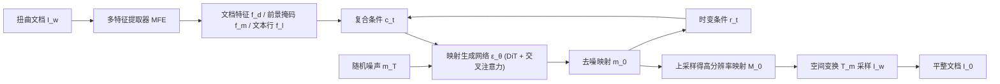

## 一句话总结

DvD 首次把文档去扭曲（dewarping）建模为生成任务，用一个在低分辨率坐标空间里做去噪的扩散模型来「生成」形变矫正映射，而不是像以往那样直接回归映射或翻译像素，从而在保持文档结构方面显著超越现有回归范式与通用多模态大模型。

## 研究背景

用手机拍摄文档已十分普遍，但相机图像常因折叠、弯曲、褶皱等几何形变而可读性差，既影响人眼阅读，也拖累 OCR 引擎乃至多模态大模型（MLLM）的识别。文档去扭曲任务旨在把拍摄文档恢复为平整版面，作为后续数字化流水线的前置步骤。

已有方法分两条路线，各有明显短板：

- 主流的「映射回归」范式（如 DewarpNet、DocGeoNet、FTA）用神经网络直接回归后向映射（backward mapping）。但回归本质上是判别式建模，无法显式刻画数据分布，导致结构保持不够精确。
- 新近的 MLLM（如 GPT-4o、Gemini 2.5）虽有强大的图像生成能力，但采用「图像翻译」范式直接生成去扭曲图像，在 2000×3000 这种高复杂度文档上难以做到忠实控制，结果看似平整却内容错乱。

作者由此提出问题：生成式模型能否有效用于文档去扭曲？直接在高分辨率图像上做像素级扩散计算量巨大，且难以保证内容忠实，这正是把生成范式引入该任务的核心障碍。

## 方法

### 整体框架

DvD 的关键转变是把「生成什么」从像素改为坐标映射：不直接生成去扭曲图像，而是生成一个小尺度的后向映射 $$m_0$$（含两个坐标通道），再上采样为高分辨率映射 $$M_0 \in \mathbb{R}^{H \times W \times 2}$$，最后通过稠密空间变换 $$T_m$$ 按映射坐标采样原图像素，得到平整文档 $$I_0$$。为降低成本，扩散与去噪过程只在 $$64 \times 64$$ 的坐标潜空间进行（受潜扩散模型启发）。生成过程由一个复合条件 $$c_t$$ 引导，并配合时变条件精修机制迭代更新。

### 关键设计

- **坐标级去噪（Mapping Generation）**：不同于典型像素级去噪，DvD 学习逐步从高斯噪声生成一系列潜变量以刻画形变矫正映射。前向过程为高斯扩散 $$m_t = \sqrt{\bar\alpha_t}\, m_0 + \sqrt{1-\bar\alpha_t}\, z$$；反向去噪网络 $$\epsilon_\theta$$ 直接预测目标映射本身而非噪声，损失为 $$\mathbb{E}\lVert m_0 - \epsilon_\theta(m_t, t, c_t)\rVert^2$$。这既显式促成「形变感知」建模，又回避了高分辨率图像生成的难题。

- **复合条件 $$c_t$$**：由多特征提取器（MFE）产出三路时不变特征——原文档图像特征 $$f_d$$（VGG16 前三块）、前景掩码特征 $$f_m$$（U2Net）、文本行特征 $$f_l$$（UNet），外加一路时变条件 $$r_t$$，统一下采样到 $$64 \times 64$$ 与坐标空间对齐，作为交叉注意力的 key/value 引导去噪。

- **时变条件精修 TVCR**：普通扩散用固定条件，而 DvD 引入随时间步变化的条件 $$r_t = \lbrace m_{0\mid t}, f_{0\mid t}\rbrace$$，即每一步的预测映射及其对应的中间去扭曲特征，动态利用「中间去扭曲结果」逼近更紧的证据下界（ELBO），从而随去噪推进逐步收紧结构精度。训练时需按当前时间步采样若干步以获取这些中间量（见其训练算法）。

- **网络与采样**：扩散解码器由 12 个条件嵌入块（CEB）与 6 个融合生成块（FGB）组成，基于 DiT_S_2 扩展时间嵌入与交叉注意力；四路并行 CEB 解耦不同条件。采样阶段采用双假设策略同时生成两份映射并取均值以增强稳定性，去噪步数取 3 步为性能/耗时的最佳折中。

作者还指出现有基准（DocUNet、DIR300 等）覆盖场景有限、规模小、缺乏域标注，为此构建了大规模细粒度基准 AnyPhotoDoc6300：6300 对真实拍摄文档，按版面类别（8 类）、环境光照（3 类）、拍摄角度（2 类）三个域组织，并提出基于 MLLM 的 OCR 指标 MMCER 与 MMED。

## 实验结果

在 DocUNet 基准上，仅用最常用的 Doc3D 训练集训练，DvD 在多数指标上取得最优（下表节选 Doc3D 统一训练分支，箭头示优化方向）：

| 方法 | MS-SSIM ↑ | LD ↓ | AD ↓ | CER ↓ | ED ↓ | 参数量 |
| --- | --- | --- | --- | --- | --- | --- |
| DewarpNet | 0.472 | 8.41 | 0.412 | 0.441 | 1158.66 | 86.9M |
| DocTr | 0.511 | 7.77 | 0.365 | 0.403 | 1093.66 | 26.9M |
| DocGeoNet | 0.504 | 7.69 | 0.378 | 0.367 | 993.08 | 24.8M |
| FTA | 0.494 | 8.87 | 0.391 | 0.403 | 1093.63 | 45.2M |
| DocScanner | 0.523 | 7.50 | 0.333 | 0.368 | 1099.06 | 8.5M |
| DvD | 0.549 | 6.61 | 0.279 | 0.366 | 928.94 | 151.25M |

消融实验进一步支撑各设计：同一网络下映射生成范式全面优于映射回归范式（MS-SSIM 0.549 对 0.487，AD 0.279 对 0.482）；复合条件逐项叠加（$$f_d \to +f_m,f_l \to +r_t$$）使各指标持续提升；潜空间分辨率 $$64 \times 64$$ 已足够，升到 $$128 \times 128$$ 无显著增益；采样步数 3 步为性能与耗时的最佳平衡。在 AnyPhotoDoc6300 上的细粒度评测还揭示了以往难以观察到的规律，如暖光加倾斜角度下曲面/褶皱文档的 AD 明显下降、暖光对 OCR 指标冲击最大等。

## 亮点与局限

**亮点**

- 范式创新：首个用扩散框架、以坐标级去噪「生成」形变映射来做文档去扭曲的工作，把判别式回归转为生成式建模，显式引入形变感知。
- 在低分辨率坐标潜空间做扩散，巧妙绕开高分辨率图像生成的算力与忠实度难题。
- TVCR 机制把中间去扭曲结果作为动态条件反哺去噪，专门强化结构保持。
- 配套贡献了大规模细粒度基准 AnyPhotoDoc6300 与 MLLM 版 OCR 指标（MMCER/MMED），推动更公平、更细致的评测。

**局限**

- 训练慢：TVCR 每次迭代需采样若干步来获取中间条件，训练速度明显低于普通 DDIM 直接选时间步。
- 泛化受限：扩散模型偏好拟合训练分布，Doc3D 以学术论文与杂志为主，DvD 在这些常见类型上优势明显，但对未见类型（发票、教育试卷）的提升微乎其微。

## 延伸思考

DvD 最具启发的一点，是把「生成什么」从高维像素换成低维坐标映射——这既保留了扩散模型对分布的建模能力，又规避了高分辨率生成的忠实性与算力问题。这种「在紧凑参数化空间里做生成、再解码回高分辨率」的思路，对其他强调结构保真的图像矫正/配准任务（如透视校正、医学图像形变配准）可能同样适用。另一方面，泛化局限也提示：生成范式的强项与短板都来自「拟合训练分布」，若要覆盖发票、票据等长尾版面，恐怕需要在数据多样性或与几何先验/物理约束结合上进一步下功夫；而 TVCR 带来的训练开销，也留下了如何在保留中间条件收益的同时加速训练的开放问题。
