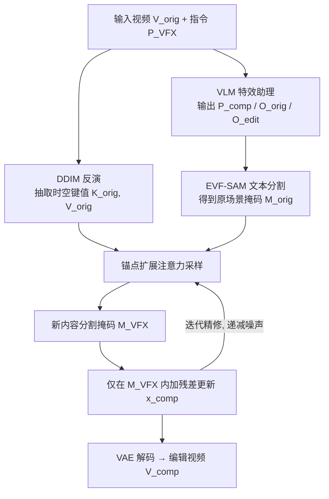

## 一句话总结

DynVFX 提出一种零样本、免训练的框架，仅凭一句文本指令，就能在真实视频中自动生成并无缝融入与场景动态交互的新内容，核心是选择性地扩展预训练文生视频扩散 Transformer 的注意力机制，配合视觉语言模型充当"特效助理"完成定位与和谐融合。

## 研究背景

把计算机生成内容（CGI）融入真实拍摄画面是影视特效的核心能力，但传统专业软件（After Effects、Maya、Blender、Unreal 等）需要大量专业知识、人工投入、预制素材和资金。作者提出一个新的创作任务：自由词表、文本驱动地把新生成的动态内容整合进真实视频，且全程无需额外用户输入。

现有方法各有局限：

- **依赖额外用户输入**：参考式视频内容插入方法（如 ReVideo、VideoAnydoor、VideoDoodles）要求用户提供逐帧掩码、边界框、运动轨迹或物体参考图，难以处理复杂动态（如多个铰接物体或全局特效），且为复杂运动手工标注逐帧掩码几乎不可行。
- **保真与编辑的权衡**：现有文本方法在"保留原场景"与"添加新内容"之间存在过拟合/欠拟合的两难，容易在外观、运动、位置或尺度上偏离原视频。
- **UNet 注意力的局限**：基于 UNet 架构的扩展注意力主要用于外观迁移，时空信息只能隐式保留。

作者由此重新审视 DiT（Diffusion Transformer）文生视频模型中的扩展注意力，发现其键/值在空间和时间上局部编码对应的视频块，从而为精确定位提供了新途径。

## 方法

整体框架：给定输入视频 $$V_{orig}$$ 和文本指令 $$P_{VFX}$$。预处理阶段，用视觉语言模型（VLM）把指令翻译成完整场景描述 $$P_{comp}$$、原场景显著物体列表 $$O_{orig}$$ 和待添加物体 $$O_{edit}$$；同时对原视频做 DDIM 反演，抽取每个 DiT 块、每个时间步的时空键值 $$K_{orig}, V_{orig}$$。编辑阶段，从 $$x_{comp} = x_{orig}$$ 出发，在一串递减的噪声水平上迭代：每步加噪后用锚点扩展注意力采样得到 $$\hat{x}_{comp}$$，再仅在新内容掩码区域 $$M_{VFX}$$ 内用残差 $$x_{res} = M_{VFX} \cdot (\hat{x}_{comp} - x_{orig})$$ 更新 $$x_{comp}$$，逐步把新内容融入，最终由 VAE 解码得到编辑视频。

关键设计：

- **VLM 作为特效助理**：直接让 VLM 生成编辑提示往往无法兼顾"忠于原视频"与"充分描述新内容"。作者通过系统提示引导 VLM 想象与特效艺术家的对话，聚焦三点：现有场景元素的空间与动态感知、原场景行为的保留、新旧内容的氛围一致性，从而产出高质量的合成场景描述，并给出前景物体列表与待添加物体。

- **锚点扩展注意力（Anchor Extended Attention）**：核心观察是在预训练 DiT 中，对原始键值施加与目标相同的位置编码（RoPE），能让生成内容与原内容在对应时空位置对齐；用全部键值扩展注意力会近似重建原视频，说明 DiT 的键值不仅编码外观，还局部编码时空块。作者据此只在稀疏锚点上扩展注意力，公式为

$$\mathrm{AnchorExtAtt} := \mathrm{Attn}(Q_{VFX}, [K_{VFX}, K_E], [V_{VFX}, V_E])$$

其中 $$K_E := \mathcal{F}(K_{orig})$$、$$V_E := \mathcal{F}(V_{orig})$$，选择函数 $$\mathcal{F}(x) := (\mathrm{DropFG}(M_{orig}) \cup \mathrm{DropBG}(\sim M_{orig})) \circ x$$，即在前景掩码区做较密、背景区做更稀疏的 dropout 采样锚点。相比"全扩展"（过度重建原场景）和"掩码扩展"（硬约束不适合处理遮挡、无引导区易尺度错位），锚点方式在保留关键空间线索与允许创造性编辑之间取得平衡。

- **迭代精修实现内容和谐（Content Harmonization）**：锚点扩展注意力能定位，但不保证像素级对齐。作者用文本分割模型得到新内容掩码 $$M^{rgb}_{VFX}$$，把掩码外像素替换回原视频，并重复用锚点扩展注意力采样、逐步降低加噪水平，让每次迭代调整新内容的高频细节以更好匹配原场景，实现渐进式和谐融合。

- **底座模型**：使用公开的 DiT 文生视频模型 CogVideoX，配合文本分割模型 EVF-SAM。整个流程零样本、免微调，且与模型无关，可随更强的 T2V 模型升级而受益。

## 实验结果

作者在 57 个视频-文本编辑对（含来自网络与 DAVIS 数据集的独特视频）上评测，指标包括编辑保真度（Directional CLIP Similarity）、原内容保留（编辑区域外的 masked SSIM）、基于 VLM 的四项评分（文本对齐、视觉质量、编辑和谐度、动态真实度，取值 0~1），以及用户研究（数值为参与者在两两对比中偏好本方法的百分比，共收集约 17160 条判断）。主结果如下：

| 方法 | CLIP Directional | SSIM | Text Alignment | Visual Quality | Edit Harmonization | Dynamics Score | 用户偏好-内容整合 | 用户偏好-和谐度 |
|------|------|------|------|------|------|------|------|------|
| Gen-3 | 0.142 | 0.283 | 0.410 | 0.586 | 0.363 | 0.374 | 98.687 | 94.691 |
| LORA finetuning | 0.292 | 0.349 | 0.781 | 0.755 | 0.726 | 0.714 | 92.221 | 71.968 |
| DDIM inv. sampling | 0.193 | 0.440 | 0.465 | 0.609 | 0.448 | 0.448 | 98.951 | 93.145 |
| SDEdit (0.9) | 0.290 | 0.321 | 0.778 | 0.750 | 0.717 | 0.730 | 99.154 | 75.645 |
| SDEdit (0.6) | 0.105 | 0.558 | 0.381 | 0.703 | 0.406 | 0.390 | 92.655 | 92.470 |
| FlowEdit | 0.288 | 0.414 | 0.771 | 0.765 | 0.712 | 0.736 | 97.346 | 65.494 |
| AnyV2V | 0.300 | 0.468 | 0.678 | 0.669 | 0.615 | 0.619 | 91.142 | 77.747 |
| I2VEdit | 0.288 | 0.524 | 0.769 | 0.773 | 0.724 | 0.719 | 91.030 | 82.563 |
| w/o AnchorExtAttn | 0.325 | 0.691 | 0.765 | 0.713 | 0.670 | 0.687 | 81.417 | 81.109 |
| w/o Iterative Refinement | 0.291 | 0.736 | 0.749 | 0.741 | 0.697 | 0.696 | 80.122 | 80.492 |
| w/o VLM Protocol | 0.254 | 0.741 | 0.705 | 0.755 | 0.669 | 0.667 | 71.360 | 73.708 |
| **Ours** | 0.307 | **0.749** | **0.843** | **0.784** | **0.778** | **0.775** | - | - |

本方法在 SSIM（原内容保留）与 VLM 四项评分上全面领先，同时保持有竞争力的 Directional CLIP，说明它在"添加新内容"与"保留未编辑区域结构"之间取得了最佳权衡；用户研究显示本方法相对所有基线都被显著更偏好。消融也印证：去掉锚点扩展注意力会导致新内容定位错误，去掉迭代精修会导致和谐度变差，去掉 VLM 协议会明显降低文本对齐与整合质量（注意 Directional CLIP 单看数值可能因过拟合而虚高，需结合 SSIM 与和谐度综合判断）。

## 亮点与局限

亮点：

- 提出全新任务与零样本、免训练、全自动的解决方案，用户只需一句文本指令，位置、运动、遮挡与像素级融合都自动推断。
- 揭示 DiT 文生视频模型中键值局部编码时空块的性质，并用共享位置编码实现生成与原内容的时空对齐，这是与 UNet 架构的关键区别。
- 锚点扩展注意力用稀疏 dropout 锚点，在保真与创造性编辑之间取得平衡，能处理遮挡、多物体交互与全局特效（如海啸、恐龙）。

局限：

- 编辑质量受限于底座 T2V 模型的能力，模型有时无法精确遵循编辑提示（如"在男孩头部套一个鱼缸"的失败案例）。
- 方法本身与模型无关，但当前公开 T2V 模型与最新 SOTA 存在明显生成质量差距，性能提升依赖未来更强模型。

## 延伸思考

DynVFX 把"操纵预训练生成模型内部注意力"的思路从图像/UNet 推广到视频/DiT，并证明了即使底座模型不够强，通过合适的推理期特征操纵仍能蒸馏出强大的生成能力。这提示未来的可控视频生成或许不必为每个任务重新训练，而是深入理解并复用大模型的内部表征。随着更强 T2V 模型出现，这类免训练的注意力操纵框架有望进一步逼近专业特效流程，并可能推广到需要精确时空对齐的其他视频编辑与合成任务（如物体移除、运动重定向、多模态交互特效）。
